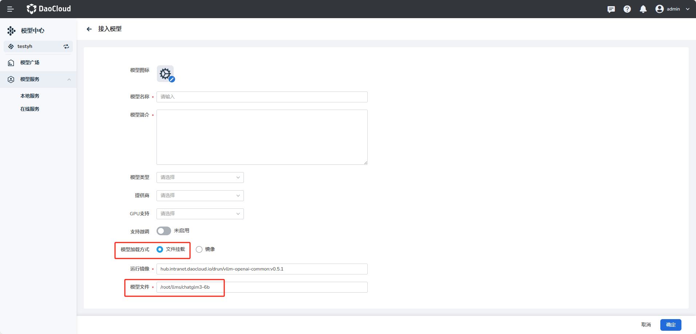
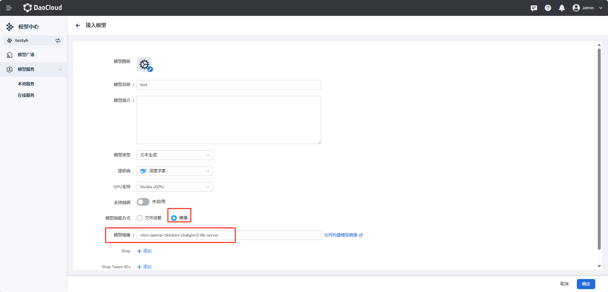
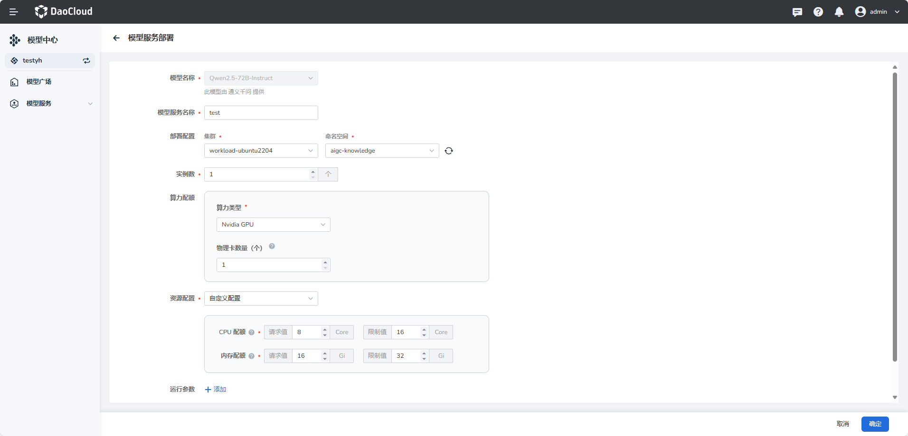

---
hide:
  - toc
---

# 模型广场

模型广场提供多样化的模型选择，涵盖文本生成、图像理解、语音合成等领域，集成了来自通义千问、Mistral、Meta、Cohere 等提供商的数百个模型。 用户可根据业务需求灵活部署模型，实现高效的实时推理。

## 内置模型

模型广场下初始化了8个 **内置模型**，可以直接部署使用。分别是大语言模型 **baichuan2-13b-Chat**、**llama-2-13b**、**chatglm3-6b**、**qwen-vl-chat**、**qwen-14b-chat**；向量化模型 **bge-large-en-v1.5**、**bge-large-zh-v1.5**；重排序模型 **bge-reranker-large**。

  

!!! note

    内置模型只能部署，不能编辑和删除。

## 接入模型

d.run 模型中心支持接入 [HuggingFace Transformers](https://huggingface.co/models) 上托管的各种生成式 Transformer 模型。

以下是目前支持的模型架构列表：

| 架构 | 模型 | HuggingFace 模型示例 | `LoRA <lora>` |
| --- | ----- | ------------------- | ------------- |
| `AquilaForCausalLM` | Aquila | `BAAI/Aquila-7B`, `BAAI/AquilaChat-7B` 等 | ✅︎ |
| `BaiChuanForCausalLM` | Baichuan | `baichuan-inc/Baichuan2-13B-Chat`, `baichuan-inc/Baichuan-7B` 等 | ✅︎ |
| `ChatGLMModel` | ChatGLM | `THUDM/chatglm2-6b`, `THUDM/chatglm3-6b` 等 | ✅︎ |
| `CohereForCausalLM` | Command-R | `CohereForAI/c4ai-command-r-v01` 等 | |
| `DbrxForCausalLM` | DBRX | `databricks/dbrx-base`, `databricks/dbrx-instruct` 等 | |
| `DeciLMForCausalLM` | DeciLM | `Deci/DeciLM-7B`, `Deci/DeciLM-7B-instruct` 等 | |
| `BloomForCausalLM` | BLOOM, BLOOMZ, BLOOMChat | `bigscience/bloom`, `bigscience/bloomz` 等 | |
| `FalconForCausalLM` | Falcon | `tiiuae/falcon-7b`, `tiiuae/falcon-40b`, `tiiuae/falcon-rw-7b` 等 | |
| `GemmaForCausalLM` | Gemma | `google/gemma-2b`, `google/gemma-7b` 等 | ✅︎ |
| `GPT2LMHeadModel` | GPT-2 | `gpt2`, `gpt2-xl` 等 | |
| `GPTBigCodeForCausalLM` | StarCoder, SantaCoder, WizardCoder | `bigcode/starcoder`, `bigcode/gpt_bigcode-santacoder`, `WizardLM/WizardCoder-15B-V1.0` 等 | |
| `GPTJForCausalLM` | GPT-J | `EleutherAI/gpt-j-6b`, `nomic-ai/gpt4all-j` 等 | |
| `GPTNeoXForCausalLM` | GPT-NeoX, Pythia, OpenAssistant, Dolly V2, StableLM | `EleutherAI/gpt-neox-20b`, `EleutherAI/pythia-12b`, `OpenAssistant/oasst-sft-4-pythia-12b-epoch-3.5`, `databricks/dolly-v2-12b`, `stabilityai/stablelm-tuned-alpha-7b` 等 | |
| `InternLMForCausalLM` | InternLM | `internlm/internlm-7b`, `internlm/internlm-chat-7b` 等 | ✅︎ |
| `InternLM2ForCausalLM` | InternLM2 | `internlm/internlm2-7b`, `internlm/internlm2-chat-7b` 等 | |
| `JAISLMHeadModel` | Jais | `core42/jais-13b`, `core42/jais-13b-chat`, `core42/jais-30b-v3`, `core42/jais-30b-chat-v3` 等 | |
| `LlamaForCausalLM` | LLaMA, Llama 2, Meta Llama 3, Vicuna, Alpaca, Yi | `meta-llama/Meta-Llama-3-8B-Instruct`, `meta-llama/Meta-Llama-3-70B-Instruct`, `meta-llama/Llama-2-13b-hf`, `meta-llama/Llama-2-70b-hf`, `openlm-research/open_llama_13b`, `lmsys/vicuna-13b-v1.3`, `01-ai/Yi-6B`, `01-ai/Yi-34B` 等 | ✅︎ |
| `MiniCPMForCausalLM` | MiniCPM | `openbmb/MiniCPM-2B-sft-bf16`, `openbmb/MiniCPM-2B-dpo-bf16` 等 | |
| `MistralForCausalLM` | Mistral, Mistral-Instruct | `mistralai/Mistral-7B-v0.1`, `mistralai/Mistral-7B-Instruct-v0.1` 等 | ✅︎ |
| `MixtralForCausalLM` | Mixtral-8x7B, Mixtral-8x7B-Instruct | `mistralai/Mixtral-8x7B-v0.1`, `mistralai/Mixtral-8x7B-Instruct-v0.1`, `mistral-community/Mixtral-8x22B-v0.1` 等 | ✅︎ |
| `MPTForCausalLM` | MPT, MPT-Instruct, MPT-Chat, MPT-StoryWriter | `mosaicml/mpt-7b`, `mosaicml/mpt-7b-storywriter`, `mosaicml/mpt-30b` 等 | |
| `OLMoForCausalLM` | OLMo | `allenai/OLMo-1B-hf`, `allenai/OLMo-7B-hf` 等 | |
| `OPTForCausalLM` | OPT, OPT-IML | `facebook/opt-66b`, `facebook/opt-iml-max-30b` 等 | |
| `OrionForCausalLM` | Orion | `OrionStarAI/Orion-14B-Base`, `OrionStarAI/Orion-14B-Chat` 等 | |
| `PhiForCausalLM` | Phi | `microsoft/phi-1_5`, `microsoft/phi-2` 等 | |
| `Phi3ForCausalLM` | Phi-3 | `microsoft/Phi-3-mini-4k-instruct`, `microsoft/Phi-3-mini-128k-instruct` 等 | |
| `QWenLMHeadModel` | Qwen | `Qwen/Qwen-7B`, `Qwen/Qwen-7B-Chat` 等 | |
| `Qwen2ForCausalLM` | Qwen2 | `Qwen/Qwen2-beta-7B`, `Qwen/Qwen2-beta-7B-Chat` 等 | ✅︎ |
| `Qwen2MoeForCausalLM` | Qwen2MoE | `Qwen/Qwen1.5-MoE-A2.7B`, `Qwen/Qwen1.5-MoE-A2.7B-Chat` 等 | |
| `StableLmForCausalLM` | StableLM | `stabilityai/stablelm-3b-4e1t/` , `stabilityai/stablelm-base-alpha-7b-v2` 等 | |

多模态语言模型列表：

| 模型类型 | 架构 | 模态 | 示例 HuggingFace 模型 | LoRA 支持 |
|----------|-----|------|------------------------|-----------|
| `Blip2ForConditionalGeneration` | BLIP-2 | 图像生成 (ImageE) | `Salesforce/blip2-opt-2.7b`, `Salesforce/blip2-opt-6.7b` 等 | ✅ |
| `ChameleonForConditionalGeneration` | Chameleon | 图像生成 (Image) | `facebook/chameleon-7b` 等 | ✅ |
| `FuyuForCausalLM` | Fuyu | 图像生成 (Image) | `adept/fuyu-8b` 等 | ✅ |
| `ChatGLMModel` | GLM-4V | 图像生成 (Image) | `THUDM/glm-4v-9b` 等 | ✅ |
| `InternVLChatModel` | InternVL2 | 图像增强 (ImageE+) | `OpenGVLab/InternVL2-4B`, `OpenGVLab/InternVL2-8B` 等 | ✅ |
| `LlavaForConditionalGeneration` | LLaVA-1.5 | 图像增强 (ImageE+) | `llava-hf/llava-1.5-7b-hf`, `llava-hf/llava-1.5-13b-hf` 等 | ✅ |
| `LlavaNextForConditionalGeneration` | LLaVA-NeXT | 图像增强 (ImageE+) | `llava-hf/llava-v1.6-mistral-7b-hf` 等 | ✅ |
| `LlavaNextVideoForConditionalGeneration` | LLaVA-NeXT-Video | 视频生成 (Video) | `llava-hf/LLaVA-NeXT-Video-7B-hf` 等 | ✅ |
| `LlavaOnevisionForConditionalGeneration` | LLaVA-Onevision | 图像 + 视频 (Image+ / Video) | `llava-hf/llava-onevision-qwen2-7b-ov-hf` 等 | ✅ |
| `MiniCPMV` | MiniCPM-V | 图像增强 (ImageE+) | `openbmb/MiniCPM-V-2`, `openbmb/MiniCPM-Llama3-V-2_5` 等 | ✅ |
| `MllamaForConditionalGeneration` | Llama 3.2 | 图像 (Image) | `meta-llama/Llama-3.2-90B-Vision-Instruct` 等 | |
| `MolmoForCausalLM` | Molmo | 图像 (Image) | `allenai/Molmo-7B-D-0924` 等 | ✅ |
| `NVLM_D_Model` | NVLM-D 1.0 | 图像增强 (ImageE+) | `nvidia/NVLM-D-72B` 等 | ✅ |
| `PaliGemmaForConditionalGeneration` | PaliGemma | 图像增强 (ImageE) | `google/paligemma-3b-pt-224` 等 | ✅ |
| `Phi3VForCausalLM` | Phi-3-Vision / Phi-3.5-Vision | 图像增强 (ImageE+) | `microsoft/Phi-3-vision-128k-instruct` 等 | ✅ |
| `PixtralForConditionalGeneration` | Pixtral | 图像增强 (Image+) | `mistralai/Pixtral-12B-2409` | ✅ |
| `QWenLMHeadModel` | Qwen-VL | 图像增强 (ImageE+) | `Qwen/Qwen-VL`, `Qwen/Qwen-VL-Chat` | ✅ |
| `Qwen2VLForConditionalGeneration` | Qwen2-VL | 图像增强 + 视频生成 (ImageE+ / Video+) | `Qwen/Qwen2-VL-7B-Instruct` 等 | ✅ |
| `UltravoxModel` | Ultravox | 音频增强 (AudioE+) | `fixie-ai/ultravox-v0_3` | ✅ |

目前接入模型支持 **文件挂载方式** 和 **镜像加载方式**，下面分别介绍两种接入模型的方式。

### 文件挂载方式

#### 步骤 1：将模型文件上传到 MinIO

1. **克隆模型文件到主机**
   将模型文件复制或克隆到任意一台可访问 MinIO 的主机上。

2. **下载 `mc` 客户端工具**  
   运行以下命令下载 MinIO 客户端工具 `mc`：

    ```bash
    curl https://dl.min.io/client/mc/release/linux-amd64/mc \
      --create-dirs \
      -o $HOME/minio-binaries/mc

    chmod +x $HOME/minio-binaries/mc
    export PATH=$PATH:$HOME/minio-binaries/
    mc --help
    ```

3. **登录 MinIO**
   使用以下命令配置 MinIO 连接信息：

    ```bash
    mc alias set ALIAS HOSTNAME ACCESS_KEY SECRET_KEY
    ```

    - **ALIAS**：自定义 MinIO 名称，用于后续操作
    - **HOSTNAME**：MinIO 服务地址（例如：http://10.33.2.23:31372）
    - **ACCESS_KEY**：MinIO 用户名
    - **SECRET_KEY**：MinIO 密码  

    **示例**：

    ```bash
    mc alias set myminio http://10.33.2.23:31372 minio minio123456
    ```

4. **推送文件到 MinIO**

    - **创建 Bucket**：

        ```bash
        mc mb myminio/llms
        ```

        > 如果 Bucket 已存在，可以通过 `mc ls myminio` 检查是否存在。

    - **上传模型文件**：
        
        以 `chatglm3-6b` 为例：

        ```bash
        mc cp chatglm3-6b myminio/llms --recursive
       ```

#### 步骤 2：在模型中心加载模型

1. **进入模型中心**  
   在 DAK 的模型中心选择“接入模型”。

2. **选择模型加载方式为“文件挂载”**

3. **选择基础镜像和填写模型路径**  
   模型路径按照模型所在工作节点的挂载目录填写。例如，`chatglm3-6b` 模型挂载后的路径为：

    ```text
    /root/llms/chatglm3-6b
    ```

    

4. **提交模型路径配置**  
   现在，模型已经成功加载，模型中心会从挂载目录中获取文件进行使用。

### 镜像加载方式

以下是完整的指导流程，包含拉取模型、构建 Docker 镜像、配置私有仓库，以及将镜像推送到自定义仓库的步骤。

#### 步骤1：拉取 Hugging Face 上的模型

1. **获取模型的 Clone 地址**  

    1. 前往 [Hugging Face](https://huggingface.co)
    2. 找到目标模型，例如 "chatglm3-6b"
    3. 复制模型的 Git URL 以用于克隆，例如：

        ```bash
        https://huggingface.co/THUDM/chatglm3-6b
        ```

    **Clone 模型**

    使用以下命令克隆模型（确保已安装 Git 和 Git LFS）：

    ```bash
    git lfs install
    git clone https://huggingface.co/THUDM/chatglm3-6b
    ```

    如果克隆失败，请尝试以下步骤：

    ```bash
    # 跳过 smudge - 我们会在后面的步骤中以更快的方式批量下载二进制文件
    git lfs install --skip-smudge
    # 在这里执行 git clone
    git clone https://huggingface.co/THUDM/chatglm3-6b
    # 进入克隆的目录（如果是其他模型，注意替换这个目录）
    cd chatglm3-6b
    # 在新的克隆中获取所有的二进制文件
    git lfs pull
    # 重新设置 smudge
    git lfs install --force
    ```

#### 步骤2：构建镜像

1. **创建 Dockerfile**

    创建一个名为`Dockerfile`的文件，并粘贴以下内容。确保根据实际需求设置`MODEL_NAME`。

    ```dockerfile
    # 基于vllm/vllm-openai:v0.4.1构建
    FROM vllm/vllm-openai:v0.4.1

    # 安装Python包
    RUN pip install tiktoken

    # 复制模型到容器
    COPY . /data

    # 使用shell形式的CMD
    ENTRYPOINT ["python3", "-m", "vllm.entrypoints.openai.api_server", "--model", "/data", "--trust-remote-code"]
    ```

2. **构建 Docker 镜像**

    构建 Docker 镜像时，示例中使用`vllm-openai-tiktoken-chatglm3-6b-server`作为镜像名称，
    `/data/chatglm3-6b/Dockerfile` 是上面的 Dockerfile 文件位置，
    `/data/llms/chatglm3-6b` 是下载的大模型文件的目录。

    ```bash
    docker build -t vllm-openai-tiktoken-chatglm3-6b-server:v2.0.1 -f /data/chatglm3-6b/Dockerfile /data/llms/chatglm3-6b
    ```

    为了减小镜像大小，确保 `.dockerignore` 文件在 `/data/llms/chatglm3-6b` 目录中，并且其中包含需要忽略的文件或目录，如：

    ```plaintext
    .git
    ```

#### 步骤3：推送镜像到自定义 Docker 仓库

1. **登录到 Docker 仓库**

    如果要推送到 Docker Hub 或其他私有仓库，请确保已登录到相应的 Docker 仓库。

    ```bash
    docker login
    ```

    对于其他仓库，例如 Google Container Registry 或 Amazon ECR，需要根据其文档指引进行登录和身份验证。

2. **配置镜像标签**

    在推送镜像之前，将镜像标签配置为目标仓库地址。以下示例使用自定义的私有仓库地址：

    ```bash
    # 假设你的仓库地址是 myregistry.example.com
    docker tag vllm-openai-tiktoken-chatglm3-6b-server myregistry.example.com/vllm-openai-tiktoken-chatglm3-6b-server
    ```

3. **推送镜像到仓库**

    将镜像推送到目标仓库：

    ```bash
    docker push myregistry.example.com/vllm-openai-tiktoken-chatglm3-6b-server
    ```

4. **验证推送成功**

    确认推送成功后，可以在 Docker 仓库的仪表盘上查看已推送的镜像。

#### 步骤4：接入模型时选择镜像加载方式

模型镜像构建并推到指定仓库后，即可在页面填写镜像直接使用。

  

## 部署模型

1. 在模型卡片右下角，点击 **部署** 按钮。

    

2. 填写模型服务名称、部署配置、算力类型、资源配置后点击 **确定** 。

    

    !!! info "支持国产 GPU"

        其中算力类型支持 Nvidia GPU 和 Ascend 等国产 GPU。

3. 创建成功后，可在模型服务的本地服务列表查看。
    
    
    
    部署成功后，模型服务显示 **健康** 。

下一步：[模型服务](model-service/local.md)
