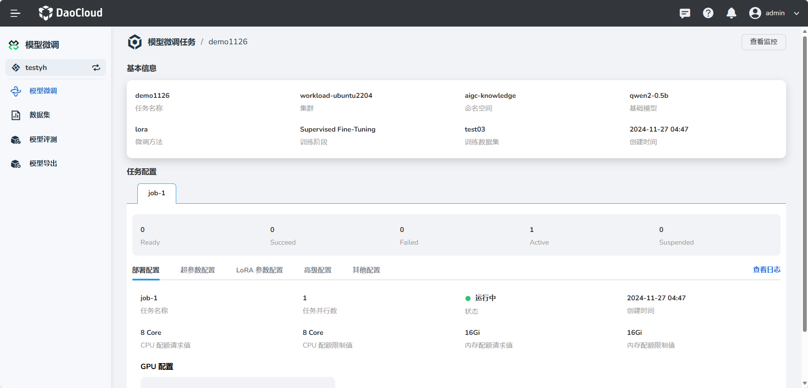

---
hide:
  - toc
---

# 什么是模型微调

DaoCloud DataTunerX（DTX）是一站式自动化平台，专注于大型语言模型微调。
涵盖了模型微调、数据集、模型评测和模型导出的全生命周期，实现了高度自动化。
通过高效利用底层分布式算力资源，DTX 能够进行矩阵式的模型微调实验，从而推动大型模型的敏捷和自动化迭代。

DTX 模型微调是一个云原生解决方案，旨在与分布式计算框架集成。
利用可扩展的 GPU 资源，该平台专注于高效微调 LLM 模型。
其核心优势在于促进批量微调任务，使用户能够在单个实验中同时进行多个任务。

## 典型应用

- 大规模数据集：在处理大规模数据集时，分布式微调能够有效利用集群资源，提升处理速度。
- 跨设备协调：支持在多个物理设备或虚拟机上同时进行模型微调。
- 资源优化：通过合理分配计算资源，达到高效利用硬件资源的目的。

## 主要步骤

- 任务分解：将微调任务划分成多个子任务。
- 任务分配：将子任务分配给不同的计算节点。
- 结果整合：在计算完成后，整合各节点的计算结果，形成最终的微调模型。

## 能力介绍

### 数据集处理

- 根据格式和数据集文件等信息定义数据集。目前支持对象存储 (S3) 和本地文件的方式。
- 修改数据集的信息
- 展示数据集的列表信息和详细信息
- 删除已经存在的数据集
- 支持使用数据集插件的方式创建数据集

### 微调实验

- 根据不同的模型参数、微调方法参数、数据集参数以及评估参数的组合并行的创建和运行微调实验
- 支持设置一个微调实验使用的评估方式，以相同的评估方式给这次实验的所有任务进行模型评估，得到本次实验的最佳微调模型
- 支持查看每一个微调实验中微调任务的详情、日志、监控信息
- 目前支持 lora、full 的方式进行大模型的微调能力
- 目前模型如下：

    | 模型名                                                      | 模型大小                         | Template         |
    | ----------------------------------------------------------- | -------------------------------- | ---------------- |
    | [Baichuan 2](https://huggingface.co/baichuan-inc)           | 7B/13B                           | baichuan2        |
    | [BLOOM/BLOOMZ](https://huggingface.co/bigscience)           | 560M/1.1B/1.7B/3B/7.1B/176B      | -                |
    | [ChatGLM3](https://huggingface.co/THUDM)                    | 6B                               | chatglm3         |
    | [Command R](https://huggingface.co/CohereForAI)             | 35B/104B                         | cohere           |
    | [DeepSeek (Code/MoE)](https://huggingface.co/deepseek-ai)   | 7B/16B/67B/236B                  | deepseek         |
    | [Falcon](https://huggingface.co/tiiuae)                     | 7B/11B/40B/180B                  | falcon           |
    | [Gemma/Gemma 2/CodeGemma](https://huggingface.co/google)    | 2B/7B/9B/27B                     | gemma            |
    | [GLM-4](https://huggingface.co/THUDM)                       | 9B                               | glm4             |
    | [InternLM2/InternLM2.5](https://huggingface.co/internlm)    | 7B/20B                           | intern2          |
    | [Llama](https://github.com/facebookresearch/llama)          | 7B/13B/33B/65B                   | -                |
    | [Llama 2](https://huggingface.co/meta-llama)                | 7B/13B/70B                       | llama2           |
    | [Llama 3-3.2](https://huggingface.co/meta-llama)            | 1B/3B/8B/70B                     | llama3           |
    | [LLaVA-1.5](https://huggingface.co/llava-hf)                | 7B/13B                           | llava            |
    | [LLaVA-NeXT](https://huggingface.co/llava-hf)               | 7B/8B/13B/34B/72B/110B           | llava_next       |
    | [LLaVA-NeXT-Video](https://huggingface.co/llava-hf)         | 7B/34B                           | llava_next_video |
    | [MiniCPM](https://huggingface.co/openbmb)                   | 1B/2B/4B                         | cpm/cpm3         |
    | [Mistral/Mixtral](https://huggingface.co/mistralai)         | 7B/8x7B/8x22B                    | mistral          |
    | [OLMo](https://huggingface.co/allenai)                      | 1B/7B                            | -                |
    | [PaliGemma](https://huggingface.co/google)                  | 3B                               | paligemma        |
    | [Phi-1.5/Phi-2](https://huggingface.co/microsoft)           | 1.3B/2.7B                        | -                |
    | [Phi-3](https://huggingface.co/microsoft)                   | 4B/7B/14B                        | phi              |
    | [Qwen (1-2.5) (Code/Math/MoE)](https://huggingface.co/Qwen) | 0.5B/1.5B/3B/7B/14B/32B/72B/110B | qwen             |
    | [Qwen2-VL](https://huggingface.co/Qwen)                     | 2B/7B/72B                        | qwen2_vl         |
    | [StarCoder 2](https://huggingface.co/bigcode)               | 3B/7B/15B                        | -                |
    | [XVERSE](https://huggingface.co/xverse)                     | 7B/13B/65B                       | xverse           |
    | [Yi/Yi-1.5 (Code)](https://huggingface.co/01-ai)            | 1.5B/6B/9B/34B                   | yi               |
    | [Yi-VL](https://huggingface.co/01-ai)                       | 6B/34B                           | yi_vl            |
    | [Yuan 2](https://huggingface.co/IEITYuan)                   | 2B/51B/102B                      | yuan             |

## 几个术语

**云原生（Cloud Native）：** 基于 Kubernetes 的 CRD 和 Operator 设计和开发的，一套围绕大语言模型、数据处理、
大语言模型微调、评估、并行等能力的开源解决方案。让大模型的微调能力变成云原生应用的能力。

**数据集（Dataset）：** 与大语言模型微调中的数据集定义基本差不多，这里主要提到的是训练集（用于大语言模型微调的主要微调数据，也就是想让大语言模型能够学会的数据），
验证集（在微调过程中用于验证大语言模型微调效果的数据），测试集（用于在大语言模型这次微调结束之后，用于验证本地微调的效果的数据）。

**基础大语言模型（Base Large Language Model）：** 大语言模型（LLM）是指使用大量文本数据训练的深度学习模型，是一种用于自然语言处理的深度学习模型，
它通过大规模的预训练来学习自然语言的表示和语言模式。这些模型可以用于各种任务，如文本生成、文本分类、机器翻译等，以生成或处理自然语言文本。
基础大语言模型就是微调过程中，被微调的底座的大语言模型。

**评估（Scoring / Evaluation）：** 用于对大语言模型进行评定好与不好的一种方式。还有一种专业点的说法叫 metrics。
评估中支持很多种不同的 metric 类型，如 Bleu、Accuracy、Precision、Recall、Rouge、F1 等，不同类型的大模型任务需要使用不同的
metric 算法进行评估。评估的时候也需要特定格式的数据来进行评估。

**微调实验（FinetuneExperiment）：** 实验，顾名思义就是要做一次尝试。可以使用数据集、大语言模型、参数组进行不同的组合进行实验，
指定本次实验的评估方式，每个组合就是一个微调任务。最终根据这次实验的所有组合进行微调之后，给每个微调任务进行打分，评估出这次实验微调出来最好的模型。
在这个过程中是并行地使用所有可以使用的算力，我们知道大语言模型的微调是存在随机性，在这个背景下，卡越多，每次实验并行数越多，每次实验结束，
出现优秀模型的概率就越大。这是用算力资源换取时间的方式，来提升整体的微调效率。下次微调就可以基于上次评估出来最好的模型进行再次微调。

**微调任务（FinetuneJob）：** 一次微调任务就是使用指定的数据集、指定的大语言模型、指定的参数组、指定的评估方式，进行微调的运行，
运行结束就会产生一个微调版本的大语言模型，并且得到对这次微调出来的模型的评分。

**微调（Finetune）：** 使用指定的数据集、指定的大语言模型、指定的参数组进行真正的微调工作，包含了具体的微调工作的实现，
在微调过程中会有相关的微调的日志、监控数据、微调出来的权重文件等。

**数据插件（DataPlugin）：** 数据是大语言模型的基石。微调需要的数据是多种多样的，所以处理数据的能力也无法统一标准化，这种情况下，
满足数据处理的多样化能力就需要系统有插件化的能力，提供可以根据不同的数据进行不同处理的能力。

**评估插件（ScoringPlugin）：** 不同类型的模型评估方式可能是不同的，不同的场景评估方式也可能是不同的，
这个时候无法内置一种万能的评估能力，所以需要开放评估能力，以插件的方式实现这种能力。

**模型仓库（LLM / LLMCheckpoint）：** 不管是基础大模型，或者是微调出来的模型，在这里它都是一个模型，这里的模型仓库就是存放模型的地方，
可以是基础大模型（LLM），也可以是微调出来的模型（LLMCheckpoint），基于这些模型可以进行后续的推理服务的部署或者对比等。
  
[注册并体验 d.run](https://console.d.run/){ .md-button .md-button--primary }
  

