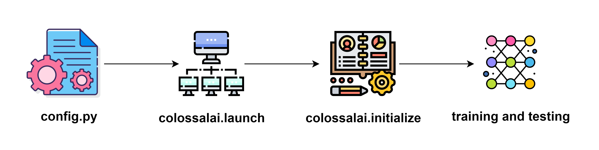

# Colossal-AI

Colossal-AI 尝试以低成本提高大语言模型的训练速度。

## 关于 Colossal-AI

随着深度学习模型规模的发展，转向新的训练范式变得尤为重要。传统的无并行和优化的训练方法已成为过去，新的训练方法是使大规模模型训练高效且具有成本效益的关键。

Colossal-AI 旨在成为一个统一的系统，为用户提供一整套训练技能和工具。您可以找到常见的训练工具，如混合精度训练和梯度累积。
此外，我们还提供了一系列并行方法，包括数据并行、张量并行和流水线并行。我们通过不同的多维分布式矩阵-矩阵乘法算法优化张量并行。
我们还提供了不同的流水线并行方法，以允许用户高效地跨节点扩展其模型。更高级的功能，如卸载，也可以在本教程文档中详细了解。

## 基本用法

我们旨在使 Colossal-AI 易于使用且对用户代码具有非侵入性。如果您想使用 Colossal-AI，有一个简单的一般工作流程。

1. 准备一个配置文件，指定您要使用的功能和参数。
2. 使用 `colossalai.launch` 初始化分布式后端。
3. 使用 `colossalai.booster` 将训练功能注入到您的训练组件（例如模型、优化器）中。
4. 运行训练和测试。

我们将在 `基础教程` 部分涵盖整个工作流程。

<iframe width="560" height="315" src="https://www.youtube.com/embed/KnXSfjqkKN0?si=U6onkgFaVzJGBmag" title="YouTube video player" frameborder="0" allow="accelerometer; autoplay; clipboard-write; encrypted-media; gyroscope; picture-in-picture; web-share" referrerpolicy="strict-origin-when-cross-origin" allowfullscreen></iframe>

## 未来发展

Colossal-AI 系统将扩展以包含更多的训练技能，这些新开发可能包括但不限于：

1. 分布式操作的优化
2. 异构系统上训练的优化
3. 实现训练工具以减少模型规模并加速训练，同时保持模型性能
4. 扩展现有的并行方法

我们欢迎来自社区的想法和贡献，您可以在我们的论坛上发布您的未来发展想法。

## 参考

- [Colossal-AI 仓库](https://github.com/hpcaitech/ColossalAI)
- [Colossal-AI 网站](https://colossalai.org/)
