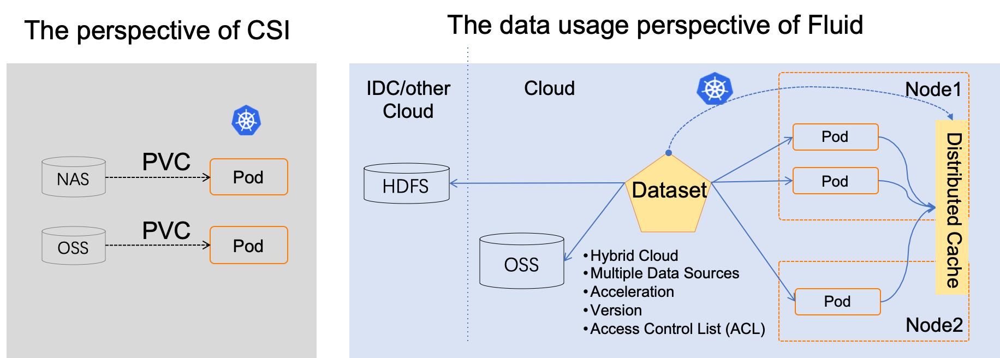

---
hide:
  - toc
---

# Fluid

Fluid 是一个 CNCF Sandbox 项目，主要在云上为大数据以及AI应用的弹性数据提供抽象和加速服务。

## 什么是 Fluid

Fluid 是一个开源的 Kubernetes 原生分布式数据集编排器和加速器，专为大数据和 AI 应用等数据密集型应用设计。
它由 [云原生计算基金会](https://cncf.io/)（CNCF）托管，作为一个沙箱项目。
Fluid 可以将分布式缓存系统（如 Alluxio 和 JuiceFS）转换为具有自我管理、弹性扩展和自我修复能力的可观察缓存服务，
并通过支持数据集操作来实现这一点。同时，通过数据缓存位置信息，Fluid 可以为使用数据集的应用提供数据亲和调度。

## 目标场景和价值

在计算与存储分离的趋势中，Fluid 的目标是通过高级抽象方式，使 AI/大数据应用能够更高效地使用来自任何存储的数据，并且无需对应用本身进行更改。

与传统的基于 PVC 的存储抽象不同，Fluid 从应用程序导向的角度抽象了“Kubernetes 上使用数据的过程”。
它引入了弹性数据集的概念，并将其作为 Kubernetes 中的一级公民，实现数据集的 CRUD 操作、权限控制和访问加速。

通过 Fluid 在 Kubernetes 上提供的数据抽象层，数据就像流体一样，在存储源（如 HDFS、OSS、Ceph）和 Kubernetes 上的云原生应用之间流动。
数据可以灵活地移动、复制、驱逐、转换和管理。此外，所有数据操作对用户都是透明的。用户无需担心远程数据访问的效率或数据源管理的便利性。
用户只需访问从 Kubernetes 原生数据卷抽象出来的数据，剩下的任务和细节都由 Fluid 处理。

Fluid 的目标是通过提供 Fluid 的通用框架，将不同的分布式缓存系统（如 Alluxio、JuiceFS、Vineyard、CubeFS 等）转变为 Kubernetes 内部自我管理、自我扩展、自我修复和可观察的缓存服务。

Fluid 使 Kubernetes 调度器能够根据分布式数据缓存系统的位置制定智能的、拓扑感知的调度计划。
它专注于数据集编排和应用编排场景。数据集编排可以将缓存的数据集安排到特定的 Kubernetes 节点，
而应用编排可以将应用安排到具有预加载数据集的节点。这两者可以结合起来形成共同编排场景，在资源调度过程中同时考虑数据集规范和应用特性。

Fluid 在以下两个方面展现其价值：

1. 利用 Kubernetes 平台的力量，通过为每个分布式缓存提供商提供 Kubernetes Operator 来交付其服务，
并自动执行管理员的任务：部署、引导、配置、供应、扩展、升级、监控、数据预取、数据迁移和资源管理。
2. 通过将第三方缓存系统与 Kubernetes 调度和弹性相结合，帮助用户充分利用分布式缓存，并将其与特定的应用数据使用场景和方法对齐。

## 参考

- [Fluid 仓库](https://github.com/fluid-cloudnative/fluid)
- [Fluid 网站](https://fluid-cloudnative.github.io/)
