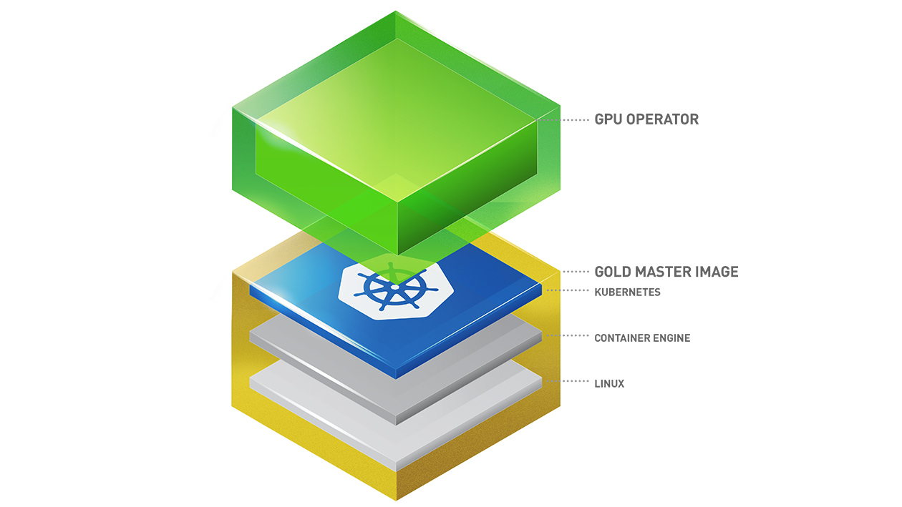

---
hide:
  - toc
---

# GPU Operator

Kubernetes 通过设备插件框架提供对特殊硬件资源（如 NVIDIA GPU、NIC、Infiniband 适配器等设备）的访问。
然而，配置和管理这些硬件资源的节点需要配置多个软件组件，例如驱动程序、容器运行时或其他库，这些操作复杂且容易出错。
NVIDIA GPU Operator 使用 Kubernetes 内的 Operator 框架来自动管理所有提供 GPU 所需的 NVIDIA 软件组件。
这些组件包括 NVIDIA 驱动程序（以启用 CUDA）、用于 GPU 的 Kubernetes 设备插件、NVIDIA 容器工具包、使用 GFD 的自动节点标签、基于 DCGM 的监控等。

## 参考

- [GPU Operator 仓库](https://github.com/NVIDIA/gpu-operator)
- [Nvidia 官网 GPU Operator 介绍](https://docs.nvidia.com/datacenter/cloud-native/gpu-operator/latest/index.html)
