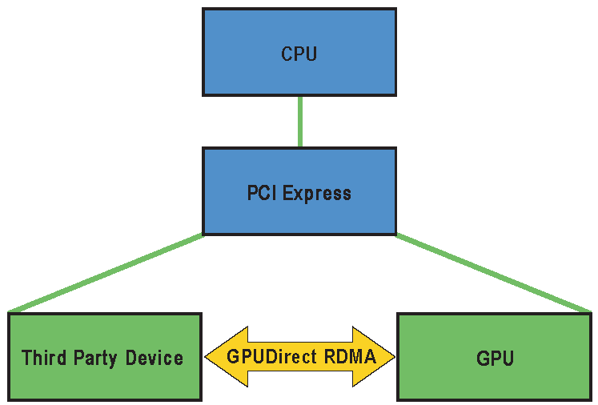

---
hide:
  - toc
---

# GPUDirect RDMA

GPUDirect RDMA 是一种在 Kepler 级 GPU 和 CUDA 5.0 中引入的技术，它通过使用 PCI Express 的标准功能，
在 GPU 和第三方对等设备之间建立了直接的数据交换路径。这些第三方设备的示例包括网络接口、视频采集设备和存储适配器。

GPUDirect RDMA 可用于 Tesla 和 Quadro GPU。

该技术有一些限制，其中最重要的是这两个设备必须共享相同的上游 PCI Express 根复杂体。
一些限制取决于所使用的平台，并可能在当前或未来的产品中得到解除。

为了在各种硬件设备上启用此功能，需要对设备驱动程序进行一些简单的更改。

## 参考

- [NVIDIA GPUDirect](https://developer.nvidia.com/gpudirect)
- [使用 GPUDirect RDMA 开发 Linux 内核模块](https://docs.nvidia.com/cuda/gpudirect-rdma/)
