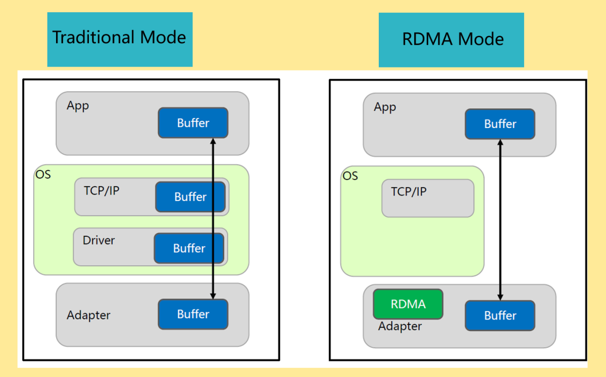

---
hide:
  - toc
---

# RDMA

远程内存直接访问（Remote Direct Memory Access, RDMA）

在数据中心领域，远程内存直接访问（Remote Direct Memory Access, RDMA）是一种绕过远程主机操作系统内核访问其内存中数据的技术，
由于不经过操作系统，不仅节省了大量 CPU 资源，同样也提高了系统吞吐量、降低了系统的网络通信延迟，尤其适合在大规模并行计算机集群中有广泛应用。
在基于 NVMe over Fabric 的数据中心中，RDMA 可以配合高性能的 NVMe SSD 构建高性能、低延迟的存储网络。

RDMA 支持零复制网络传输，通过使网络适配器直接在应用程序内存间传输数据，不再需要在应用程序内存与操作系统缓冲区之间复制数据。
这种传输不需要中央处理器、CPU 缓存或上下文切换参与，并且传输可与其他系统操作并行。
当应用程序执行 RDMA 读取或写入请求时，应用程序数据直接传输到网络，从而减少延迟并实现快速的消息传输。

常见的 RDMA 实现包括虚拟接口架构、基于融合以太网的 RDMA（RoCE）、[InfiniBand](./infiniband.md)、iWARP。

## 参考

- [RDMA 维基百科词条](https://zh.wikipedia.org/wiki/%E8%BF%9C%E7%A8%8B%E7%9B%B4%E6%8E%A5%E5%86%85%E5%AD%98%E8%AE%BF%E9%97%AE)
