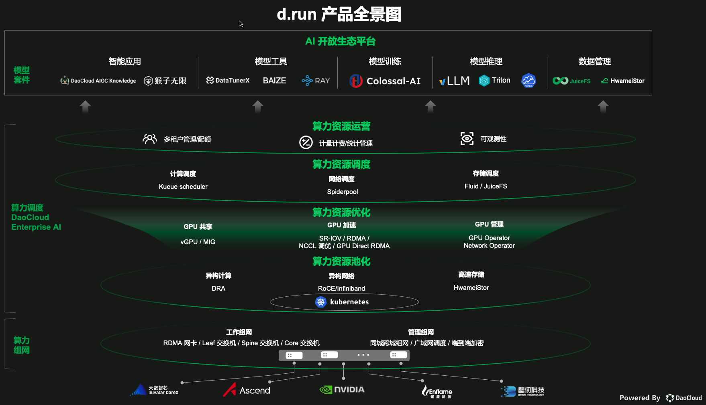
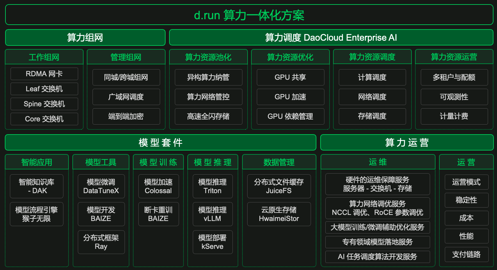
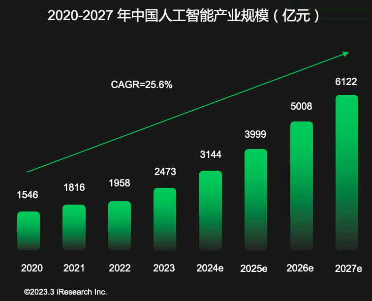

---
hide:
  - toc
---

# d.run 介绍

d.run 是 DaoCloud 自研的 AIGC 综合性算力运维和运营平台，整合云原生调度能力，一站式管理算力集群资源，
内置算法开发、模型中心和模型微调，轻松创建智能问答提供生成式智能聊天服务，管理用户反馈。

「DaoCloud 道客」作为算力服务提供商和专业技术支持方，与各大政企、科研机构和运营商等智算中心建设方与运营方紧密合作，
在上海、合肥、天津、香港等多个地区建设算力枢纽中心，实现算力资源跨行业、跨地区、跨层级地自由流动，并通过构建 AI 开放生态平台，
集成丰富的模型套件工具，全面推动算力与应用的协同创新，为所有用户提供高效、可靠、易得的 AI 算力云服务，加速 AI 普惠。

[点击注册 d.run](https://console.d.run/){ .md-button }
[查阅和下载 PDF](https://harbor-test2.cn-sh2.ufileos.com/drun/d.run-0625.pdf){ .md-button }

## 产品全景图

d.run 作为算力一体化解决方案，能够打造千卡、万卡等大规模高速互联的算力网络，通过性能优化的 DaoCloud Enterprise AI 调度异构算力，
基于多种模型套件加速 AI 应用创新，配合一系列运维和运营服务，全方位保障算力的稳定、可靠。

d.run 面向用户提供功能丰富、易用性好、性能高效的模型套件，集成数据准备、模型开发、模型训练、模型部署等各个环节所需的便捷实用的生态产品和开源工具，
支持高效的模型开发与训练，帮助用户轻松将 AI 技术应用到实际业务中，赋能产业升级。

- **全面的 AI 开发与生产工具** 集成了从数据的获取、探索，到模型的开发、训练、部署、微调、管理等丰富的模型套件工具选项，
  可低成本、高效率地应用 AI 技术，加速产品和业务的创新。

- **便捷的数据管理与准备工具** 提供对接各类数据源、统一管理数据集、可视化数据探索、数据清洗、数据增强等工具，
  最大程度提升数据科学家和算法工程师的工作效率，使其更专注于模型开发。

- **高效的模型开发与训练支持** 能够提供易用的集成开发环境，支持交互式开发和拖拉拽的可视化建模，
  通过分布式训练架构提升训练效率，降低算力成本，实现模型快速高效部署，打通开发训练和生产环境。

## d.run 优势

- **灵活的资源调度** ：提供灵活的计算、网络、存储资源调度方案，有效提高资源利用率，用户可按需使用算力资源，显著降低算力使用成本。
- **优异的处理能力** ：提供业界领先的算力性能，软硬协同优化，通过 GPU 共享和加速显著缩短训练时间，提高算法的准确性
- **功能丰富的模型套件** ：通过 AI 生态开放平台提供各类便捷实用、性能高效的模型套件，为模型开发与训练提供支持，加速 AI 应用落地及创新。
- **全方位的运维和运营服务** ：提供优质的算力运维和运营服务，实现软硬件一站式的性能调优，配合高效、可视化的平台管理，为企业的算力使用保驾护航。

d.run 的这些优势来自于丰富的产品模块和功能特性：

## d.run 新手尝鲜步骤

一名新用户注册 d.run 之后，首先需要[购买算力](./buy.md)，支持的范围囊括了单卡、双卡...千卡、万卡。
您可以随时检查自己购买的资源，查阅历史购买记录。

您的订单生效后，d.run 后台会自动创建[算力集群](../kpanda/intro/index.md)。
您可以在[全局管理](../../bake/ghippo/intro/index.md) 中设置用户、用户组、工作空间和平台个性化设置。

在[模型中心](../dmc/index.md)，您可以一键部署高可用的大语言模型服务，通过统一的模型推理接口进行分布式推理。
与智能问答和流程编排模块紧密集成，模型中心支持行业内外流行的各种大模型。
您可以轻松接入各类在线模型 API Key，并根据需求灵活切换本地和在线模型服务。

接下来使用 DataTunerX 进行[模型微调](../dtx/index.md)，尝试微调数据集、超参组，实现模型微调、模型评估和模型推理全生命周期的自动化处理。
通过高效利用算力集群中的底层分布式算力资源，DataTunerX 能够进行矩阵式的模型微调实验，从而推动大型模型的敏捷和自动化迭代。

微调好模型后，AI[流程引擎](../monkey/index.md)可以通过智能化的流程创建文生文、文生图、图生图、文生视频等智能问答。
您可以随时调整智能问答所调用的语料库和占用的 GPU 等资源，还能随时了解用户对智能问答的反馈并迅速做出响应。

通过 AI 流程可以为各行业、各场景分门别类地生成不同[智能问答](../dak/index.md)，
一站式管理智能问答的上下层、前后端设施，把控用户需求，洞察前沿趋势。

参见演示视频：

<video controls src="https://harbor-test2.cn-sh2.ufileos.com/drun/d.run-workflow.mp4" preload="metadata" poster="./images/workflow.png"></video>

## 行业背景

全球人工智能行业大爆发，对智能算力提出了指数级的增长要求。

!!! quote "SemiAnalysis"

    GPT-4 在大约 2.5 万个 A100 （GPU 利用率 32%-36%）上训练 90-100 天，单次训练成本 6300 万美元。

!!! quote "埃隆·马斯克"

    GPT-5 的训练可能需要 3-5 万块 H100。

在国内，算力成为新质生产力基建热点，从中央到地方各层级政策密集出台。

- 2024.2 国务院国资委明确央企要把发展 AI 放在全局工作中统筹谋划，加快建设一批智能算力中心
- 人民银行、工信部等 6 部门联合发文：鼓励金融机构加大对绿色低碳算力基础设施的信贷支持力度
- 北京：“十四五 期间 形成规模化先进算力供给能力，支撑千亿级参数量的大型语言模型、大型视觉模型、多模态大模型、科学计算大模型...
- 上海：到 2024 年，本市数据中心算力供给呈现以智算算力等高性能算力为主的多元算力协同体系，总算力超 15EFLOPS，高性能算力占比达到 35%
- 广东：到 2025年，智能算力规模实现全国第一、全球领先，通用人工智能技术创新体系较为完备，人工智能高水平应用场景进一步拓展，核心产业规模突破3000 亿元，企业数量超 2000 家
- 江苏：到 2027 年底，全省 算力规模达到 70 万核 CPU 和 400PB 存储、新增高性能算力持续增长
- 浙江：到 2024 年形成 10 项以上人工智能重大科技成果，获得 1000 项以上核心发明专利；打造 3-4 个千亿级人工智能产业集群，产业营业收入年均增长 15% 以上
- 河南：到 2025 年 智算和超算算力规模超过 2000PFLOPS，高性能算力占比超过 30%
- 山东：到 2025 年，全省 数据中心 在用标准机架数达到 45 万个以上，平均利用率提升到 60% 以上
- 湖南：到 2027 年长沙人工智能创新中心、马栏山视频超算中心等加快建设，建成和在建规模以上数据中心 51 个，标准机架 17.2 万个
- 成都：到 2025 年，全市人工智能产业产值突破 1500 亿元，人工智能创新应用场景数量达到 100 个以上
- 贵州：2023-2025 年贵州省通用算力、智算算力、超算算力的总规模分别达 2Eflops、5Eflops 和 10Eflops

