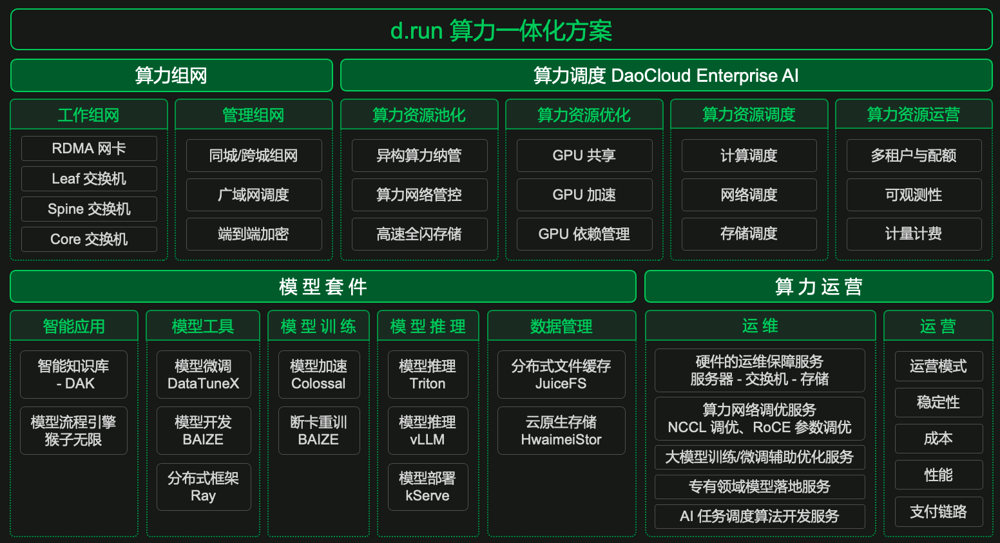

---
hide:
  - toc
---

# Introduction to d.run

d.run is a comprehensive AIGC (Artificial Intelligence Generated Content) operation and management platform developed by DaoCloud. It integrates cloud-native scheduling capabilities to provide one-stop management of computing cluster resources, featuring built-in algorithm development, model center, and model fine-tuning. It allows users to easily create intelligent Q&A systems and provides generative intelligent chat services while managing user feedback.

As a computing service provider and professional technical support, DaoCloud closely collaborates with various government enterprises, research institutions, and operators to build and operate intelligent computing centers across regions such as Shanghai, Hefei, Tianjin, and Hong Kong. This collaboration enables the free flow of computing resources across industries, regions, and levels. By constructing an AI open ecological platform and integrating a rich suite of model tools, d.run comprehensively promotes the collaborative innovation of computing power and applications, providing efficient, reliable, and easily accessible AI cloud services to all users, accelerating the widespread adoption of AI.

[Click to register for d.run](https://console.d.run/){ .md-button }
[Refer to and download PDF](https://harbor-test2.cn-sh2.ufileos.com/drun/d.run-0625.pdf){ .md-button }

## Product Overview

As an integrated solution for computing power, d.run can build a large-scale, high-speed interlinked computing network with thousands or tens of thousands of cards. It optimizes performance using DaoCloud Enterprise AI to schedule heterogeneous computing power, accelerating AI application innovation based on various model suites. Coupled with a series of operation and maintenance services, it ensures the stability and reliability of computing power.

d.run provides users with rich, user-friendly, and high-performance model suites, integrating practical ecological products and open-source tools needed for data preparation, model development, model training, and model deployment. This supports efficient model development and training, helping users easily apply AI technology in real business scenarios and empowering industrial upgrades.

- **Comprehensive AI Development and Production Tools**: Integrates a wide range of model suite tool options from data acquisition and exploration to model development, training, deployment, fine-tuning, and management, enabling low-cost and high-efficiency applications of AI technology to accelerate product and business innovation.

- **Convenient Data Management and Preparation Tools**: Provides tools for connecting various data sources, unified management of datasets, visual data exploration, data cleaning, and data augmentation, maximizing the work efficiency of data scientists and algorithm engineers, allowing them to focus more on model development.

- **Efficient Model Development and Training Support**: Offers an easy-to-use integrated development environment that supports interactive development and drag-and-drop visual modeling, improving training efficiency through a distributed training architecture while reducing computing costs for rapid and efficient model deployment, bridging the development, training, and production environments.

## Advantages of d.run

- **Flexible Resource Scheduling**: Offers flexible solutions for computing, networking, and storage resource scheduling, effectively improving resource utilization. Users can utilize computing resources on demand, significantly reducing computing costs.
- **Outstanding Processing Capability**: Provides industry-leading computing performance, optimizing soft and hard collaboration, significantly shortening training time and improving the accuracy of algorithms through GPU sharing and acceleration.
- **Rich Model Suite**: Offers a variety of convenient, practical, and high-performance model suites through the AI ecological open platform, supporting model development and training, accelerating the implementation and innovation of AI applications.
- **Comprehensive Operation and Maintenance Services**: Provides high-quality computing operation and maintenance services, achieving one-stop performance optimization for hardware and software, paired with efficient, visual platform management to ensure safe computing power usage for enterprises.

These advantages of d.run stem from its rich product modules and functional features:

## Getting Started with d.run

After a new user registers for d.run, they first need to [purchase computing power](./buy.md), which supports various options from single cards to thousands of cards. You can check your purchased resources at any time and review your purchase history.

Once your order is effective, the d.run backend will automatically create a [computing cluster](../kpanda/intro/index.md). You can set user, user groups, workspaces, and platform personalization in [Global Management](../ghippo/intro/index.md).

In the [Model Center](../dmc/index.md), you can deploy high-availability large language model services with one click and perform distributed inference through a unified model inference interface. The Model Center supports various popular large models both within and outside the industry, tightly integrated with intelligent Q&A and workflow orchestration modules. You can easily access various online model API Keys and flexibly switch between local and online model services as needed.

Next, use DataTunerX for [model fine-tuning](../dtx/index.md), trying out fine-tuning datasets and hyperparameter groups to achieve automated processing of the entire lifecycle of model fine-tuning, evaluation, and inference. By efficiently utilizing the underlying distributed computing resources in the computing cluster, DataTunerX can conduct matrix-style model fine-tuning experiments, promoting the agility and automated iteration of large models.

After fine-tuning the model, the AI [Process Engine](../monkey/index.md) can create intelligent Q&A systems that generate text from text, images from text, images from images, and videos from text. You can adjust the corpus and GPU resources used by the intelligent Q&A system at any time and quickly respond to user feedback.

Through the AI process, different [intelligent Q&A](../dak/index.md) can be generated for various industries and scenarios, managing the upper and lower levels and front and back-end facilities of intelligent Q&A in a one-stop manner, controlling user demand, and gaining insights into cutting-edge trends.

Refer to the demo video:

<video controls src="https://harbor-test2.cn-sh2.ufileos.com/drun/d.run-workflow.mp4" preload="metadata" poster="./images/workflow.png"></video>

## Industry Background

The global artificial intelligence industry is experiencing explosive growth, leading to an exponential increase in demand for intelligent computing power.

!!! quote "SemiAnalysis"

    GPT-4 was trained on approximately 25,000 A100 GPUs (utilization rate of 32%-36%) for 90-100 days, with a single training cost of $63 million.

!!! quote "Elon Musk"

    Training GPT-5 may require 30,000 to 50,000 H100 GPUs.

In China, computing power has become a hot topic in the new infrastructure for productivity, with policies being introduced intensively from central to local levels.

- February 2024: The State-owned Assets Supervision and Administration Commission of the State Council clearly stated that central enterprises should plan the development of AI as part of their overall work and accelerate the construction of a number of intelligent computing power centers.
- Six departments including the People's Bank of China and the Ministry of Industry and Information Technology jointly issued a document encouraging financial institutions to increase credit support for green and low-carbon computing power infrastructure.
- Beijing: During the 14th Five-Year Plan period, a large-scale advanced computing power supply capability will be formed to support large language models, large vision models, multimodal large models, and scientific computing large models with hundreds of billions of parameters.
- Shanghai: By 2024, the city's data center computing power supply will present a multi-dimensional collaborative system primarily based on intelligent computing power and other high-performance computing power, with total computing power exceeding 15 EFLOPS and high-performance computing power accounting for 35%.
- Guangdong: By 2025, the scale of intelligent computing power is expected to be the first in the country and lead globally, with a relatively complete innovation system for general artificial intelligence technology and the scale of core industries exceeding 300 billion yuan, with over 2,000 enterprises.
- Jiangsu: By the end of 2027, the province's computing power scale is expected to reach 700,000 CPU cores and 400 PB of storage, with sustained growth in high-performance computing power.
- Zhejiang: By 2024, more than 10 major scientific and technological achievements in artificial intelligence are expected to be formed, and over 1,000 core invention patents will be obtained; 3-4 large-scale artificial intelligence industry clusters are anticipated, with annual revenue growth of over 15%.
- Henan: By 2025, the scale of intelligent and supercomputing power is expected to exceed 2,000 PFLOPS, with high-performance computing power accounting for over 30%.
- Shandong: By 2025, the number of standard racks in use in the province's data centers is expected to reach over 450,000, with average utilization rates improving to over 60%.
- Hunan: By 2027, the construction of the Changsha Artificial Intelligence Innovation Center and the Malanshan Video Supercomputing Center will accelerate, with 51 large-scale data centers completed or under construction and 172,000 standard racks.
- Chengdu: By 2025, the output value of the city's artificial intelligence industry is expected to exceed 150 billion yuan, with the number of innovative application scenarios in artificial intelligence reaching over 100.
- Guizhou: From 2023 to 2025, the total scale of general computing power, intelligent computing power, and supercomputing power in Guizhou Province is expected to reach 2 EFLOPS, 5 EFLOPS, and 10 EFLOPS, respectively.

