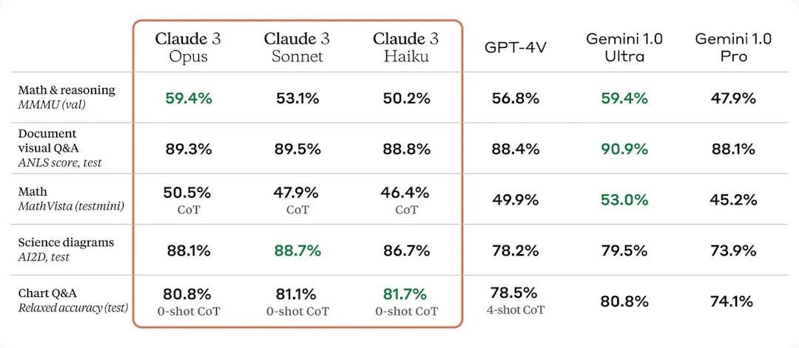

# Claude 3

获 Amazon 和 Google 投资的人工智能初创公司 Anthropic 推出全新的 Claude 3 人工智能大型语言模型，
旗下拥有 Haiku、Sonnet 和 Opus 三个版本。根据官方数据，Opus 表现比 GPT-4 和 Gemini 还要优胜。

## Claude 3 模型

- Claude 3 Opus

    Opus 是拉丁语的"作品"。Anthropic 同时称它为最智能的产品，理解已接近人类水平，也是目前在多项基准测试中表现最出色的模型。
    在 Anthropic 列出的十项常用模型能力评估数据中，Opus 的得分全都超过 GPT-4，即使视觉识别能力的情况也一样。

- Claude 3 Sonnet

    Sonnet 是英语的"十四行诗"。它在智能和速度之间取得理想平衡，尤其适用于高流量任务。
    对大部分任务来说，Sonnet 的速度比 Claude 2 和 Claude 2.1 快上 2 倍，而智能水平更高。

- Claude 3 Haiku

    Haiku 是日语"俳句"的音译。是三者中最具成本效益的模型，提供几乎是即时的回应。

## Claude 3 与 GPT-4 比较

Claude 3 现在已经像 GPT-4 一样支持多模态能力。Opus 在 MMMU 的得分为 59.4%，超过了 GPT-4V，与 Gemini 1.0 Ultra 持平。
如果想上传照片或图片给 AI 分析，数据显示 Claude 3 的能力比 GPT-4 更佳。

Claude 系列模型的优势还在于其长上下文窗口，这次更新的全系列大模型提供了 200K 的上下文窗口，并且支持超过 100 万个 Tokens 的输入。
100 万个 Token 有多长？大约是英文版《哈利波特-死神圣物》的长度。

然而，在定价方面，能力最高的 Claude 3 比 GPT-4 Turbo 要贵得多。
GPT-4 Turbo 每百万个 token 输入/输出收费为 10/30 美元，而 Claude 3 Opus 则为 15/75 美元，输出贵上 2.5 倍。

## 参考

- [Claude 3 英文原版长文介绍](https://www.anthropic.com/news/claude-3-family)
