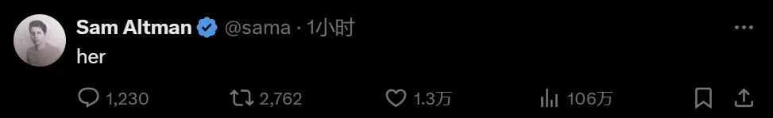
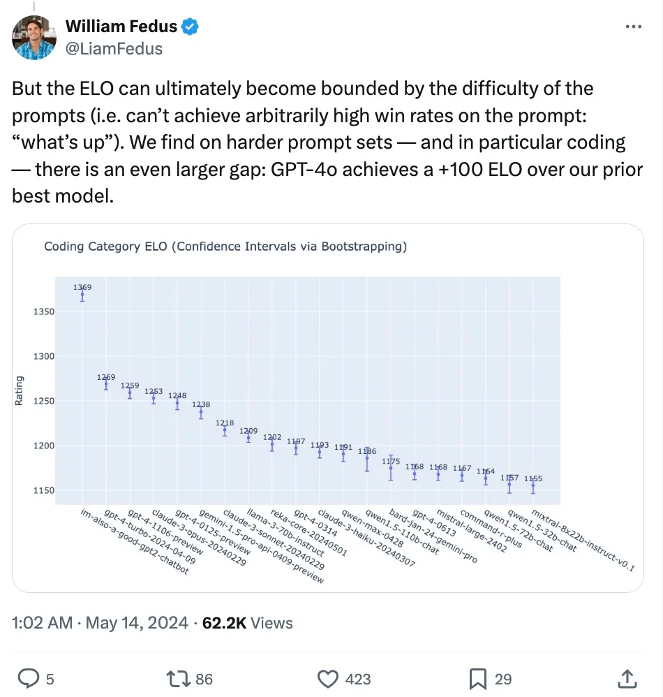
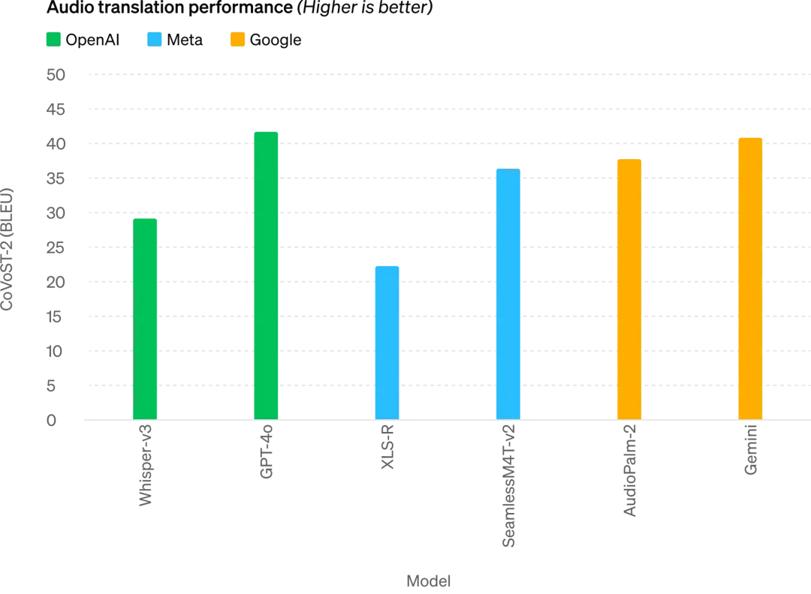
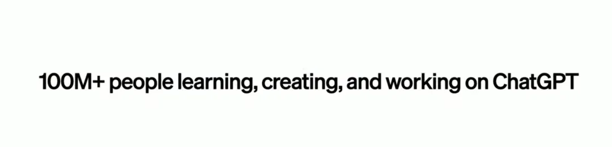
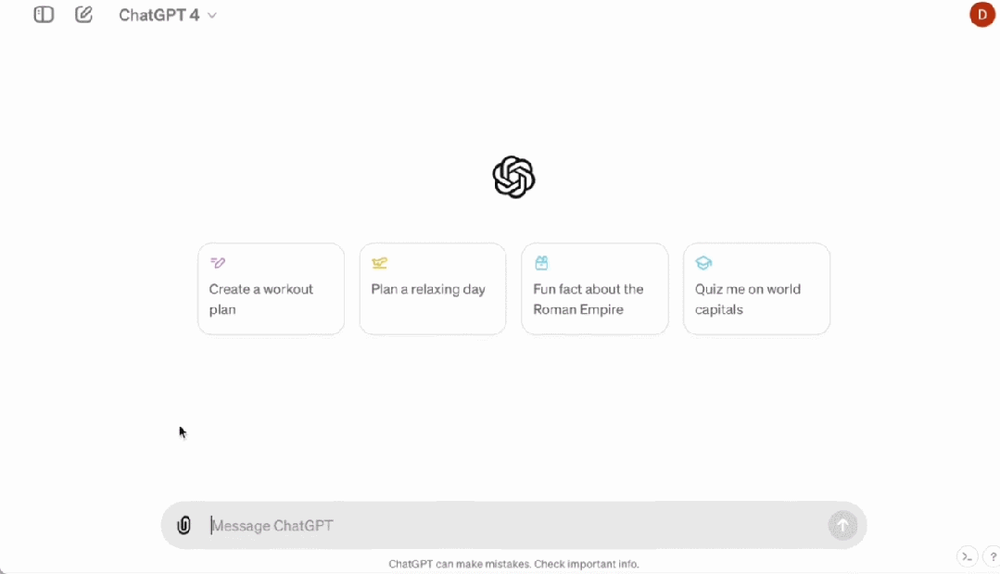
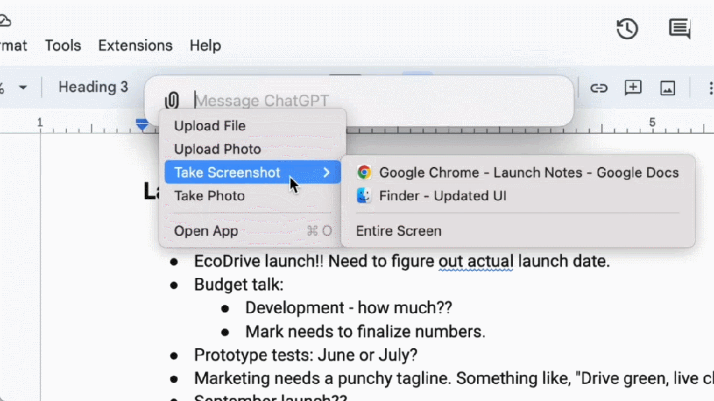
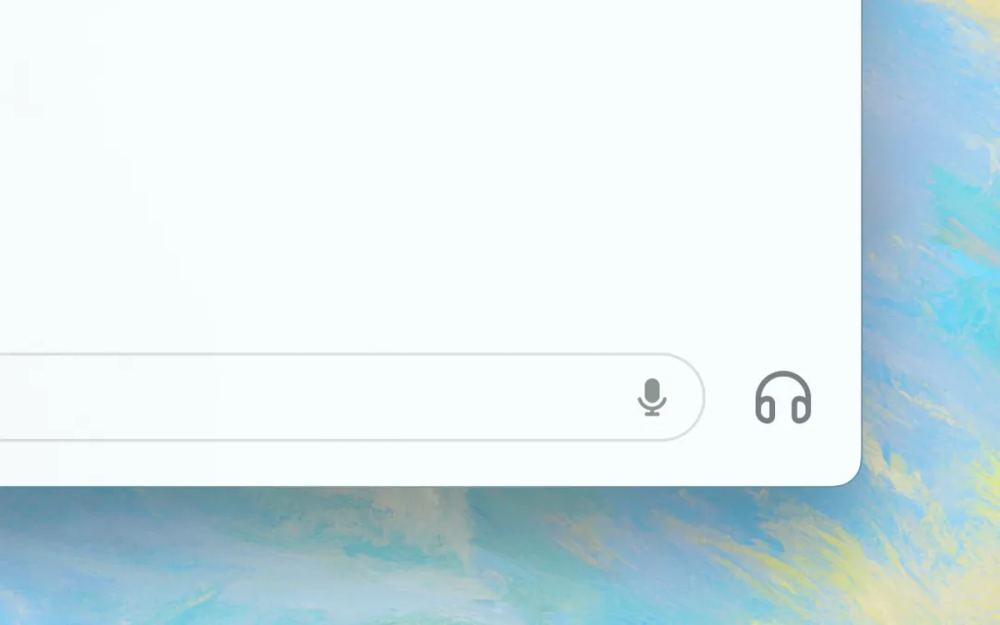

# OpenAI 颠覆世界：GPT-4o 完全免费

> 转载自机器之心

OpenAI 正在颠覆世界：GPT-4o 现在完全免费，实时语音视频交互震撼全场，直接进入科幻时代！

!!! note

    ChatGPT 问世才 17 个月，OpenAI 就拿出了科幻电影里的超级 AI，而且完全免费，人人可用。

太震撼了！

当各家科技公司还在追赶大模型多模态能力，把总结文本、P 图等功能放进手机里的时候，遥遥领先的 OpenAI 直接开了大招，发布的产品连自家 CEO 奥特曼都惊叹：就像电影里一样。

5 月 14 日凌晨，OpenAI 在首次「春季新品发布会」上搬出了新一代旗舰生成模型 GPT-4o、桌面 App，并展示了一系列新能力。这一次，技术颠覆了产品形态，OpenAI 用行动给全世界的科技公司上了一课。

今天的主持人是 OpenAI 的首席技术官 Mira Murati，她表示，今天主要讲三件事：

- 第一，以后 OpenAI 做产品就是要**免费优先**，为的就是让更多的人能使用。
- 第二，因此 OpenAI 此次发布了**桌面版本的程序和更新后的 UI**，其使用起来更简单，也更自然。
- 第三，GPT-4 之后，新版本的大模型来了，名字叫 **GPT-4o**。GPT-4o 的特别之处在于它以极为自然的交互方式为每个人带来了 GPT-4 级别的智能，包括免费用户。

ChatGPT 的这次更新以后，大模型可以接收文本、音频和图像的任意组合作为输入，并实时生成文本、音频和图像的任意组合输出 —— 这才是属于未来的交互方式。

最近，ChatGPT 不用注册也可以使用了，今天又增加了桌面程序，OpenAI 的目标就是让人们可以随时随地的无感使用它，让 ChatGPT 集成在你的工作流中。这 AI 现在就是生产力了。

GPT-4o 是面向未来人机交互范式的全新大模型，具有文本、语音、图像三种模态的理解力，反应极快还带有感情，也很通人性。

在现场，OpenAI 的工程师拿出一个 iPhone 演示了新模型的几种主要能力。最重要的是实时语音对话，
Mark Chen 说：「我第一次来直播的发布会，有点紧张。」ChatGPT 说，要不你深呼吸一下。

好的，我深呼吸。

ChatGPT 立即回答说，你这不行，喘得也太大了。

如果你之前用过 Siri 之类的语音助手，这里就可以看出明显的不同了。
首先，你可以随时打断 AI 的话，不用等它说完就可以继续下一轮对话。
其次，你不用等待，模型反应极快，比人类的回应还快。第三，模型能够充分理解人类的情感，自己也能表现出各种感情。

随后是视觉能力。另一个工程师在纸上现写的方程，让 ChatGPT 不是直接给答案，而是让它解释要一步步怎么做。看起来，它在教人做题方面很有潜力。

_ChatGPT 说，每当你为数学焦头烂额的时候，我就在你身边。_

接下来尝试 GPT-4o 的代码能力。这有一些代码，打开电脑里桌面版的 ChatGPT 用语音和它交互，让它解释一下代码是用来做什么的，某个函数是在做什么，ChatGPT 都对答如流。

输出代码的结果，是一个温度曲线图，让 ChatGPT 以一句话的方式回应所有有关此图的问题。

最热的月份在几月，Y 轴是摄氏度还是华氏度，它都能回答得上来。

OpenAI 还回应了一些 X/Twitter 上网友们实时提出的问题。比如实时语音翻译，手机可以拿来当翻译机来回翻译西班牙语和英语。

又有人问道，ChatGPT 能识别你的表情吗？

<video controls src="https://harbor-test2.cn-sh2.ufileos.com/drun/gpt4o-video01.mp4" preload="metadata" poster="./images/video-cover01.png"></video>

看起来，GPT-4o 已经能够做到实时的视频理解了。

接下来，就让我们详细了解下 OpenAI 今天放出的核弹。

**全能模型 GPT-4o**

首先介绍的是 GPT-4o，o 代表 Omnimodel（全能模型）。

第一次，OpenAI 在一个模型中集成了所有模态，大幅提升了大模型的实用性。

OpenAI CTO Muri Murati 表示，GPT-4o 提供了「GPT-4 水准」的智能，但在 GPT-4 的基础上改进了文本、视觉和音频方面的能力，将在未来几周内「迭代式」地在公司产品中推出。

「GPT-4o 的理由横跨语音、文本和视觉，」Muri Murati 说道：「我们知道这些模型越来越复杂，但我们希望交互体验变得更自然、更简单，让你完全不用关注用户界面，而只关注与 GPT 的协作。」

GPT-4o 在英语文本和代码上的性能与 GPT-4 Turbo 的性能相匹配，但在非英语文本上的性能显著提高，同时 API 的速度也更快，成本降低了 50%。与现有模型相比，GPT-4o 在视觉和音频理解方面尤其出色。

它最快可以在 232 毫秒的时间内响应音频输入，平均响应时长 320 毫秒，与人类相似。在 GPT-4o 发布之前，体验过 ChatGPT 语音对话能力的用户能够感知到 ChatGPT 的平均延迟为 2.8 秒 (GPT-3.5) 和 5.4 秒 (GPT-4)。

这种语音响应模式是由三个独立模型组成的 pipeline：一个简单模型将音频转录为文本，GPT-3.5 或 GPT-4 接收文本并输出文本，第三个简单模型将该文本转换回音频。但 OpenAI 发现这种方法意味着 GPT-4 会丢失大量信息，例如模型无法直接观察音调、多个说话者或背景噪音，也无法输出笑声、歌唱或表达情感。

而在 GPT-4o 上，OpenAI 跨文本、视觉和音频端到端地训练了一个新模型，这意味着所有输入和输出都由同一神经网络处理。

「从技术角度来看，OpenAI 已经找到了一种方法，可以将音频直接映射到音频作为一级模态，并将视频实时传输到 transformer。这些需要对 token 化和架构进行一些新的研究，但总体来说是一个数据和系统优化问题（大多数事情都是如此）。」英伟达科学家 Jim Fan 如此评论道。

GPT-4o 可以跨文本、音频和视频进行实时推理，这是向更自然的人机交互（甚至是人 - 机器 - 机器交互）迈出的重要一步。

<video controls src="https://harbor-test2.cn-sh2.ufileos.com/drun/gpt4o-video02.mp4" preload="metadata" poster="./images/video-cover02.png"></video>

OpenAI 总裁 Greg Brockman 也在线「整活」，不仅让两个 GPT-4o 实时对话，还让它们即兴创作了一首歌曲，虽然旋律有点「感人」，但歌词涵盖房间的装饰风格、人物穿着特点以及期间发生的小插曲等。

此外，GPT-4o 在理解和生成图像方面的能力比任何现有模型都要好得多，此前很多不可能的任务都变得「易如反掌」。

比如，你可以让它帮忙把 OpenAI 的 logo 印到杯垫上：

经过这段时间的技术攻关，OpenAI 应该已经完美解决了 ChatGPT 生成字体的问题。

同时，GPT-4o 还拥有 3D 视觉内容生成的能力，能够从 6 个生成的图像进行 3D 重建：

这是一首诗，GPT-4o 可以将其排版为手写样式：

更复杂的排版样式也能搞定：

与 GPT-4o 合作，你只需要输入几段文字，就能得到一组连续的漫画分镜：

而下面这些玩法，应该会让很多设计师有点惊讶：

这是一张由两张生活照演变而来的风格化海报：

还有一些小众的功能，比如「文本转艺术字」：

## GPT-4o 性能评估结果

OpenAI 技术团队成员在 X 上表示，之前在 LMSYS Chatbot Arena 上引起广泛热议的神秘模型「im-also-a-good-gpt2-chatbot」就是 GPT-4o 的一个版本。

在比较困难的 prompt 集上 —— 特别是编码方面：GPT-4o 相比于 OpenAI 之前的最佳模型，性能提升幅度尤其显著。

具体来说，在多项基准测试中，GPT-4o 在文本、推理和编码智能方面实现了 GPT-4 Turbo 级别的性能，同时在多语言、音频和视觉功能上实现了新高。

_推理提升：GPT-4o 在 5-shot MMLU（常识问题）上创下了 87.2% 的新高分。（注：Llama3 400b 还在训练中）_

_音频 ASR 性能：GPT-4o 相比 Whisper-v3 显著提高了所有语言的语音识别性能，特别是对于资源匮乏的语言。_

_GPT-4o 在语音翻译方面取得了新的 SOTA 水平，并且在 MLS 基准测试中优于 Whisper-v3。_

_M3Exam 基准测试既是多语言评估基准也是视觉评估基准，由来自多个国家 / 地区的标准化测试多项选择题组成，并包括图形、图表。在所有语言基准测试中，GPT-4o 都比 GPT-4 更强。_

未来，模型能力的提升将实现更自然、实时的语音对话，并能够通过实时视频与 ChatGPT 进行对话。例如，用户可以向 ChatGPT 展示一场现场体育比赛，并要求它解释规则。

## ChatGPT 用户将免费获得更多高级功能

每周都有超过一亿人使用 ChatGPT，OpenAI 表示 GPT-4o 的文本和图像功能今天开始免费在 ChatGPT 中推出，并向 Plus 用户提供高达 5 倍的消息上限。

现在打开 ChatGPT，我们发现 GPT-4o 已经可以使用了。

使用 GPT-4o 时，ChatGPT 免费用户现在可以访问以下功能：体验 GPT-4 级别智能；用户可以从模型和网络获取响应。

此外，免费用户还可以有以下选择 ——

分析数据并创建图表：

和拍摄的照片对话：

上传文件以获取总结、写作或分析方面的帮助：

发现并使用 GPTs 和 GPT 应用商店：

以及使用记忆功能打造更有帮助的体验。

不过，根据使用情况和需求，免费用户可以使用 GPT-4o 发送的消息数量会受到限制。当达到限制时，ChatGPT 将自动切换到 GPT-3.5，以便用户可以继续对话。

此外，OpenAI 还将在未来几周内在 ChatGPT Plus 中推出新版本的语音模式 GPT-4o alpha，并通过 API 向一小部分值得信赖的合作伙伴推出对 GPT-4o 更多新的音频和视频功能。

当然了，通过多次的模型测试和迭代，GPT-4o 在所有模态下都存在一些局限性。在这些不完美的地方，OpenAI 表示正努力改进 GPT-4o。

可以想到的是， GPT-4o 音频模式的开放肯定会带来各种新的风险。在安全性问题上，GPT-4o 通过过滤训练数据和通过训练后细化模型行为等技术，在跨模态设计中内置了安全性。OpenAI 还创建了新的安全系统，为语音输出提供防护。

**新的桌面 app 简化用户工作流程**

对于免费和付费用户，OpenAI 还推出了适用于 macOS 的新 ChatGPT 桌面应用程序。通过简单的键盘快捷键（Option + Space），用户可以立即向 ChatGPT 提问，此外，用户还可以直接在应用程序中截取屏幕截图并进行讨论。

现在，用户还可以直接从计算机与 ChatGPT 进行语音对话，GPT-4o 的音频和视频功能将在未来推出，通过点击桌面应用程序右下角的耳机图标来开始语音对话。

从今天开始，OpenAI 将向 Plus 用户推出 macOS 应用程序，并将在未来几周内更广泛地提供该应用程序。此外今年晚些时候 OpenAI 会推出 Windows 版本。

**奥特曼：你们开源，我们免费**

在发布结束后，OpenAI CEO 山姆・奥特曼久违地发表了一篇博客文章，介绍了推动 GPT-4o 工作时的心路历程：

在我们今天的发布中，我想强调两件事。

首先，我们使命的一个关键部分是将强大的人工智能工具免费（或以优惠的价格）提供给人们。我非常自豪地宣布，我们在 ChatGPT 中免费提供世界上最好的模型，没有广告或类似的东西。

当我们创立 OpenAI 时，我们的最初构想是：我们要创造人工智能并利用它为世界创造各种利益。现在情况有所变化，看起来我们将创造人工智能，然后其他人将使用它来创造各种令人惊奇的事物，我们所有人都会从中受益。

当然，我们是一家企业，会发明很多收费的东西，这将帮助我们向数十亿人提供免费、出色的人工智能服务（希望如此）。

其次，新的语音和视频模式是我用过的最好的计算交互界面。感觉就像电影里的人工智能一样，我仍然有点惊讶于它竟然是真的。事实证明，达到人类水平的响应时间和表达能力是一个巨大的飞跃。

最初的 ChatGPT 暗示了语言界面的可能性，而这个新事物（GPT-4o 版本）给人的感觉有本质上的不同 —— 它快速、智能、有趣、自然且能给人带来帮助。

对我来说，与电脑交互从来都不是很自然的事情，事实如此。而当我们添加（可选）个性化、访问个人信息、让 AI 代替人采取行动等等能力时，我确实可以看到一个令人兴奋的未来，我们能够使用计算机做比以往更多的事情。

最后，非常感谢团队为实现这一目标付出了巨大的努力！

值得一提的是，上个星期奥特曼在一次采访中表示，虽然全民免费收入（universal basic income）难以实现，但我们可以实现「全民免费计算 universal basic compute」。在未来，所有人都可以免费获得 GPT 的算力，可以使用、转售或捐赠。

「这个想法是，随着 AI 变得更加先进，并嵌入到我们生活的方方面面，拥有像 GPT-7 这样的大语言模型单元可能比金钱更有价值，你拥有了部分生产力，」奥特曼解释道。

GPT-4o 的发布，或许就是 OpenAI 朝着这方面努力的一个开始。

是的，这还只是个开始。

最后提一句，今天 OpenAI 博客中展示的「Guessing May 13th’s announcement.」的视频，几乎完全撞车谷歌明天 I/O 大会的一个预热视频，这无疑是对谷歌的贴脸开大。不知道看完今天 OpenAI 的发布，谷歌有没感到巨大压力？

