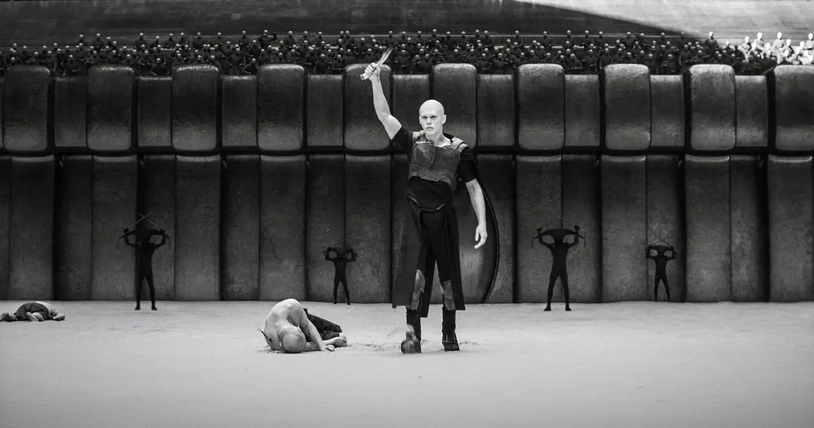

# 谁将替代 Transformer？

> 文章转载自 [AI 科技评论](https://mp.weixin.qq.com/s/Q8PIn0FOuXkOT1TiIOuDaA)

非 Transformer 面临的共同考验依然是证明自己的天花板有多高。

## Transformer 前世今生

2017 年谷歌发表的论文《Attention Is All You Need》成为当下人工智能的一篇圣经，此后席卷全球的人工智能热潮都可以直接追溯到 Transformer 的发明。

Transformer 由于其处理局部和长程依赖关系的能力以及可并行化训练的特点，一经问世，逐步取代了过去的 RNN（循环神经网络）与 CNN（卷积神经网络），成为 NLP（自然语言处理）前沿研究的标准范式。

今天主流的 AI 模型和产品——OpenAI 的 ChatGPT、谷歌的 Bard、Anthropic 的 Claude，Midjourney、Sora 到国内智谱 AI 的 ChatGLM 大模型、百川智能的 Baichuan 大模型、Kimi chat 等等——都是基于 Transformer 架构。

Transformer 已然代表了当今人工智能技术无可争议的黄金标准，其主导地位至今无人能撼动。

在 Transformer 大行其道的同时，出现了一些反对的声音，如：“Transformer 的效率并不高”；“Transformer 的天花板很容易窥见”；“Transformer 是很好，但并不能实现 AGI，实现一个 world model（世界模型）”。

这是因为 Transformer 的强大之处同时也是它的弱点：Transformer 中固有的自注意力机制（attention）带来了挑战，主要是由于其二次复杂度造成的，这种复杂度使得该架构在涉及长输入序列或资源受限情况下 **计算成本高昂且占用内存** 。

简单点说，这意味着当 Transformer 处理的序列长度（例如，段落中的单词数量或图像的大小）增加时，所需的算力就会按该序列的平方增加，从而迅速变得巨大，因此有说法认为“Transformer 效率不高”。这也是当下人工智能热潮引发了全球算力短缺的主要原因。

基于 Transformer 的局限性，许多非 Transformer 架构顺势提出，其中包括中国的 RWKV、Meta 的 Mega、微软亚研的 Retnet、Mamba、DeepMind 团队的 Hawk 和 Griffin 等——它们都是在 Transformer 一统大模型研发江湖之后陆续被提出来的。

他们大多在原来的 RNN 基础上，针对 Transformer 的缺陷和局限性来做改进，试图研究出所谓的「高效 Transformer」（efficient Transformer）结构，一个更像人类思考的架构。

其中 efficient Transformer 是指占用的内存更小、训练和推理过程中的计算成本更小的模型，试图来推翻 Transformer 的霸权。

## 当前的非 Transformer 架构研究正走向何方？

现在主流的非 Transformer 研究基本都是针对 attention 机制去优化 full attention 的部分，然后想办法将这一部分变成一个 RNN 模型，以此提高推理的效率。

attention 是 Transformer 的核心——Transformer 模型之所以如此强大，是因为它抛弃了之前广泛采用的循环网络和卷积网络，而采用了一种特殊的结构——注意力机制（attention）来建模文本。

attention 使模型能够考虑单词之间的关系、不管它们相距多远，并确定段落中哪些单词和短语最值得关注。

这种机制使得 Transformer 实现了语言处理的并行化，即同时分析特定文本中的所有单词，而不是按顺序分析。Transformer 的并行化使它们对所读所写的文本有了更全面、更准确的理解，也使得它们比 RNN 具有更高的计算效率和可扩展性。

相比之下，循环神经网络（RNNs）面临梯度消失的问题，使得它们难以对长序列进行训练，此外，在训练过程中无法在时间上并行化，进而限制了其可扩展性；卷积神经网络（CNNs）只擅长捕捉局部模式，在长程依赖方面还很欠缺，而这对于许多序列处理任务至关重要。

但是 RNNs 的优势在于 RNN 模型做推理时，复杂度是恒定的，所以内存和计算需求是呈线性增长，相对于 Transformer 在序列长度上的内存和计算复杂性呈二次方增长，RNN 的内存与计算需求更低。因此，今天很多非 Transformer 研究都循着“保留 RNN 优势的同时，试图达到 Transformer 性能”的方向去努力。

**基于这一目标，今天的非 Transformer 技术研究主要分为两个流派：**

流派一是以 RWKV、 Mamba 和 S4 为代表，它们完全用 recurrent（循环）结构去替代 attention。这种思路是用一个固定的内存记住前面的信息，但目前看来虽然可以记住一定长度，但要达到更长的长度是有难度的。

还有一个流派是把 full attention 这种密集结构变得稀疏，例如 Meta 的 Mega，在之后的计算中不再需要算所有 attention 矩阵中的每一个元素，模型效率也随之变高。

具体分析各个非 Transformer 模型，其中 RWKV 是国产开源的首个非 Transformer 架构的大语言模型，目前已经迭代至第六代 RWKV-6。RWKV 的作者彭博在 2022 年 5 月开始训练 RWKV-2，当时只有 1 亿（100M）参数规模，后续在 2023 年 3 月又训练出了 RWKV-4 140 亿（14B）的参数版本。

彭博曾告诉 AI 科技评论，为什么他要做一个跟 Transformer 架构不同的模型：

“因为这个世界本身就不是基于 Transformer 的逻辑去做推理来运转的，这个世界的运转规律是基于类似 RNN 结构的——这个世界的下一秒，不会跟你过去所有的时间、所有的信息相关联，只会跟你的上一秒相关联。而 Transformer 要辨认所有的 token，这是不合理的。”

所以 RWKV 用 linear attention（线性注意力机制） 去近似 full attention，试图结合 RNN 和 Transformer 的优点，同时规避两者的缺点，来缓解 Transformer 所带来的内存瓶颈和二次方扩展问题，实现更有效的线性扩展，同时提供并行训练和可扩展性，类似于 Transformer。简而言之，主打高性能、低能耗、占用内存小。

而此前讨论较多的 Mamba，其论文作者有两位，一位是卡内基梅隆大学机器学习系助理教授 Albert Gu，另一位是 Together.AI 首席科学家的 Tri Dao。

他们在论文中称，Mamba 是一个新的 SSM 架构，在语言建模方面，无论是预训练还是下游评估，他们的 Mamba-3B 模型都优于同等规模的 Transformer 模型，并能与两倍于其规模的 Transformer 模型相媲美，还可以随上下文长度的增加实现线性扩展，其性能在实际数据中可提高到百万 token 长度序列，并实现 5 倍的推理吞吐量提升。

一位非 Transformer 研究者告诉 AI 科技评论，Mamba 完全只用 recurrent（循环）结构，不用 attention，所以它在做下一个 token 的预测时，
**其内存大小永远固定，并不会随时间增加而增加；但它的问题在于滚动的过程中 memory 非常小，即其外推能力也比较弱。**

上述研究者认为，微软亚研提出的 RetNet，走的也是完全 recurrent 思路。RetNet 引入了一种多尺度 retention 机制来替代多头注意力，它有三种计算范式：并行、循环和分块循环表征。

论文中称，RetNet 的推理成本与长度无关。对于 7B 模型和 8k 序列长度，RetNet 的解码速度是带键值缓存的 Transformers 的 8.4 倍，内存节省 70%。

在训练过程中，RetNet 也能够比标准 Transformer 节省 25-50% 的内存，实现 7 倍的加速，并在高度优化的 FlashAttention 方面具有优势。此外，RetNet 的推理延迟对批大小不敏感，从而实现了巨大的吞吐量。

Meta 提出的 Mega 则代表了非 Transformer 研究的第二种技术路线。Mega 的思路是把 recurrent 和变稀疏的 attention 矩阵结合起来。

Mega 的核心研究人员之一 Max 告诉 AI 科技评论，attention 有它不可替代的作用，只要把它的复杂度限制在一定范围内，就能达到想要的效果。Mega 用了很长时间研究如何把 recurrent 和 attention 结合在一起才能最高效。

所以 Mega 还是采用了 attention 结构，只不过把 attention 限制在了一个固定的 window（窗口）范围内，同时结合了类似 Mamba 的滚动记忆形式，只不过 Mega 的滚动形式要简化许多，所以整个计算速度很快。

「滚动记忆」是指，所有的 efficient Transformer 都是把 recurrent 循环结构引入到 Transformer 中，类似于模型先看一段历史、记住，再看下一段历史，更新记忆，可能第一段历史记忆就没必要都记住了，忘掉一些，再把第二段需要记住的加到整个历史中，以此不断往前滚动着记忆。

这样记忆的好处是模型可以有一个固定长度的滚动记忆，不会随着时间增加而让 memory 也要增加，但它的问题是很多时候，某些特殊任务在最后时刻都不知道前面记忆中有哪些是有用的、哪些是没用的，这种滚动式记忆就很难完成。

Mega 在跟 llama 同样的数据上训练，再跟 llama2 去做公平的比较，发现在同样的数据情况下，Mega2 的效果比 llama2 要好很多。同时 Mega 预训练采用 32K 窗口大小，Transformer 用同样 32K 的窗口大小速度比 Mega2 慢很多，如果 window size 再变大，Mega 优势会越来越明显。目前 Mega2 已经训到了 7B 大小。

DeepMind 团队提出的 Hawk 和 Griffin 同样认为没有 attention 是不行的，属于 gated linear RNN，跟 Mega 一样属于混合模型。

除 RWKV，国内岩芯数智也发布了非 Attention 机制的通用自然语言大模型——Yan 模型。岩芯数智 CTO 刘凡平称，Yan 跟线性的 Attention 和 RNN 没有任何关系，Yan 架构的大模型去除了 Transformer 中高成本的注意力机制，代之以计算量更小、难度更低的线性计算，提高了建模效率和训练速度，实现了效率的提升和成本的降低。

## Transformer 能否被颠覆？

虽然当下非 Transformer 研究提出的并不少，从测评效果上来看，跟同等规模大小的 Transformer 相比，表现普遍超过 Transformer，但它们共同面临的考验和质疑是：当它们的规模被放大到今天 Transformer 模型的大小时，是否还能继续展示出强大的性能和效率提升？

其中参数最大的 RWKV 有 140 亿参数，背靠 Meta 的 Mega 有 70 亿参数，而 GPT-3 有 1750 亿参数，GPT-4 传闻有 1.8 万亿参数，这意味着非 Transformer 急需训练出一个千亿模型来证明自己。

非 Transformer 研究中最具代表性的 RWKV，已经走得非常靠前——其背后的元始智能目前已经完成了上千万元的种子轮融资；据了解国内已经有一些公司在尝试用 RWKV 来训练模型；过去的一年里，RWKV 在 To C、To B 也有局部落地。

然而，有多位投资人告诉 AI 科技评论曾纠结是否要投 RWKV，赌一下非 Transformer 时，因为内部分歧太大——不敢坚信非 Transformer 能跑出来，最后都放弃了。

现阶段来看，基于现有硬件的算力基础，用 Transformer 去做端侧大模型的难度很高，还是需要在云上完成计算推理等工作，而且应答速度不如人意，终端用户很难接受。

有业内人士告诉 AI 科技评论，“在端侧，RWKV 并不一定是最优解，因为随着半导体发展，AI 芯片越来越进化，未来在硬件、算力、能源上的成本，最终都会被摊平，未来大模型可以轻松地直接跑在终端上，不再需要花费大力气从底层架构来做出改变。未来有一天会达到这样一个临界点的。”

RWKV 的方式是从框架层操作，把框架轻量化了以后，可以让模型在本地运算。但也有一位投资人提出观点，认为非 Transformer 的理想状态是必须达到 OpenAI 的水平再来讲轻量化，“而不是为了小而小，为了本地化而本地化”。

上述投资人评价 RWKV “麻雀虽小，五脏俱全”，总体体验感能达到 GPT-3.5 的 60 分，但并不知道最后能否达到 GPT 的 80 分、90 分。这也是非 Transformer 的问题所在，即如果舍弃了框架的复杂度、可能会牺牲上限的天花板。

有接近 OpenAI 的人士告诉 AI 科技评论，OpenAI 内部其实曾经测试过 RWKV，但后面还是放弃了这一路线，因为“可能从长期来看它的天花板还未显现，实现 AGI 的可能性不大”。

证明自己的天花板有多高，成为了所有非 Transformer 架构需要共同面临的考验。

一些模型研究人员称，Transformer 做文本大模型还没有达到它的天花板，毕竟 scaling law 还没有失效，Transformer 的瓶颈或许还是在生成序列长度更长的领域，例如在视频生成的多模态领域，而多模态是未来实现 AGI 的必经之路，如此看来，上下文窗口依然是 Transformer 的一个瓶颈。

如果像 OpenAI 一样不怕花钱，可以继续推高 Transformer 的 scaling law，但问题在于序列每长两倍就要花四倍的钱，花的时间也是四倍，平方级别的增长使 Transformer 在长序列问题的处理上效率太低，而且资源有上限。

据了解，国内前列的大模型公司，基本用的都是 Transformer。但也有猜测称，GPT-5 是否还是沿用 Transformer 架构是个未知，理由是从 GPT-2 之后没再继续开源。但大家更愿意相信 Transformer 的天花板还远。所以国内想要继续追赶 GPT-4、GPT-5，走 Transformer 这条路也未必是错的。大模型时代，大家都在赌。

但实现 AGI，Transformer 是否是唯一的路径，也未可知。目前能够确定的，是 Transformer 形成的垄断很难被打破，无论是从资源还是生态，当下的非 Transformer 研究都比不过。

据了解，目前研究大模型非 Transformer 新架构的团队，要么在学术界，要么是如 RWKV 这样的创业团队，很少有大公司投入一个大的团队来研究新架构，所以在资源上，跟 Transformer 相比，非 Transformer 研究的差距还很大。

此外，挡在前面最大的阻碍是 Transformer 日益坚固的生态护城河。

现在，无论是硬件、系统、应用，都是围绕 Transformer 做适配、优化，使得开发其他架构的性价比降低，导致想要开发新的架构越来越难。

在测评这块，许多测评设计任务的方式，都在偏向 Transformer 架构，意思是它设计的任务可能只有 Transformer 的模型能做出来，非 Transformer 做不出来、或者难度加大。这种设计能够展示 Transformer 的优势，但对其他架构并不友好。

MIT 的博士生、flash-linear-attention 项目负责人杨松霖就曾告诉 AI 科技评论，当下非 Transformer 研究面临的阻碍之一是评估方式——单纯看 Perplexity（困惑度），非 transformer 其实跟 Transformer 的模型相比没有差距，但很多实际能力 （如 in-context copy and retrieval）依然差距很大。她认为当前的非 Transformer 模型缺乏更全面的评估方式，方能改进与 Transformer 之间能力的差距。

毫无疑问，当下 Transformer 的地位依然无可撼动，依然是当下最强大的 AI 架构，然而，在回音室效应之外，开发下一代人工智能架构的工作正如火如荼进行着。

打破垄断固然不易，但根据科技发展的规律，很难有一个架构能永远一统江湖。未来，非 Transformer 需要继续证明自己的天花板有多高，Transformer 架构也同样如此。
