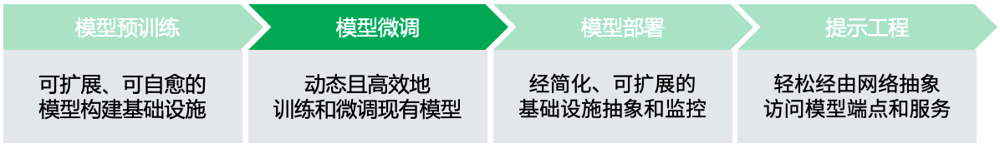

# 为什么 K8s 与生成式 AI 珠联璧合

> 英文原版来自 [run.ai/blog](https://www.run.ai/blog/why-kubernetes-is-the-platform-for-genai)

Kubernetes（K8s）不再只是一个运行工作负载（如 Web 应用和微服务）的工具；
对于大语言模型（LLM）等大型人工智能（AI）和大型机器学习（ML）工作负载，K8s 是端到端全生命周期管理的理想平台。

2021 年，[Run:ai 的一份报告](https://pages.run.ai/ai-infrastructure-survey-report-2021)发现，
42% 的受访者表示他们已将 K8s 用于 AI/ML 工作流。去年，
[Red Hat](https://www.altoros.com/blog/machine-learning-constitutes-65-percent-of-kubernetes-workloads)
发现这一比例已增至 65%，预计今年会更高。

这种广泛应用跨越了各个行业：从 [OpenAI](https://kubernetes.io/case-studies/openai/) 等最前沿的创新公司，到
[CoreWeave](https://www.coreweave.com/blog/serverless-kubernetes-what-it-is-and-how-it-works)
等人工智能云服务提供商，再到 [Shell](https://www.altoros.com/blog/shell-builds-10000-ai-models-on-kubernetes-in-less-than-a-day/)
和 [Spotify](https://www.youtube.com/watch?v=KUyEuY5ZSqI) 等知名品牌。
所有这些企业组织都依赖 K8s 来支持其 AI/ML 分布式工作负载。

在这篇文章中，我们将探讨为什么 K8s 在 AI/ML 研究和工程的每个生命周期阶段都能提供独特的支持。

## 引言

众所周知，K8s 是分布式计算环境中一个高效的容器编排和管理平台。
它最初是由 Google 开发的开源项目，用于管理其内部海量应用。开源之后，它已成为各种环境下部署、扩展和管理容器化应用的实际标准。

最近，K8s 经证实对于一些新兴使用场景也非常有用：那些寻求高效开发、训练和部署 LLM 的企业组织已开始利用这一工具。
它为 LLM 整个生命周期中的全面支持提供了众多优势，消除了在不同技术栈中集成复杂框架的需求。
从模型预训练到模型部署，再到微调实验和应用构建，K8s 可以用在 LLM 全生命周期的每个阶段。

## 各阶段的优势

### 模型预训练

在模型预训练阶段，K8s 凭借其无与伦比的可扩展性和韧性，为模型训练提供了坚实的基础。
K8s 可以根据资源需求自动扩缩的能力是其最大的优势之一，这正是 AI/ML 工作负载在面对海量算力需求时所急需的特性。
K8s 通过自动化管理 Pod 的生命周期来实现这一点；如果某个 Pod 出错，它将被自动终止并重启。换句话说，Pod 有自愈能力。

K8s 还可以按需轻松添加或减少 Pod 和节点，从而实现动态扩展，以满足不断变化的工作负载需求。
其声明式基础架构方法便于用户们交流需求，从而简化管理流程。这些都是使用 Slurm 等其他工具时无法获得的强大开发特性。
这意味着您可以拥有更高的产出量，更高效地训练模型，而无需手动处理基础设施限制。

Jupyter Notebooks 和 VS Code 等工具对于 LLM 实验和提示工程来说是必需的，而 K8s
网络抽象使数据科学家能够非常轻松地创建开发环境，并完成与这些工具的集成。
此外，端口转发和配置管理是自动进行的，这简化了最终用户的工作空间配置以及集群管理员的环境和网络管理。

### 模型微调

虽然 K8s 拥有开发 LLM 所需的所有工具，但如今许多企业并非从头开始构建大语言模型，而是选用现有的一些模型，根据企业特定环境对模型进行定制和微调。在这种场景下，当您想对现有模型进行微调时，K8s 也是理想的选择，因为它非常具有动态性。与 Slurm 不同，K8s 可以并行处理多个工作负载，这使得训练过程更加高效。另一个优势体现在 K8s 为模型训练构建了丰富的工具生态。比如 Kubeflow（专为 Pytorch、Tensorflow 和 MPI 设计的 Operator）、KubeRay Operator 和 MLflow。

### 模型部署

谈到 LLM 模型部署本身或模型推理服务，K8s 提供了一个简化的流程：您只需向数据科学家呈现一个端点。
网络栈简化了向外界发布模型的流程，轻松将模型推向消费侧。K8s 为模型部署提供了全面的工具集和丰富的生态，
包括负载均衡、Ingress 控制器、网络策略等。这有助于 LLM 端点的无缝部署及其与服务和应用的集成。

基础设施抽象进一步简化了部署过程，确保了可扩展性和自动扩缩能力。K8s 抽象了所有底层基础设施，
简化为用于管理容器的通用 API。因此无论工作负载在何处运行，您都可以使用相同的工具和流程。
这极大地简化了生产环境的管理和监控。

### 提示工程

优势不止于此。部署 LLM 模型后，K8s 在开发应用或让用户参与模型实验时能够提供增强的用户体验。
例如，使用 K8s 在 Gradio 或 Streamlit 等平台上托管应用几乎毫不费力，
这是因为 K8s 社区有一套完整的工具集专门用于跨平台托管应用。
这就简化了部署过程，同时服务端点和自动扩缩能力还确保了实验的平滑顺利和可扩缩。

### 安全性

无论在哪个阶段，K8s 都能提供强大的安全性，确保您的数据和知识产权的安全。
例如，基于角色的访问控制（RBAC）可实现细粒度的访问控制，为用户或服务帐户授予适当的权限；
Pod 安全上下文允许您在 Pod 级别设置安全属性，从而缩小集群内的攻击面。
这些特性可确保在整个 AI/ML 生命周期中容器、模型和数据集的环境安全。

## 真实的成功案例

上述这些优势不仅仅是理论上的，当今许多最具创新性的尖端企业正在 K8s 上运行和管理整个
LLM 的生命周期，包括运营大规模集群的领先科技公司（例如 OpenAI）以及新兴 AI 云服务提供商（Core Weave、Lambda 云服务）。

例如，[OpenAI 的集群由 7,500 多个节点组成](https://openai.com/research/scaling-kubernetes-to-7500-nodes)，
用于支持其大型语言模型和分布式机器学习负载。尽管有 Slurm 等替代方案，但 K8s 为 OpenAI
工程师们提供了更优越的开发体验和云原生集成环境。借助 K8s，他们还可以轻松、灵活地部署容器、管理异构节点、处理动态基础设施组件。

!!! quote "OpenAI 基础设施主管 Christopher Berner 表示"

    研究团队现在可以利用我们在 K8s 之上构建的框架，轻松启动模型实验，轻松将实验规模扩大 10 倍或 50 倍，并且无需花费太多精力来管理。

OpenAI 在 Azure 的多个数据中心运行 K8s，受益于集群范围的 MPI 通信域，能够支持跨节点的并行作业和批量操作。
K8s 作为批量调度系统，其自动扩缩器可确保动态扩缩，降低空闲节点成本，同时保持低延迟。而且 K8s 的速度非常快，
研究分布式训练系统的人员能够在几天而不是几个月内启动和扩缩实验。

通过采用 K8s，OpenAI 发现模型的移植性能优异，可以在集群之间轻松迁移模型实验。
K8s 提供了一致的 API，简化了这个迁移过程。此外，OpenAI 在借助 Azure 设施的同时，
还可以充分利用自有的数据中心，既节省了成本，又提高了可用性。

当然并不是只有 OpenAI 这样规模的公司才能受益：K8s 已经成为构建、训练和部署语言模型的主流平台，
彻底革新了[人工智能蓝图](https://mattturck.com/landscape/mad2023.pdf)。
在 K8s 中托管 AI/ML 工作负载具有多种优势：可扩展性、灵活性、网络抽象以及实验时更好的用户体验。
借助 K8s，您可以使用最优秀的工具和技术满足自身需求，轻松构建、训练和部署 AI/ML 工作负载。
