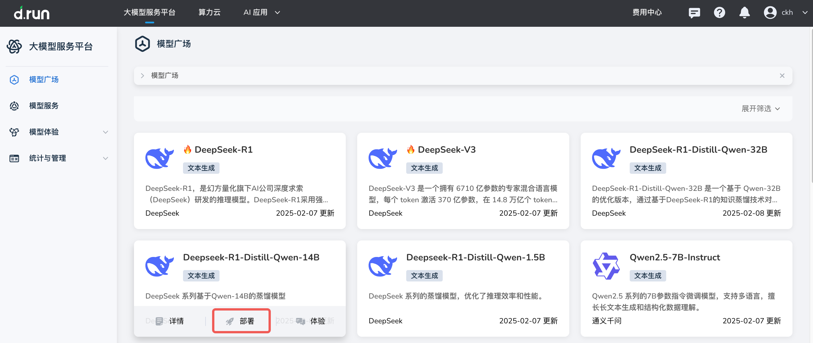
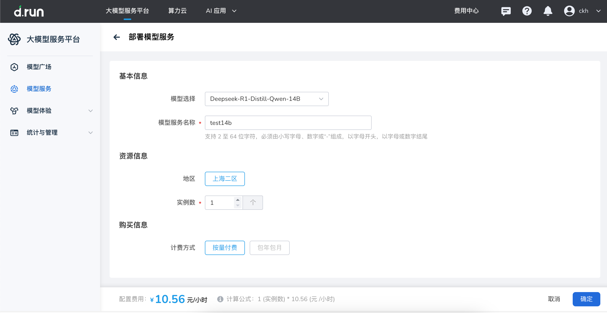
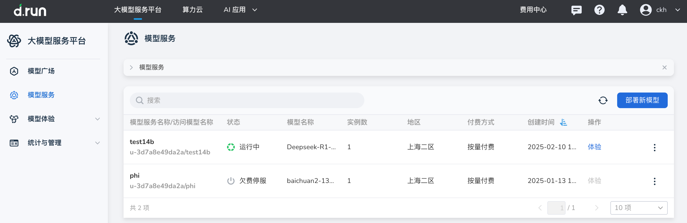
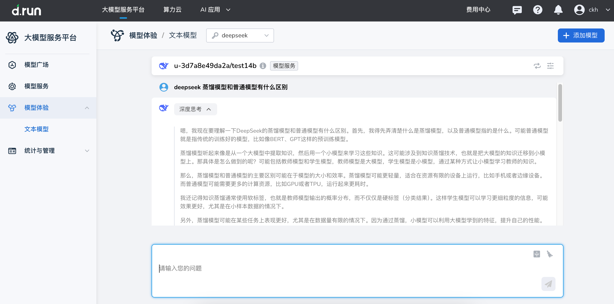
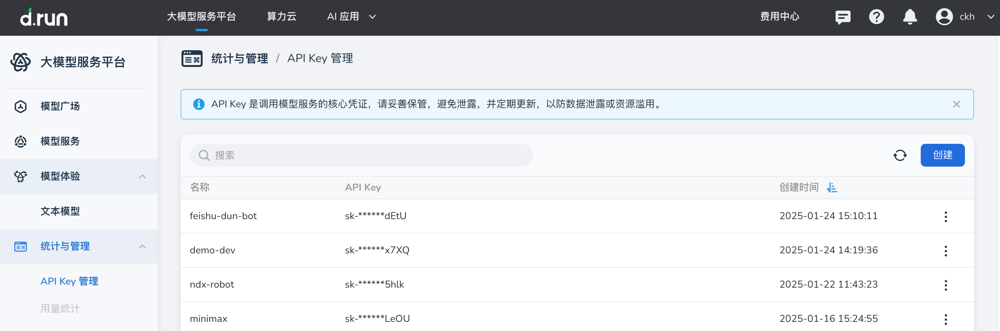
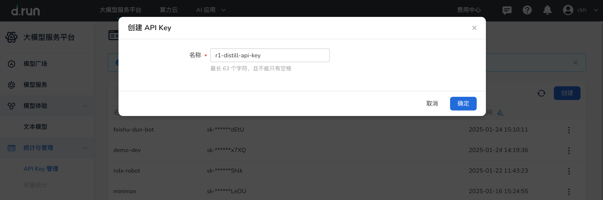
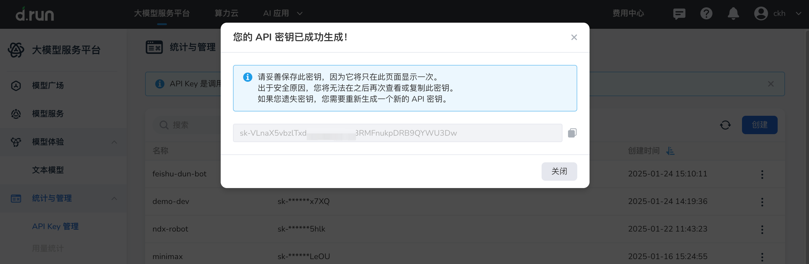
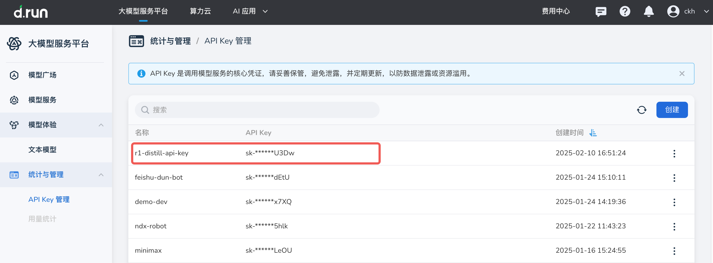
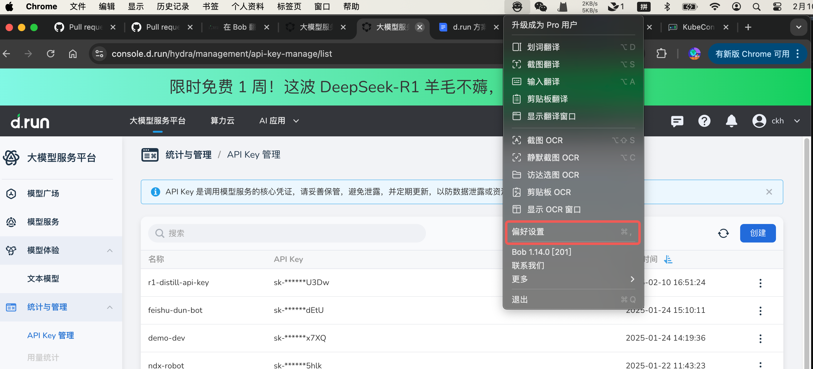
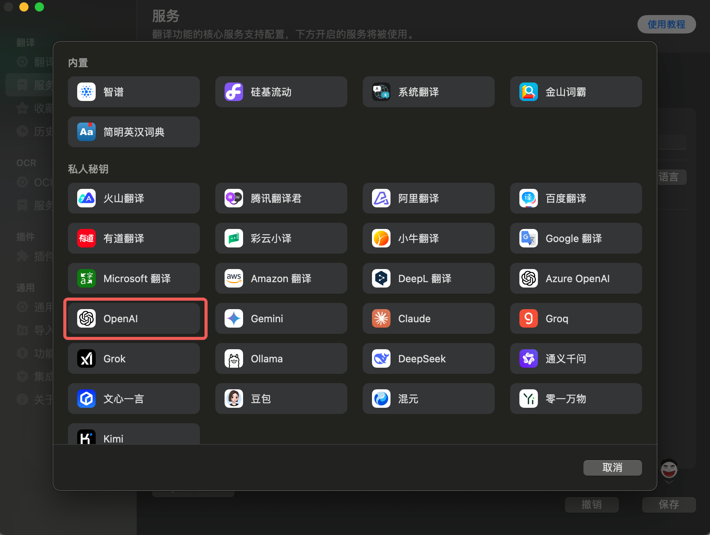

---
hide:
  - toc
---

# 快速入门：部署、调用和体验 d.run DeepSeek

d.run 目前为 DeepSeek 模型提供了免费一周的体验时间，
打开 <https://console.d.run/> 即可免费体验一周以下几个 DeepSeek 模型的服务：

- DeepSeek-R1
- DeepSeek-V3
- DeepSeek-R1-Distill-Qwen-32B
- DeepSeek-R1-Distill-Qwen-14B

不过，为了提高你的使用体验，建议部署一个自己专属的大模型。
我们以 DeepSeek-R1-Distill-Qwen-14B 为例。

## 部署模型

1. 在 **模型广场** 找到 DeepSeek-R1-Distill-Qwen-14B，点击卡片上的 **部署** 按钮。

    

1. 输入基本信息、资源信息，选择计费方式后，点击 **确定**

    

1. 系统提示部署成功，状态从 **部署中** 变为 **运行中** 后，即表示 DeepSeek-R1-Distill-Qwen-14B 模型被成功部署。

    

## 在 d.run 中体验模型对话

点击操作列中的 **体验** ，即可使用 DeepSeek-R1-Distill-Qwen-14B 蒸馏模型开始对话聊天。



## 第三方调用 d.run 模型服务

此外，你还可以通过 VSCode、Bob Translate、Lobe Chat、Cherry Studio 等第三方智能应用调用 d.run API
来使用刚刚部署的 DeepSeek-R1-Distill-Qwen-14B 模型服务。

### 创建 API Key

如果想要在第三方应用中调用 d.run 的模型服务，就需要 API Key。

1. 在 d.run 大模型服务平台中，点击导航栏的 **统计与管理** -> **API Key 管理** ，点击右侧的 **创建** 按钮

    

1. 输入一个方便识别的名称后，点击 **确定**

    

1. 屏幕提示 API 密钥创建成功，妥善保管生成的密钥后，点击 **关闭**

    

1. 返回 API Key 列表，刚生成的默认位于第一个。

    

### 调用 d.run 模型服务

以第三方应用 Bob Translate 为例，

1. 通过 App Store 安装完成之后，运行 Bob，从下拉菜单中点选 **偏好设置**

    

1. 依次点击 **服务** -> **➕**

    

1. 选择 OpenAI（后续应该会增加 DeepSeek 的选项）

    

1. 填写以下参数，只启用 d.run 的模型服务，点击 **保存**

    | **配置项** | **举例值** |
    |-----------|----------- |
    | **服务名称** | d.run.deepseek |
    | **API Key** | 输入刚生成的 Key |
    | **自定义 API Base URL** | `https://sh-02.d.run` |
    | **自定义 API Path** | `/v1/chat/completions` |
    | **模型** | 自定义模型 |
    | **自定义模型** | DeepSeek-R1-Distill-Qwen-14B |

    

    !!! note

        你也可以在命令行运行以下命令，检测模型是否能调用成功：

        ```bash
        curl 'https://sh-02.d.run/v1/chat/completions' \
         -H "Content-Type: application/json" \
         -H "Authorization: Bearer <Your API Key here>" \
         -d '{
            "model": "u-3d7a8e49da2a/test14b",
            "messages": [{"role": "user", "content": "Say this is a test!"}],
            "temperature": 0.7
         }'
        ```

1. 现在让 Bob Translate 翻译一句话

    

🎉 恭喜你，第三方应用 Bob Translate 已成功通过 API 调用了 d.run 中部署的 DeepSeek-R1-Distill-Qwen-14B 模型。
以此类推，你可以将 d.run 中部署的 DeepSeek 模型挂接到任何第三方智能应用了。
