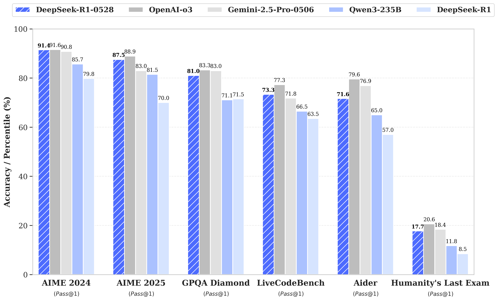
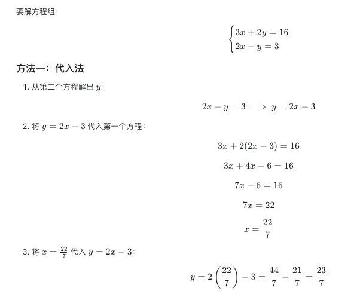
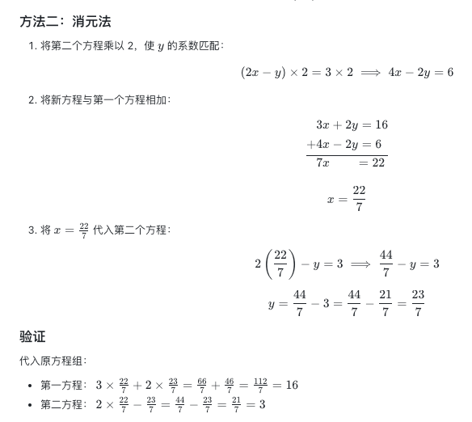
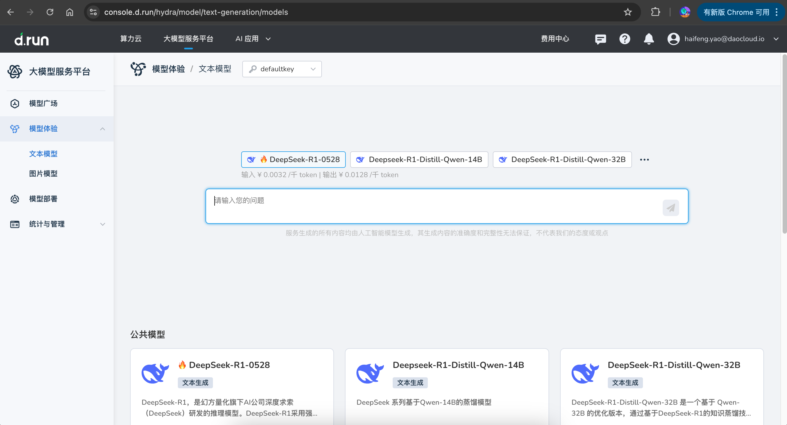

---
hide:
  - toc
---

# d.run 上新 DeepSeek-R1-0528，强化 CoT 推理链，代码实力再进化

端午节期间，[d.run 大模型服务平台](../../models/index.md)紧跟 DeepSeek 步伐，上线了全新的 **DeepSeek-R1-0528** 模型。

## R1-0528 简要说明

R1-0528 是 DeepSeek R1 模型的一次小版本升级。在本次更新中，
DeepSeek R1 通过引入更强的算力支持以及后训练阶段的算法优化机制，显著提升了模型在推理深度和推断能力方面的表现。
R1-0528 模型在数学、编程和通用逻辑等多个基准评测中展现出优异性能，整体水平已接近主流领先模型，如 ChatGPT O3 和 Gemini 2.5 Pro。

R1-0528 在 Hugging Face 上的模型仓库为：
<https://huggingface.co/deepseek-ai/DeepSeek-R1-0528/tree/main>

相较于 R1 版本，升级后的 R1-0528 模型在复杂推理任务上的处理能力有明显提升，如下图所示：



根据官方陈述， **CoT 思维链全面升级** ，R1-0528 在处理复杂推理任务时表现更加出色：

* 在 **AIME 2025 测试** 中，准确率由 70% 提升至 **87.5%**
* 推理过程中的 token 使用量，从平均 12K 增加至 **23K tokens** ，展现更深层次的思维过程

除了推理能力的突破，R1-0528 在以下方面也带来了显著提升：

* 幻觉率进一步降低，生成更可信
* **函数调用** 支持增强，更适用于工具集成与智能体开发
* 编程体验更丝滑，**Vibe 编程** 更加自然高效

## R1-0528 评估结果

对于所有 DeepSeek 模型，生成长度上限均设为 **64K tokens** 。
在需要采样的基准测试中，使用以下参数进行评估：

- 温度 **0.6**
- top-p **0.95**
- 每个查询生成 **16 个响应** 以估算 pass\@1 指标

| 类别 | 基准测试（指标） | DeepSeek R1 | DeepSeek R1 0528 |
|-----|---------------|-------------|------------------|
| 通用 | MMLU-Redux（精确匹配） | 92.9 | 93.4 |
| | MMLU-Pro（精确匹配） | 84.0 | 85.0 |
| | GPQA-Diamond（Pass@1） | 71.5 | 81.0 |
| | SimpleQA（正确率） | 30.1 | 27.8 |
| | FRAMES（准确率） | 82.5 | 83.0 |
| | Humanity's Last Exam（Pass@1） | 8.5 | 17.7 |
| 编程 | LiveCodeBench（2408-2505）（Pass@1） | 63.5 | 73.3 |
| | Codeforces-Div1（评级） | 1530 | 1930 |
| | SWE Verified（解决率） | 49.2 | 57.6 |
| | Aider-Polyglot（准确率） | 53.3 | 71.6 |
| 数学 | AIME 2024（Pass@1） | 79.8 | 91.4 |
| | AIME 2025（Pass@1） | 70.0 | 87.5 |
| | HMMT 2025（Pass@1） | 41.7 | 79.4 |
| | CNMO 2024（Pass@1） | 78.8 | 86.9 |
| 工具调用 | BFCL_v3_MultiTurn（准确率） | - | 37.0 |
| | Tau-Bench（Pass@1） | - | 53.5（航空）/63.9（零售） |

从上表可以看出，相较于 R1 模型，R1-0528 在各项能力上均实现了全面升级，
其中 **编程能力与数学推理** 表现尤为亮眼，提升幅度显著。

!!! note

    * 在 SWE-Verified 基准测试中，DeepSeek 官方采用 **Agentless 框架** 进行模型性能评估
    * 对于 HLE 测试集，官方仅评估 **纯文本提示词（text-only prompts）**
    * 在 Tau-bench 评估中，**GPT-4.1** 作为用户角色参与了测试

## 组合方程式求解示例

为了考察 R1-0528 在思维链方面的推理能力、符号计算能力和数学逻辑的理解能力。
我们简单做一个测试，求解组合方程式。

d.run 大模型服务平台 Demo 地址（面向公众开放）：
<https://console.d.run/>

提问：

```question
求解方程组：
3x + 2y = 16
2x - y = 3
```

深度思考过程：

```think
我们有两个方程：

    1. 3x + 2y = 16
    2. 2x - y = 3

我们可以使用代入法或消元法来解这个方程组。这里我选择使用代入法。

从方程2解出y：2x - y = 3 => y = 2x - 3 ...(3)

将方程3代入方程1：3x + 2(2x - 3) = 16 3x + 4x - 6 = 16 7x - 6 = 16 7x = 16 + 6 7x = 22 x = 22/7

将x的值代入方程3：y = 2*(22/7) - 3 y = 44/7 - 21/7 y = (44 - 21)/7 y = 23/7

所以解为：x = 22/7, y = 23/7

验证：将x=22/7, y=23/7代入方程1：3*(22/7) + 2*(23/7) = (66/7) + (46/7) = 112/7 = 16，正确。

代入方程2：2*(22/7) - (23/7) = (44/7) - (23/7) = 21/7 = 3，正确。

因此，方程组的解为 x = 22/7, y = 23/7。
```

输出：





## 弹球游戏示例

我们在 [d.run 大模型服务平台](https://console.d.run/)，使用 DeepSeek-R1-0528 编写一个网页版的弹球游戏，测试其对物理环境和条件的模拟效果。

这个小游戏的编写、调试、提 PR 和网页构建共用时：15 分钟

<div align="center" style="font-size: 20px;">
  <a href="images/simulation.html">
    
  </a>
</div>

游戏特点：

1. 可调整重力和旋转速度
2. 真实的物理碰撞效果
3. 粒子系统碰撞特效
4. 响应式 UI 设计

## 大模型服务平台介绍

本次测试使用的大模型服务平台是 d.run 的核心模块之一，面向公众开放注册，用户可随时免费体验包括
DeepSeek-R1-0528 在内的多种先进 **文本与图像大模型** 。

大模型服务平台提供了多样化的模型选择，涵盖文本生成、图片生成、图片理解等领域，
集成了来自 DeepSeek、通义千问、Meta 等提供商的数百个模型，支持多种模型调用方式。
用户可根据业务需求灵活部署模型，实现高效的实时推理。



📍 立即体验 👉 <https://console.d.run/>

2025 年 5 月大模型服务平台 v0.5.0 更新亮点包括：

- 模型广场
    - 支持文本模型的深度思考功能
    - 支持文本模型的消息复制和重新生成
    -  图生文模型支持同时生成多张图片
    - 图生文模型支持自定义正反提示词，支持自定义图片尺寸
    - 支持 100% 兼容标准的 OpenAI SDK 调用
- API Key 管理
    - 支持按 API Key、模型类型、调用时间等维度进行调用统计
    - 快速展示调用总量、输入 token 总数、输出 token 总数
    - 支持多模型用量对比

## 参考汇总

- [DeepSeek-R1-0528 Hugging Face 仓库](https://huggingface.co/deepseek-ai/DeepSeek-R1-0528/tree/main)
- [d.run 体验入口](https://console.d.run/)
- [d.run 操作教程](https://docs.d.run/)
