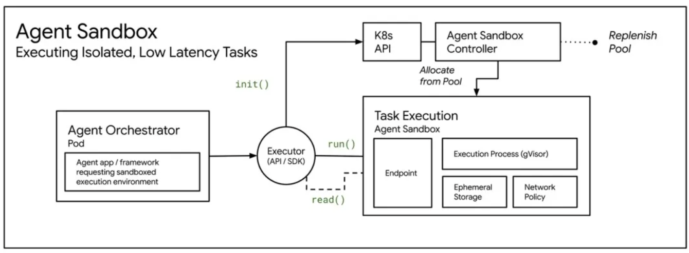
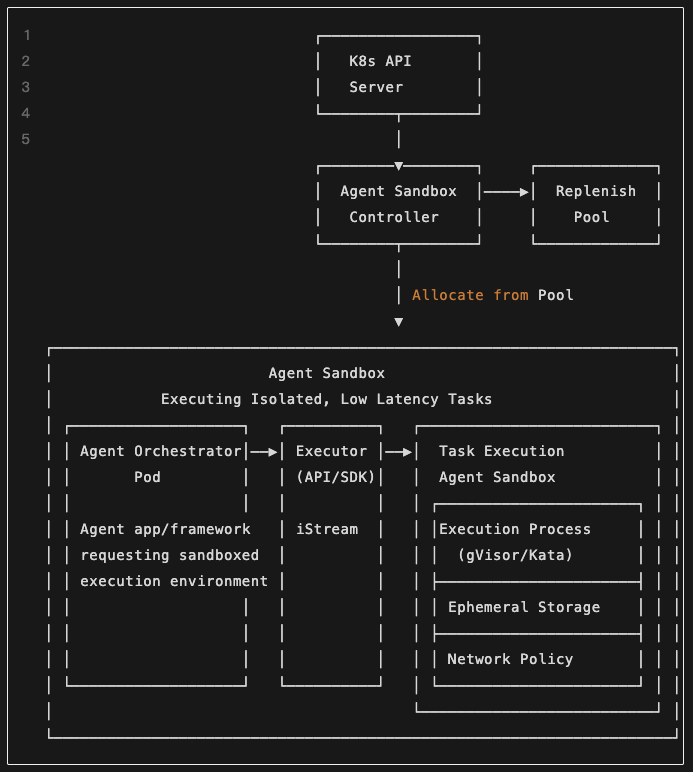
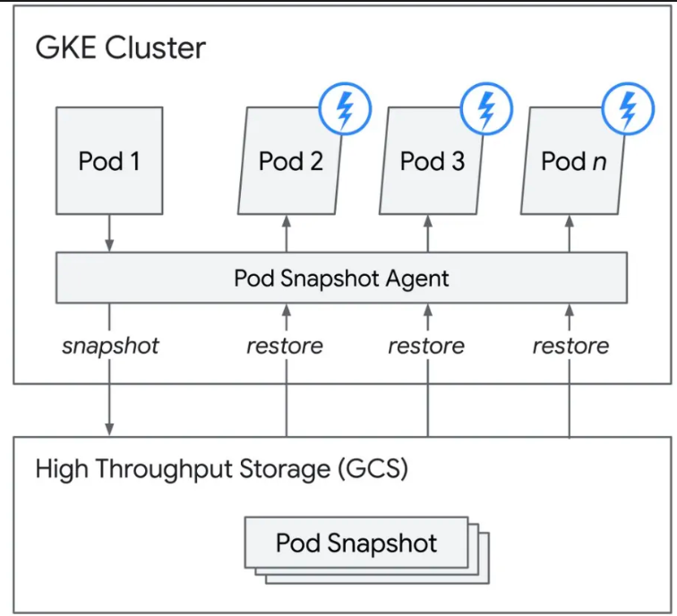
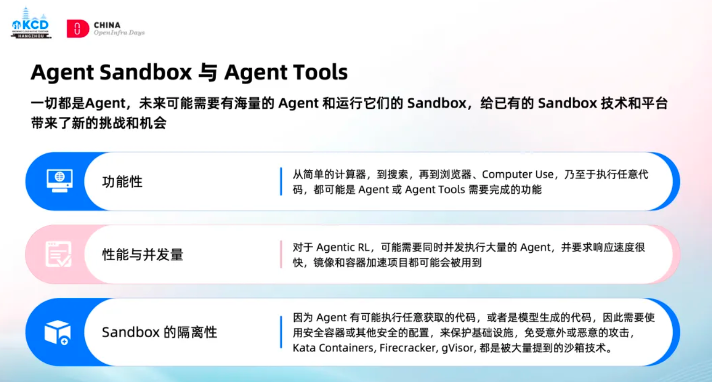

# Agent Sandbox 深度解析：当 AI 学会“动手”，我们如何不被它“误伤”？

2023 年 7 月，OpenAI 悄然发布了一个后来被证明具有里程碑意义的功能 ——
**Code Interpreter**（后更名为 **Advanced Data Analysis**）。

这是很多人第一次真正感受到 **AI Agent** 的形态：
它不仅能思考、分析问题，还能 **写代码、运行程序、生成结果** 。

Code Interpreter 的本质创新，并不只是模型能力提升，而是 **第一次将 LLM 放进了可执行环境** ：

- AI 生成代码
- 系统自动执行
- 用户直接获得结果

然而，它的成功也暴露了一个严峻现实。

## 一个绕不开的问题：AI 生成的代码，本质上不可信

与人类工程师编写的软件不同，AI 生成代码具有天然风险：

- **不可预测性**
  基于概率模型，输出具有随机性

- **易受提示注入攻击**
  恶意用户可诱导 AI 生成危险代码

- **权限边界模糊**
  AI 并不真正理解系统级操作的安全后果

当工程师们在需求洪水中依赖 AI 工具“救火”时，这些工具却开始频繁“闯祸”。

## 真实事故：一条命令，清空整个 Home 目录

不久前，一位网友在 Reddit 上发帖称，自己在使用 **Claude CLI** 清理旧代码仓库时，意外清空了 Mac 的整个用户主目录。

```shell
rm -rf tests/ patches/ plan/ ~/
```

多年工作成果瞬间消失。

如果这种操作发生在 Linux 系统中，后果可能更加严重：

```python
import subprocess
subprocess.run(['rm', '-rf', '/'])
```

这不是理论风险，而是 **Agent 在没有约束条件下的真实威胁** 。

## Agent Sandbox：AI 时代的基础设施

正如：

* Docker 改变了软件交付方式
* GitHub 改变了代码协作方式

Agent Sandbox 正在成为 AI 时代的基础设施。
一个可以执行不受信任代码，但不会危及宿主系统的沙箱环境。

它解决的核心问题不是「AI 能不能做事」，而是「AI 做事时，如何始终处于人类可控范围内」。

## Kubernetes Agent Sandbox 项目概览

**Agent Sandbox** 是 Kubernetes sig-apps 旗下的全新子项目，通过 **标准化、声明式 API** 管理隔离的、有状态的单例工作负载，非常适合 AI Agent 运行时场景。它提供 **原生 Sandbox CRD 与控制器、高可扩展性、开发者友好的 SDK**，可管理数千并发 Sandbox，亚秒级响应。

其大致工作原理如下图所示：



### 核心组件与架构

Sandbox CRD 是项目核心，用于声明式管理 **单个有状态 Pod** ，提供稳定身份、持久存储和统一生命周期管理。同时，扩展 CRD 包括：

| CRD 名称 | 功能 |
| --------------- | -------------------- |
| SandboxTemplate | 可复用的 Sandbox 模板 |
| SandboxClaim | 从模板创建 Sandbox |
| SandboxWarmPool | 预热 Sandbox 池，实现亚秒级启动 |

架构上，Sandbox CRD 位于 Kubernetes 控制平面之上，由控制器统一管理 Pod 生命周期，并向下对接安全运行时（如 gVisor、Kata Containers），实现强隔离执行。



Agent Sandbox 支持 **供应商中立** 的安全运行时，重点包括 gVisor 和 Kata Containers。

### gVisor（GKE 集成）

* **隔离方式**：应用程序内核（用户空间）
* **特性**：生产就绪、快照与恢复、低开销
* **示例配置**：

```yaml
apiVersion: agents.x-k8s.io/v1alpha1
kind: Sandbox
metadata:
  name: ai-agent-sandbox
spec:
  podTemplate:
    spec:
      runtimeClassName: gvisor
      containers:
      - name: agent-runtime
        image: my-ai-agent:latest
```



### Kata Containers

* **隔离方式**：轻量级虚拟机（硬件虚拟化）
* **特性**：虚拟机级别强隔离、GPU 直通支持、适合 AI/ML 工作负载
* **示例配置**：

```yaml
apiVersion: agents.x-k8s.io/v1alpha1
kind: Sandbox
metadata:
  name: kata-ai-sandbox
spec:
  podTemplate:
    spec:
      runtimeClassName: kata-qemu-nvidia-gpu
      containers:
      - name: agent-runtime
        image: my-ai-agent:latest
```



### gVisor 与 Kata Containers 对比

| 特性 | gVisor | Kata Containers |
| --- | ------ | --------------- |
| 隔离方式 | 用户空间内核 | 硬件虚拟化 |
| 启动时间 | ~100ms | ~1–2s |
| 内存开销 | 低 | 高 |
| 系统调用兼容性 | ~95% | 100% |
| GPU 支持 | 有限 | 完全直通 |
| 适合场景 | 不受信任代码 | GPU / 强隔离 |

### 期望能力与使用场景

| 能力 | 说明 |
| --- | ---- |
| 强隔离 | 内核与网络层隔离 |
| 深度休眠 | 状态持久化与归档 |
| 自动恢复 | 网络恢复后继续运行 |
| 高效持久化 | 弹性快速存储 |
| 内存共享 | 跨 Sandbox 内存共享 |
| 身份与连接性 | 双身份模型与高效路由 |
| 可编程性 | Agent 原生调用 API |

主要使用场景：AI Agent 运行时、云端开发环境、Jupyter / 研究工具、有状态单 Pod 服务。

### 快速上手

```shell
export VERSION="v0.1.0"
# 安装核心组件
kubectl apply -f https://github.com/kubernetes-sigs/agent-sandbox/releases/download/${VERSION}/manifest.yaml
# 安装扩展（可选）
kubectl apply -f https://github.com/kubernetes-sigs/agent-sandbox/releases/download/${VERSION}/extensions.yaml
```

创建一个 Sandbox：

```yaml
apiVersion: agents.x-k8s.io/v1alpha1
kind: Sandbox
metadata:
  name: my-sandbox
spec:
  podTemplate:
    spec:
      containers:
      - name: agent
        image: your-agent-image:latest
```

## 行业趋势与未来方向

* AI Agent 自主性增强
* 零信任执行环境成为标配
* 云原生 AI Infra 崛起
* 多集群与可观测性集成

Agent Sandbox 不只是技术方案，更是长期命题：
**如何在赋能 AI 的同时，确保人类始终掌握控制权？**

它让 AI 可以大胆尝试，也让工程师可以安心放手，是 AI Infra 时代的潜在关键基石。

## 参考

- [kubernetes-sigs/agent-sandbox repo](https://github.com/kubernetes-sigs/agent-sandbox)
- [agent-sandbox 网站及文档](https://agent-sandbox.sigs.k8s.io/)
- [GKE 博客：Agent Sandbox 简介](https://cloud.google.com/blog/products/containers-kubernetes/agentic-ai-on-kubernetes-and-gke)
