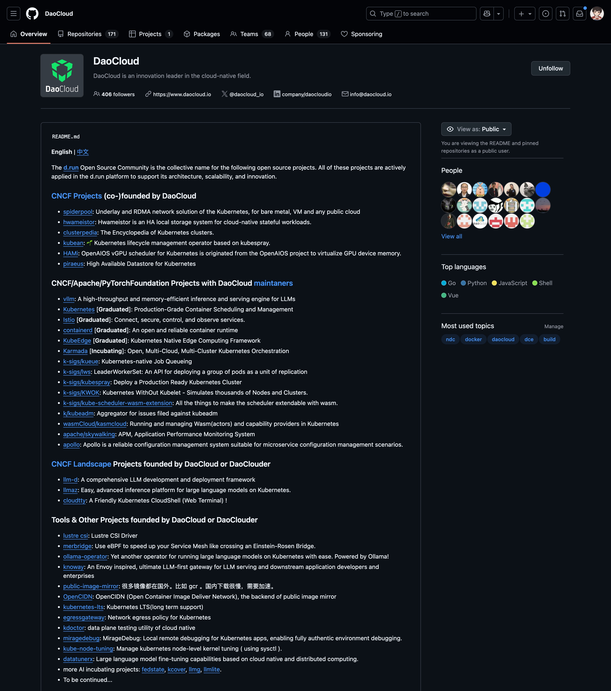

# AI Infra 创业潮：为什么“推理”将成为下一个独角兽赛道？

过去几年大家最关注的是大模型本身：
**参数规模、能力、Benchmark 性能基准、能不能打**

如果将开发大模型比做是“造房子”，那 AI Infra 就是“工具箱”，包括构建、部署和维护人工智能 (AI) 系统所需的硬件、软件和服务的组合。

| 类比 | 对应真实世界 |
| --- | -------- |
| 房子本体 | 大模型 |
| 房子的钢筋水泥、工具、电工、管线 | AI Infra |

中国真正缺的不是“应用场景”，缺的是成熟的“原材料+工具厂” —— AI Infra 层的产能。
**AI Infra 也就是 AI 模型的“操作系统”。**

**应用是显性创业机会；Infra 是隐形蓝海。**

从 2024 到 2030 年，这层价值正在快速从幕后转向台前。

## 为什么上一轮的独角兽诞生在训练层？

在上一轮的 AI 发展浪潮中，独角兽企业如雨后春笋般在训练层涌现，其背后的推动力正是 **Scaling Law** 这一铁律。Scaling Law，即尺度定律，它如同一条无形的指挥棒，引领着整个行业的发展方向。其核心观点简洁而有力：在人工智能领域，尤其是大模型的训练中，模型越大，所展现出的涌现能力就越强 。这一理论为模型的发展提供了清晰的指引，让人们看到了通过扩大模型规模来提升性能的可能性，仿佛打开了一扇通往无限潜力的大门。

**当模型参数规模达到某个临界点，一些几乎“像天才一样”的能力会突然出现。**

大模型里有一个神奇现象，叫 **“涌现”** ：
当模型规模到达临界点时，性能会呈指数级提升，甚至展现出难以预测的能力——比如接近真正智能的表现。

正如中国科学院首位人工智能领域院士张钹在访谈中形容天才一样：

!!! quote

    “你认为自己是天才吗？”

    “我从 6 岁开始，每天都在学习，再笨的人也能变聪明。”

天才的 **涌现** 就是知识积累到极致时自然爆发的灵感。

因此，2017~2023 年间，整个行业都在卷：
**谁能堆起最大的 GPU，谁就有机会成为下一轮独角兽**

但训练层的胜负，不仅是算力的比拼，更是对 **架构设计、训练策略、数据调度能力** 的全方位考验。
真正的独角兽，是在这场 **认知与算力的双重赛道** 上脱颖而出的。

## 未来五年赚钱的主战场是推理层

在 AI 的宏大版图中，推理层正逐渐崭露头角，成为未来五年当之无愧的赚钱主战场。
这一转变并非偶然，而是由模型的使用频率、成本结构等多方面因素共同驱动的必然结果。

**模型不会天天训练，但每天都在推理。**

成本结构的差异，也使得推理层在未来的商业价值愈发凸显。训练过程涉及海量的数据处理和复杂的算法运算，需要消耗大量的计算资源，因此训练成本属于 CAPEX（资本性支出），是一次性的高额投入。

以 OpenAI 训练 GPT-4 为例，其训练成本高达上亿美元，这不仅包括了购买大量高性能 GPU 的硬件成本，还涵盖了长时间运行所产生的电力成本以及研发团队的人力成本等。而推理成本则属于 OPEX（运营成本），虽然单次推理的成本相对较低，但由于其高频次的特点，随着用户量的不断增加，每天累积起来的成本相当可观。

在一个拥有庞大用户群体的智能语音助手应用中，每天可能会处理数以亿计的语音请求，每一次请求都需要模型进行推理，长期累积下来，全年推理的 OPEX 可能会逼近甚至超过一次性的训练成本。

- **推理延迟 = 成本**
- **推理速度 = 你的 OPEX 会不会爆表**

资金属性也完全不同：

- **训练 = CAPEX，一次性投入**
- **推理 = OPEX，每天都在烧钱**

这个差别非常关键：

- CFO 不会被“模型性能”打动
- CFO 会被“推理成本降低 60%”打动

举个直观例子（假设某公司一年训练一次模型，但全年提供推理服务）：

| 项目 | 成本（假设） |
| ---------- | ------: |
| 训练 CAPEX | 1000 万美元 |
| 推理 OPEX（全年） | 700 万美元 |

🔑 核心理解：

1. 单次训练成本非常高，尤其是大模型训练，动辄上千万甚至上亿美元。
2. 推理成本虽低，但每天累积，用户量大时全年推理的 OPEX 会逼近甚至超过训练成本。

所以，未来五年，真正能 **赚钱的，是推理层**

## 推理不是“跑一次 forward pass”那么简单

在学术研究的理想环境中，推理或许只是简单地 “跑一次 forward pass”，遵循既定的算法和流程，就能得到相对准确的结果。

真实世界的推理，远比学术实验复杂：
它是 **异构计算 + 多租户调度 + 大缓存工程的结合体** ，涉及硬件、软件和系统的全链路优化。

| 工程难点 | 简要说明 |
| ------- | ------- |
| KV cache 怎样做生命周期管理？ | 驱逐策略 + 多租户隔离，保证不同请求数据互不干扰 |
| 怎么在 128K 上下文下做可控批处理？ | Token 形态感知调度，让批量处理既高效又可控 |
| GPU/CPU/NPU 如何组装成一个“虚拟大机”？ | 异构流水线，充分利用各种算力资源 |
| P99 延迟在高峰期不炸？ | 流式 SLO 工程，保障用户请求在高负载下仍稳定 |
| QPS 突发时如何平滑处理？ | 弹性调度 + 优先级队列，避免请求堆积或超时 |
| 高并发下缓存与算力如何平衡？ | 热点数据缓存 + 动态算力分配，降低 OPEX |

推理的本质更接近 **支付宝结算引擎** 。

支付宝作为全球领先的支付平台，日均交易额达万亿级别，其结算引擎需要在高并发、跨银行、跨数据中心的复杂环境下，确保每一笔资金都能精准无误地流转。这与推理过程中需要满足高吞吐、低延迟、可控成本、多租户隔离的要求高度一致。

在支付宝的结算过程中，采用了 TCC（Try - Confirm - Cancel）事务控制模型，通过业务层补偿机制，实现了高性能、高可用、最终一致性的资金结算方案。

在推理过程中，也需要类似的机制来保证数据的准确性和系统的稳定性。在处理复杂的推理任务时，可能需要进行多次尝试和验证，就像支付宝在处理交易时，需要进行预授权、确认支付和退款等多个步骤 。

在工业界，推理是一个分布式交易系统，它不是简单的学术实验中的模型计算。它涉及到多个环节的协同工作，从数据的输入、模型的计算，到结果的输出，每一个环节都需要高效、稳定地运行。它要同时满足 **高吞吐、低延迟、可控成本、多租户隔离** 。

一句行业暗号：
推理 = 分布式交易系统，不是简单的 ML infer。

外行人可能听不懂，
内行人会沉默三秒，然后默默点头。

更直白地说，推理不仅是模型计算，
它是一个完整的 **工程系统 + 成本优化 + 服务保障** ，
每一条优化都直接决定客户的钱袋子和业务体验。

## DaoCloud 在这条主线里站的位置

在 AI Infra 赛道，DaoCloud 并非 “新入局者”，而是拥有十年技术积累的 “老兵”。自 2014 年起，DaoCloud 就深耕云原生领域，推广 Kubernetes 生态技术，为企业提供容器化、微服务等底层支撑 —— 这些技术，正是 AI Infra 的核心基础。

随着 AI 浪潮来袭，DaoCloud 迅速将云原生技术与 AI 推理需求结合，不仅紧跟 **vLLM、SGLang** 等主流推理引擎的发展，更成为 **llm-d、Dynamo 等关键开源仓库的积极贡献者** ：在 llm-d 仓库中，参与了长上下文推理的性能优化代码开发，提升了大模型处理 128K+ Token 的效率；在 Dynamo 仓库中，贡献了异构算力调度模块的核心逻辑，让 GPU、CPU、NPU 的协同更流畅。这些代码贡献，不仅提升了开源社区的技术水平，也让 DaoCloud 对推理技术的理解更深入、更贴近工业需求。

DaoCloud **是中国第一代云原生 “工具厂” 的重要成员** ，其在 AI Infra 领域的布局，不是 “后知后觉” 的跟风，而是 “十年技术连线” 的必然结果 —— 从云原生底层调度到 AI 推理上层，DaoCloud 构建了完整的技术链路，能够为企业提供从 “算力调度” 到 “推理优化” 的全栈支撑。

近期，DaoCloud 还联合中国信通院，以及数十家 AI 企业、科研机构，[共同编写《AI 云操作系统大模型推理加速能力要求》标准](https://mp.weixin.qq.com/s/CL0mdE3UQyv4D2l6469kug)。“写标准” 这件事的象征意义尤为明确：它标志着 DaoCloud 不仅是推理技术的 “实践者”，更是行业规则的 “共建者”，站在了 “推理 OS 层” 的地基位置，为行业提供标准化的技术指引。

DaoCloud 研发的 [d.run 算力调度服务平台](https://docs.d.run/)，以全球领先的云原生调度引擎，为异构算力的高效管理提供了强大的支持。该平台能够充分发挥各种计算资源的优势，根据不同的任务需求和资源状况，实现动态的资源分配和调度，从而大幅提高 GPU 利用率，降低企业的算力成本。在面对大规模的深度学习任务时，d.run 能够快速响应，合理分配 GPU 资源，确保模型训练和推理任务的高效执行，为企业的 AI 应用开发提供了坚实的基础支撑。

DaoCloud 推出的 DeepSeek 一体机，更是其在 AI 推理领域的又一力作。这是一款面向企业私有化部署需求的软硬一体产品，它将硬件设备与软件系统深度融合，打通了从算力通电到模型生产力的全流程。DeepSeek 一体机内置行业前沿大模型，并与社区保持同步更新，确保企业能够始终使用到最新、最先进的模型技术。通过软硬协同的优化设计，能够一键开启高效模型推理，为企业提供便捷、高效的 AI 解决方案。无论是在金融领域的风险预测、医疗行业的疾病诊断，还是制造业的质量检测等场景中，DeepSeek 一体机都能够凭借其出色的性能和稳定性，为企业提供精准、快速的推理服务，助力企业实现智能化转型和业务创新。​

在全球开源领域，DaoCloud 同样拥有卓越的领导力，自主开源并参与了人工智能时代的众多重要项目，例如：

- [HAMi](https://project-hami.io/) 提供了将算力切分至 1% 的异构算力设备管理方案，有效提升了算力利用率，为解决异构算力资源共享的难题提供了创新思路；
- [KWOK](https://kwok.sigs.k8s.io/) 以轻量化的方式完成大规模集群的仿真模拟及调度器压测，被 NVIDIA、OpenAI 等全球 AI 科技巨头广泛采用，成为验证和优化大规模集群性能的重要工具；
- [Kueue](https://kueue.sigs.k8s.io/) 则在计算调度增强方面发挥了关键作用，为提高 AI 任务的调度效率和资源利用率做出了重要贡献。

这些开源项目不仅展示了 DaoCloud 的技术实力和创新能力，也为全球 AI 开发者提供了宝贵的技术资源和交流平台，促进了 AI 技术的开源共享和协同发展。

## 为什么推理赛道能产生百亿级独角兽？

在 AI 产业的发展进程中，推理赛道正展现出前所未有的潜力，成为孕育 100B+ 独角兽公司的肥沃土壤。其商业吸引力不仅体现在对企业成本和性能的显著改善上，更得益于各类先进技术路线的强力支撑。

推理不是华丽的 PPT，推理是真实发生的计算结算层。你只要能给客户：

| 改善指标 | 数字意义 |
| ------- | ------ |
| 推理成本降低 | -45% ~ -60% |
| QPS 提升 | 3 倍 |
| 拖尾延迟 (P99) 降低 | 从 120ms 到 50ms |

客户一方的 CFO 会立刻上预算 —— 不需要你再去布道、推广、宣传（Evangelism）。

另外，推理层的技术路线各种“降本加速器”，例如：

- MoE 架构：不全启用 → 成本直接大砍
- 阿姆达尔定律：把串行部分消灭，跑满大集群

一句更直接的话：
“只要 AI 应用流量起来了，底层推理 Infra 就能开始变现。”

自 2024 下半年起，国内智能体、金融客服、AI 智能化供应链等场景，
流量数据开始真实体现 QPS。同时，豆包、可灵、即梦等 C 端 AI 应用产品，正在迅速被市场和大众所接受。

这意味着：
**推理 Infra 的货币化窗口期打开了**

## 写在最后

在 AI 技术的汹涌浪潮中，我们正站在一个关键的转折点上，AI Infra 尤其是推理层的重要性愈发凸显，它们犹如 AI 产业大厦的基石，支撑着整个产业的稳定发展。推理层作为模型与实际应用之间的桥梁，将 AI 的智慧融入到各个领域的日常运作中，为企业带来了实实在在的商业价值和创新动力。

潮水来了，
人们会先盯着 App/智能体/GPT 应用侧。

!!! success

    但真正能沉淀价值的是：
    模型的“操作系统”层 —— 即 AI Infra，尤其是推理运行层。

训练造贵族，推理造生意。

2025~2030 是这个 OS 层的 **黄金窗口期**

**下一批独角兽，一定从推理层出生。**
