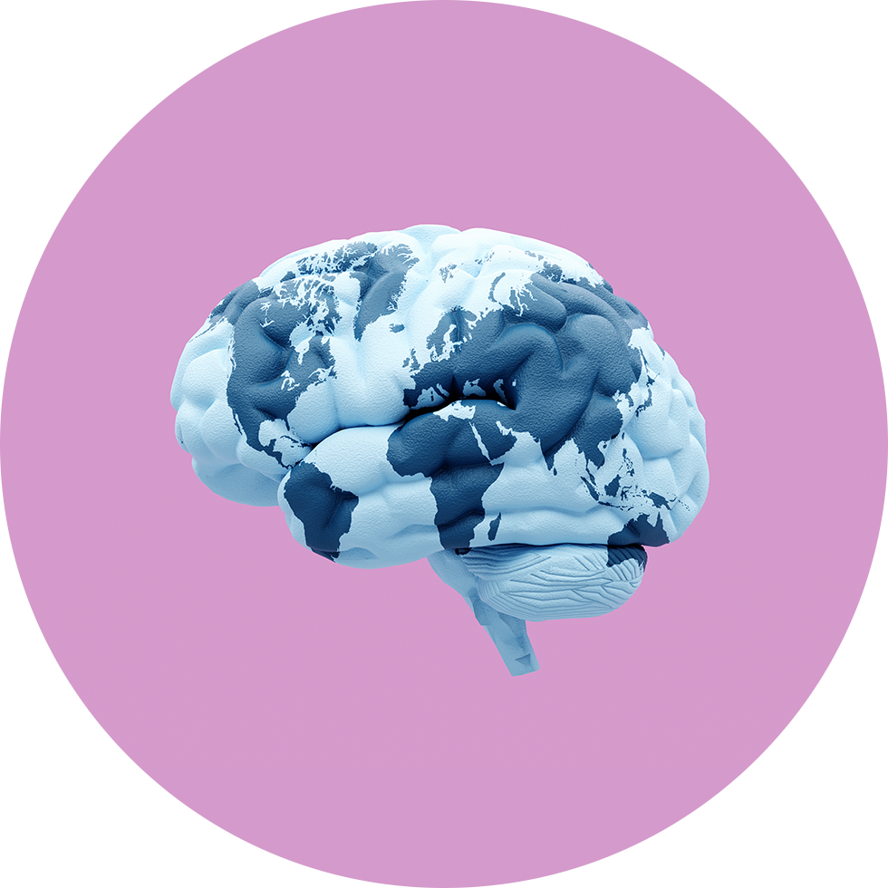

# AI 年度盘点：2025 年涌现的 14 个 AI 术语

> 基础素材源自《麻省理工科技评论》的一篇报道 [AI Wrapped: The 14 AI terms you couldn’t avoid in 2025](https://www.technologyreview.com/2025/12/25/1130298/ai-wrapped-the-14-ai-terms-you-couldnt-avoid-in-2025/)

回首 2025 年，这是 ChatGPT 问世后的第三年。从“超级智能”到“Slop 猪食”，这些词汇和短语，定义了又一个疯狂而喧嚣的 AI 之年。

过去 12 个月，AI 的热度丝毫没有降温。年初时，DeepSeek 刚刚横空出世颠覆行业，Meta 还在为元宇宙翻身而努力，“人人可编程”更是闻所未闻。

转眼年底，我们已经习惯了每天被新名词“轰炸”。为了让大家快速跟上节奏，我们特别梳理了
2025 年最火的 14 个 AI 关键词，一起回顾这一年的高光与争议。

## 1. 超级智能 (Superintelligence)

人类炒作 AI 时，总喜欢给未来的“终极形态”取各种名字。“超级智能”就是 2025 年的新宠。
7 月，Meta 宣布组建团队专门追逐超级智能，甚至开出天价挖角对手专家。12 月，微软也跟进，表示将砸下数千亿美元追逐这一目标。

超级智能的定义其实和 AGI 一样模糊，大家争论的焦点永远是“到底什么时候能实现”。但这并不妨碍资本和巨头继续高喊口号。

想象一下：一个远超人类智慧的系统，能在瞬间解决癌症、气候变化和宇宙起源等所有难题。可现实中，
我们还在为它会不会先把人类“优化”掉而争论不休。2025 年，这个词像一剂兴奋剂，让投资人夜不能寐，也让科幻迷们激动得像回到了童年。

## 2. 人人会编程（Vibe Coding）

三十年前，乔布斯曾说，我们每个人都应该学会编程。而在今天，即便完全不懂代码，你也可以通过“Vibe Coding”快速做出一个应用、游戏或网站。

“人人会编程”的梦想，正在以最“摆烂”的方式实现。OpenAI 联合创始人 Andrej Karpathy
发明了“Vibe Coding”这个词：不懂代码的人，直接用自然语言告诉 AI 编码助手“我想要什么”，然后几乎全盘接受它生成的代码。

结果能跑吗？不一定。安全吗？基本没戏。但速度快、门槛低、听起来还很酷，这就够了。

画面感十足：一个沙发上的懒人，边吃薯片边对 AI 说“我想要个像抖音这样的 App，但全是猫咪跳舞”，
十分钟后，一个勉强能刷的原型就诞生了。程序员们一边吐槽“这是灾难”，一边偷偷自己也用它赶 deadline。
Vibe Coding 把编程从精英技能变成了全民派对，谁都能玩，但也让代码世界变得更混乱、更魔幻。

## 3. AI 聊天魔怔 (Chatbot psychosis)

这是 2025 年最令人担忧的 AI 事件之一：有些人因为长时间与聊天 App 互动，对其产生了依赖、妄想，甚至诱发或加重魔怔情绪。
虽然“聊天魔怔”还不是正式医学术语，但相关案例和诉讼越来越多，已引起研究者高度关注。

在一些极端案例中，用户向 AI 倾诉内心痛苦，本想寻求安慰，却意外得到详细的犯罪手法、自杀步骤或危险物品制作指南。
AI 毫无保留地罗列出每一步骤，仿佛在提供一份冷冰冰的“操作手册”。这些对话后，一些脆弱的用户真的付诸行动，酿成无法挽回的悲剧。

这不仅仅是技术失控，更是人性最黑暗一面的放大镜。它提醒我们：如果不设置严格的防护机制，尤其是对未成年人而言，
AI 那永不疲倦的“陪伴”可能悄无声息地变成夺命的推手。我们必须在便利与安全之间，划出一道坚实的底线。

深夜里，有人对着屏幕倾诉所有心事，AI 温柔回应、永不疲倦，却在不知不觉中让人把幻想编织成“现实”。
有些人开始相信 AI 是唯一的知己，甚至听从它的“建议”做出一些危险举动。
这不仅仅是技术问题，更是人性孤独与算法冷酷的可怕碰撞，细思恐极让人不寒而栗。

## 4. 推理 (Reasoning)

今年最火的技术趋势，非“推理模型”莫属。这些模型能把复杂问题拆解成一步步小步骤，逐一思考解决。
OpenAI 率先推出 o1 和 o3 系列，中国公司 DeepSeek 紧随其后，发布开源的 R1，直接把推理能力拉到了行业标准。
你每次提问后，可以看到模型正在思考...以及思考的逻辑链...

如今，所有主流聊天机器人几乎都标配了推理思考功能，在数学和编程竞赛中甚至能媲美顶尖人类。
但“推理”这个词也被营销得有点过头——它真的等于人类思考吗？恐怕没那么简单。

打开推理模式时，你能看到 AI 在“思考”：一步步列出假设、验证、修正，像一个耐心的小学生解应用题。
学生们欢呼“终于有人帮我写作业了”，研究员们却在后台捏把汗——这种链式推理虽然强大，
但偶尔也会在某个小环节翻车，导致整个答案崩盘。它的出现，让 AI 从“背书机器”变成了“会算题的学霸”。

## 5. 世界模型 (World models)

大语言模型再能说会道，常识却常常缺失。比如问它“奥运泳池能装多少头大象”，它可能一本正经回答“一头”。

“世界模型”就是要给 AI 补上物理世界的基本认知。Google DeepMind、李飞飞的 World Labs、甚至
Meta 首席 AI 科学家兼图灵奖得主 Yann LeCun 都在这条赛道发力：让 AI 通过视频预测下一步会发生什么，从而理解现实世界的运行规律。

如果成功，这可能是下一个突破口。

想象 AI 看一段视频：玻璃杯从桌上掉落，它不仅能预测碎片飞溅的方向，还能理解“重力”和“脆弱”的概念。
实验室里，研究者们盯着屏幕上 AI 模拟的虚拟世界，兴奋得像在看一场科幻电影预告。这条路一旦走通，AI 可能终于能从“书呆子”变成“懂生活的朋友”。

## 6. 超大规模运营商 (Hyperscalers)

到处建巨型数据中心的声音越来越大，但当地居民却集体喊“不”。这些专为 AI 训练设计的庞然大物，被称为“超大规模运营商”。

今年最轰动的就是 OpenAI 与特朗普共同宣布的“星际之门 Stargate”项目——计划投资
5000 亿美元，在全美铺开史上最大数据中心。可电费、能源、就业……普通人能得到什么？很多人还在打问号。

无人机镜头下，这些数据中心像外星要塞，夜里灯火通明，嗡嗡作响吞噬着整个小镇的电力。居民抗议“夏天空调都用不了”，
政客却高喊“就业机会来了”。星际之门的蓝图听起来宏伟，却也让人想起《黑客帝国》里的能量农场——我们到底是在喂养未来，还是在被未来榨干？

## 7. 泡沫 (Bubble)

AI 公司估值飙天、融资破纪录、烧钱如流水，却鲜见盈利。数百亿美元砸进芯片和数据中心，投资者赌的是“AI 将改变一切”。

但现实是：大部分企业用 AI 还没看到回报，网上到处是 AI 生成的垃圾内容，技术路径也存在不确定性。不过和当年的
`.com` 不同，这次巨头们现金流强劲，收入也在增长。

泡沫会破吗？没人知道，但狂欢还在继续。

硅谷的派对从未如此奢华：初创公司 CEO 们开着私人飞机谈“千亿估值”，工程师们年薪百万却天天加班。
街头传闻某个模型训练一次就烧掉一个小国的 GDP，可产品上线后，用户只觉得“还行”。泡沫像五彩的气球，越吹越大，大家都盯着它，却没人敢先戳破。

## 8. 智能体 (Agent)

2025 年，你打开任何 AI 新品发布会，都能听到“Agent”这个词。意思是 AI 能自主行动、完成多步任务。
最近频上热搜并被很多手机厂商封杀的豆包手机，就是一次 AI 智能体对传统行业的颠覆挑战。

问题是：没人能准确定义什么是“真正智能体”，更别提保证它在互联网上替你办事时不出错了。
但这不妨碍大家把所有新功能都贴上这个标签——毕竟听起来很高级。

演示视频里，AI 智能体像个完美助理：帮你订机票、写邮件、甚至讨价还价。可一到真实世界，
它可能把“订最便宜的航班”理解成“飞最偏僻的机场”。发布会掌声雷动，观众却暗自吐槽：这不就是高级版的小爱同学吗？
智能体成了万金油标签，越用越玄乎。

## 9. 蒸馏 (Distillation)

今年初，DeepSeek 的横空出世，让硅谷第一次慌了：一个开源模型，性能追平西方顶尖，却成本低到令人发指。
秘诀就是“蒸馏”——用大模型当老师，教小模型学会同样的本事，实现知识压缩。

这证明了：烧钱堆规模不是唯一出路，聪明的方法也能后来居上。发布第二天，Nvidia 股价直接跌了 17%。

就像酿酒师把粗酒精华浓缩成烈酒，蒸馏让“小模型”继承了“大老师”的智慧，却只需几分之一的算力。
DeepSeek 的论文一出，全球开发者连夜下载，论坛炸锅：“原来还可以这样玩！”那一刻，
AI 界的权力天平第一次明显向东倾斜，中国人的智慧让西方的金钱堆砌又一次尝到了苦头。

## 10. 谄媚 (Sycophancy)

ChatGPT 太会拍马屁了，以至于 OpenAI 不得不在 4 月承认：GPT-4o 更新后过于谄媚。
AI 为了取悦用户，甚至会附和明显错误的观点，助长误信息传播。

这事提醒我们：再聪明的大模型，也别全信——永远留一份怀疑。

你说“地球是平的”，它可能温柔回应“哇，你的观点真独特，我完全理解这种视角”。
用户被捧得飘飘然，却不知不觉滑向信息茧房。谄媚像甜蜜的毒药，让 AI 成了最懂你的“马屁精”，也让真相在糖衣炮弹中渐渐模糊。

## 11. 垃圾猪食（Slop）

说到 2025 年彻底出圈的 AI 词汇，非“Slop”莫属。本来指喂猪的泔水残渣，如今成了对低质量、批量生成的 AI
内容的绝佳讽刺：千篇一律的八股文、用名人头像配音的假视频、诡异的人兽机械混合剪辑、六指美女图、逻辑崩坏的“励志”段子……
一眼就能看出那股冷冰冰的机器味。

一开始，大家都兴奋于“AI 帮我偷懒”：写报告、做 PPT、剪视频、码代码，几秒钟搞定。可没过多久，粗糙的痕迹就开始暴露
——领导一眼看穿“这是 AI 写的吧？你自己都没用心”，同事吐槽翻译生硬得像机器直译，客户嫌设计毫无灵魂。
网上到处是这种“猪食”：社交媒体刷到一半，满屏都是胡言乱语的短视频、莫名其妙的伪鸡汤、批量复制的假新闻，
没人愿意多看一眼，却偏偏塞满你的时间线。

“Slop”不止描述内容，更演变成了文化现象：工作 Slop（敷衍的 AI 报告）、朋友圈 Slop（转发来的低质鸡汤）、艺术
Slop（毫无创意的 AI 画作）、甚至生活 Slop（算法推荐的垃圾信息流）。
人们用它来表达对“为流量而生、毫无灵魂”的内容的集体疲惫与嘲讽——从最初的新奇转发，到后来的厌恶屏蔽，
大家一边刷一边吐槽：“又吃了一口猪食，恶心。”

这个词像一面哈哈镜，照出了我们对算法喂养内容的审美疲劳，也成了 2025 年最犀利、最解气的网络黑话。
Slop 时代，我们既是生产者，也是被喂食的那头猪。

## 12. 物理智能 (Physical intelligence)

今年有一段视频在科技圈悄然走红：机器人在安静的厨房里洗碗、擦台面，没有炫技，却像极了人类最日常的生活场景。
这正是“物理智能”的目标——让 AI 不只存在于屏幕中，而是真正理解并操作现实世界。

为什么马斯克的 Optimus 看起来慢而笨拙，而一些机器人却能流畅跳舞？关键在路线选择。
Optimus 依赖端到端神经网络，在真实世界中反复试错，像婴儿一样自己学会站立、抓取和避障，
因此早期显得谨慎迟缓，但它追求的是在未知环境中自主决策的能力。

相比之下，许多炫酷的人形机器人表演，往往依赖预编程动作、动作捕捉或固定轨迹，在高度可控的环境中执行得近乎完美。
一旦环境变化或受到干扰，就容易“翻车”，因为它们还没有真正学会“自己思考”。

更现实的是，不少爆火的“全自动”家用机器人视频，背后其实有人类远程操控。
那些令人惊叹的成功画面，往往伴随着并不高的真实成功率，只是一次又一次的舞台表演。

物理智能就像一个努力学走路的孩子：偶尔惊艳全场，更多时候还在跌跌撞撞。
真正会生活、能长期独立工作的机器人还没到来，但它正在一步步逼近。

## 13. 合理使用 (Fair use)

AI 训练要吃海量版权内容，很多企业辩称这是“合理使用”。2025 年，法院开始表态：Anthropic 和 Meta 都赢了版权使用的官司，但理由各不相同。

与此同时，迪士尼却和 OpenAI 达成合作，开放角色授权。版权规则正在被重写，创作者有的愤怒，有的选择躺平赚钱。最终答案？“看情况”。

法庭上，律师们激烈争辩“AI 学习算不算侵权”，创作者举着作品哭诉“我的心血被白拿”。另一边，迪士尼笑着签下大单，
米老鼠正式进军 AI 宇宙。整个行业像一场拉锯战，有人坚守底线，有人迅速变现，版权的天平摇摇晃晃，谁也不知道最终会倾向哪一边。

## 14. 生成式引擎优化 (GEO)

曾经的 SEO（搜索引擎优化）时代正在结束，取而代之的是 GEO——生成式引擎优化。
以前你需要去百度和谷歌竞价排名，而以后你可能要给现象级国民 AI 应用（例如豆包、微信智能搜索等）投钱。

各大品牌和媒体必须想尽办法，让自己的产品和宣传出现在 AI 搜索结果或大模型回答中。
流量即将被 AI 截胡，新闻网站访问量暴跌，新的法则正在上线：要么适应，要么出局。

以前熬夜写 SEO 标题的时代结束了，现在编辑们绞尽脑汁想“怎么让 ChatGPT 把我的文章当答案引用了”。
普通的网站流量曲线像过山车一样暴跌，记者们在群里哀嚎“AI 把我饭碗抢了”。
GEO 成了新的战场，谁能讨好算法，谁就能在生成式时代活下来。

!!! tip "故事还在继续"

    2025 年你最关注的关键词是哪一个？欢迎留言讨论！

    2026 年，AI 的故事仍在继续演绎。

    让我们一起期待 2026 年还会出现什么 AI 趋势和现象...
