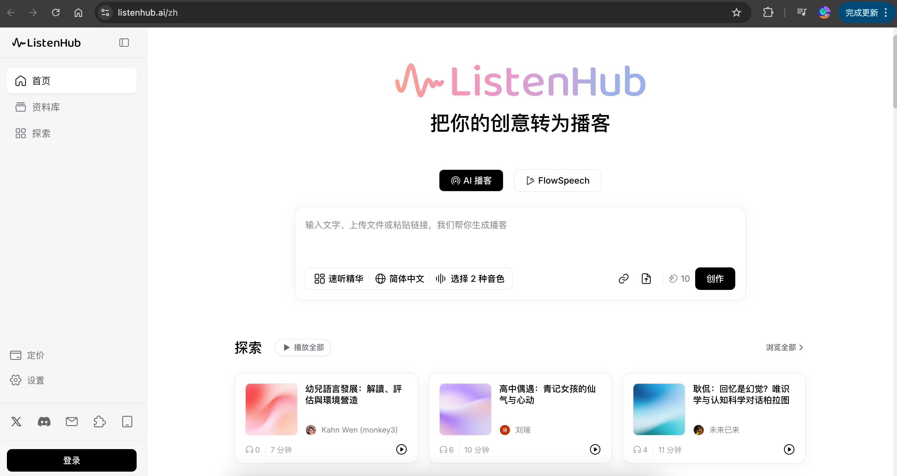

---
hide:
  - toc
---

# FlowSpeech：全球首个书面语转口语的 TTS

[立即体验 FlowSpeech](https://listenhub.ai/zh){ .md-button .md-button--primary }

人工智能语音合成技术迎来新突破。一款名为 FlowSpeech 的 AI 文本转语音工具正式发布，
其独特之处在于能够将书面文字转换为自然流畅的口语表达，为用户提供更贴近真实对话的语音合成体验。

FlowSpeech 的开发初衷源于一个感人故事。一位年过八旬的美国老人因长期病痛失去说话能力，但通过
AI 工具 ListenHub 继续与他人分享自己的人生经历。这个真实案例启发了开发团队，促使他们研发出专门针对书面语向口语转换的 TTS 技术解决方案。

与传统文本转语音工具的显著区别在于，FlowSpeech 重点解决书面语与口语之间的表达差异问题。传统
TTS 产品往往机械地将文字朗读出来，缺乏自然的语调变化和情感表达。FlowSpeech 通过上下文感知和多模态支持技术，
能够深度理解文本的语义层面，从而生成更加生动自然的语音输出。

在技术实现上，FlowSpeech 具备智能内容筛选功能，能够自动识别并剪裁不适合朗读的内容，
如广告信息、无意义字符串等干扰元素，显著提升了最终语音输出的质量和用户体验。

应用场景方面，FlowSpeech 展现出广泛的实用性。内容创作者可以利用该工具制作播客节目，将文字稿转换为自然的口语表达。
有声书制作领域也能从中受益，通过更自然的朗读方式提升听众的沉浸体验。企业用户则可以将其应用于内部培训材料制作，让枯燥的文档内容变得更易于理解和接受。

教育工作者是 FlowSpeech 的另一重要用户群体。通过将教学材料转换为自然的口语形式，教师可以更好地传达知识内容，
学生也能获得更好的学习体验。对于需要分享个人故事或经验的用户而言，FlowSpeech 提供了一个便捷的表达渠道。

从技术发展趋势来看，FlowSpeech 代表了语音合成技术向更智能化、人性化方向的演进。相比简单的文字朗读，
理解语境并生成自然口语表达的能力更接近人类的实际交流方式。

开发团队表示，未来将继续完善技术功能，计划推出个性化声音定制服务，让用户能够拥有专属的 AI 语音助手。
这一功能的实现将进一步拓展 FlowSpeech 的应用边界，为不同用户提供更加个性化的语音合成体验。

FlowSpeech 的出现填补了现有 TTS 工具在自然语言表达方面的空白，为语音合成技术的实际应用开辟了新的可能性。
随着技术的不断完善，这类智能化的语音工具有望在更多领域发挥重要作用。
