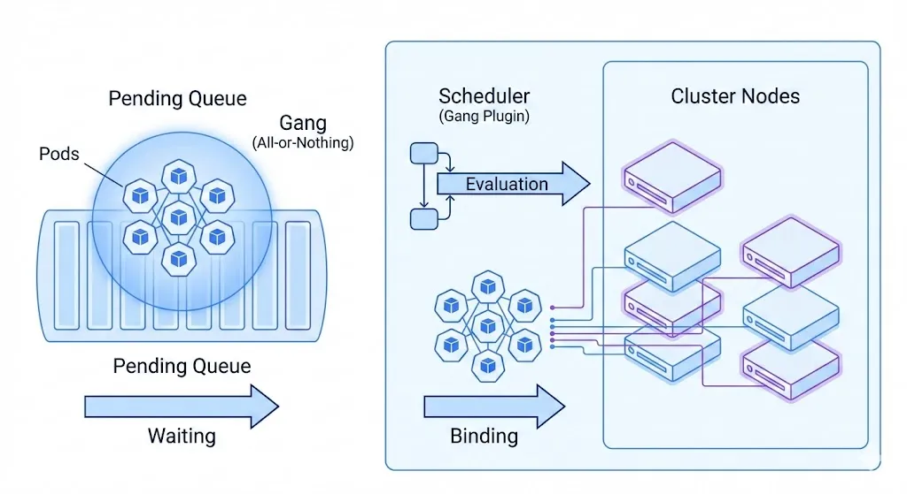

# Kubernetes 全新特性 Gang Scheduling

!!! tip

    DaoCloud 率先发起 Kubernetes 全新特性 Gang Scheduling，夯实 AI Infra 调度底座，全面适配 AI/ML 负载。

在 **AI Infra** 时代，Kubernetes 正在经历一次深刻的调度范式转变。
随着大模型训练、分布式推理、向量检索、批处理计算等 **AI/ML 与 GenAI 场景** 的爆发式增长，
**如何高效调度“大规模 AI 工作负载”**，已经成为 AI Infra 与云原生平台必须直面的核心问题。

而这类问题，仅靠 **单 Pod 调度** 的传统思路，已经远远不够了。
Kubernetes v1.35 基于 Gang Scheduling 等全新特性推出了工作负载感知调度（Workload Aware Scheduling）。



## 从「调度 Pod」到「调度 AI 工作负载」

在 AI Infra 场景中，调度一个大型工作负载，要比调度一个单独的 Pod **复杂且脆弱得多** 。

现实中的 AI 训练与推理任务，往往具有以下特征：

* **一组 Pod 需要作为一个整体被调度** ，而非逐个、独立调度  
* **需要统一的资源与拓扑规划** ，例如：
    * GPU/NPU 数量对齐
    * 位于同一机架、同一 NUMA 域或同一高速互联拓扑
* 资源必须 **要么一次性到位，要么完全不启动**

以分布式大模型训练为例，如果只成功调度了部分 worker 或 parameter 服务器：

* 训练任务无法真正开始
* GPU 等昂贵算力被长时间空占
* 甚至可能导致调度阻塞和集群资源碎片化

更关键的是，在 **AI Infra 的调度视角** 下，这类工作负载中的 Pod **通常是完全同构的** ：
相同镜像、相同资源规格、相同调度约束。

这从根本上要求 Kubernetes 的调度模型，从「Pod 级」升级到 **Workload/Job 级** 。

## 为什么 AI Infra 需要原生的 Workload 级调度？

过去几年，社区和厂商已经为 AI、Batch、HPC 等场景构建了不少 **定制调度器** ：

* AI 专用调度器
* 批处理调度器
* 外部 Gang/Queue 调度系统

但在 AI Infra 规模化落地过程中，问题逐渐显现：

* **工作负载级调度是通用能力，而非小众需求**
* 对 AI 用户而言，这是 Kubernetes 的“基础设施能力”，不是“插件能力”
* 依赖外部调度器或私有实现，会导致：
    * 调度语义割裂
    * 生态不统一
    * 运维与演进成本极高

因此，让 **AI 工作负载成为 kube-scheduler 的一等公民** ，
在 Kubernetes 原生调度层面提供能力支持，已经成为社区共识。

这也是 **新一代 AI Infra 调度体系** 的必经之路。

## Kubernetes 1.35：AI Infra 调度能力的重要里程碑

**2025 年 12 月 17 日** 发布的 **Kubernetes v1.35** ，首次交付了一批 **工作负载感知调度** 能力。

这不仅是一次功能更新，更是 Kubernetes 面向 **AI Infra 场景** 的架构级演进起点。

!!! tip "长期目标"

    在 Kubernetes 中，实现原生、统一、可扩展的工作负载级调度与管理能力

该演进计划将跨越多个 SIG、多个版本，逐步增强系统在 AI Infra 维度的能力，包括：

* 工作负载级抢占（Preemption）
* 与自动扩缩容（Autoscaling）的深度协同
* 拓扑与异构算力感知调度（GPU/DRA/NUMA）
* AI 作业生命周期内的调度策略管理

## 全新 Workload API：为 AI Infra 描述“如何调度”

Kubernetes v1.35 正式引入 **Workload API**
（`scheduling.k8s.io/v1alpha1`），这是 AI Infra 调度体系的关键抽象。

其核心思想是：

* **业务 Workload（如 Job/Training Job）负责描述“运行什么”**
* **Workload API 专注描述“一组 Pod 如何被调度”**

通过这一解耦，Kubernetes 首次在原生层面具备了：

* 用结构化、机器可读的方式表达 AI 作业的调度需求
* 在 Workload 整个生命周期内持续管理调度策略

这是 AI Infra 能力体系中极为关键的一步。

## Gang Scheduling：为 AI/ML 与大模型训练而生

在 Workload API 中，最受 AI Infra 关注的能力之一，
正是 **Gang Scheduling（成组调度）** 的原生实现。

### 什么是 Gang Scheduling？

Gang Scheduling 的核心思想是：将一组 Pod 视为一个调度单元，采用 **全有或全无（All-or-Nothing）** 的调度策略

只有当一组 Pod 中 **至少满足指定数量（`minCount`）可以同时运行** 时，调度才会真正发生。

这正是分布式 AI 训练与推理的刚性需求。

### 示例：一个用于 AI 训练的 Gang Workload

```yaml
apiVersion: scheduling.k8s.io/v1alpha1
kind: Workload
metadata:
  name: training-job-workload
  namespace: some-ns
spec:
  podGroups:
  - name: workers
    policy:
      gang:
        # 只有当至少 4 个 Pod（例如 4 张 GPU）可以同时运行时，才允许调度
        minCount: 4
```

对应的 Pod 只需通过 `workloadRef` 与 Workload 关联：

```yaml
apiVersion: v1
kind: Pod
metadata:
  name: worker-0
  namespace: some-ns
spec:
  workloadRef:
    name: training-job-workload
    podGroup: workers
  ...
```

这使得 **AI Infra 调度策略** 从零散的 Pod 配置，升级为统一、清晰的工作负载模型。

## Gang Scheduling 在 kube-scheduler 中的工作机制

启用 Gang Scheduling 后，`kube-scheduler` 中的 `GangScheduling` 插件，
将以 **Pod Group（AI 作业单元）** 为核心管理调度流程：

1. **阻断阶段（Blocking）**

    Pod 不会立即进入调度流程，直到：

    * Workload 已创建
    * PodGroup 已定义
    * Pending Pod 数量达到 `minCount`

2. **Permit 阶段**

    调度器为整个 Pod Group 寻找可行节点，但暂不绑定资源

3. **原子绑定/回滚**

    * 若整体资源满足：**所有 Pod 一次性绑定**
    * 若在超时时间内（默认 5 分钟）无法满足：

        * **拒绝整个 Pod Group**
        * 回收所有预留资源
        * 重新进入调度队列

这一机制，从根本上避免了 AI Infra 中最常见的痛点：
**“GPU 只上来一半，训练却永远跑不起来”**

!!! note

    该特性当前仍为 **Alpha** ，属于原生 Gang Scheduling 的初始实现。
    社区已规划在后续版本中持续增强，包括：

    * 单调度周期内完成整个 Gang 调度
    * 工作负载级抢占与资源重分配

## 机会式批处理：让同构 AI Pod 调度更快

除了显式的 Gang Scheduling，Kubernetes v1.35 还引入了一个
对 **AI Infra 极其友好** 的 **Beta 特性** ：
**Opportunistic Batching（机会式批处理）**

其核心优势在于：

* **无需 Workload API**
* **无需用户额外配置**
* 调度器自动识别 **调度条件完全一致的 Pod**
* 复用节点可行性计算结果，大幅降低调度开销

在 AI 训练、推理、向量计算等场景中，
大量 **同构 Pod（Same Shape Pod）** 可以直接受益。

!!! note

    在部分实测场景中：
    **Gang Scheduling + 机会式批处理** 对 AI 负载的调度吞吐提升 **最高可达 42 倍**

## DaoCloud：深度参与 AI Infra 核心调度演进

值得一提的是：

**DaoCloud 早在 2024 年 5 月，就已在 Kubernetes 社区正式发起 Gang Scheduling 的 KEP 提案**

* [KEP 编号：#4671](https://github.com/kubernetes/enhancements/issues/4671)
* 发起 SIG：`sig-scheduling`
* DaoCloud 多名工程师长期担任该 SIG 的 **Approver**

这不仅是一次调度特性的贡献，更体现了 DaoCloud 在 **云原生 + AI Infra** 方向上的长期战略投入。

## 北极星愿景：面向 AI Infra 的真正工作负载级调度

工作负载感知调度只是起点。围绕 **AI Infra 与大规模工作负载** ，社区已经明确提出了更宏大的北极星目标，包括：

* 独立的工作负载调度阶段
* 更完善的 GPU/DRA/拓扑感知能力
* 工作负载级抢占与公平性保障
* 调度与自动扩缩容的深度集成
* 原生与外部 AI 调度器的协作
* 工作负载生命周期内的调度策略管理
* 多 Workload 并发调度仿真与评估能力

Kubernetes 正在从“Pod 调度器”，进化为 **面向 AI Infra 的 Workload 调度与管理平台** 。

## 写在最后

AI/ML 正在重塑基础设施，而 Kubernetes 也正在重塑自己。

从 **Gang Scheduling** 到 **Workload API** ，
从 **机会式批处理** 到 **工作负载感知调度** ，
这些变化背后，是 AI Infra 对云原生基础能力提出的全新要求。

DaoCloud 将持续深度参与 Kubernetes 核心调度能力的演进，
让云原生真正成为 **AI Infra 时代最稳固、最高效的基础底座** 。

!!! tip

    关注 DaoCloud，持续解锁 Kubernetes × AI Infra 前沿能力。
