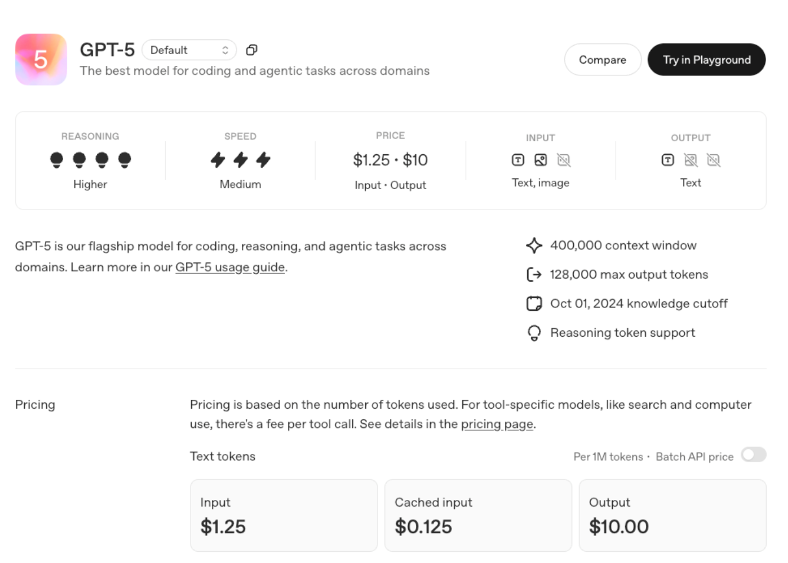
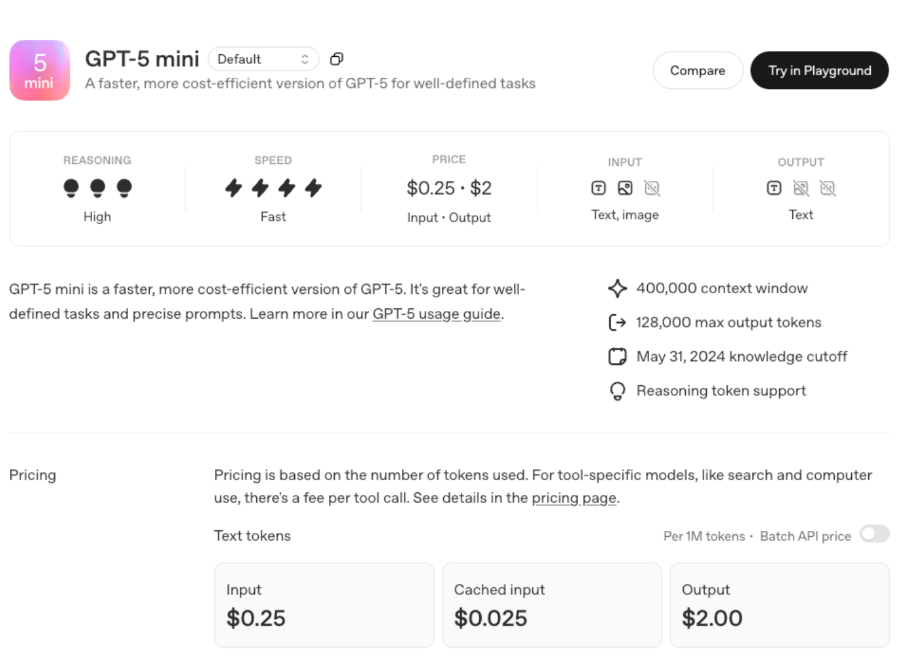

# GPT-5 正式发布：OpenAI 史上最大规模产品升级 四大版本全面解析

[体验 GPT-5](https://chatgpt.com/){ .md-button .md-button--primary }

2025 年 8 月 7 日，OpenAI 正式发布 GPT-5 系列模型，这是该公司历史上最重要的产品升级。此次发布包含
GPT-5、GPT-5Mini、GPT-5Nano 和 GPT-5Pro 四个版本，每个版本针对不同应用场景进行深度优化，标志着 AI 技术进入全新发展阶段。

## 统一智能系统：技术架构的革命性突破

GPT-5 被 OpenAI 定位为"统一智能系统"，成功整合了此前分散在不同模型中的能力：GPT-4o 的多模态处理、
o 系列的深度推理、高级数学计算以及代理任务执行。这一架构创新让用户无需在不同模型间手动切换，
系统通过实时路由器根据任务复杂度自动选择最适合的处理方式。

在核心技术指标上，GPT-5 实现了全面突破：

- 数学推理：在 AIME2025 基准测试中达到 94.6%准确率，无需外部工具
- 代码能力：SWE-bench Verified 测试得分 74.9%，Aider Polyglot 多语言编程测试达到 88%
- 多模态理解：MMMU 基准测试得分 84.2%
- 专业知识：在 GPQA 通用问题回答测试中得分 88.4%

## 四大版本详细解析

### GPT-5（旗舰版）：最强推理与多模态能力

作为系列中的旗舰产品，GPT-5 专为复杂任务设计，具备以下核心特性：

- 推理能力突破：内置链式推理（Chain-of-Thought）技术，能够分解复杂问题并逐步解决。在内部测试中，
  GPT-5 在 40 多个职业领域的复杂任务上表现优于前代所有模型。
- 全面多模态支持：支持文本、图像、语音和视频处理，继承了 Sora 的视频生成技术。用户可以上传各种格式的内容，
  GPT-5 能够生成相应回应或执行复合任务，例如分析医学影像或实时翻译视频内容。
- 代理式任务执行：支持自动浏览网页、生成完整软件应用、管理日程等复杂操作。在发布会演示中，
  GPT-5 根据简单描述在数秒内生成了包含闪卡、测验和进度跟踪功能的完整法语学习 Web 应用。
- 大幅降低幻觉率：通过"安全补全"技术，GPT-5 的事实错误率比 GPT-4o 降低约 45%，
  在使用推理模式时错误率比 o3 模型降低约 80%。

### GPT-5Mini：高性价比的轻量选择

GPT-5Mini 针对成本敏感应用进行优化，在保留核心功能的同时显著降低了资源需求：

- 支持中等复杂度的链式推理任务
- 具备文本、图像和语音处理能力，视频处理功能相对受限
- 可在较低算力设备上运行，适合中小企业和个人开发者
- 在核心推理测试中接近 o4-mini 性能水平

主要应用场景包括教育内容生成、客户服务自动化、简单多模态任务处理等。

### GPT-5Nano：超高效边缘计算模型

GPT-5Nano 专为速度和低资源占用优化，是系列中最轻量的版本：

- 极低延迟响应，专为实时应用设计
- 可在内存仅 16GB 的设备上运行，包括 MacBook 或低端服务器
- 推理能力相对简化，主要用于快速交互和简单任务
- 在通用基准测试中与 o3-mini 性能相当

适用场景包括移动设备应用、嵌入式系统、实时翻译、语音助手等对响应速度要求极高的场景。

### GPT-5Pro：面向专业用户的增强版本

GPT-5Pro 是专为高端用户和企业设计的高性能版本：

- 增强推理模式：支持"GPT-5Thinking"功能，可对复杂问题进行更长时间的深度推理，确保极高准确性。
- 无限制访问：Pro 用户享有无限制的 GPT-5 访问权限，以及 GPT-5Pro 的独家访问权。
- 专业多模态能力：在视频处理、复杂图像分析等任务中表现优异，在 HealthBench Hard 医疗基准测试中得分 46.2%。
- 深度工具整合：无缝集成搜索、Canvas、代码执行等专业工具，提供完整的工作流体验。

## 定价策略：史上最大规模免费开放

OpenAI 采用了前所未有的开放策略，向所有用户群体提供 GPT-5 访问权限：

- 免费用户：可使用 GPT-5 和 GPT-5Mini，有使用限额，超出后自动切换至 Mini 版本
- Plus 用户（$20/月）：享有更高使用限额，适合个人用户和小型团队
- Pro 用户（$200/月）：无限制访问 GPT-5 和 GPT-5Pro，并可使用"GPT-5Thinking"模式
- 企业与教育用户：发布后一周内获得访问权限，并可使用 GPT-5Pro 版本
- API 定价：输入$1.25/百万 token，输出$10/百万 token，面向专业开发者

## 用户体验的全面升级

GPT-5 系列带来了多项用户体验创新：

- 智能模型选择：系统根据任务复杂度和用户意图自动选择最适合的模型版本，用户无需手动切换

- 个性化交互：提供四种预设人格（Cynic、Robot、Listener、Nerd）和自定义聊天颜色选项

- 增强记忆能力：更大的上下文窗口能够记住更长的对话历史，提供更连贯的交互体验

- 用户友好设计：相比 GPT-4o，新模型减少了过度讨好的表达，使用更少不必要的表情符号，让交互更加自然

## 技术架构创新

GPT-5 系列可能采用了混合专家模型（MoE）架构，通过减少活跃参数数量大幅提升效率。训练数据以英语文本为主，聚焦
STEM、编程和通用知识领域，知识截止时间为 2024 年 6 月。整个训练过程在 NVIDIA H100GPU 上完成，耗费约 210 万 GPU 小时。

## 竞争优势与市场影响

在当前 AI 竞争激烈的环境下，GPT-5 的发布具有重要战略意义。面对 Anthropic Claude3.5Sonnet、
xAI Grok4、Google Gemini2.5Pro 等强劲竞争对手，OpenAI 通过免费开放策略和显著降低幻觉率来巩固市场地位。

据统计，目前已有 500 万付费用户使用 ChatGPT 商业产品，包括 BNY Mellon、加州州立大学、Figma、Intercom、
摩根士丹利等知名机构。GPT-5 的发布预计将进一步加速企业 AI 采用，推动各行业的数字化转型。

## 行业展望与挑战

GPT-5 系列的发布代表了 AI 技术发展的新里程碑，但同时也面临一些挑战：

- 隐私与安全：多模态能力涉及处理医疗影像、个人对话等敏感数据，数据保护成为关键议题
- 技术影响：自动化程度的提升可能对传统工作岗位产生冲击，需要社会层面的适应和调整
- 性能验证：虽然 OpenAI 声称 GPT-5 具备"博士级智能"，但其真实推理能力在实际应用中的表现仍需时间检验

## 总结

GPT-5 系列的发布标志着 OpenAI 在 AI 领域的又一次重大突破。通过四个版本的差异化布局，OpenAI
成功覆盖了从个人用户到企业客户的全部需求谱系。这不仅是一次技术升级，更是 AI 产品策略的全面革新。

随着 GPT-5 成为 ChatGPT 的新默认模型，取代此前的 GPT-4o、o3 等版本，用户只需打开 ChatGPT
输入问题，系统将自动处理并在需要时应用推理功能。这种无缝体验的实现，预示着 AI 技术正在从工具向助手、从辅助向协作的方向快速演进。

## 参考

- [OpenAI GPT-5 官方介绍页面](https://openai.com/index/introducing-gpt-5/)
