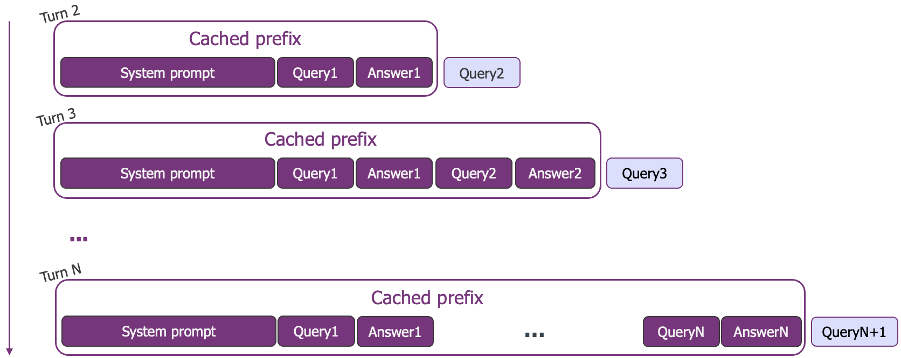
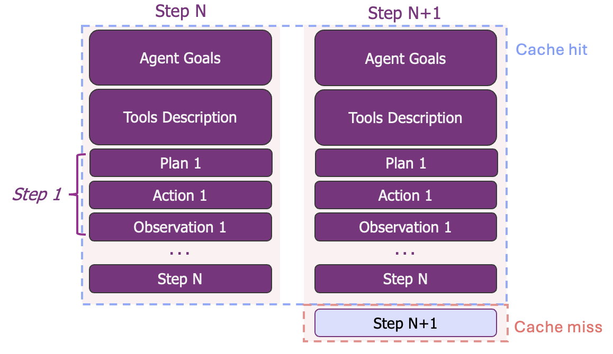
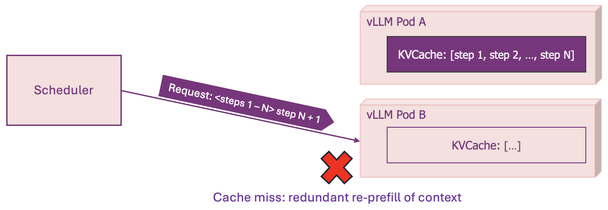
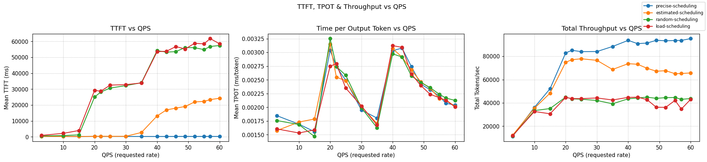
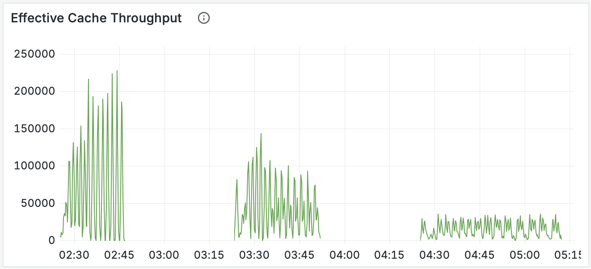
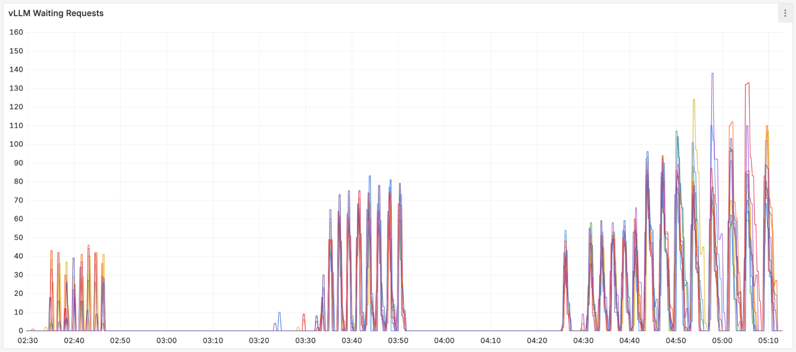
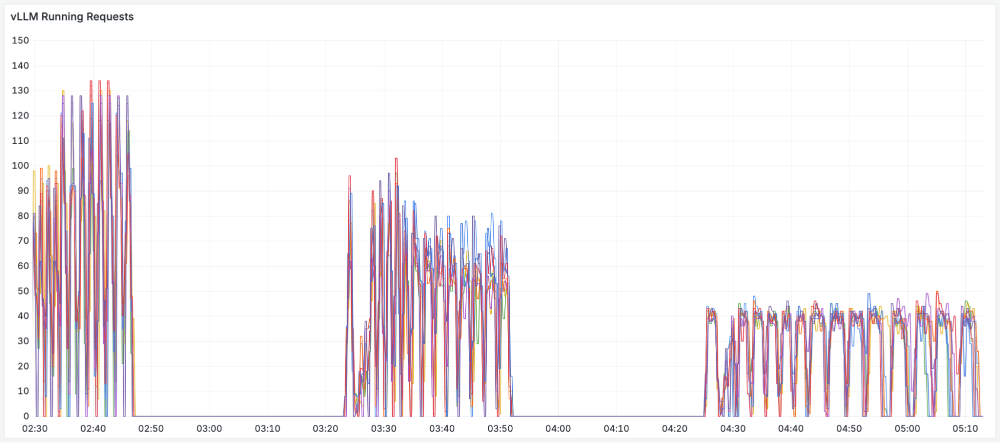

# KV 缓存优势浅显易见：从 vLLM 的前缀缓存到 llm-d 的分布式调度

> 英文博客转载自 [https://llm-d.ai/blog/](https://llm-d.ai/blog/kvcache-wins-you-can-see)

**llm-d 如何实现更智能、前缀感知、负载感知和 SLO 感知的路由，从而带来更小的延迟和更大的吞吐量？**

llm-d 项目提供了一系列“明确的路径”：经过测试和基准验证的生产环境大语言模型部署解决方案。
我们的第一条路径[智能推理调度](https://llm-d.ai/blog/intelligent-inference-scheduling-with-llm-d)，
通过在集群负载和前缀缓存亲和性之间平衡，建立了 AI 感知路由的基线。
这条路径的默认配置采用一种 **逼近法** ，通过请求流量预测缓存局部性。

本文展示了一条更先进、更强大的路径：
[精确前缀缓存感知调度](https://llm-d.ai/docs/guide/Installation/precise-prefix-cache-aware)。

我们深入探讨了这一功能的下一代实现：它超越了预测，赋予调度器直接洞察分布式 vLLM 缓存的能力。
这种精确性是最大化缓存命中率、在分布式部署中实现性能和成本效率更高的关键。

!!! tip "博文要点总结"

    - **KV 缓存命中率直接影响成本:** 缓存与非缓存 Token 的成本差异高达 **10 倍** ，缓存效率不仅是性能优化，更是成本与性能的核心驱动  
    - **这不是理论:** 真实生产工作负载（如对话式 AI 和智能体工作流）天然产生前缀密集型模式，这正是该方法的优势所在  
    - **vLLM 的前缀缓存在分布式部署中失效:** 标准负载均衡器会将相关请求打散到不同 Pod，破坏缓存局部性并导致昂贵的重复计算  
    - **精确前缀缓存感知调度带来数量级提升:** 基准测试显示在相同硬件上实现了 **57 倍更快的响应时间** 和 **两倍吞吐量**

<!-- truncate -->

## 生产 AI 中最重要的指标

在生产环境的 LLM 推理中，我们会追踪几十种指标：延迟、吞吐量、GPU 利用率和成本等等。
有一个指标尤为突出。正如生产级 AI 智能体工程师所指出的：

!!! quote "Manus, [AI Agents 的上下文工程](https://manus.im/blog/Context-Engineering-for-AI-Agents-Lessons-from-Building-Manus)"

    *KV 缓存命中率是生产阶段 AI 智能体最重要的单一指标。它直接影响延迟和成本。*

这不仅仅是学术观点，它对财务结果有直接且显著的影响。以最先进的模型 Claude Sonnet 为例，
其[定价模型](https://www.anthropic.com/pricing#api)中，处理已在缓存中的 Token
的成本比未缓存 Token 低 **10 倍**（每百万 Token 分别为 $0.30 和 $3.00）。在
OpenAI 的 [API 定价](http://openai.com/api/pricing/)页面上也能看到同样的规律。
高缓存命中率不仅让应用更快，更让其**本质上更便宜** 。这就是 KV 缓存的力量。

在单实例环境下，像 vLLM 这样的引擎利用自动前缀缓存来消除冗余计算，
通过重用先前的计算结果来实现更快、更高效的性能。
然而，一旦扩展到分布式多副本环境，这些精细的优化可能会完全失效。

本文探讨的正是这一挑战：vLLM 的前缀缓存优势如何在朴素的分布式系统中丧失，以及 llm-d
的精确前缀缓存感知调度如何恢复并增强这些优势。要全面理解这一点，我们首先需要了解 vLLM
在单实例环境下为何如此高效。让我们深入看看。

## vLLM 内部：单实例中的缓存掌控

!!! note "给专家的提示"

    已经了解 vLLM 如何使用 KV 缓存（Key-Value Cache）和前缀缓存优化推理？可以直接跳到[扩展的挑战](#_3)。

在每个 Transformer 模型的核心是 **自注意力机制** ：模型通过计算每对 Token
之间的注意力分数来理解上下文。这种两两比较随输入长度呈平方级增长，使得初始的
**Prefill** 计算成为生成中最昂贵的部分。

结果是生成 **Key (K)** 和 **Value (V)** 张量并存储在 **KV 缓存**
中——这就是模型的短期记忆。在随后的 **解码** 阶段生成 Token 时，
模型直接从缓存中提取这些已有值，而不是重新计算。

vLLM 进一步引入了 **自动前缀缓存:** 它能智能识别请求是否共享相同的 Token 序列前缀。
无需重新计算，而是通过基于哈希的块匹配直接重用缓存中的内存页。这种重用计算结果的原则推动了 vLLM 的性能：

* **首 Token 延迟 (TTFT)** 大幅下降，因为昂贵的 Prefill 步骤大部分被跳过  
* **整体吞吐量** 提升，因为 GPU 得以释放处理更多请求  

在一个简单测试中，向 Qwen/Qwen3-32B 实例连续两次发送约 10,000 Token 的请求时，首
Token 延迟从 **4.3 秒** 降低到仅 **0.6 秒** 。

## 实际场景中的前缀重用

vLLM 的缓存能力并非理论，它直接映射到最常见和最有价值的 LLM 工作负载结构。
通过理解这种模式，我们可以清楚看到在生产环境中可能损失的价值。

#### 对话式 AI

在任何多轮对话中，从客服机器人到长文本助手，整个聊天历史和系统提示共同构成了庞大的 **前缀** 。
而每条新用户消息则是一个很小的 **后缀** 。高效缓存意味着只需 Prefill 最新的对话轮次，
从而保持对话流畅，避免随着对话长度增加而导致的延迟累积。

<small>图 1：示意图展示了对话历史作为不断增长的前缀被缓存，只有新用户问题需要 Prefill。</small>

#### 智能体工作流

AI 智能体是前缀占主导的极端场景。这些系统在推理循环中运行，前缀包含了智能体的目标、工具定义和长历史的动作与观察。
生产数据表明，这可能导致输入输出比超过 **100:1**
（参考 Manus [博客](https://manus.im/blog/Context-Engineering-for-AI-Agents-Lessons-from-Building-Manus)），
使前缀占据绝对优势。在每一步中重用上下文是让智能体具备计算可行性的关键。

<small>图 2：智能体循环示意图，展示了庞大且静态的上下文（工具、历史步骤）作为缓存前缀，而新观察/动作是小后缀。</small>

在每次迭代中重用庞大的上下文，对复杂智能体的计算可行性和成本效益至关重要。

!!! tip "RAG 怎么办？"

    虽然检索增强生成同样依赖大前缀（系统提示 + 文档），但重用 KV 更具挑战性。
    文档及其顺序常在不同查询间发生变化，打破了简单的前缀模式。这需要更复杂的方法，本文将在结尾简要讨论。

## 横向扩展的挑战

当我们从单实例环境转移到分布式生产集群时，会发生什么？曾经统一的 KV 缓存变得 **解耦** 。
每个 vLLM Pod 都在完全隔离的情况下管理自己的缓存。
标准的负载均衡器会天真地使用对缓存一无所知的指标来平均分配流量，把相关请求分散到不同的
Pod 上，从而破坏缓存局部性。

让我们重新审视一下代理型工作流的示例，看看对这个未管理、解耦缓存视而不见所带来的直接影响：

<small>图 3：令人心碎的 KV 缓存未命中场景。</small>

这个单一的路由决策触发了一连串的失败：

* **缓存未命中:** Pod A 上的热缓存优势完全丧失  
* **重复计算:** 最昂贵的计算被无谓地执行了两次  
* **延迟增加:** 用户体验到显著更高的首 Token 时间 (TTFT)  
* **GPU 资源浪费:** 昂贵的硬件被用于重复工作而不是处理新请求，降低了系统整体吞吐量  

在一个有成千上万个并发请求的生产环境中，这不是罕见事件，而是默认行为。
结果就是系统比应有的状态 **显著更慢** 且 **更昂贵** 。这正是
[llm-d 的精确前缀缓存感知调度](https://github.com/llm-d/llm-d/blob/main/guides/precise-prefix-cache-aware/README.md)所要解决的核心挑战。

## llm-d：精确前缀缓存感知调度

我们刚刚看到，扩展 vLLM 集群自然会导致 KV 缓存解耦，形成一个分布式的内存池，
从而导致代价高昂的缓存未命中。解决方案就是弥合这种解耦。为了恢复前缀缓存的优势，
调度器需要一种新的能力：洞察分布式缓存的实时状态。

这正是 llm-d 提供的功能（双关语有意为之）。它创建了一个 **全局视图** ，让集群的
KV 缓存可以被视为单一的、可管理的内存池，从而实现精确的请求路由。

### 工作原理：通过 `KVEvents` 构建全局缓存视图

全局缓存视图建立在来自每个 vLLM Pod 的持续
[`KVEvents`](https://docs.vllm.ai/en/latest/api/vllm/config/kv_events.html)
流之上，这些事件由开源的
[`llm-d-kv-cache-manager`](https://github.com/llm-d/llm-d-kv-cache-manager) 库高效处理。

`KVEvents` 提供了整个集群中所有物理缓存变化的实时流，每当一个缓存块被创建或驱逐时都会触发。
这种数据流随后由 `llm-d-kv-cache-manager` 库的组件摄取并组织：

1. `kvevents.Pool`: 消费高吞吐事件流的组件。在处理这些事件时，它会不断更新一个底层的
   **KV-Block 索引** ，该索引维护着块哈希与其所在 Pod 和存储介质（GPU/CPU）的实时映射。
2. `kvcache.Index`: 调度器使用的高级索引。它基于底层的 KV-Block 索引，将逻辑 Token
   序列（即前缀）映射到持有它们的 Pod。这直接回答了一个问题：
   “这个请求的前缀有多少比例存在于可访问的 Pod 上？”  

这种双层架构提供了一个持续更新、可扩展的集群缓存视图，这是实现智能、缓存感知路由的关键。

<small>图 4：简化的架构图。(1) - (3) 表示读取路径，而 (A) - (B) 表示写入管道。</small>

**开销如何？** 这个全局索引的内存开销可以忽略不计 —— 参见[附录 A.3](#a3)
的扩展性分析，显示数据与元数据的比例为 **1,000,000:1** 。

!!! info "高可用支持"

    该设计天然支持主动-主动或主动-被动部署，可以通过配置实现完整视图复制或分片。

### 精确前缀缓存评分器

有了缓存的精确、实时全局视图，调度器现在可以进行智能路由。负责这一任务的组件就是
**精确前缀缓存评分器** 。它位于调度器内部，利用 `kvcache.Index` 为每个传入请求执行一个简单但至关重要的任务：

1. 查询 `kvcache.Index`，确定该前缀在每个活跃 vLLM Pod 上已有的比例。
2. 输出每个 Pod 的“缓存亲和度得分”，直接表示可节省的计算量。

该评分器提供了强烈的 **粘性** 信号，使调度能最大化缓存命中概率。然而，
仅依赖粘性可能带来新问题，比如把请求流量集中到一个已经过载的 pod，而其他 Pod 却闲置。

因此，最终路由决策不会仅基于该得分。如我们在之前的[智能推理调度](https://llm-d.ai/blog/intelligent-inference-scheduling-with-llm-d)一文中详细介绍的那样，
KV 缓存亲和度得分会与分布式、负载感知得分结合，形成一个平衡的决策。

## 性能结果

为了验证这种方法，我们在一个包含 **8 个 vLLM pods（总共 16 张 H100 GPU）**
的集群上，对四种调度策略进行了基准测试。测试使用了逼真的 B2B 工作负载: **150 家企业客户** ，
每个客户有 **6,000-Token 的上下文** ，并且每个客户有 **5 个并发用户** 提交
**1,200-Token 的查询** ，在 **3-60 QPS** 的持续负载下运行。

该工作负载产生的 KV 缓存总需求是 **集群容量的 73%** ，是单个 Pod 能处理的
**6 倍** ，这迫使系统必须在集群内分配前缀 —— 正是智能调度至关重要的场景。

!!! info "基准测试细节"

    详见 [附录 A.1](#a1) 和[附录 A.2](#a2-b2b-saas)，包括完整的基准测试方法和工作负载细节。

对比的四种策略：

* `random-scheduling`: 一个天真的调度器，作为对照组。
* `load-scheduling`: 只考虑负载评分器的调度器：vLLM 排队 + KV 缓存利用率  
* `approximate-scheduling`: 智能推理调度路径中的默认配置，
  在负载感知调度的基础上扩展了[近似前缀缓存评分器](https://gateway-api-inference-extension.sigs.k8s.io/guides/epp-configuration/prefix-aware/)。
    * 该插件基于路由历史构建一个近似局部性索引。
* `precise-scheduling`: 本文所描述的高级路径。

因此，此基准测试检验调度器高效管理解耦 KV 缓存的能力。在生产环境中，如果总缓存需求超过集群容量，
自动扩缩容系统将负责增加副本以维持 SLO。而这里，我们专注于 **最大化现有硬件的性能** 。

### 结果：性能飞跃

下表展示了关键性能指标的差异。

| 实验                   | 输出 toks/s | TTFT p90 (s) | TTFT 平均值 (s) | vLLM 等待队列 (平均) |
|:-----------------------| :---- | :---- | :---- | :---- |
| **precise-scheduling** | **8730.0** | **0.542** | **0.298** | **0.1** |
| approximate-scheduling | 6944.4 | 31.083 | 13.316 | 8.1 |
| load-scheduling        | 4428.7 | 94.865 | 46.987 | 28.9 |
| random-scheduling      | 4428.7 | 92.551 | 45.281 | 27.3 |

#### 首 Token 时间 (TTFT)

对用户体验延迟的影响最为显著。`precise-scheduling` 实现了仅 **0.542 秒** 的
P90 TTFT。相比之下，近似调度器超过 **31 秒** ，缓存盲调度器则超过 **90 秒** 。

* `precise-scheduling` 比 `approximate-scheduling` 快 57 倍。
* `precise-scheduling` 比 `random-scheduling` 快 170 倍以上。

这是交互式体验与在规模化场景下几乎不可用的系统之间的区别。

#### 系统总吞吐量

延迟效率直接转化为更高的系统容量。`precise-scheduling` 实现了
**输出 8,730 Token/秒** 的总吞吐量。这代表：

* 比 `approximate-scheduling` 基线提高 **25%**
* 是缓存盲配置吞吐量的 **两倍以上**

这使得你可以在完全相同的硬件上处理显著更多的流量，仅仅通过消除缓存未命中的浪费。

<small>图 5：一个三联图，展示 TTFT、TPoT 和吞吐量在逐步增加 QPS 率下的测量结果。</small>

上图清楚地展示了这些优势。蓝色曲线（`precise-scheduling`）保持最低的平均 TTFT，
并在请求速率增加时实现最高的总吞吐量。

#### “为什么”：从节省工作到系统吞吐量

基准测试中的显著性能提升直接来源于 **系统效率** ，这一差异在 **实时 Grafana 指标** 中立刻可见。

以下图表是在基准运行期间捕获的。调度器依次展示：`precise-scheduling` *(左)*，`approximate-scheduling` *(中)*，`random-scheduling` *(右)*。

##### 1. 有效缓存吞吐量：量化节省工作

首先，我们衡量 **有效缓存吞吐量** —— 每秒直接从缓存中提供的提示 **Token** 数量。该指标量化了
GPU **避免** 的计算工作。数值高意味着系统持续节省了大量昂贵的 Prefill 计算。

<small>图 6：在整个基准测试过程中，KV 缓存为集群节省的计算工作总量。</small>

图表清楚显示，`precise-scheduling` 通过有效命中前缀，维持了巨大且稳定的节省吞吐量。中间的 `approximate-scheduling` 效率尚可但较低，而右侧的 `random-scheduling` 几乎没有节省任何工作。

##### 2. 系统状态：效率的结果

这种节省的工作直接转化为系统健康。通过避免 Prefill 瓶颈，GPU 可以专注于高效解码。
我们可以通过对比 **等待** 请求（排队中）和 **运行中** 请求（解码中）的数量来观察。

<small>图 7：基准测试过程中 vLLM 中的 **等待请求** 数量。</small>

<small>图 8：基准测试过程中 vLLM 中的 **运行请求（解码）** 数量。</small>

左侧的 `precise-scheduling` 曲线显示了一个稳定的系统。通过高效利用解耦的 KV 缓存，
它维持了最小的等待队列，并最大化了活跃运行请求的数量。相比之下，其他调度器明显不堪重负；
不断增长的等待队列扼杀了系统，阻止工作被高效完成。

这种不稳定是由 **缓存抖动** 引起的。缓存盲调度器不断在不同 Pod 上 **重复和驱逐** 相同前缀，浪费 GPU 周期在
**冗余 Prefill** 上。`precise-scheduling` 完全避免了这一点。它对前缀位置有精确认知，
并持续路由请求以实现缓存命中 —— 只要负载允许 —— 结果就是更少的工作、几乎没有队列以及一个健康的系统。

!!! info "会话级调度"

    会话级调度为单个用户提供亲和性，但会错过跨用户的场景。在我们的基准测试中，
    **150 家企业客户** 每家都有 **6,000-Token 的系统提示** ，
    会话调度会创建 750 个单独的会话，但会错过客户组内的跨用户缓存复用，
    从而导致大多数计算工作未被节省。精确前缀缓存感知调度保证了系统范围内的 **最大复用** 。

### 采纳情况

基准测试展示的显著性能提升推动了现实世界各大厂商对 llm-d 技术的采纳。

例如， **阿里云** 正在将这种精确路由策略集成到其 **阿里云容器服务 Kubernetes (ACK) 推理扩展网关 (GIE)**
中。为了进一步增强其在 **Qwen** 和 **DeepSeek** 等模型上的生产部署，他们正在开发一个解耦的分词服务来支持补充功能，并计划将这项工作贡献回 llm-d 社区。端到端能力已在客户仿真环境中得到验证。

同样的潜力促使 **DaoCloud** 增强其 **d.run** **模型即服务 (MaaS)** 平台，加速
**DeepSeek** 及其他先进模型的推理。他们采用通过 **Kubernetes**、
**vLLM** 和 **llm-d** 实现的 P/D 解耦与高级 KV 缓存架构。
Kay Yan 强调：“智能 KV 缓存管理让推理架构更加自适应且具备成本效益”。

## 接下来：扩展缓存感知范式

精确的前缀感知调度是巨大的进步，但这只是更广泛的、以缓存为中心的推理愿景的一部分。llm-d 项目正在快速发展，未来有几个令人兴奋的方向：

* **增强的 CPU 卸载:** 对于大规模的 KV 缓存池，我们正在深化 vLLM 的原生 CPU 卸载集成。这将支持在 GPU 显存与更便宜的 CPU 内存之间智能分层的超大缓存池，调度器会基于延迟感知做出决策。
* **面向 RAG 的 KV-Cache-Fusion:** 如前所述，RAG 工作负载带来了独特的挑战，因为检索到的文档可能以不同顺序出现，打破了简单的前缀模式。下一个前沿方向是位置无关的 KV-fusion，这是一种支持灵活而强大的缓存复用的技术，适用于多样化的 RAG 查询。这将与 **大规模存储卸载** 一同实现。

## 结论

llm-d 的旅程反映了我们对 LLM 推理方式的更广泛转变 —— 不再仅仅将其视为无状态的函数调用，而是一个动态的、有状态的编排问题。基准数据非常清晰：
**前缀缓存感知调度不仅仅是一种优化，而是生产性能和成本效率的关键。**

通过从 AI 盲目路由转向精确的 KV 缓存感知策略，
**我们在相同硬件上解锁了数量级的延迟和吞吐改进。**
精确前缀缓存感知的光明之路提供了一个经过验证的、基于基准测试的解决方案，使你的分布式部署大幅提升效率。

!!! tip "选择正确的策略"

    最优的调度器依赖于工作负载的复杂性。下面是一个支持的策略层级，每一层都解决了前一层的局限性。

1. **随机/轮询调度:** 这种简单方法适用于对称工作负载，其中所有请求具有相似的计算成本，且缓存复用最小。

2. **负载感知调度:** 针对非对称工作负载的必要进化。通过基于 Pod 服务能力路由请求，它可以避免过载并改善资源利用率。

3. **近似前缀缓存调度:** 此策略为具有上下文复用模式的工作负载引入缓存感知。  

    * **局限性:** 在大规模或动态工作负载下，估算可能变得不可靠，从而导致次优的路由 —— 我们的基准测试中已有体现。

4. **精确前缀缓存感知调度:** 在具有严格 SLO 的生产环境中，这是最有效的策略，适用于动态、大规模工作负载，其中最大化缓存命中率是主要的性能驱动因素。

## 参与 llm-d

llm-d 项目依赖社区贡献而蓬勃发展，有很多方式可以参与其中：

* 探索 llm-d 社区快速上手指南 → [从这里开始](https://llm-d.ai/docs/community)，了解更多关于参与 llm-d 项目的方式。
* 加入我们的 Slack → [获取邀请](https://llm-d.slack.com/)，与维护者和贡献者建立联系  
* 探索代码 → 浏览我们的 [GitHub 组织](https://github.com/llm-d)，找到你感兴趣的问题  
* 参加会议 → 所有会议都是开放的！添加我们的[公共日历](https://llm-d.ai/docs/community#public-meeting-calendar)，加入讨论  

## 附录

### A.1: 基准测试设置详情

* **模型:** `Qwen/Qwen-32B`。
* **硬件:** 一个由 **8** 个 vLLM Pod 组成的集群，每个 Pod 配置 **2 块 NVIDIA H100 GPU**
  （总共 16 块）。

    * 每个实例持有一个 307,328 Token 的 KV 缓存。

* **比较的调度器：**  

    * `random-scheduling`：一个朴素的调度器，作为对照组。  
    * `load-scheduling`：一个仅感知负载打分的调度器：vLLM 排队 + kv-cache 利用率  
    * `approximate-scheduling`：在负载调度的基础上增加近似前缀缓存打分器的智能基准调度器。  
    * `precise-scheduling`：本文描述的先进光明之路。  

### A.2: 工作负载详情 - 真实 B2B SaaS 场景

该基准测试旨在模拟一个高价值的、多租户 B2B 应用在高负载、持续压力下的运行情况。设想一个平台为大量企业客户提供专用的 AI 助手。

* 有 **150 个不同的企业客户**（群组）同时使用该平台。  
* 每个客户有一个独特且庞大的 **6,000 Token** 的上下文。这可以视为其公司的内部知识库或一组详细的说明，形成了宝贵的 **共享前缀** 。  
* 对于每个客户，**5 名员工** 同时与助手交互，提交各自独特的问题，每个问题大约 **1,200 tokens** 。  
* 系统承受着一个连续泊松分布的请求流量，从 3 QPS 增长到 **60 QPS** 的高峰业务压力。  

在理想情况下，为所有活跃客户缓存共享前缀需要集群总 KV 缓存容量的 **约 73%** 。这几乎是单个 pod 个体容量（约 12.5%）的 **六倍** 。这使得单个副本无法处理负载，调度器必须智能地在整个集群中分配前缀。  

因此，该基准测试检验了调度器高效管理分离式 KV 缓存的能力。在真实场景中，如果总缓存需求超过集群容量，自动扩缩系统会负责扩容以维持 SLO。而在这里，我们专注于 **最大化现有硬件的性能** —— 在缓存盲配置下，这会导致大量排队和高延迟。  

实验的工具与具体细节记录在 [llm-d-kv-cache-manager 基准测试报告](https://github.com/llm-d/llm-d-kv-cache-manager/blob/main/benchmarking/73-capacity/README.md) 中。

### A.3: 索引规模分析

这种全局记账的开销仅在于存储 KV-block 哈希，而不是庞大的 KV 张量本身。让我们看看这个 vLLM 示例：[在 8xH200 上运行 DeepSeek-R1（FP8）](https://docs.vllm.ai/projects/recipes/en/latest/DeepSeek/DeepSeek-V3.html#installing-vllm)。

**DeepSeek R1** 模型运行在 **8x NVIDIA H200 GPU** 上，采用 FP8，每块 GPU 提供 **45.7 GB * 8 = 365 GB VRAM** 用于 KV 缓存池，将由数千个独立的内存块组成。每个块代表 **128 Token** ，大约消耗 **8.6 MB** 的显存。然而，用于在全局索引中跟踪这些块的元数据仅为一个 64 位哈希，即 **8 字节** 。如果数据结构足够高效，则维护的额外开销微不足道。  

这意味着管理整个 **365 GB** 缓存池，调度器索引所需的内存仅约 **339 KB**
—— 数据与元数据的比例超过 **1,000,000 比 1** 。索引的内存占用比它跟踪的
GPU 显存小几个数量级，使其成为一种高效、低开销的解决方案。
