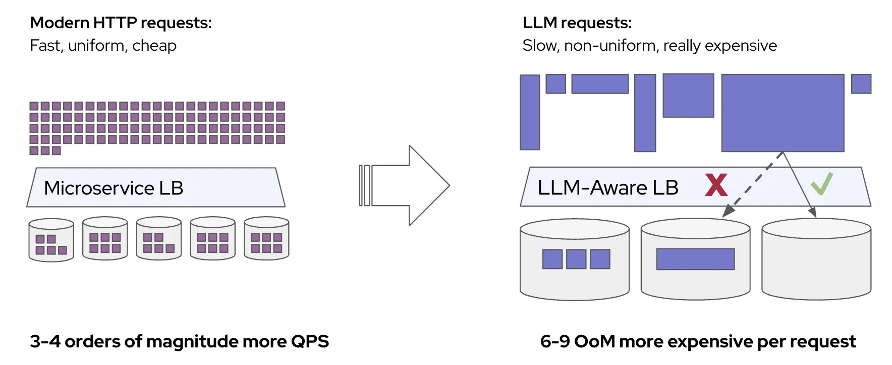
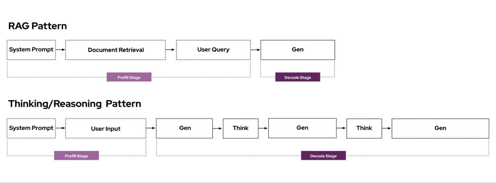
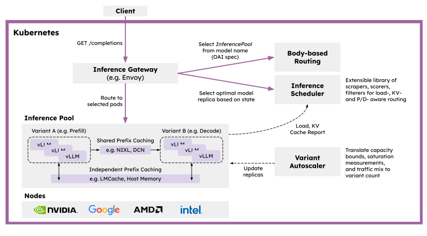

# llm-d 社区宣布成立！

> 来源：[llm-d.ai](https://llm-d.ai/blog/llm-d-announce)

llm-d 是一个 Kubernetes 原生的高性能分布式 LLM 推理框架，为任何希望实现大规模服务的人提供了一条清晰之路，
在大多数模型和硬件加速器上都能实现最快的价值实现速度和每美元的竞争性能。

借助 llm-d，用户可以通过一个模块化、高性能、端到端的服务解决方案，将生成式 AI 部署实现运营化，
该方案利用了最新的分布式推理优化技术，如 KV 缓存感知路由和解耦服务，同时与 Kubernetes 的运维工具
[Inference Gateway (IGW)](https://github.com/kubernetes-sigs/gateway-api-inference-extension?tab=readme-ov-file)
协同设计并集成。

<!-- truncate -->

## LLM 推理进入分布式时代

### 为什么标准扩展方式不足以胜任

Kubernetes 通常通过统一副本和轮询负载均衡来扩展应用负载。

这种简单的模式对于大多数具有以下特征的请求模式非常有效：

* 请求生命周期短且资源使用基本一致
* 请求在服务延迟目标（SLO）方面基本一致
* 每个副本都能同样好地处理每个请求
* 对单个请求专用化变体和协调副本处理并无意义

### LLM 服务具有独特性

然而，LLM 推理负载具有慢速、不均匀、昂贵的请求特点。这意味着典型的扩展和负载均衡模式在性能上无法达到最佳效果。

让我们逐步分析每个特点：

1. 请求成本高，资源使用差异大

    * 每个 LLM 推理请求都有不同的“形状”，可以通过输入 token 数和输出 token 数衡量。这些参数在请求和工作负载之间差异显著。

        * RAG 模式具有较长的输入（提示和检索文档）和较短的输出
        * 推理类请求具有短到中等长度的输入和较长的输出

        

    * 这些请求时间的差异会导致实例间负载严重不均，且一旦实例过载，延迟进一步加剧（ITL 增加），形成恶性循环。

2. 将请求路由到缓存了先前计算结果的特定副本可极大提升延迟性能

    * 许多常见的 LLM 工作负载具有“多轮”请求模式，即同一个提示反复发送到同一个实例。

        * Agentic（工具调用是迭代请求流）
        * 代码补全任务（请求重用当前代码库作为上下文）

        

    * LLM 推理服务器如 vLLM 实现了“自动前缀缓存”方法，在命中缓存时可以“跳过”大量预填充计算。将请求路由到已有缓存数据的 vLLM 副本上，可显著提升尾部延迟。增加缓存命中率（例如通过扩大缓存）将进一步改善性能。

        

3. 为单个请求专门化并协调副本可提升每 GPU 的吞吐量

    * 推理分为两个阶段：预填充（prefill）和解码（decode）。预填充并行处理所有提示 token，用于生成第一个输出 token，此阶段受计算能力限制；解码阶段一次生成一个 token，需对模型进行完整访问，此阶段受内存带宽限制。

    * 标准 LLM 部署在单个副本内完成预填充和解码阶段。由于两个阶段对资源的要求不同，将它们放在同一副本会导致资源使用效率低，尤其对长序列而言。

    * **解耦架构**（如 [Distserve](https://arxiv.org/abs/2401.09670)）将预填充和解码分配到不同变体上，允许独立优化和扩展各阶段。

        * Google [在 TPU 上采用了解耦服务](https://cloud.google.com/blog/products/compute/whats-new-with-ai-hypercomputer)，以提高首 token 延迟并简化运维扩展。
        * DeepSeek 发布了其推理系统的[设计探讨](https://github.com/deepseek-ai/open-infra-index/blob/main/202502OpenSourceWeek/day_6_one_more_thing_deepseekV3R1_inference_system_overview.md)，在规模化条件下通过积极的解耦架构实现卓越性能。

    

4. 生产部署通常具有多种服务质量（QoS）需求

    * 单一 LLM 端点的使用场景可能涵盖多种 QoS 要求。示例如下：

        * 延迟至关重要：代码补全和搜索响应需最小化延迟以维持交互流畅。延迟容忍 O(毫秒)
        * 延迟重要：聊天代理、邮件草拟等交互式场景。延迟容忍 O(秒)
        * 可容忍延迟：视频通话、邮件摘要、“深度研究”代理等日/小时级使用场景。延迟容忍 O(分钟)
        * 延迟无关：夜间批处理、会议纪要生成、自主代理。延迟容忍 O(小时)

    * 考虑到 LLM 的高计算密度（和高成本），实现严格的延迟 SLO 成本极高。
      多样化延迟需求提供了进一步优化基础设施效率的机会 —— 工作负载越容忍延迟，越可与其他任务共享资源提高整体效率。

## 为什么选择 llm-d？

为了利用这些特性并在大语言模型（LLM）工作负载中实现最佳性能，推理服务领域正在迅速向分布式集群规模架构转变。
例如，在“开源周”中，DeepSeek 团队发布了其[推理系统的设计](https://github.com/deepseek-ai/open-infra-index/blob/main/202502OpenSourceWeek/day_6_one_more_thing_deepseekV3R1_inference_system_overview.md)，
该系统通过积极利用分离式架构和 KV 缓存，在每美元计算成本方面实现了卓越的性能。

然而，对于大多数生成式 AI 的创新者、机器学习平台团队以及 IT 运维团队而言，这些优势仍然遥不可及。
构建和运维一个复杂的单体系统既耗时又具有挑战性，尤其是在快速发展的技术和企业场景中需要部署数十甚至数百个模型以满足不同需求的背景下。
这种复杂性会带来上市时间延迟、更高的运营成本与系统蔓延，以及采用和实验的难度。

### 我们的目标

llm-d 的目标是为任何人提供一条明确的路径，在 *现有的部署框架 Kubernetes 中* 采用领先的分布式推理优化技术。

为实现这一目标，我们为该项目制定了以下设计原则：

* **可运维性：** 通过推理网关 API 与 Kubernetes 原生集成的模块化且具备弹性的架构
* **灵活性：** 跨平台支持（积极支持 NVIDIA、Google TPU、AMD 和 Intel），关键可组合层的实现具备可扩展性
* **性能：** 利用分离式优化和前缀感知路由，在满足 SLO 的同时实现最高的 tok/$ 性能

### 架构设计

为实现上述目标，我们在行业标准的开源技术（vLLM、Kubernetes 和 Inference Gateway）基础上，设计了模块化和分层的 llm-d 架构：

* [vLLM](https://docs.vllm.ai/en/latest/) 是领先的开源 LLM 推理引擎，
  支持广泛的模型（包括 Llama 和 DeepSeek）和硬件加速器（包括 NVIDIA GPU、Google TPU、AMD），并具有高性能。

* [Kubernetes](https://kubernetes.io/docs/home/)（K8s）是一个开源容器编排引擎，
  用于自动化容器化应用的部署、扩展和管理。K8s 是在各种硬件加速器上部署和更新 LLM 推理引擎的行业标准。

* [Inference Gateway](https://gateway-api-inference-extension.sigs.k8s.io/)（IGW）是
  Kubernetes 官方项目，基于下一代 Kubernetes Ingress 与负载均衡 API ——
  [Gateway API](https://gateway-api.sigs.k8s.io/)，扩展了推理特有的路由能力。
  IGW 支持诸如模型路由、服务优先级、可扩展调度逻辑等关键功能，并与多种网关实现集成（如 Envoy），可在 Kubernetes 集群中广泛迁移部署。

我们的核心新增贡献包括：

* **vLLM 优化推理调度器** - IGW 通过 [Endpoint Picker Protocol (EPP)](https://github.com/kubernetes-sigs/gateway-api-inference-extension/tree/main/docs/proposals/004-endpoint-picker-protocol)
  定义了“智能”负载均衡的可定制模式。该推理调度器利用 vLLM 提供的增强操作遥测，实现了对分离式服务、
  前缀缓存感知和负载感知的过滤与评分算法，使 llm-d 用户可开箱即用。进阶团队也可自定义评分器和过滤器，
  同时继续受益于 IGW 提供的即将上线的功能，如流控和延迟感知均衡。

    更多细节请参见我们的指南文档：[[PUBLIC] llm-d Scheduler Northstar](https://docs.google.com/document/d/1kE1LY8OVjiOgKVD9-9Po96HODbTIbgHp4qgvw06BCOc/edit?tab=t.0)

* **基于 [vLLM](https://github.com/vllm-project/vllm) 的分离式推理服务** - llm-d
  利用 vLLM 最新支持的 KV Connector API 插件，实现预填充与解码的独立实例运行，并借助如
  [NVIDIA 的 NIXL](https://github.com/ai-dynamo/nixl) 等高性能传输库。

    在 llm-d 中，我们计划支持两种预填充/解码（P/D）分离的清晰路径：

    * 基于快速互联（IB、RDMA、ICI）的低延迟实现
    * 基于数据中心网络的高吞吐实现
    * 更多细节请参见：[llm-d Disaggregated Serving Northstar](https://docs.google.com/document/d/1FNN5snmipaTxEA1FGEeSH7Z_kEqskouKD1XYhVyTHr8/edit?tab=t.0#heading=h.ycwld2oth1kj)

* **vLLM 的分离式前缀缓存** - llm-d 使用 vLLM 的 KV Connector API 构建插件式缓存机制，支持将 KV 结果卸载到主机、远程存储，或集成至如 [LMCache](https://github.com/LMCache/LMCache) 等系统中。

    我们计划支持两种前缀缓存的分离路径：

    * 基础卸载至主机内存和磁盘的独立缓存，实现零运维成本、充分利用系统资源
    * 跨实例 KV 传输与共享存储结合的共享缓存，通过全局索引提供更高性能（但需更高运维复杂度）
    * 更多详情请见：[llm-d Prefix Caching Northstar](https://docs.google.com/document/d/1d-jKVHpTJ_tkvy6Pfbl3q2FM59NpfnqPAh__Uz_bEZ8/edit?tab=t.0#heading=h.6qazyl873259)

* **异构硬件、工作负载和流量的自动扩缩容** - 不同的加速器在计算、内存与成本方面差异显著，共享模型的不同工作负载对服务质量要求不同；推理过程的不同阶段和专家模型在计算、内存、网络方面的瓶颈不同，且请求流量随时间和工作负载变化明显。当前这些决策都需部署时完成，大多数用户难以实现安全、有效的自动扩缩容。

    基于 AIBrix 等 OSS 合作伙伴和终端用户的经验，我们计划实现一个基于流量和硬件感知的自动扩缩容器，其功能包括：

    * 测量每个模型服务器实例的容量
    * 构建负载函数，考虑请求形态与 QoS
    * 基于最近流量组合（QPS、QoS、形态分布）计算 P/D 与容忍延迟请求的最佳实例组合，并对实例进行分组标记
    * 按分组报告负载指标，使 Kubernetes 的水平 pod 自动扩缩容功能可根据需求调整硬件资源，而不会违反 SLO
    * 更多细节请见：[llm-d Autoscaling Northstar](https://docs.google.com/document/d/1inTneLEZTv3rDEBB9KLOB9K6oMq8c3jkogARJqdt_58/edit?tab=t.0)

### llm-d 示例功能

llm-d 集成了 IGW 与 vLLM，构建了高性能分布式推理栈。以下是由 llm-d 实现的一些示例功能。

**前缀与 KV 缓存感知路由**

llm-d 中 IGW 与 vLLM 首次合作实现的关键功能是开发前缀缓存感知路由，以补充 IGW 中已有的 KV 缓存感知负载均衡能力。

我们在两个 NVIDIA 8xH100 节点上，使用[专为压力测试 KV 缓存复用与路由质量设计的 LMbenchmark](https://github.com/LMCache/LMBenchmark/tree/main/synthetic-multi-round-qa)
的长输入/短输出配置，对 [llm-d-inference-scheduler](https://github.com/llm-d/llm-d-inference-scheduler)
的前缀感知路由性能进行了评估：

|        | 模型                 | 配置       | ISL    | OSL | 延迟 SLO        |
| :----- | :----------------- | :------- | :----- | :-- | :------------ |
| **S1** | LlaMA 4 Scout FP8  | TP2，2 副本 | 20,000 | 100 | 无             |
| **S2** | LlaMA 4 Scout FP8  | TP2，4 副本 | 12,000 | 100 | P95 TTFT ≤ 2s |
| **S3** | Llama 3.1 70B FP16 | TP2，4 副本 | 8,000  | 100 | P95 TTFT ≤ 2s |

**关键观察结果：**

* **S1：** 在 4 QPS 下，llm-d 实现的平均 TTFT 大约为基线的三分之一（越低越好）
* **S2：** llm-d 在满足 SLO 的同时，吞吐率比基线提升约 50%（越高越好）
* **S3：** 在 SLO 限制下，llm-d 可维持约 2 倍于基线的 QPS（越高越好）

这些结果表明，llm-d 的缓存与前缀感知调度在降低 TTFT、提升 QPS 的同时，稳定满足 SLA 要求。

使用我们 [quickstart](https://github.com/llm-d/llm-d-deployer/tree/main/quickstart)
中的 `base.yaml` 配置进行试用。
自定义示例见此调度器过滤器[模板](https://github.com/llm-d/llm-d-inference-scheduler/blob/main/docs/create_new_filter.md)。

**P/D 分离**

我们已完成 vLLM 与 llm-d-inference-scheduler 的初始 P/D 分离实现，在以预填充为主的工作负载（20:1 ISL | OSL）中显示出可观的加速效果。
我们下一步将聚焦于异构 TP 的完善实现，并为分离式推理完成全面基准测试。近期优先事项包括支持异构 TP、MoE 大规模部署下的高性能
P/D + EP<>DP、以及 DP 感知负载均衡。我们将在未来几周发布详细性能博客。

使用 [quickstart](https://github.com/llm-d/llm-d-deployer/tree/main/quickstart) 中的 `pd-nixl.yaml` 配置进行试用。

## 快速开始使用 llm-d

llm-d 将 vLLM 的性能与 Kubernetes 的可运维性结合，创建了面向最新模型与代理架构的模块化分布式推理平台。

我们欢迎 AI 工程师与研究人员加入 llm-d 社区并参与贡献：

* 查看我们的 GitHub 仓库：[https://github.com/llm-d/llm-d](https://github.com/llm-d/llm-d)
* 加入我们的开发者 Slack 社区：[https://inviter.co/llm-d-slack](https://inviter.co/llm-d-slack)
* 试用我们的快速上手指南，在你的 Kubernetes 集群中部署 llm-d：
  [https://github.com/llm-d/llm-d-deployer/tree/main/quickstart](https://github.com/llm-d/llm-d-deployer/tree/main/quickstart)

欢迎加入我们，共创开放的 AI 未来。
