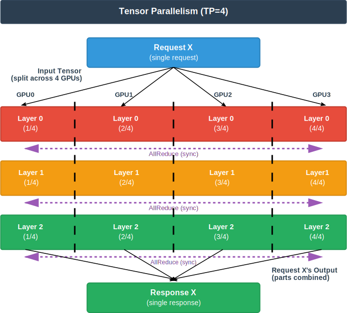
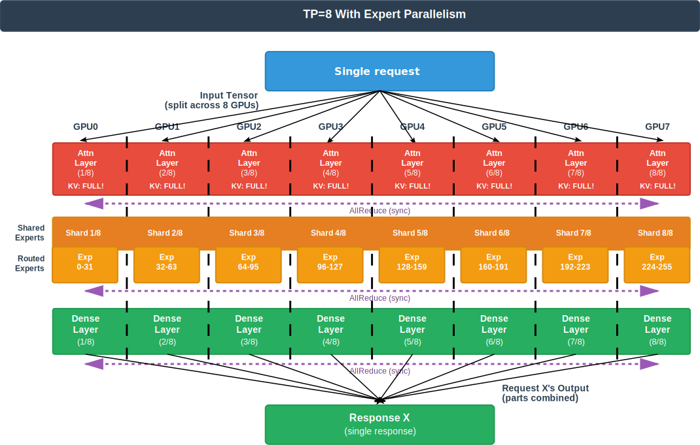
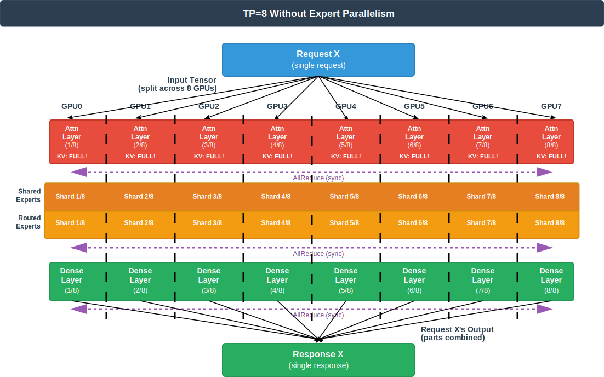
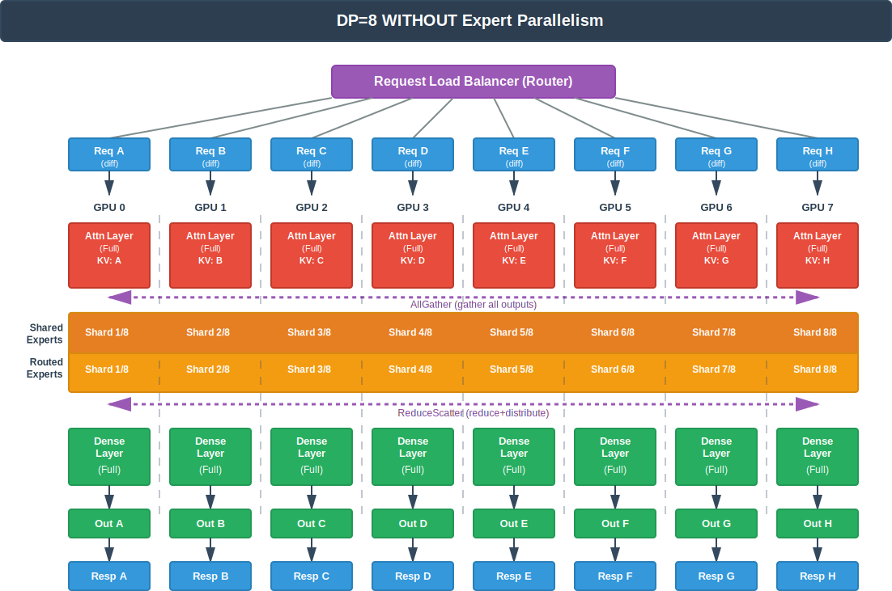
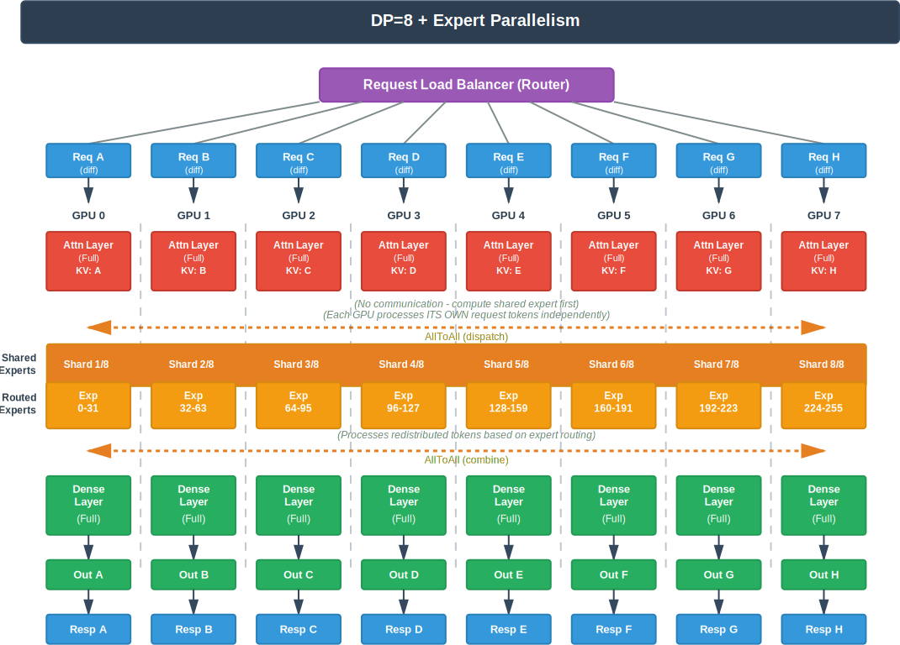

# vLLM MoE 实战手册：TP、DP、PP 与 EP 的实用指南


> 原英文博客来自 [AMD 官网](https://rocm.blogs.amd.com/software-tools-optimization/vllm-moe-guide/README.html)

高效部署像 DeepSeek-R1 这样的大型混合专家（Mixture-of-Experts，MoE）模型，并不仅仅是拥有足够多的 GPU —— 更关键的是选择 **正确的并行策略** 。错误的选择可能导致 KV Cache 被重复复制，占用 **8 倍内存** ，或者通信开销将吞吐量削减一半；而正确的选择则可以针对你的具体工作负载，释放出显著更高的性能。

本指南提供了一个全面、可视化的框架，用于理解和部署 vLLM 的并行策略：张量并行（Tensor Parallelism，TP）、数据并行（Data Parallelism，DP）、流水线并行（Pipeline Parallelism，PP）以及专家并行（Expert Parallelism，EP）。通过详细的示意图，你将清楚地看到每种策略是如何在 GPU 之间分配计算与内存的——从 TP 如何切分层并需要 AllReduce 同步，到 DP+EP 如何通过 AllToAll 通信为 MoE 模型实现请求级并行。我们将指出一些常见误区（例如为何“DP Attention”在本质上不同于传统的 DP），并说明什么时候 `--enable-expert-parallel` 参数是 **必需的** ，什么时候反而会引入 **不必要的开销** 。

我们在 AMD Instinct™ MI300X GPU 上部署 DeepSeek-R1、Qwen3-235B 和 Llama-4-Maverick 的基准测试结果揭示了性能的“拐点”：在低并发的交互式负载下，TP+EP 提供更低的延迟；而在高吞吐量的批处理场景中，DP+EP 的扩展性更好。你将了解 **专家激活密度** 如何决定 EP 是利是弊，以及为何像 DeepSeek 这样的 MLA/MQA 模型在 KV Cache 管理上需要特殊处理。

在阅读完本指南后，你将拥有一个实用的决策框架，能够根据并发水平、模型架构和硬件约束，选择最优的并行策略。

**适用范围：** 本博客主要聚焦于 **单节点部署** （通常是 8 张通过 AMD Infinity Fabric™ 技术或 xGMI 互联的 GPU）。我们会简要讨论多节点的注意事项以供参考，但主要示例和建议均针对单节点环境进行优化。

## 核心概念

vLLM 有三种基础并行策略：TP、PP 和 DP。另外 EP 是一种 **特殊的修饰参数** ，专用于 MoE 模型，并且需要与 TP 或 DP 结合使用。

### 张量并行（Tensor Parallelism, TP）

**作用：** 将单个网络层切分（shard）到多个 GPU 上。每个 GPU 处理该层的一部分计算，并通过集合通信对结果进行同步。

<a id="figure1"></a>



<div style="text-align:center;">
图 1：TP=4 时的数据流
</div>

在[图 1](#figure1) 中，单个请求 X 的张量被拆分到 4 张 GPU 上。所有 GPU **协同完成同一计算** ，每张 GPU 持有每一层 **1/4 的权重** 。在每一层之后，都需要通过 ***AllReduce*** 进行通信同步。

**使用场景：** 当单个模型过大，无法放入一张 GPU 时。使用 TP 可以让单个请求在多张 GPU 上并行处理，从而降低延迟。  
**约束：** TP 受限于注意力头（attention heads）的数量，且必须能整除。例如，若尝试使用 TP=3，可能会报错：
“Error message: Total number of attention heads (64) must be divisible by tensor parallel size (3)”

**命令：**

```sh
vllm serve model-name --tensor-parallel-size 4
```

### 数据并行（Data Parallelism, DP）

**作用：** 创建多个完整的模型副本，每个副本独立处理不同的请求。通过并行处理多个请求来提升吞吐量。

<a id="figure2"></a>


<div style="text-align:center;">
图 2：DP=4 时的数据流
</div>

在[图 2](#figure2) 中，不同的请求被同时处理。每张 GPU 都是一个 **完整、独立的模型副本** ，彼此之间没有通信，可将并发请求的吞吐量提升至 4×。

**使用场景：** 当你需要更高吞吐量，且请求之间可以完全独立处理时。

**约束：** DP 通常 **不会降低单个请求的延迟**

**命令：**

```sh
vllm serve model-name --data-parallel-size 4
```

### 流水线并行（Pipeline Parallelism, PP）

**作用：** 将模型的不同层拆分到多个 GPU 或节点上，每个 GPU 顺序处理不同的层，数据像流水线一样在各阶段之间流动。

<a id="figure3"></a>


<div style="text-align:center;">
图 3：Vanilla 在 PP=4 时的数据流
</div>

在[图 3](#figure3) 中，为了演示，单个请求在这种“原始”的 PP 中被顺序处理。任意时刻只有一张 GPU 在工作，其余 GPU 处于空闲状态（流水线气泡）。每个请求的总延迟为 4 个顺序阶段，GPU 利用率仅为 25%（4 张 GPU 中只有 1 张在工作）。

**何时使用：**

- 模型过大，单节点无法容纳（通常与 TP 结合使用）
- 需要部署在非 2 的幂数量 GPU 上（如 3、5、6、7、9 等）

**约束：** PP 通常也 **不会降低延迟**

**问题所在：** 使用原始 PP 一次只处理一个请求时，**75% 的 GPU 都是空闲的**

**vLLM 的优化：** vLLM 允许 **多个请求同时** 在流水线中流动。例如，当 GPU 0 处理请求 B 时，GPU 1 处理请求 A，GPU 2 处理更早的请求，以此类推。这使得所有流水线阶段都能同时保持忙碌，大幅减少空闲时间。

**关键特性：**

- 每张 GPU 持有模型的一部分层（一个“流水线阶段”）
- 数据按顺序流经各个阶段
- **单请求延迟：** 高于 TP（需要经过所有阶段）
- **吞吐量：** 当流水线被并发请求填满时非常高
- 更适合多节点部署（节点内使用 TP，节点间使用 PP）

**命令：**

```sh
# 纯 PP：4 张 GPU 作为 4 个流水线阶段
vllm serve model-name --pipeline-parallel-size 4

# 节点内 TP + 节点间 PP（2 个流水线阶段，每个阶段 4 张 GPU）
vllm serve model-name --tensor-parallel-size 4 --pipeline-parallel-size 2
```

## 关于 MoE 并行的常见误区

在深入 MoE 专有策略之前，理解以下概念至关重要。

### 术语表：专家分布相关术语

理解专家是如何分布的，对于解读本文中的示意图和策略非常关键。

**切分专家（Sharded Experts，不使用 `--enable-expert-parallel`）：**

* **定义：** 每张 GPU 上都存在所有专家，但专家的权重张量在 GPU 之间被切分/分片
* **示例：** 256 个路由专家、TP=8 时，每张 GPU 都有全部 256 个专家，但每个专家的权重被切成 8 份（每张 GPU 一份）
* **通信方式：** 需要 AllReduce 来聚合分片权重的计算结果

**拆分专家（Split Experts，使用 `--enable-expert-parallel`）：**

* **定义：** 专家被分布到不同 GPU 上，每张 GPU 只持有一部分 **完整的专家**
* **示例：** 256 个路由专家、TP=8 + EP 时，每张 GPU 持有 32 个完整专家（GPU 0：专家 0–31，GPU 1：32–63，依此类推）
* **通信方式：** 根据并行策略不同，可能使用 AllToAll（与 DP 结合）或 AllReduce（仅 TP）

### 误区 1：“EP 是一种独立的并行策略”

**事实：** EP **并不是一种独立的并行策略** 。它只是一个参数（`--enable-expert-parallel`），用于修改 MoE 的通信模式，必须与 TP 或 DP 结合使用。只有当 `TP_SIZE × DP_SIZE > 1` 时，`--enable-expert-parallel` 才会生效，否则会被忽略。

**EP 参数控制的行为：**

* **不启用 EP：** 每张 GPU 上都有所有专家，权重张量被切分，使用 **AllReduce** 通信
* **启用 EP：** 专家被分布到 GPU 上；当 DP>1 时使用 **AllToAll**，当 DP=1 时使用 **AllReduce**

有关 EP 激活条件和示例，请参阅“混合并行策略”一节。

### 误区 2：“DP Attention 与传统 DP 是一样的”

**事实：** 对于 MoE 模型，vLLM 使用了一种特殊变体，称为 **“DP Attention”** ，它在本质上不同于传统 DP。

**了解几个术语：**

* **传统 DP：**

    * 创建多个完整的模型副本（每张 GPU 或每组 GPU 一个）
    * 每个副本独立处理不同请求
    * 推理过程中副本之间 **没有通信**

* **DP Attention：** 请求级并行，GPU 协同作为一个逻辑模型副本：

    * 注意力层被复制（类似传统 DP）
    * MoE 专家层的处理方式取决于是否启用 EP
    * 推理过程中需要 GPU 间通信（如 all-gather、all-to-all、slice），以在注意力层和 MoE 层之间对齐 batch 切分
    * 通过 `--data-parallel-size N` 配置，可用于：

        * 启用 EP：即 “DP+EP”（专家分布，MoE 前后使用 all-to-all 或 gather/slice）
        * 不启用 EP：退化为传统 DP，每张 GPU 上 **完整复制 KV Cache** ， **无法获得 KV Cache 分区的收益**

**TP 在 MLA/MQA 上的问题：**

* MLA 和 MQA 在 KV Cache 中只有一个 KV head
* TP 可以沿注意力头维度切分 QKV
* 但 **无法沿 head 维度切分 KV Cache**（因为只有一个 head）
* 结果：**KV Cache 必须在所有 TP Rank 上完整复制**

**示例：** 注意力层使用 TP=32：

* 每张 GPU 的线性计算：1/32 的 attention heads ✓
* 每张 GPU 的 KV Cache：**完整 KV Cache（复制 32 份）** ✗
* 造成巨大的内存浪费

**DP Attention 的解决方案：** DP Attention 在 **单个模型副本内部** 工作，通过请求/Token 维度对 KV Cache 进行分区：

* 每张 GPU 持有完整的非 MoE 层（attention、dense）
* **单一逻辑 batch** 被分配到多张 GPU
* KV Cache 按请求/Token 分区（每张 GPU 仅持有 1/DP_SIZE）
* 推理过程中通过 AllToAll 进行通信
* **对比传统 DP：** 传统 DP 中，每张 GPU 处理自己的独立 batch，各自拥有完整 KV Cache（无分区、无通信）

**示例：** 注意力层使用 TP=4、DP=8（共 32 张 GPU）：

* 8 个独立的 DP 组，每组包含 4 张 GPU（TP 组）
* 每张 GPU 的非 MoE 计算：1/4 的 attention heads
* 每张 GPU 的 KV Cache：理论上为整个 batch 的 1/8
* AllReduce 仅发生在 4 张 GPU 的 TP 组内
* 每个 DP 组独立处理不同请求

**可用性：** MoE 模型的 DP Attention 在 vLLM v0.9.0+、V1 engine 中可用，专为 DeepSeek-V2/V3/R1 等 MLA/MQA 架构设计。

### 误区 3：“在 MoE 模型中，所有专家的处理方式都是一样的”

**事实：** MoE 模型中存在两种本质上不同的专家类型，它们具有不同的并行行为。

**路由专家（Routed Experts）：**

* 基于路由机制 **有条件地** 激活
* 每个 Token 只由其中一部分专家处理（例如 256 个专家中激活 8 个）
* **如果启用了 EP，路由专家会通过 `determine_expert_map` 分布** 到不同 GPU（每个设备上的专家不同）
* **如果未启用 EP，所有路由专家都会存在于每个 GPU 上** ，但权重张量会通过 `flatten_tp_across_dp` 进行切分
* 示例：DeepSeek-R1 有 **256 个路由专家** ，每个 Token 激活 8 个

**共享专家（Shared Experts）：**

* 对每个 Token **始终激活**（无路由）
* 被当作标准的稠密 MLP 层处理
* 权重会在 GPU 之间进行切分。只有在同时满足以下所有条件时，权重才会在每个 GPU 上进行完整复制：

    * 启用了 EP
    * TP 大小 > 1
    * DP 大小 > 1
    * 使用特定的 all2all 后端（allgather_reducescatter、naive、deepep_high_throughput 或 deepep_low_latency）

* 示例：DeepSeek-R1 有 **1 个共享专家**（始终激活）

**专家分布公式（针对路由专家）：**

```
EP_SIZE = TP_SIZE × DP_SIZE
Routed experts per GPU = Total Routed Experts / EP_SIZE
```

**示例：DeepSeek-R1（256 个路由专家 + 1 个共享专家）：**

| TP_SIZE | DP_SIZE | EP_SIZE | 每个 GPU 的路由专家数 | 共享专家处理方式 |
| ------- | ------- | ------- | ------------- | ------------- |
| 8 | 1 | 8 | 256 / 8 = 32 | 在 8 个 GPU 上切分 |
| 1 | 8 | 8 | 256 / 8 = 32 | 在 8 个 GPU 上切分 |

**关键点：** 在 GPU 数量相同（此处为 8 张 GPU）的情况下，只要启用了 EP，`TP=8` 和 `DP=8` 在路由专家分布上是相同的（每 GPU 32 个专家）。

### 误区 4：“TP+EP 像 DP+EP 一样使用 AllToAll 通信”

**事实：** TP+EP **只使用 AllReduce** ，而不是 AllToAll。根据 vLLM 源码，AllToAll 内核需要 `dp_size > 1`：

```python
# 来自 vllm/model_executor/layers/fused_moe/config.py:669
@property
def use_all2all_kernels(self):
    return self.dp_size > 1 and self.use_ep  # 两个条件都必须满足
```

由于 TP 的 `dp_size=1`，因此无论是否启用 EP，AllToAll 都 **永远不会** 被触发。

* **TP+EP：** 使用 AllReduce 通信（与不启用 EP 的 TP 相同）
* **DP+EP：** 使用 AllToAll 通信（启用 DP Attention）

这也解释了为什么在 MoE 模型中，`TP=8` 在启用和不启用 `--enable-expert-parallel` 时在功能上非常相似（两者都使用 AllReduce，没有 AllToAll）。

**关键含义：** 对于 KV Cache 切分至关重要的 MLA/MQA 模型：

* TP+EP：**不提供** KV Cache 切分（使用 AllReduce，dp_size=1）
* DP+EP：**提供** KV Cache 切分（使用 AllToAll，dp_size>1）

## 单一策略深度解析

### MoE 模型中的 EP

EP 会修改 MoE 层的映射方式以及通信方式。理解这一点对所有 MoE 部署都至关重要。

**vLLM 内部如何处理 MoE 专家分布：**

专家通过 `flatten_tp_across_dp` 函数进行映射 [[3]](https://rocm.blogs.amd.com/software-tools-optimization/vllm-moe-guide/README.html#references)：

```python
# 来自 vllm/model_executor/layers/fused_moe/config.py:687-695
def flatten_tp_across_dp(tp_size: int, dp_size: int, dp_rank: int):
    flatten_tp_size = dp_size * tp_size
    flatten_tp_rank = dp_rank * tp_size + tp_rank
    return flatten_tp_size, flatten_tp_rank
```

该函数在 MoE 层中 **始终会被调用** ，与是否启用 EP 无关。

**为什么 EP 可以降低 MoE 模型的延迟：**

关键点：**瓶颈在内存带宽，而不是计算能力。**

* MoE 模型具有稀疏激活（例如 DeepSeek 每个 Token 只使用 671B 中的 37B 参数）
* GPU 大部分时间花在从内存加载专家权重上，而不是计算
* 单个 GPU 的内存带宽限制了专家访问速度
* **解决方案：** 将专家分布到多个 GPU 上，以获得聚合内存带宽

在 8 张 GPU 上启用 EP，可获得 8× 的专家权重加载内存带宽，从而减少内存传输等待时间，而这正是 MoE 模型延迟的主要来源。

**通信权衡：** EP 需要 AllToAll 通信，将 Token 路由到位于不同 GPU 上的专家。但对于大多数模型而言，这一开销 **远小于** 内存带宽带来的收益（例外：激活密度 <1% 的超稀疏模型）。

## 策略组合

### TP+EP：MoE 模型的张量并行

**关键点：** 对于 MoE 模型，`--tensor-parallel-size 8 --enable-expert-parallel` 与仅使用 `--tensor-parallel-size 8` 的行为是不同的。EP 参数会改变路由专家在 GPU 之间的映射方式。

* **未启用 `--enable-expert-parallel`：** 路由专家在 8 张 GPU 上进行切分（见[图 5](#figure5)）
* **启用 `--enable-expert-parallel`：** 路由专家在 8 张 GPU 上进行分布（见[图 4](#figure4)）
* KV Cache 行为：两种情况下都在每个 GPU 上完整复制
* 通信模式：两种情况下都使用 AllReduce（**不是** AllToAll）

**原因：** AllToAll 内核要求 `dp_size > 1`。TP 的 `dp_size=1`，因此无论是否启用 EP，都不会触发 AllToAll。

如下方[图 4](#figure4) 所示，在 TP=8 且启用 EP 时，专家被分布到 8 张 GPU 上（每 GPU 32 个专家），并在每一层之后使用 AllReduce 通信。

<a id="figure4"></a>



<div style="text-align:center;">
图 4：TP=8 的单节点数据流（启用 EP）
</div>

<a id="figure5"></a>



<div style="text-align:center;">
图 5：TP=8 的单节点数据流（未启用 EP）
</div>

**为什么 TP+EP 对 MLA 模型（DeepSeek V2/V3/R1）的收益有限：**

DeepSeek 模型使用多潜变量注意力（MLA），这带来了一个关键限制：

**KV Cache 复制问题：**

* MLA 使用 **单一 KV 头**（不同于标准多头注意力）
* 在 TP 下，**无法沿头维度切分 KV Cache**（因为只有 1 个头）
* 结果： **KV Cache 必须在每个 TP Rank 上完整复制**

**内存影响示例**（DeepSeek-V3 671B，TP=8，批量 512 Token）：

| 配置 | KV Cache 状态 | 有效并发度 | 结果 |
| --- | ------------ | ----- | ------- |
| TP=8 + EP | 复制 ×8（每 GPU 持有相同 cache） | 1× | KV Cache 总量放大 8×，限制 batch 大小 |
| DP=8 + EP | 无复制（每 GPU 持有独立 cache） | 8× | KV Cache 最优，允许 8× 更大 batch |

**DP+EP 的内存节省：** 通过消除 KV Cache 的 8× 复制，DP=8 配置中的每张 GPU 可释放大量内存，用于将有效并发度提升 8×，从而支持更大的 batch 或更长上下文。

**为什么 TP+EP 仍然有帮助（但不理想）：**

* 专家分布：专家分布在 8 张 GPU 上，降低单 GPU 专家内存
* 注意力计算：可切分 query 投影（收益有限）
* KV Cache：完全复制（对 MLA 模型是主要浪费）

**基准现实检验：** 尽管存在 KV Cache 复制，TP+EP 在低并发（64–128 请求）下的吞吐量仍比 DP+EP **高 52%** ，因为单请求延迟更低。如果 HBM 充足且优先考虑延迟而非 batch 大小，这一内存开销是可接受的。

**何时使用 TP+EP：**

* 无法在单 GPU 上容纳的大型 MoE 模型
* 低到中等并发、对延迟敏感的工作负载
* HBM 充足，可承受 KV Cache 复制

**命令：**

```sh
# 不启用 EP（与纯 TP 行为相同）
vllm serve model-name --tensor-parallel-size 8

# 启用 EP（仅有轻微内部优化差异）
vllm serve model-name --tensor-parallel-size 8 --enable-expert-parallel
```

### DP+EP：带 EP 的 DP Attention

**关键点（CRITICAL）：** 仅使用 `--data-parallel-size`（不加 `--enable-expert-parallel`）时，
**被切分的是 MoE 专家，而不是 DP Attention** 。

#### 不开启 EP 的 DP

当你使用 `--data-parallel-size 8` **但未** 启用 `--enable-expert-parallel` 时：

```sh
# MoE 专家会被切分，但使用的是传统通信方式
vllm serve model-name --data-parallel-size 8
```

**实际发生的情况**（以 DeepSeek-R1 为例）：

* Attention 层：每张 GPU 上都是 **完整副本**
* **MoE 路由专家：被切分（SHARDED）**（每张 GPU 上都有全部 256 个专家，但权重张量在 8 张 GPU 间切分）

    * 在路由专家之前需要 **AllGather**（汇集共享的专家输出）
    * 在路由专家之后需要 **ReduceScatter**（规约并分发结果）

* **MoE 共享专家：被切分（SHARDED）**
* KV Cache 在 GPU 间 **分区** ；每张 GPU 只保存分配给自己的请求的缓存
* 通信方式：在路由专家前使用 AllGather + 路由专家后使用 ReduceScatter，
  **不是 AllToAll**
* **不存在 DP Attention 行为**

[图 6](#figure6) 展示了该架构，说明路由专家如何在全部 8 张 GPU 上被切分，并通过 AllGather 与 ReduceScatter 进行通信。

<a id="figure6"></a>



<div style="text-align:center;">
图 6：DP=8 且未开启 EP 的数据流
</div>

#### 开启 EP 的 DP

当你使用 `--data-parallel-size 8` **并** 启用 `--enable-expert-parallel` 时：

```sh
# 启用 DP Attention（请求级并行）
vllm serve model-name --data-parallel-size 8 --enable-expert-parallel
```

此时使用的是 **DP Attention** ，其工作方式是 **在单个模型副本内部** ：

* 不同 GPU 处理不同请求（请求级并行）
* KV Cache 在 GPU 间 **分区** ；每张 GPU 只保存分配给自己的请求的缓存
* 非 MoE 层是复制的，但 KV Cache 被分区
* MoE 专家被 **分布（distributed）** 到所有 GPU 上
* **层间通信** 通过 AllToAll 完成

该架构如[图 7](#figure7) 所示：专家分布在各 GPU 上，AllToAll 通信使带有 KV Cache 分区的请求级并行高效运行。

<a id="figure7"></a>



<div style="text-align:center;">
图 7：DP=8 且开启 EP 的数据流
</div>

**为什么 MoE 模型要用 DP+EP？**

DP+EP 为 MoE 模型带来特定优势，但最优策略取决于你的工作负载。
**对于 MLA/MQA 模型（DeepSeek V2/V3/R1）：**

* **关键收益：** 避免 TP 下发生的 KV Cache 复制
* TP 会在每张 GPU 上复制完整 KV Cache（8× 浪费），而 DP 会将其分区（每张 GPU 1/8）
* **结果：** 可支持 8× 更大的 batch size，并获得更高吞吐

**对所有 MoE 模型而言：**

* **更低的数据搬移：** Token 只会发送到持有其路由专家的 GPU
* **更好的专家分布：** 专家分布在 `TP_SIZE × DP_SIZE` 张 GPU 上
* **更高吞吐：** 面向服务负载的请求级并行
* **更少通信：** 稀疏 AllToAll 在规模化场景下比致密 AllReduce 更高效

**何时使用 DP+EP：**

* **MLA/MQA 模型的必选方案**（KV Cache 内存至关重要）
* **当 TP 取值不兼容（非 2 的幂）时**（如 Qwen3-Coder-480B FP8、MiniMax-M2）
* **大型 MoE 模型** ，且非专家层可放入单卡
* **以吞吐为目标的部署** ，高 QPS 比低延迟更重要

### 内存需求对比

理解内存需求有助于选择正确策略。以下是 DeepSeek-R1（671B 参数）的对比：

**假设：**

* 模型：671B（每 Token 激活 37B），256 个路由专家 + 1 个共享专家
* 量化：FP8（每参数 1 字节）
* Batch：512 个 Token，KV Cache 每 Token：约 2MB，总 KV Cache：1GB
* 非 MoE 层：约 84GB，路由专家：约 584GB，共享专家：约 0.04GB

| 配置 | 非 MoE | 路由专家 | 共享专家 | KV Cache | 单卡合计 | 通信方式 |
| --- | ------ | ------ | ------ | -------- | ------- | ------- |
| **TP=8（无 EP）** | 10.5GB | 73GB（32 个专家） | 0.04GB | 1GB | ~84.5GB | AllReduce |
| **TP=8 + EP** | 10.5GB | 73GB（32 个专家） | 0.04GB | 1GB | ~84.8GB | AllReduce |
| **DP=8（无 EP）** | 84GB | 73GB（32 个专家） | 0.04GB | 1GB | ~158GB | AllGather + ReduceScatter |
| **DP=8 + EP** | 84GB | 73GB（32 个专家） | 0.04GB | 0.125GB | ~157GB | AllToAll |

**关键结论：**

1. **未开启 EP：** 所有路由专家都存在于每张 GPU 上，但权重通过 `flatten_tp_across_dp` 被切分。
2. **开启 EP：** 当 `TP_SIZE × DP_SIZE > 1` 时，通过 `determine_expert_map` 将路由专家分布到不同设备。
3. **EP 决定通信方式：** 无 EP 用 AllReduce；有 EP 用 AllToAll。
4. **TP=8（无 EP）与 TP=8 + EP：** 路由专家分别是切分（全部存在）与拆分（分布）；二者都使用 AllReduce。
5. **DP=8（无 EP）与 DP=8 + EP：** 相比 TP 都会分区 KV Cache（可支持 8× 更大 batch）；路由专家分别是切分（全部存在）与拆分（分布）；二者都使用 AllToAll（内存几乎相同），但 **DP+EP 会分区 KV Cache（支持 8× 更大 batch）** 。
6. **为何推荐 DP+EP：** 在保持高效专家分布的同时按请求/Token 分区 KV Cache，可解锁更大 batch 与更长上下文，在更低单卡内存占用下获得更高吞吐，尤其适合 MLA/MQA 模型。

## 基准测试结果：策略性能

在 8× AMD Instinct™ MI300X GPU 上的真实基准测试揭示了并行策略选择的关键点。

### 测试配置

**硬件：**

* **GPU：** 8× AMD Instinct™ MI300X（gfx942）
* **CPU：** 2 × AMD EPYC™ 9654 96 核处理器

**软件栈：**

* **ROCm Driver：** 6.10.5（AMDGPU）
* **容器：** rocm/vllm-dev（ROCm 7.0.51831）
* **vLLM：** 0.11.1rc3.dev69+g269c4db0a
* **PyTorch：** 2.9.0a0+git1c57644（ROCm 7.0.51831）

**基准配置：**

* **输入：** 8192 个 Token（长上下文）
* **输出：** 每请求 1024 个 Token
* **负载：** 总计 640 个请求

### DeepSeek-R1（671B，256 路由 + 1 共享，8/Token，MLA）在 AITER 关闭时的 DP+EP 与 TP+EP 扩展性

<a id="figure8"></a>


<div style="text-align:center;">
图 8：DeepSeek-R1 DP+EP 与 TP+EP 扩展性能
</div>

**关键发现**（来自[图 8](#figure8)）：

1. **低并发（64）下 TP=8 + EP 更优** —— 吞吐高 52%，TTFT（首 Token 时间）低 80%（相对 DP=8 + EP，concurrency=64）
2. **DP=8 + EP 扩展性更好** —— 在 concurrency=1024 时达到 7,114 tok/s（比 TP=8 + EP 高 47%）

### Qwen3-235B-A22B-Instruct-2507（128 路由，8/Token，6.25% 稠密度）

在 AITER 启用时的 DP+EP 与 TP+EP 扩展性

<a id="figure9"></a>


<div style="text-align:center;">
图 9：Qwen3-235B-A22B DP+EP 与 TP+EP 扩展性能
</div>

**关键发现：** 如[图 9](#figure9) 所示，尽管激活密度更高（6.25% 与 DeepSeek 的 3.13%），在 256–512 并发请求处仍出现相似的交叉点。

### Llama-4-Maverick-17B-128E-Instruct-FP8（128 路由 + 1 共享，1/Token，0.78% 激活密度）

在 AITER 启用时，DP 与 EP（有/无 EP）的扩展性如下：

<a id="figure10"></a>


<div style="text-align:center;">
图 10：启用/不启用 EP 时 Llama-4-Maverick-17B-128E TP 与 DP 扩容
</div>

**关键发现：** 如[图 10](#figure10) 所示，**EP=0 比 EP=1 快 7–12%** ，适用于超稀疏模型。仅 0.78% 的激活密度下，AllToAll 的开销超过其收益。

### 专家激活密度假设

EP 参数的收益与专家激活密度相关：

| 模型 | Experts/Token | 激活密度 | EP 建议 | 影响 |
| --- | ------------- | ----- | -------- | --- |
| Llama-4-Maverick-17B-128E-Instruct-FP8 | 1 / 128 | 0.78% | EP=0 | EP=1 增加 7–12% 开销 |
| DeepSeek-R1 | 8 / 256 | 3.13% | EP=1（MLA 必需） | |
| Qwen3-235B-A22B-Instruct-2507 | 8 / 128 | 6.25% | EP=1 | 开销极小，支持更多优化 |

**规律：**

* **< 1% 激活：** 更适合 EP=0（AllReduce 更高效）
* **> 3% 激活：** 强烈推荐 EP=1（AllToAll 更具效率）

**MLA 例外：** DeepSeek-R1 的多潜变量注意力（MLA）**必须** 在 DP 下使用 EP=1 才能正确处理 KV Cache，与激活密度无关。

## 决策框架

选择最优策略需要在模型架构、专家配置、工作负载特性和硬件约束之间权衡。

### 四个关键问题

#### 1. 预期并发水平是多少？

**低到中等并发（≤128 并发请求）：**

* ✅ **使用 TP=8**（或单节点内的最大 TP）
* **原因：** 在所有测试模型中吞吐高 40–86%
* **适用：** 交互式聊天、实时推理、开发/测试

**高并发（≥512 并发请求）：**

* ✅ **使用 DP=8**（或与节点数匹配的最大 DP）
* **原因：** 在规模化下吞吐高 16–47%，高负载下 TTFT 更优
* **适用：** 批处理、高 QPS 生产服务

**交叉点：** 所有测试模型均在 256–512 并发请求之间

#### 2. 模型的专家激活密度是多少？

计算公式：`激活密度 =（每 Token 激活专家数 / 路由专家总数）× 100%`

**超稀疏（< 1%）：**

* 示例：Llama-4-Maverick-17B-128E-Instruct-FP8（1/128 = 0.78%）
* **建议：** 不启用 EP（EP=0）
* **原因：** AllToAll 的开销超过收益

**稀疏（> 3%）：**

* 示例：Qwen3-235B-A22B-Instruct-2507（8/128 = 6.25%）
* **建议：** 启用 EP（EP=1）
* **原因：** 高路由复杂度更适合 AllToAll

**MLA 例外：** MLA 模型（DeepSeek）在 DP 下必须使用 EP=1，以保证 KV Cache 正确处理。

#### 3. 模型是否使用 MLA/MQA Attention？

MLA/MQA 模型（DeepSeek-R1、DeepSeek-V2、DeepSeek-V3）：

* **关键：** DP 配置下始终使用 EP=1
* **原因：** MLA 的单 KV 头需要 DP Attention 才能正确处理 KV Cache
* **若未用 EP=1：** 38.6% 失败率 + KV Cache 完整复制

Grouped-Query Attention 模型（Qwen3、Llama-4、Mixtral）：

* **更灵活：** 是否启用 EP 取决于激活密度
* **非关键：** EP 属于优化，而非正确性要求

#### 4. 硬件约束是什么？

单节点（≤8 GPU，快速互联）：

* **优选：** TP 或 DP（除非必要，避免 PP）
* **原因：** 充分利用 XGMI 的高带宽 AllReduce/AllToAll

内存受限：

* **优选：** DP+EP 以分区 KV Cache

**收益：** DP=8 相比 TP=8 可支持 **8× 更大 batch**

### 快速配置指南

**DeepSeek-R1（671B，MLA）：**

| 使用场景 | 并发 | 配置 | 命令 |
| ----- | ---- | ---- | ---- |
| 交互式聊天 | ≤128 | TP=8 + EP | `--tensor-parallel-size 8 --enable-expert-parallel` |
| 批处理 | ≥512 | DP=8 + EP | `--data-parallel-size 8 --enable-expert-parallel` |

**Qwen3-235B-A22B-Instruct-2507（235B，6.25% 密度）：**

| 使用场景 | 并发 | 配置 | 命令 |
| ----- | ---- | ---- | ---- |
| 交互式聊天 | ≤128 | TP=8 + EP | `--tensor-parallel-size 8 --enable-expert-parallel` |
| 批处理 | ≥512 | DP=8 + EP | `--data-parallel-size 8 --enable-expert-parallel` |

**Llama-4-Maverick-17B-128E-Instruct-FP8（17B，0.78% 密度）：**

| 使用场景 | 并发 | 配置 | 命令 |
| ----- | ---- | ---- | ---- |
| 交互式聊天 | ≤128 | TP=8（无 EP） | `--tensor-parallel-size 8` |
| 批处理 | ≥512 | DP=8（无 EP） | `--data-parallel-size 8` |

## 并行策略混合

vLLM 允许组合多种策略以高效地将模型分布到 GPU 上。理解哪些组合可行及其约束对于成功部署至关重要。

### EP 激活约束

**关键点（CRITICAL）：** 只有当 `TP_SIZE × DP_SIZE > 1` 时，**EP 才会激活**。示例如下：

| TP_SIZE | DP_SIZE | `--enable-expert-parallel` | TP_SIZE × DP_SIZE | EP 是否激活 | 通信方式 |
| ------- | ------- | -------------------------- | ----------------- | ------- | --------- |
| 8 | 1 | Yes | 8 | Yes | AllReduce（dp_size=1） |
| 1 | 8 | Yes | 8 | Yes | AllToAll（dp_size>1） |
| 4 | 2 | Yes | 8 | Yes | AllToAll（dp_size>1） |
| 8 | 1 | No | 8 | No | AllReduce |
| 1 | 1 | Yes | 1 | No | N/A（违反约束） |

**关键点：** AllToAll 通信需要 `dp_size > 1`。在仅 TP 的配置（`dp_size=1`）下，即使启用了 EP，vLLM 也始终使用 AllReduce。

### PP 与 EP 的限制

**关键限制（CRITICAL LIMITATION）：** PP+EP 组合存在显著约束：

1. **EP 仅在每个流水线阶段内 `TP_SIZE × DP_SIZE > 1` 时才会激活**

    1. `--pipeline-parallel-size 2 --enable-expert-parallel` → EP **不会激活**（每阶段 TP=1，DP=1）
    2. `--pipeline-parallel-size 2 --tensor-parallel-size 4 --enable-expert-parallel` → EP 激活（每阶段 TP=4）

2. **PP+EP 需要 AITER（高级节点间 TP 引擎运行时）**

    1. AITER 为 PP 下的复杂通信模式提供稳定性
    2. 启用方式：`VLLM_ROCM_USE_AITER=1`
    3. 未启用 AITER：在大型 MoE 模型下可能出现不稳定或失败

**可工作的 PP+EP 示例：**
`# 8 GPU：2 个流水线阶段 × 每阶段 4 GPU`

```sh
VLLM_ROCM_USE_AITER=1 vllm serve model-name \
    --pipeline-parallel-size 2 \
    --tensor-parallel-size 4 \
    --enable-expert-parallel

# EP 激活：TP_SIZE × DP_SIZE = 4×1 = 4 > 1 ✓
```

**不会激活 EP 的 PP+EP 示例：**

```sh
# 8 GPU：8 个流水线阶段 × 每阶段 1 GPU
vllm serve model-name \
    --pipeline-parallel-size 8 \
    --enable-expert-parallel

# EP 不会激活：TP_SIZE × DP_SIZE = 1×1 = 1 ✗
```

### 支持的策略组合

**单一策略：**

* ✅ 仅 TP、仅 PP、仅 DP
* ❌ 仅 EP（必须与 TP 或 DP 搭配）

**两种策略：**

* ✅ TP+PP、TP+DP、TP+EP、PP+DP、DP+EP
* ⚠️ PP+EP：需要 `TP_SIZE × DP_SIZE > 1` + AITER 才能稳定

**三种及以上策略：**

* ✅ TP+PP+DP、TP+DP+EP
* ⚠️ TP+PP+EP、TP+PP+DP+EP：大型 MoE 模型下需要 AITER 才能稳定

### 实践建议

**单节点 MoE 部署（≤8 GPU）：**

* ✅ **低并发：使用 TP+EP**（更低延迟）
* ✅ **高并发：使用 DP+EP**（更高吞吐）
* ❌ **避免 PP**（除非模型超出单节点内存，会增加延迟开销）

**ROCm 最佳实践：** 在配备 XGMI 的 AMD Instinct™ MI300X GPU 上，优先在单节点（≤8 GPU）内使用 TP 或 DP。仅在扩展到 8 卡以上或跨节点时才引入 PP，并且 **PP+EP 必须启用 AITER** 。

## 总结

本文讲解了如何通过分析 TP、DP 与 EP 之间的关键权衡，为 MoE 模型选择最优并行策略。我们基于基准测试给出了决策框架，帮助你应对诸如专家激活密度与 MLA 架构要求等特定约束，避免 KV Cache 复制等常见陷阱。应用这些洞见，你可以在 AMD Instinct™ MI300X GPU 上最大化部署性能，根据具体负载实现更优的吞吐或延迟。

高效部署 MoE（Mixture-of-Experts）模型需要理解并行策略如何与模型架构和负载模式相互作用。我们在 DeepSeek-R1、Qwen3-235B-A22B-Instruct-2507 和 Llama-4-Maverick-17B-128E-Instruct-FP8 上的全面基准测试表明：
**不存在适用于所有场景的单一最优配置** 。

核心洞见是：**上下文决定一切** 。专家激活密度决定 EP 是增益还是负担；并发水平决定 TP 与 DP 的取舍；模型架构（MLA/MQA 与标准 Attention）从根本上改变需求。这些因素相互作用，使得“照本宣科”的配置不可行——你必须针对自己的实际负载进行测试。

对于在 ROCm 上部署于 AMD Instinct™ MI300X GPU 的实践者而言，每卡 192GB HBM3 以及高带宽 XGMI 互联，使得像 DeepSeek-R1（671B 参数）这样的大型 MoE 模型可以在 **无需 PP** 的情况下完成单节点部署。这在保持优秀性能的同时，简化了部署流程：低延迟交互负载可用 TP+EP，高吞吐批处理可用 DP+EP。

MoE 服务化生态正在快速演进。随着 vLLM 等框架持续优化 EP 与内存效率，理解这些基础权衡将帮助你解锁论文基准之外的性能收益。请以本文的决策框架为起点，并结合你的真实推理模式进行基准测试，找到最适合你部署场景的方案。

## 参考文献

* [vLLM 文档](https://docs.vllm.ai/)
* [DeepSeek Recipe](https://docs.vllm.ai/projects/recipes/en/latest/DeepSeek/DeepSeek-V3.html)
* [vLLM 并行配置源码](https://github.com/vllm-project/vllm/blob/main/vllm/model_executor/layers/fused_moe/config.py)
* [vLLM DP Attention 设计文档](https://docs.google.com/document/d/1I5gmPFdjOvsvgNSvTAuA_h0x7zn3M-5v5AWGLev9M9I/edit?tab=t.0#heading=h.sb8qme4g256f)
* [vLLM RFC: Data Parallel Attention 与 Expert Parallel MoEs](https://github.com/vllm-project/vllm/issues/16037)

## 附录

本附录提供了本指南中所有基准测试的完整、可复现的 vLLM 命令行配置。每条命令都包含了精确的环境变量（AITER 设置、AllToAll 后端）、并行策略参数（TP、DP、EP）以及用于生成 DeepSeek-R1、Qwen3-235B-A22B-Instruct-2507 和 Llama-4-Maverick-17B-128E-Instruct-FP8 在 AMD Instinct™ MI300X GPU 上性能结果的部署参数。

### 基准测试命令

### DeepSeek-R1

#### DeepSeek-R1：DP=8（无 EP）

```sh
VLLM_ROCM_USE_AITER=0 VLLM_ALL2ALL_BACKEND=allgather_reducescatter vllm serve deepseek-ai/DeepSeek-R1 \
    --tensor-parallel-size 1 \
    --data-parallel-size 8 \
    --max-model-len 32768 \
    --disable-nccl-for-dp-synchronization \
    --trust-remote-code \
    --distributed-executor-backend mp \
    --swap-space 16 \
    --disable-log-requests \
    --port 8000
```

#### DeepSeek-R1: DP=8 + EP

```sh
VLLM_ROCM_USE_AITER=0 VLLM_ALL2ALL_BACKEND=allgather_reducescatter vllm serve deepseek-ai/DeepSeek-R1 \
    --tensor-parallel-size 1 \
    --data-parallel-size 8 \
    --enable-expert-parallel \
    --max-model-len 32768 \
    --disable-nccl-for-dp-synchronization \
    --trust-remote-code \
    --distributed-executor-backend mp \
    --swap-space 16 \
    --disable-log-requests \
    --port 8000
```

#### DeepSeek-R1: TP=8 + EP

```sh
VLLM_ROCM_USE_AITER=0 vllm serve deepseek-ai/DeepSeek-R1 \
    --tensor-parallel-size 8 \
    --enable-expert-parallel \
    --max-model-len 32768 \
    --disable-nccl-for-dp-synchronization \
    --trust-remote-code \
    --distributed-executor-backend mp \
    --swap-space 16 \
    --disable-log-requests \
    --port 8000
```

### Qwen3-235B-A22B-Instruct-2507

#### Qwen3: TP=8

```sh
VLLM_ROCM_USE_AITER=1 vllm serve Qwen/Qwen3-235B-A22B-Instruct-2507 \
    --tensor-parallel-size 8 \
    --max-model-len 32768 \
    --trust-remote-code \
    --distributed-executor-backend mp \
    --swap-space 16 \
    --disable-log-requests \
    --port 8000
```

#### Qwen3: TP=8 + EP

```sh
VLLM_ROCM_USE_AITER=1 vllm serve Qwen/Qwen3-235B-A22B-Instruct-2507 \
    --tensor-parallel-size 8 \
    --enable-expert-parallel \
    --max-model-len 32768 \
    --trust-remote-code \
    --distributed-executor-backend mp \
    --swap-space 16 \
    --disable-log-requests \
    --port 8000
```

#### Qwen3: DP=8

```sh
VLLM_ROCM_USE_AITER=1 VLLM_ALL2ALL_BACKEND=allgather_reducescatter vllm serve Qwen/Qwen3-235B-A22B-Instruct-2507 \
    --tensor-parallel-size 1 \
    --data-parallel-size 8 \
    --max-model-len 32768 \
    --disable-nccl-for-dp-synchronization \
    --trust-remote-code \
    --distributed-executor-backend mp \
    --swap-space 16 \
    --disable-log-requests \
    --port 8000
```

#### Qwen3: DP=8 + EP

```sh
VLLM_ROCM_USE_AITER=1 VLLM_ALL2ALL_BACKEND=allgather_reducescatter vllm serve Qwen/Qwen3-235B-A22B-Instruct-2507 \
    --tensor-parallel-size 1 \
    --data-parallel-size 8 \
    --enable-expert-parallel \
    --max-model-len 32768 \
    --disable-nccl-for-dp-synchronization \
    --trust-remote-code \
    --distributed-executor-backend mp \
    --swap-space 16 \
    --disable-log-requests \
    --port 8000
```

### Llama-4-Maverick-17B-128E-Instruct-FP8

#### Llama-4: TP=8

```sh
VLLM_ROCM_USE_AITER=1 vllm serve meta-llama/Llama-4-Maverick-17B-128E-Instruct-FP8 \
    --tensor-parallel-size 8 \
    --max-model-len 32768 \
    --trust-remote-code \
    --distributed-executor-backend mp \
    --swap-space 16 \
    --disable-log-requests \
    --port 8000
```

#### Llama-4: TP=8 + EP

```sh
VLLM_ROCM_USE_AITER=1 vllm serve meta-llama/Llama-4-Maverick-17B-128E-Instruct-FP8 \
    --tensor-parallel-size 8 \
    --enable-expert-parallel \
    --max-model-len 32768 \
    --trust-remote-code \
    --distributed-executor-backend mp \
    --swap-space 16 \
    --disable-log-requests \
    --port 8000
```

#### Llama-4: DP=8

```sh
VLLM_ROCM_USE_AITER=1 VLLM_ALL2ALL_BACKEND=allgather_reducescatter vllm serve meta-llama/Llama-4-Maverick-17B-128E-Instruct-FP8 \
    --tensor-parallel-size 1 \
    --data-parallel-size 8 \
    --max-model-len 32768 \
    --disable-nccl-for-dp-synchronization \
    --trust-remote-code \
    --distributed-executor-backend mp \
    --swap-space 16 \
    --disable-log-requests \
    --port 8000
```

#### Llama-4: DP=8 + EP

```sh
VLLM_ROCM_USE_AITER=1 VLLM_ALL2ALL_BACKEND=allgather_reducescatter vllm serve meta-llama/Llama-4-Maverick-17B-128E-Instruct-FP8 \
    --tensor-parallel-size 1 \
    --data-parallel-size 8 \
    --enable-expert-parallel \
    --max-model-len 32768 \
    --disable-nccl-for-dp-synchronization \
    --trust-remote-code \
    --distributed-executor-backend mp \
    --swap-space 16 \
    --disable-log-requests \
    --port 8000
```
