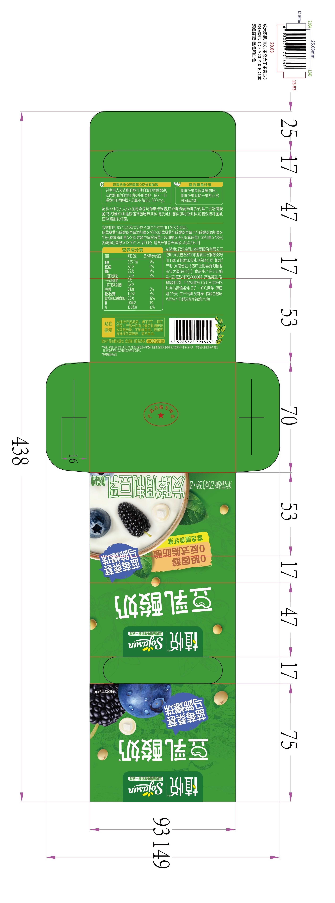
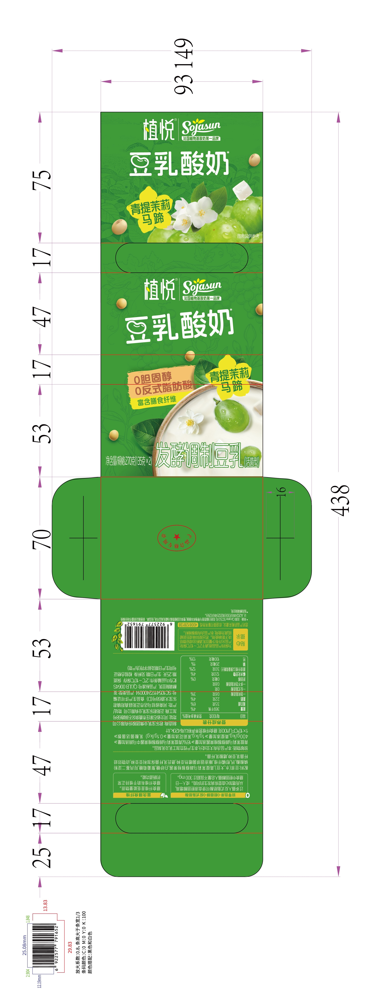
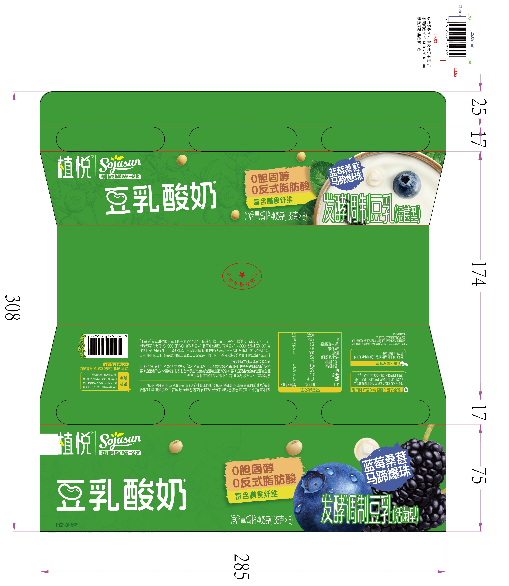
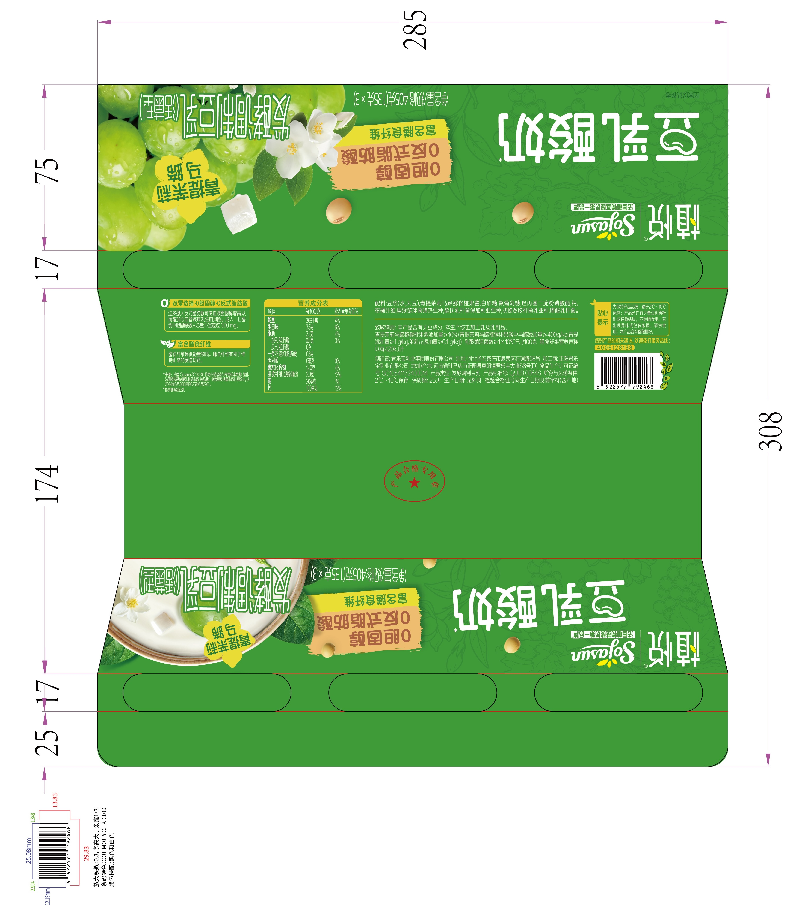
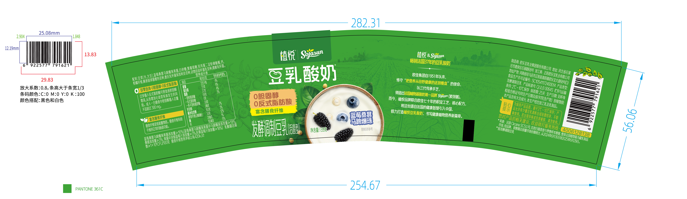
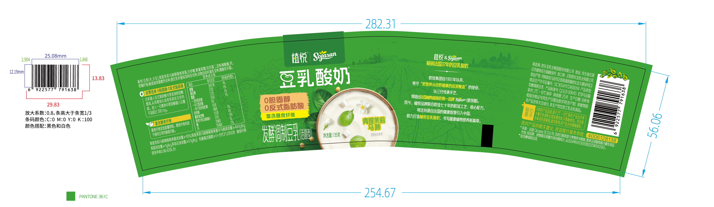
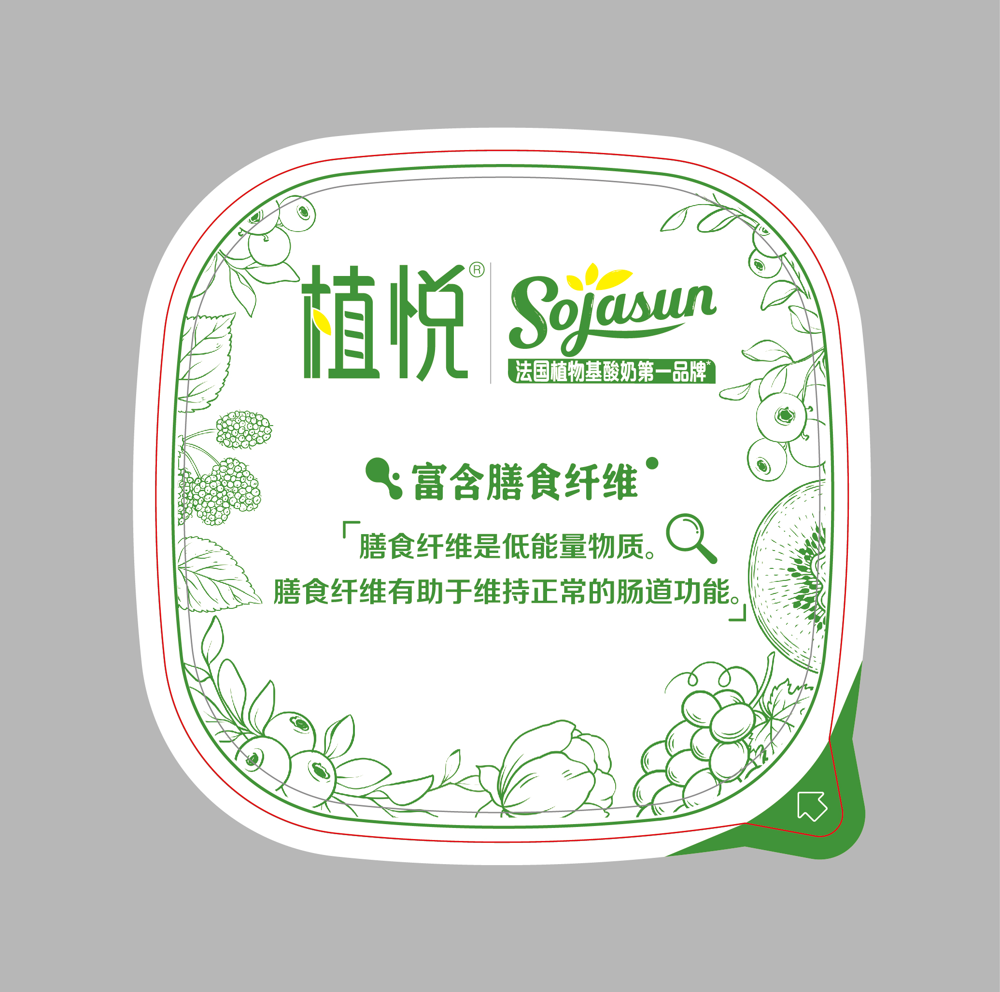

---
hide:
  - navigation
---

# 9 张 JPG 的中文

## 2 入裹包-蓝莓.jpg

放大系数:0.8,条高大于条宽 1/3  
条码颜色:C:0 M:0 Y:0 K:100  
颜色搭配:黑色和白色

### 双零选择·0 胆固醇·0 反式脂肪酸

过多摄入反式脂肪酸可使血液胆固醇增高，从而增加心血管疾病发生的风险。成人一日膳食中胆固醇摄入总量不宜超过 300mg。

### 富含膳食纤维

膳食纤维是低能量物质。膳食纤维有助于维持正常的肠道功能。

配料:豆浆(水,大豆),蓝莓桑葚马蹄爆珠果酱,白砂糖,聚葡萄糖,羟丙基二淀粉磷酸酯,钙,柑橘纤维,唾液链球菌嗜热亚种,德氏乳杆菌保加利亚亚种,动物双歧杆菌乳亚种,嗜酸乳杆菌。

致敏物质:本产品含有大豆成分,本生产线也加工乳及乳制品。

蓝莓桑葚果酱添加量 ≥16%/蓝莓桑葚马蹄爆珠酱中马蹄爆珠添加量 ≥19%/桑葚添加量 ≥3%/果酱中浓缩蓝莓汁添加量 ≥(18%)

乳酸菌活菌数 ≥1×10⁸CFU/100 克

膳食纤维营养声称(以每 420kJ 计)

### 营养成分表

| 项目                   | 每 100 克 | 营养素参考值% |
| ---------------------- | --------- | ------------- |
| 能量                   | 335 千焦  | 4%            |
| 蛋白质                 | 3.5 克    | 6%            |
| 脂肪                   | 2.2 克    | 4%            |
| 饱和脂肪酸             | 0.6 克    | 3%            |
| 反式脂肪酸             | 0 克      | -             |
| 一多不饱和脂肪酸       | 0.8 克    | -             |
| 胆固醇                 | 0 毫克    | 0%            |
| 碳水化合物             | 10.0 克   | 3%            |
| 膳食纤维(以聚葡萄糖计) | 3.0 克    | 12%           |
| 钠                     | 20 毫克   | 1%            |
| 钙                     | 100 毫克  | 13%           |

制造商:君乐宝乳业集团股份有限公司  
地址:河北省石家庄市鹿泉区石铜路 68 号  
加工商：正阳君乐宝乳业有限公司  
地址/产地:河南省驻马店市正阳县真阳镇君乐宝大道 68 号(D)  
食品生产许可证编号:SC10541172400044  
产品类型:发酵调制豆乳  
产品标准代号:Q/JLB0064S  
贮存与运输条件:2℃~10℃ 保存  
保质期:25 天  
生产日期:见杯身  
检验合格证号同生产日期及前字符(含产地)

### 贴心提示

为保持产品品质，请于 2℃~10℃ 保存；产品允许有少量豆乳清析出或轻微结块，不影响食用。若出现异味或包装破损，请勿食用。

您对产品的相关建议，欢迎拨打服务热线：4006128138

\*来源: 法国 Circana SCS 公司,信息扫描普查与零售样本数据,整体法国植物基冷藏乳制品市场,按品牌、销售额及销量市场份额统计,从 2024 年 6 月 30 日到 2025 年 6 月 29 日。

\*指发酵调制豆乳

产品合格专用章

### 植悦 | Sojasun

法国植物基酸奶第一品牌

豆乳酸奶

蓝莓桑葚马蹄爆珠

图案仅供参考

植悦 | Sojasun  
法国植物基酸奶第一品牌

豆乳酸奶

0 胆固醇  
0 反式脂肪酸  
富含膳食纤维  

蓝莓桑葚马蹄爆珠

发酵调制豆乳（活菌型）

净含量/规格 270 克(135 克 ×2)

## 2 入裹包-青提.jpg

放大系数:0.8,条高大于条宽 1/3  
条码颜色:C:0 M:0 Y:0 K:100  
颜色搭配:黑色和白色  

### 双零选择·0 胆固醇·0 反式脂肪酸

过多摄入反式脂肪酸可使血液胆固醇增高，从而增加心血管疾病发生的风险。成人一日膳食中胆固醇摄入总量不宜超过 300mg。

### 富含膳食纤维

膳食纤维是低能量物质。膳食纤维有助于维持正常的肠道功能。

配料:豆浆(水,大豆),青提茉莉马蹄猕猴桃果酱,白砂糖,聚葡萄糖,羟丙基二淀粉磷酸酯,钙,柑橘纤维,唾液链球菌嗜热亚种,德氏乳杆菌保加利亚亚种,动物双歧杆菌乳亚种,嗜酸乳杆菌。

致敏物质:本产品含有大豆成分,本生产线也加工乳及乳制品。

青提茉莉马蹄猕猴桃果酱添加量 ≥16%(青提茉莉马蹄猕猴桃果酱中马蹄添加量 ≥400g/kg,青提添加量 ≥1g/kg,茉莉花海添加量 ≥0.1g/kg)

乳酸菌活菌数 ≥1×10⁸CFU/100 克

膳食纤维营养声称(以每 420kJ 计)

### 营养成分表

| 项目                   | 每 100 克 | 营养素参考值% |
| ---------------------- | --------- | ------------- |
| 能量                   | 369 千焦  | 4%            |
| 蛋白质                 | 3.5 克    | 6%            |
| 脂肪                   | 2.2 克    | 4%            |
| 饱和脂肪酸             | 0.6 克    | 3%            |
| 反式脂肪酸             | 0 克      | -             |
| 一多不饱和脂肪酸       | 0.8 克    | -             |
| 胆固醇                 | 0 毫克    | 0%            |
| 碳水化合物             | 12.0 克   | 4%            |
| 膳食纤维(以聚葡萄糖计) | 3.0 克    | 12%           |
| 钠                     | 20 毫克   | 1%            |
| 钙                     | 100 毫克  | 13%           |
  
制造商:君乐宝乳业集团股份有限公司  
地址:河北省石家庄市鹿泉区石铜路 68 号  
加工商：正阳君乐宝乳业有限公司  
地址/产地:河南省驻马店市正阳县真阳镇君乐宝大道 68 号(D)  
食品生产许可证编号:SC10541172400044  
产品类型:发酵调制豆乳  
产品标准代号:Q/JLB0064S  
贮存与运输条件:2℃~10℃ 保存  
保质期:25 天  
生产日期:见杯身  
检验合格证号同生产日期及前字符(含产地)

### 贴心提示

为保持产品品质，请于 2℃~10℃ 保存；产品允许有少量豆乳清析出或轻微结块，不影响食用。若出现异味或包装破损，请勿食用。

您对产品的相关建议，欢迎拨打服务热线：4006128138

\*来源: 法国 Circana SCS 公司,信息扫描普查与零售样本数据,整体法国植物基冷藏乳制品市场,按品牌、销售额及销量市场份额统计,从 2024 年 6 月 30 日到 2025 年 6 月 29 日。

\*指发酵调制豆乳

产品合格专用章

### 植悦 | Sojasun

法国植物基酸奶第一品牌

豆乳酸奶

青提茉莉马蹄  

图案仅供参考

植悦 | Sojasun  
法国植物基酸奶第一品牌

豆乳酸奶

0 胆固醇  
0 反式脂肪酸  
富含膳食纤维  

青提茉莉马蹄

净含量/规格 270 克(135 克 ×2)

发酵调制豆乳（活菌型）

## 3 入裹包-蓝莓.jpg

放大系数:0.8,条高大于条宽 1/3  
条码颜色:C:0 M:0 Y:0 K:100  
颜色搭配:黑色和白色

### 植悦 | Sojasun

法国植物基酸奶第一品牌

豆乳酸奶

0 胆固醇  
0 反式脂肪酸  
富含膳食纤维

净含量/规格 270 克(135 克 ×2)

蓝莓桑葚马蹄爆珠

发酵调制豆乳（活菌型）

### 双零选择·0 胆固醇·0 反式脂肪酸

过多摄入反式脂肪酸可使血液胆固醇增高，从而增加心血管疾病发生的风险。成人一日膳食中胆固醇摄入总量不宜超过 300mg。

### 富含膳食纤维

膳食纤维是低能量物质。膳食纤维有助于维持正常的肠道功能。

\*来源: 法国 Circana SCS 公司,信息扫描普查与零售样本数据,整体法国植物基冷藏乳制品市场,按品牌、销售额及销量市场份额统计,从 2024 年 6 月 30 日到 2025 年 6 月 29 日。

\*指发酵调制豆乳

### 营养成分表

| 项目                   | 每 100 克 | 营养素参考值% |
| ---------------------- | --------- | ------------- |
| 能量                   | 335 千焦  | 4%            |
| 蛋白质                 | 3.5 克    | 6%            |
| 脂肪                   | 2.2 克    | 4%            |
| 饱和脂肪酸             | 0.6 克    | 3%            |
| 反式脂肪酸             | 0 克      | -             |
| 一多不饱和脂肪酸       | 0.8 克    | -             |
| 胆固醇                 | 0 毫克    | 0%            |
| 碳水化合物             | 10.0 克   | 3%            |
| 膳食纤维(以聚葡萄糖计) | 3.0 克    | 12%           |
| 钠                     | 20 毫克   | 1%            |
| 钙                     | 100 毫克  | 13%           |

配料:豆浆(水,大豆),蓝莓桑葚马蹄爆珠果酱,白砂糖,聚葡萄糖,羟丙基二淀粉磷酸酯,钙,柑橘纤维,唾液链球菌嗜热亚种,德氏乳杆菌保加利亚亚种,动物双歧杆菌乳亚种,嗜酸乳杆菌。

致敏物质:本产品含有大豆成分,本生产线也加工乳及乳制品。

蓝莓桑葚果酱添加量 ≥16%/蓝莓桑葚马蹄爆珠酱中马蹄爆珠添加量 ≥19%/桑葚添加量 ≥3%/果酱中浓缩蓝莓汁添加量 ≥(18%)

乳酸菌活菌数 ≥1×10⁸CFU/100 克

膳食纤维营养声称(以每 420kJ 计)

制造商:君乐宝乳业集团股份有限公司  
地址:河北省石家庄市鹿泉区石铜路 68 号  
加工商：正阳君乐宝乳业有限公司  
地址/产地:河南省驻马店市正阳县真阳镇君乐宝大道 68 号(D)  
食品生产许可证编号:SC10541172400044  
产品类型:发酵调制豆乳  
产品标准代号:Q/JLB0064S  
贮存与运输条件:2℃~10℃ 保存  
保质期:25 天  
生产日期:见杯身  
检验合格证号同生产日期及前字符(含产地)

### 贴心提示

为保持产品品质，请于 2℃~10℃ 保存；产品允许有少量豆乳清析出或轻微结块，不影响食用。若出现异味或包装破损，请勿食用。

您对产品的相关建议，欢迎拨打服务热线：4006128138

产品合格专用章

### 植悦 | Sojasun

法国植物基酸奶第一品牌

豆乳酸奶

0 胆固醇  
0 反式脂肪酸  
富含膳食纤维  

净含量/规格 270 克(135 克 ×2)

蓝莓桑葚马蹄爆珠

发酵调制豆乳（活菌型）

## 3 入裹包-青提.jpg

放大系数:0.8,条高大于条宽 1/3  
条码颜色:C:0 M:0 Y:0 K:100  
颜色搭配:黑色和白色  

### 植悦 | Sojasun

法国植物基酸奶第一品牌

豆乳酸奶

0 胆固醇  
0 反式脂肪酸  
富含膳食纤维  

净含量/规格 270 克(135 克 ×2)

青提茉莉马蹄

发酵调制豆乳（活菌型）

### 双零选择·0 胆固醇·0 反式脂肪酸

过多摄入反式脂肪酸可使血液胆固醇增高，从而增加心血管疾病发生的风险。成人一日膳食中胆固醇摄入总量不宜超过 300mg。

### 富含膳食纤维

膳食纤维是低能量物质。膳食纤维有助于维持正常的肠道功能。

\*来源: 法国 Circana SCS 公司,信息扫描普查与零售样本数据,整体法国植物基冷藏乳制品市场,按品牌、销售额及销量市场份额统计,从 2024 年 6 月 30 日到 2025 年 6 月 29 日。

\*指发酵调制豆乳

### 营养成分表

| 项目                   | 每 100 克 | 营养素参考值% |
| ---------------------- | --------- | ------------- |
| 能量                   | 369 千焦  | 4%            |
| 蛋白质                 | 3.5 克    | 6%            |
| 脂肪                   | 2.2 克    | 4%            |
| 饱和脂肪酸             | 0.6 克    | 3%            |
| 反式脂肪酸             | 0 克      | -             |
| 一多不饱和脂肪酸       | 0.8 克    | -             |
| 胆固醇                 | 0 毫克    | 0%            |
| 碳水化合物             | 12.0 克   | 4%            |
| 膳食纤维(以聚葡萄糖计) | 3.0 克    | 12%           |
| 钠                     | 20 毫克   | 1%            |
| 钙                     | 100 毫克  | 13%           |

配料:豆浆(水,大豆),青提茉莉马蹄猕猴桃果酱,白砂糖,聚葡萄糖,羟丙基二淀粉磷酸酯,钙,柑橘纤维,唾液链球菌嗜热亚种,德氏乳杆菌保加利亚亚种,动物双歧杆菌乳亚种,嗜酸乳杆菌。

致敏物质:本产品含有大豆成分,本生产线也加工乳及乳制品。

青提茉莉马蹄猕猴桃果酱添加量 ≥16%（青提茉莉马蹄猕猴桃果酱中马蹄添加量 ≥400g/kg，青提添加量 ≥1g/kg 茉莉花添加量 ≥01g/kg）

乳酸菌活菌数 ≥1×10⁸CFU/100 克

膳食纤维营养声称以每 420kJ 计

制造商:君乐宝乳业集团股份有限公司  
地址:河北省石家庄市鹿泉区石铜路 68 号  
加工商：正阳君乐宝乳业有限公司  
地址/产地:河南省驻马店市正阳县真阳镇君乐宝大道 68 号(D)  
食品生产许可证编号:SC10541172400044  
产品类型:发酵调制豆乳  
产品标准代号:Q/JLB0064S  
贮存与运输条件:2℃~10℃ 保存  
保质期:25 天  
生产日期:见杯身  
检验合格证号同生产日期及前字符(含产地)  

### 贴心提示

为保持产品品质，请于 2℃~10℃ 保存；产品允许有少量豆乳清析出或轻微结块，不影响食用。若出现异味或包装破损，请勿食用。

您对产品的相关建议，欢迎拨打服务热线：4006128138

产品合格专用章

### 植悦 | Sojasun

法国植物基酸奶第一品牌

豆乳酸奶

0 胆固醇  
0 反式脂肪酸  
富含膳食纤维  

净含量/规格 270 克(135 克 ×2)

青提茉莉马蹄

发酵调制豆乳（活菌型）

## 蓝莓酸奶.jpg

放大系数:0.8,条高大于条宽 1/3  
条码颜色:C:0 M:0 Y:0 K:100  
颜色搭配:黑色和白色  

配料:豆浆(水,大豆),蓝莓桑葚马蹄爆珠果酱,白砂糖,聚葡萄糖,羟丙基二淀粉磷酸酯,钙,柑橘纤维,唾液链球菌嗜热亚种,德氏乳杆菌保加利亚亚种,动物双歧杆菌乳亚种,嗜酸乳杆菌。

### 双零选择·0 胆固醇·0 反式脂肪酸

过多摄入反式脂肪酸可使血液胆固醇增高，从而增加心血管疾病发生的风险。成人一日膳食中胆固醇摄入总量不宜超过 300mg。

### 富含膳食纤维

膳食纤维是低能量物质。膳食纤维有助于维持正常的肠道功能。

### 营养成分表

| 项目                   | 每 100 克 | 营养素参考值% |
| ---------------------- | --------- | ------------- |
| 能量                   | 335 千焦  | 4%            |
| 蛋白质                 | 3.5 克    | 6%            |
| 脂肪                   | 2.2 克    | 4%            |
| 饱和脂肪酸             | 0.6 克    | 3%            |
| 反式脂肪酸             | 0 克      | -             |
| 一多不饱和脂肪酸       | 0.8 克    | -             |
| 胆固醇                 | 0 毫克    | 0%            |
| 碳水化合物             | 10.0 克   | 3%            |
| 膳食纤维(以聚葡萄糖计) | 3.0 克    | 12%           |
| 钠                     | 20 毫克   | 1%            |
| 钙                     | 100 毫克  | 13%           |

蓝莓桑葚果酱添加量 ≥16%/蓝莓桑葚马蹄爆珠酱中马蹄爆珠添加量 ≥19%/桑葚添加量 ≥3%/果酱中浓缩蓝莓汁添加量 ≥(18%)

乳酸菌活菌数 ≥1×10⁸CFU/100 克

膳食纤维营养声称(以每 420kJ 计)

### 植悦

豆乳酸奶

0 胆固醇  
0 反式脂肪酸  
富含膳食纤维  

发酵调制豆乳（活菌型）

净含量：135 克

蓝莓桑葚马蹄爆珠

图案仅供参考

### 植悦&Sojasun

畅销法国 37 年的豆乳酸奶
欧佳集团自 1951 年以来，
恪守“把营养从田野健康的送到餐盘”的使命，
以三代传承手艺，
缔造出法国植物基酸奶第一品牌 Sojasun（素芽膳）。
而今，植悦品牌联合欧佳七十年的积淀工艺、核心配方，
将这份源自法国的健康智慧引入中国，
倾力打造植悦豆乳酸奶，书马健康植物营养新篇章。

制造商:君乐宝乳业集团股份有限公司  
地址:河北省石家庄市鹿泉区石铜路 68 号  
加工商：正阳君乐宝乳业有限公司  
地址/产地:河南省驻马店市正阳县真阳镇君乐宝大道 68 号(D)  
食品生产许可证编号:SC10541172400044  
产品类型:发酵调制豆乳  
产品标准代号:Q/JLB0064S  
贮存与运输条件:2℃~10℃ 保存  
保质期:25 天  
生产日期:见杯身  
检验合格证号同生产日期及前字符(含产地)

### 贴心提示

为保持产品品质，请于 2℃~10℃ 保存；产品允许有少量豆乳清析出或轻微结块，不影响食用。若出现异味或包装破损，请勿食用。

您对产品的相关建议，欢迎拨打服务热线：4006128138

\*来源: 法国 Circana SCS 公司,信息扫描普查与零售样本数据,整体法国植物基冷藏乳制品市场,按品牌、销售额及销量市场份额统计,从 2024 年 6 月 30 日到 2025 年 6 月 29 日。

\*指发酵调制豆乳

## 青提茉莉.jpg

放大系数:0.8,条高大于条宽 1/3  
条码颜色:C:0 M:0 Y:0 K:100  
颜色搭配:黑色和白色  

配料豆染（水大豆），青提茉莉马蹄狱猴林果酱，白砂糖聚葡萄糖，
柑橘纤维,唾液链球菌嗜热亚种,德氏乳杆菌保加利亚亚种,动物双歧杆菌乳亚种,嗜酸乳杆菌。

### 双零选择·0 胆固醇·0 反式脂肪酸

过多摄入反式脂肪酸可使血液胆固醇增高，从而增加心血管疾病发生的风险。成人一日膳食中胆固醇摄入总量不宜超过 300mg。

### 富含膳食纤维

膳食纤维是低能量物质。膳食纤维有助于维持正常的肠道功能。

### 营养成分表

| 项目                   | 每 100 克 | 营养素参考值% |
| ---------------------- | --------- | ------------- |
| 能量                   | 369 千焦  | 4%            |
| 蛋白质                 | 3.5 克    | 6%            |
| 脂肪                   | 2.2 克    | 4%            |
| 饱和脂肪酸             | 0.6 克    | 3%            |
| 反式脂肪酸             | 0 克      | -             |
| 一多不饱和脂肪酸       | 0.8 克    | -             |
| 胆固醇                 | 0 毫克    | 0%            |
| 碳水化合物             | 12.0 克   | 4%            |
| 膳食纤维(以聚葡萄糖计) | 3.0 克    | 12%           |
| 钠                     | 20 毫克   | 1%            |
| 钙                     | 100 毫克  | 13%           |

青提茉莉马蹄猕猴桃果酱添加量 ≥16%（青提茉莉马蹄猕猴桃果酱中马蹄添加量 ≥400g/kg，
青提添加量 ≥1g/kg 茉莉花添加量 ≥0.1g/Kg）

乳酸菌活菌数 ≥1×10⁸CFU/100 克

膳食纤维营养声称(以每 420kJ 计)

### 植悦

豆乳酸奶

0 胆固醇  
0 反式脂肪酸  
富含膳食纤维  

发酵调制豆乳（活菌型）

净含量：135 克

青提茉莉马蹄

图案仅供参考

### 植悦&Sojasun

畅销法国 37 年的豆乳酸奶
欧佳集团自 1951 年以来，
恪守“把营养从田野健康的送到餐盘”的使命，
以三代传承手艺，
缔造出法国植物基酸奶第一品牌 Sojasun（素芽膳）。
而今，植悦品牌联合欧佳七十年的积淀工艺、核心配方，
将这份源自法国的健康智慧引入中国，
倾力打造植悦豆乳酸奶，书马健康植物营养新篇章。

制造商:君乐宝乳业集团股份有限公司  
地址:河北省石家庄市鹿泉区石铜路 68 号  
加工商：正阳君乐宝乳业有限公司  
地址/产地:河南省驻马店市正阳县真阳镇君乐宝大道 68 号(D)  
食品生产许可证编号:SC10541172400044  
产品类型:发酵调制豆乳  
产品标准代号:Q/JLB0064S  
贮存与运输条件:2℃~10℃ 保存  
保质期:25 天  
生产日期:见杯身  
检验合格证号同生产日期及前字符(含产地)

### 贴心提示

为保持产品品质，请于 2℃~10℃ 保存；产品允许有少量豆乳清析出或轻微结块，不影响食用。若出现异味或包装破损，请勿食用。

您对产品的相关建议，欢迎拨打服务热线：4006128138

\*来源: 法国 Circana SCS 公司,信息扫描普查与零售样本数据,整体法国植物基冷藏乳制品市场,按品牌、销售额及销量市场份额统计,从 2024 年 6 月 30 日到 2025 年 6 月 29 日。

\*指发酵调制豆乳

## 植悦-杯盖.jpg

植悦 | Sojasun  
法国植物基酸奶第一品牌

0 胆固醇  
0 反式脂肪酸  

## 植悦-撕膜 1.jpg

植悦 | Sojasun  
法国植物基酸奶第一品牌

0 胆固醇  
0 反式脂肪酸  

过多摄人反式脂肪酸可使血液胆固醇增高，
从而增加心血管疾病发生的风险。
成人一日膳食中胆固醇摄人总量不宜超过 300mg。

## 植悦-撕膜 2.jpg

植悦 | Sojasun  
法国植物基酸奶第一品牌

富含膳食纤维

膳食纤维是低能量物质。
膳食纤维有助于维持正常的肠道功能。
