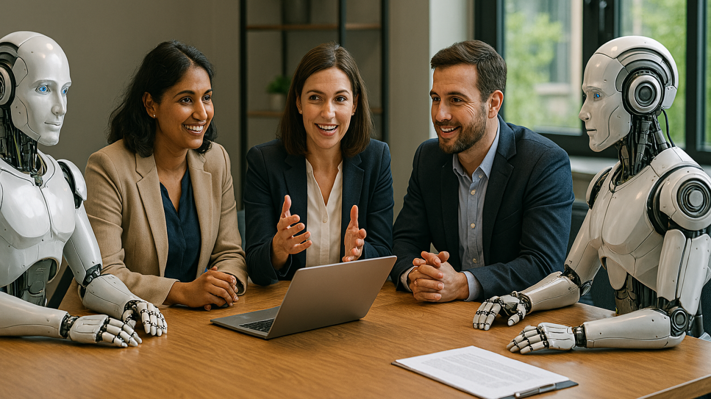
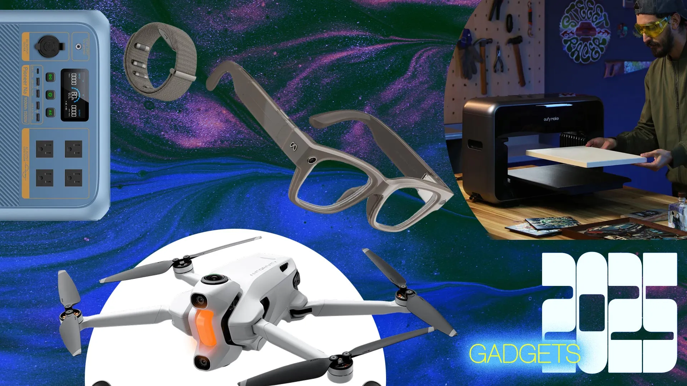
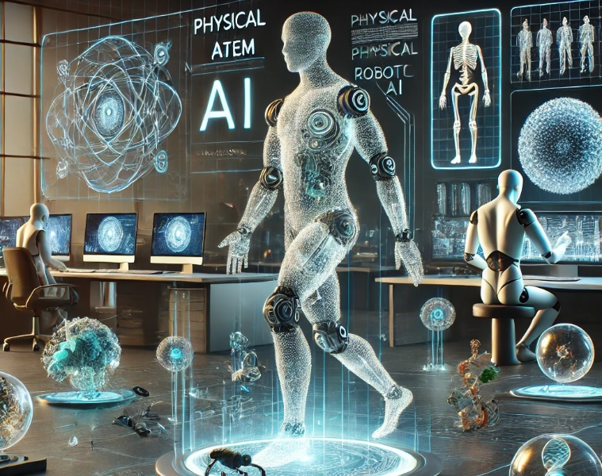

# 2026 年，人工智能从炒作走向务实

> 基本素材源自 [techcrunch.com](https://techcrunch.com/2026/01/02/in-2026-ai-will-move-from-hype-to-pragmatism/)

如果你觉得 2025 年是人工智能（AI）经历“现实考验”的一年，那 2026 年，将是它真正落地生根、开始改变我们日常生活和工作的一年。
行业焦点不再一味追逐更大更强的语言模型，而是转向更实际的问题：如何让人工智能真正好用？
如何把人工智能塞进更多设备里？如何让人工智能无缝融入我们的工作和生活？

我们采访的多位国内外专家一致认为，2026 年将是人工智能的“过渡年”：从靠钞能力堆算力规模，转向探索全新架构；
从炫技式的演示，转向精准落地的应用；从幻想全自动的智能体，转向真正辅助人类的伙伴。

热闹的聚会还没散场，但大家已经开始清醒——人工智能的未来，更注重实用。

## 规模定律行不通了

回溯历史：2012 年，多伦多大学三位教授联合发表的
[ImageNet 论文](https://proceedings.neurips.cc/paper_files/paper/2012/file/c399862d3b9d6b76c8436e924a68c45b-Paper.pdf)阐述了如何让人工智能通过海量图片“学会”识别物体。这一切离不开 GPU 的强大算力，也开启了后续十年人工智能架构创新的狂飙。

高潮出现在 2020 年前后，OpenAI 的 GPT-3 证明：把模型规模放大 100 倍，就能解锁编程、推理等新能力。
这被很多人工智能从业者称为“规模时代”——大家坚信更多算力、更多数据、更大 Transformer 就能带来突破。

但现在，越来越多的研究者意识到，规模定律正在触及天花板。人工智能行业将重新回归以创新架构为核心的时代。

Meta 前首席人工智能科学家 Yann LeCun 一直批评过度依赖规模，呼吁开发更好架构。
ImageNet 论文的作者 Sutskever 最近也表示，当前模型预训练效果已趋平缓，需要新思路。

华为也在积极探索全新的人工智能架构方向，其盘古系列大模型正逐步从规模驱动转向混合专家（MoE）和高效训练范式。

“我相信未来五年，我们很可能找到比 Transformer 更优秀的架构，”
Workera 的创始人兼 CEO Katanforoosh 说，“否则，模型能力很难再有质的飞跃。”

## 有时候，少即是多

大语言模型（LLM）擅长广博知识，但专家们预测，2026 年企业级人工智能采用的主角，将是小而美、能灵活针对特定领域微调的小语言模型（SLM）。

“到 2026 年，微调后的 SLM 会成为主流，很多企业会优先选择 SLM，因为 SLM 成本低、速度快、性能却不输 LLM，”
AT&T 首席数据官 Andy Markus 表示。“我们已看到越来越多企业转向 SLM——在专属场景下，它们准确率能媲美通用大模型。”

法国开源人工智能公司 Mistral 也持相同观点：微调小模型在多项基准中甚至超越大模型。

“SLM 高效、性价比高、易定制，非常适合高精度企业应用，”企业级人工智能公司 ABBYY 的人工智能战略师
Jon Knisley 说。小模型还更容易部署到边缘设备，这得益于边缘计算的快速发展。

阿里通义千问系列的 Qwen2.5-7B 版本就是典型代表，轻量化后推理能耗降低 60%，成本大幅下降，非常适合手机端和边缘场景部署。

Markus 认为，SLM 将在智能体时代扮演关键角色；Knisley 则强调，它正加速人工智能向本地化落地。

## 通过“经验”学习世界

人类不只靠语言学习，更通过亲身经历理解物理世界。可当前大语言模型本质上只是预测下一个词，它们并不是真正“懂”世界。

因此，许多研究者相信，下一个大突破来自“世界模型”——能模拟物体在三维空间的运动与交互、从而预测和行动的人工智能系统。

2026 年有望成为世界模型爆发之年：LeCun 离职 Meta 后创办的世界模型实验室估值或达 50 亿美元；谷歌
DeepMind 的 Genie 最新版已能生成实时交互世界；李飞飞的 World Labs 推出商用模型 Marble；
Runway 发布 GWM-1……一系列初创公司正密集展示成果。

北京智源研究院的 Emu3 已展示出强大的多模态世界模拟能力，阿里也在通义系列中融入空间推理模块，而特斯拉的 FSD
系统通过端到端神经网络和海量真实驾驶数据训练，正不断强化对复杂物理世界的理解与预测能力，为自动驾驶和未来 Robotaxi 提供更可靠的环境建模。

短期看，世界模型最先影响游戏行业。PitchBook 预测，到 2030 年游戏世界模型市场将从数十亿美元飙升至 2760
亿美元——因为它能创造沉浸式互动世界和更智能的 NPC。

General Intuition 创始人 Pim de Witte 也表示，虚拟世界的模拟环境不仅会重塑游戏产业，还可能成为训练下一代基础人工智能模型的绝佳试验场。

## 智能体终于要落地了

2025 年智能体炒得火热，却没完全兑现承诺，主要卡在“连接”上：智能体很难接入到真实的工作系统，多数还停留在尝试阶段。

Anthropic 推出的模型上下文协议（MCP），被誉为“人工智能的 USB-C”，让智能体轻松连接数据库、搜索和 API，MCP 已迅速成为行业标准。
OpenAI、微软拥抱都在积极拥抱 MCP，Anthropic 在 2025 年 12 月 9 日将 MCP 捐给了开源的
Linux 基金会，谷歌也搭建了自家的 MCP 服务器。

这大大降低了接入门槛，2026 年很可能见证智能体从 demo 走向日常。

字节跳动的豆包大模型已深度整合多智能体协作框架，在抖音生态中实现内容审核、推荐优化和用户交互的端到端处理，
12 月推出的豆包手机引发行业热议，成为国内智能体落地的标杆案例。

Sapphire Ventures 合伙人 Rajeev Dham 预测，“智能体优先”的方案将在各行业成为核心系统，尤其在客户服务、销售、IT
支持等领域，语音智能体将处理更多端到端任务。

## 增强人类，而不是取代

智能体更强大，会不会引发大规模裁员？Workera 的 Katanforoosh 不这么看：“2026 年将是属于人类的一年。”

过去几年，人工智能公司总爱喊“自动化取代人类”，但技术还没到那步，而且经济环境下这种说法也不受欢迎。明年，
我们会更清醒地认识到：人工智能远未实现真正自治，讨论焦点将转向如何用人工智能增强人类能力。

“很多公司反而会开始招聘，”他补充说，新岗位将集中在人工智能治理、透明性、安全和数据管理。“
我对 2026 年平均失业率保持在 4% 以下非常乐观。”

General Intuition 创始人 Pim de Witte 也说：“人们想站在 API 之上，而不是被压在下面。2026 年在这点上会很关键。”

## 走向物理世界

小模型、世界模型、边缘计算的进步，正推动人工智能深入物理场景。

“2026 年，‘物理人工智能’ 将主流化，包括机器人、自动驾驶、无人机和可穿戴设备，”AT&T Ventures 负责人 Vikram Taneja 表示。

自动驾驶和机器人虽会继续增长，但成本仍高。可穿戴设备则更容易被接受：像 Ray-Ban Meta 智能眼镜已能回答“你在看什么”；
人工智能健康戒指、智能手表让“贴身智能”成为常态。

华为昇腾生态正加速边缘人工智能部署，阿里夸克 AI 眼镜已实现视觉问答和实时翻译，
百度萝卜快跑则计划 2026 年在更多城市实现无人驾驶商业化运营。

“运营商会优化网络支持这波新设备浪潮，连接更灵活的玩家将胜出，”Taneja 说。

!!! tip

    2026 年，人工智能不再是遥远的梦想，而是触手可及的工具。
    
    它会如何改变你的工作和生活？欢迎留言分享你的期待！
