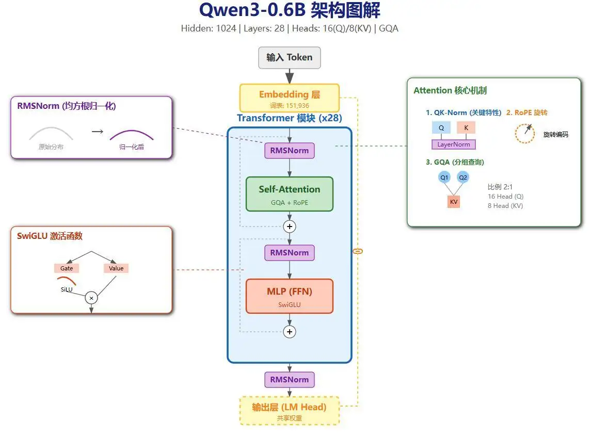
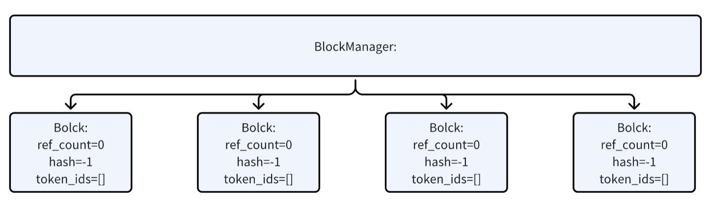
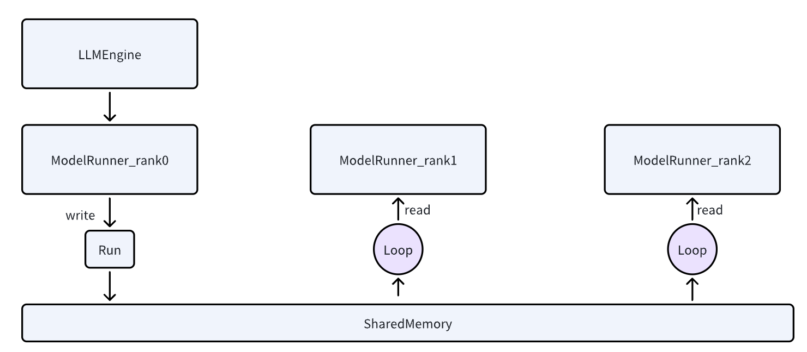

# Nano-vLLM 学习教程：基于 Qwen3-0.6B 模型的深度剖析

> 原作者 [lengrongfu](https://github.com/lengrongfu)

大模型推理的最简流程可以概括为

1. 文本输入：输入一串自然语言文本
1. 词典映射（编码）：通过词典映射表，将文本转换为一串数字序号（token）
1. Embedding 计算：token 序号经过 embedding 层，映射为表示语义的浮点数向量
1. 向量送入模型：将语义向量输入推理系统
1. 模型内部计算：经过多层矩阵乘法、加法及各类专用函数运算，生成输出向量
1. 概率筛选：对输出向量进行概率计算，选出概率最高的 token 序号
1. 结果解码：通过词典映射表将序号还原为文字，得到最终输出词


以上是对大模型推理流程的最朴素理解。尽管整体步骤看起来并不复杂，但真正发生在模型内部的推理计算，对大多数开发者而言仍然像一个“黑盒”。如果希望进一步拆解推理引擎的底层计算与加速原理，nano-vllm 是一个非常理想的入门切入点。

[nano-vLLM](https://github.com/GeeeekExplorer/nano-vllm) 代码量仅约 1200 行，却实现了生产级推理框架的核心技术原型，具体包括：

- 连续批处理（Continuous Batching）
- KV 缓存（Prefix KV Cache / Paged KV Cache）
- 高性能编译与执行优化（Torch Compilation、Triton、CUDA Graph）
- 张量并行（Tensor Parallelism）

本教程基于 nano-vLLM 项目和 Qwen3-0.6B 模型，提供一个完整的学习路径。我们将从模型结构入手，逐步解读配置、代码实现和关键组件。教程旨在帮助您理解 nano-vLLM 的工作原理，包括模型加载、调度、KV 缓存管理和推理流程。所有内容均基于提供的分析信息，确保全面覆盖。

## 1. Qwen3-0.6B 模型结构概述

Qwen3 的模型结构如下（忽略参数细节，主要结合 nano-vLLM 项目学习结构和流程）：


- **整体架构**：Qwen3 是一个因果语言模型（Causal LM），基于 Transformer 解码器堆栈。核心组件包括嵌入层、多层解码器块（Decoder Layers）和 LM Head。
- **关键特点**：
    - 使用 Grouped Query Attention (GQA) 来优化 KV 缓存使用，节省显存。
    - 每层 Decoder 包括 Self-Attention、MLP 和 LayerNorm。
- **可视化**：模型结构图显示嵌入层后接 28 层 Decoder，每层有 RMSNorm、Attention 和 MLP 子模块。Attention 使用 Rotary Position Embedding (RoPE)，MLP 使用 SiLU 激活。

通过 nano-vLLM，我们可以从代码层面分析这些结构如何在推理中实现高效执行。

## 2. 解读 config.json

Qwen3-0.6B 的配置文件位于 `~/.cache/huggingface/hub/models--Qwen--Qwen3-0.6B/snapshots/c1899de289a04d12100db370d81485cdf75e47ca/config.json`。内容如下：

```json
{
  "architectures": [
    "Qwen3ForCausalLM"
  ],
  "attention_bias": false,
  "attention_dropout": 0.0,
  "bos_token_id": 151643,
  "eos_token_id": 151645,
  "head_dim": 128,
  "hidden_act": "silu",
  "hidden_size": 1024,
  "initializer_range": 0.02,
  "intermediate_size": 3072,
  "max_position_embeddings": 40960,
  "max_window_layers": 28,
  "model_type": "qwen3",
  "num_attention_heads": 16,
  "num_hidden_layers": 28,
  "num_key_value_heads": 8,
  "rms_norm_eps": 1e-06,
  "rope_scaling": null,
  "rope_theta": 1000000,
  "sliding_window": null,
  "tie_word_embeddings": true,
  "torch_dtype": "bfloat16",
  "transformers_version": "4.51.0",
  "use_cache": true,
  "use_sliding_window": false,
  "vocab_size": 151936
}
```

### 核心字段解读

以下是关键配置字段的解释，使用表格总结：

| 字段名称                  | 值                  | 解释 |
|---------------------------|---------------------|------|
| 模型类型 (architectures) | ["Qwen3ForCausalLM"] | 指定模型类为 Qwen3 的因果 LM 变体。 |
| 隐藏层维度 (hidden_size/d_model) | 1024 | Transformer 内部表示的维度。 |
| 中间层维度 (intermediate_size/d_ff) | 3072 | MLP 层扩展维度。 |
| Q 头数 (num_attention_heads) | 16 | Query Attention 头数。 |
| KV 头数 (num_key_value_heads) | 8 | Key/Value Attention 头数（GQA 设计）。 |
| 隐藏层数量 (num_hidden_layers) | 28 | Transformer 解码器层数。 |
| RMSNorm Epsilon (rms_norm_eps) | 1e-06 | 归一化层的小值防止除零。 |
| RoPE Theta (rope_theta) | 1000000 | Rotary Position Embedding 的基频。 |
| 词表大小 (vocab_size) | 151936 | 词汇表大小。 |

### 分析

- **GQA 确认**：Q 头数 (16) != KV 头数 (8)，因此使用 Grouped Query Attention (GQA)。分组大小：16 / 8 = 2（每个 KV 头对应 2 个 Q 头）。
- **FFN 扩展比例**：d_ff / d_model = 3072 / 1024 ≈ 3.00。

## 3. GQA 解读

GQA 的核心是 Query Attention 头数与 KV 头数不成一对一关系。在 Qwen3-0.6B 中，Q 头数是 KV 头数的 2 倍（16 vs 8），即 2 个 Q 对应 1 个 KV。这使得模型在保持性能的同时显著节省显存，因为 KV 缓存仅需存储较少的头。



- **可视化**：GQA 结构图显示 Q 被分组，每组共享一个 KV 头。相比 MHA (Multi-Head Attention)，GQA 减少 KV 计算开销；相比 MQA (Multi-Query Attention)，它提供更多 KV 多样性。
- **优势**：在 nano-vLLM 中，这有助于高效的 KV 缓存管理和并行计算，尤其在 TP (Tensor Parallelism) 场景下。

## 4. 分析模型结构

使用 Transformers 库加载模型并检查第一个 Transformer Block：

```python
from transformers import AutoModelForCausalLM
model1 = AutoModelForCausalLM.from_pretrained(
    "Qwen/Qwen3-0.6B", 
    device_map="auto", 
    torch_dtype="auto"
)
first_block = model1.model.layers[0]
print("\n--- Qwen3-0.6B 第一个 Transformer Block 结构 ---")
print(first_block)
```

输出：

```output
--- Qwen3-0.6B 第一个 Transformer Block 结构 ---
Qwen3DecoderLayer(
  (self_attn): Qwen3Attention(
    (q_proj): Linear(in_features=1024, out_features=2048, bias=False)
    (k_proj): Linear(in_features=1024, out_features=1024, bias=False)
    (v_proj): Linear(in_features=1024, out_features=1024, bias=False)
    (o_proj): Linear(in_features=2048, out_features=1024, bias=False)
    (q_norm): Qwen3RMSNorm((128,), eps=1e-06)
    (k_norm): Qwen3RMSNorm((128,), eps=1e-06)
  )
  (mlp): Qwen3MLP(
    (gate_proj): Linear(in_features=1024, out_features=3072, bias=False)
    (up_proj): Linear(in_features=1024, out_features=3072, bias=False)
    (down_proj): Linear(in_features=3072, out_features=1024, bias=False)
    (act_fn): SiLUActivation()
  )
  (input_layernorm): Qwen3RMSNorm((1024,), eps=1e-06)
  (post_attention_layernorm): Qwen3RMSNorm((1024,), eps=1e-06)
)
```

- **解读**：每个 Decoder Layer 包括 Self-Attention (Qwen3Attention) 和 MLP (Qwen3MLP)。Attention 有独立的 Q/K/V/O 投影，带有 Q/K Norm。MLP 使用 SiLU 激活和 Gate/Up/Down 投影。这在 nano-vLLM 的代码分析中非常有用，用于理解权重加载和前向传播。

## 5. nano-vLLM 解读

nano-vLLM 是一个高效的 vLLM 简化版，支持离线推理。以下从 Demo 代码开始逐步剖析。

### 5.1 Demo 代码解读

示例代码（`example.py`）不支持 OpenAPI，仅离线运行：

```python title="example.py"
import os
from nanovllm import LLM, SamplingParams
from transformers import AutoTokenizer

model = "/tmp/Qwen3-0.6B"
tokenizer = AutoTokenizer.from_pretrained(model)
llm = LLM(model, enforce_eager=True)

sampling_params = SamplingParams(temperature=0.6, max_tokens=256)
prompts = ["1+1=?"]
prompts = [
    tokenizer.apply_chat_template(
        [{"role": "user", "content": prompt}],
        tokenize=False,
        add_generation_prompt=True,
        enable_thinking=True
    )
    for prompt in prompts
]
outputs = llm.generate(prompts, sampling_params)

for prompt, output in zip(prompts, outputs):
    print("\n")
    print(f"Prompt: {prompt!r}")
    print(f"Completion: {output['text']!r}")
```

- **流程**：加载 tokenizer 和 LLM，准备采样参数，应用聊天模板渲染 prompts，然后生成输出。
- **渲染后 Prompt 示例**：`<|im_start|>user\n1+1=?<|im_end|>\n<|im_start|>assistant\n`。这影响 token 长度计算。

### 5.2 Chat Template

聊天模板定义在 `tokenizer_config.json` 的 `chat_template` 字段中，用于不同角色（如 user/assistant）的提示渲染。完整模板字符串如下（支持工具调用、思考标记等）：

<details>
  <summary>点击查看 chat_template</summary>

"chat_template": "\n    {{- '<|im_start|>system\\n' }}\n    \n        {{- messages[0].content + '\\n\\n' }}\n    \n    {{- \"# Tools\\n\\nYou may call one or more functions to assist with the user query.\\n\\nYou are provided with function signatures within <tools></tools> XML tags:\\n<tools>\" }}\n    \n        {{- \"\\n\" }}\n        {{- tool | tojson }}\n    \n    {{- \"\\n</tools>\\n\\nFor each function call, return a json object with function name and arguments within <tool_call></tool_call> XML tags:\\n<tool_call>\\n{\\\"name\\\": <function-name>, \\\"arguments\\\": <args-json-object>}\\n</tool_call><|im_end|>\\n\" }}\n\n    \n        {{- '<|im_start|>system\\n' + messages[0].content + '<|im_end|>\\n' }}\n    \n\n\n\n    \n    \n        \n        \n    \n\n\n    \n        \n    \n        \n    \n    \n        {{- '<|im_start|>' + message.role + '\\n' + content + '<|im_end|>' + '\\n' }}\n    \n        \n        \n            \n        \n            \n                \n                \n            \n        \n        \n            \n                {{- '<|im_start|>' + message.role + '\\n<think>\\n' + reasoning_content.strip('\\n') + '\\n</think>\\n\\n' + content.lstrip('\\n') }}\n            \n                {{- '<|im_start|>' + message.role + '\\n' + content }}\n            \n        \n            {{- '<|im_start|>' + message.role + '\\n' + content }}\n        \n        \n            \n                \n                    {{- '\\n' }}\n                \n                \n                    \n                \n                {{- '<tool_call>\\n{\"name\": \"' }}\n                {{- tool_call.name }}\n                {{- '\", \"arguments\": ' }}\n                \n                    {{- tool_call.arguments }}\n                \n                    {{- tool_call.arguments | tojson }}\n                \n                {{- '}\\n</tool_call>' }}\n            \n        \n        {{- '<|im_end|>\\n' }}\n    \n        \n            {{- '<|im_start|>user' }}\n        \n        {{- '\\n<tool_response>\\n' }}\n        {{- content }}\n        {{- '\\n</tool_response>' }}\n        \n            {{- '<|im_end|>\\n' }}\n        \n    \n\n\n    {{- '<|im_start|>assistant\\n' }}\n    \n        {{- '<think>\\n\\n</think>\\n\\n' }}\n    \n",

</details>

## 6. LLMEngine 类解析

LLMEngine 是 nano-vLLM 的核心引擎，管理请求添加、调度和生成。

### 6.1 `__init__` 函数

- 如果启用 TP（Tensor Parallelism），使用 PyTorch 多进程启动多个 ModelRunner 进程（从 rank 1 开始）。
- 初始化主 ModelRunner (rank 0)。
- 初始化 Scheduler。

```python
import torch.multiprocessing as mp
for i in range(1, config.tensor_parallel_size):
    event = mp.Event()
    process = mp.Process(target=ModelRunner, args=(config, i, event))
    process.start()
    self.ps.append(process)
    self.events.append(event)
self.model_runner = ModelRunner(config, 0, self.events)
self.scheduler = Scheduler(config)
```

### 6.2 add_request 函数

将 prompt 转换为 Sequence 并添加到 Scheduler 的 Waiting 队列。

- 如果 prompt 是字符串，使用 tokenizer.encode() 转为 token_ids。
- 示例 token_ids：`[151644, 872, 198, 16, 10, 16, 19884, 151645, 198, 151644, 77091, 198]`（对应渲染后的 prompt）。
- 创建 Sequence 并调度添加。

!!! tip

    如果词表有乱码，可参考这些资料进行转换：
    
    - [Qwen(千问) 系列大模型的 tokenizer 为什么是乱码？](https://blog.alikia2x.com/posts/qwen-tokenizer/)
    - [为什么vocab.json 文件看不到中文有乱码](https://huggingface.co/Qwen/Qwen2-7B-Instruct/discussions/10)

```python
def add_request(self, prompt: str | list[int], sampling_params: SamplingParams):
    if isinstance(prompt, str):
        prompt = self.tokenizer.encode(prompt)
    seq = Sequence(prompt, sampling_params)
    self.scheduler.add(seq)
```

### 6.3 is_finished 函数

检查 Scheduler 是否完成（Waiting 和 Running 队列为空）。

```python
def is_finished(self):
    return self.scheduler.is_finished()
```

### 6.4 generate 函数

公开生成函数：

- 如果 sampling_params 非列表，复制为列表匹配 prompts。
- 循环添加请求。
- 循环执行 step 直到 finished。
- 收集输出，按 seq_id 保存 token_ids。
- decode 为文本。

```python
def generate(self, prompts: list[str] | list[list[int]], sampling_params: SamplingParams | list[SamplingParams], use_tqdm: bool = True):
    if not isinstance(sampling_params, list):
        sampling_params = [sampling_params] * len(prompts)
    for prompt, sp in zip(prompts, sampling_params):
        self.add_request(prompt, sp)
    while not self.is_finished():
        output, num_tokens = self.step()
    # ... 收集和 decode 输出
    outputs = [{"text": self.tokenizer.decode(token_ids), "token_ids": token_ids} for token_ids in outputs]
```

### 6.5 step 函数

每步生成一个 token：

- 从 Scheduler 调度 seqs 和 is_prefill。
- 调用 ModelRunner.run(seqs, is_prefill) 获取 token_ids。
- Scheduler.postprocess 更新状态。
- 返回 outputs 和 num_tokens（prefill 累加，decode 为负）。

```python
def step(self):
    seqs, is_prefill = self.scheduler.schedule()
    token_ids = self.model_runner.call("run", seqs, is_prefill)
    self.scheduler.postprocess(seqs, token_ids)
    outputs = [(seq.seq_id, seq.completion_token_ids) for seq in seqs if seq.is_finished]
    num_tokens = sum(len(seq) for seq in seqs) if is_prefill else -len(seqs)
```

## 7. Sequence 解析

Sequence 表示一个请求序列。

- **状态**：WAITING, RUNNING, FINISHED。
- **块大小**：block_size = 256。
- **初始化**：设置 seq_id、token_ids 等。

关键方法：

- num_completion_tokens：完成 token 数，检查是否 > max_tokens。
- append_token：追加 token 并更新计数。
- prompt_token_ids / completion_token_ids：获取 prompt/completion 部分。
- num_cached_blocks / num_blocks：计算块数。

```python
class SequenceStatus(Enum):
    WAITING = auto()
    RUNNING = auto()
    FINISHED = auto()

def __init__(self, token_ids: list[int], sampling_params: SamplingParams):
    self.seq_id = next(Sequence.counter)
    self.status = SequenceStatus.WAITING
    self.token_ids = copy(token_ids)
    # ... 其他字段
```

## 8. BlockManager 解析

管理 KV 缓存块。

### 8.1 Block 类

简单块结构：block_id、ref_count、hash、token_ids。

```python
class Block:
    def __init__(self, block_id):
        self.block_id = block_id
        self.ref_count = 0
        self.hash = -1
        self.token_ids = []
```

### 8.2 `__init__` 函数

初始化块列表、hash 映射、free/used 队列。

```python
def __init__(self, num_blocks: int, block_size: int):
    self.block_size = block_size
    self.blocks = [Block(i) for i in range(num_blocks)]
    self.hash_to_block_id = dict()
    self.free_block_ids = deque(range(num_blocks))
    self.used_block_ids = set()
```

注：num_blocks 在 ModelRunner.allocate_kv_cache 中基于 GPU 显存计算。

### 8.3 allocate 函数

为 Sequence 分配块：

- 计算 hash 检查缓存命中。
- 命中：增加 ref_count。
- 未命中：分配新块，更新 hash。
- 追加到 seq.block_table。

```python
    def allocate(self, seq: Sequence):
        assert not seq.block_table
        h = -1
        cache_miss = False
        for i in range(seq.num_blocks):
            token_ids = seq.block(i)
            h = compute_hash(token_ids, h) if len(token_ids) == self.block_size else -1
            block_id = self.hash_to_block_id.get(h, -1)
            if block_id == -1 or self.blocks[block_id].token_ids != token_ids:
                cache_miss = True
            if cache_miss:
                block_id = self.free_block_ids[0]
                block = self._allocate_block(block_id)
            else:
                seq.num_cached_tokens += self.block_size
                if block_id in self.used_block_ids:
                    block = self.blocks[block_id]
                    block.ref_count += 1
                else:
                    block = self._allocate_block(block_id)
            if h != -1:
                block.update(h, token_ids)
                self.hash_to_block_id[h] = block_id
            seq.block_table.append(block_id)
```



## 9. Scheduler 解析

管理序列调度。

### 9.1 `__init__` 函数

初始化 max_num_seqs/max_num_batched_tokens、BlockManager、Waiting/Running 队列。

```python
def __init__(self, config: Config):
    self.max_num_seqs = config.max_num_seqs
    self.max_num_batched_tokens = config.max_num_batched_tokens
    self.eos = config.eos
    self.block_manager = BlockManager(config.num_kvcache_blocks, config.kvcache_block_size)
    self.waiting = deque()
    self.running = deque()
```

### 9.2 schedule 函数

优先 prefill，然后 decode：

- prefill：从 Waiting 取 seq，检查空间/批大小，分配块，转 Running。
- decode：检查可 append，预占或释放块。

返回 seqs 和 is_prefill。

```python
def schedule(self) -> tuple[list[Sequence], bool]:
        # prefill
        scheduled_seqs = []
        num_seqs = 0
        num_batched_tokens = 0
        while self.waiting and num_seqs < self.max_num_seqs:
            seq = self.waiting[0]
            if num_batched_tokens + len(seq) > self.max_num_batched_tokens or not self.block_manager.can_allocate(seq):
                break
            num_seqs += 1
            self.block_manager.allocate(seq)
            num_batched_tokens += len(seq) - seq.num_cached_tokens
            seq.status = SequenceStatus.RUNNING
            self.waiting.popleft()
            self.running.append(seq)
            scheduled_seqs.append(seq)
        if scheduled_seqs:
            return scheduled_seqs, True

        # decode
        while self.running and num_seqs < self.max_num_seqs:
            seq = self.running.popleft()
            while not self.block_manager.can_append(seq):
                if self.running:
                    self.preempt(self.running.pop())
                else:
                    self.preempt(seq)
                    break
            else:
                num_seqs += 1
                self.block_manager.may_append(seq)
                scheduled_seqs.append(seq)
        running = deque(scheduled_seqs)
        running.extend(self.running)
        self.running = running
        assert scheduled_seqs
        return scheduled_seqs, False
```

## 10. ModelRunner 解析

这个是模型运行的关键类，所有底层的模型运行都是在这里做的。

在遇到多 `rank` 的情况下，都是由 0 号 `rank` 进行通知其他 `rank` 需要执行操作了，并且把参数通过 `sharedmemory` 写入到其他的 rank 中。



### 10.1 `__init__` 函数

- 初始化分布式组 (NCCL)。
- 加载模型。
- 分配 KV 缓存。
- 捕获 CUDA Graph (可选)。
- 多 rank：共享内存初始化。

```python
    def __init__(self, config: Config, rank: int, event: Event | list[Event]):
        dist.init_process_group("nccl", "tcp://localhost:2333", world_size=self.world_size, rank=rank)
        
        self.model = Qwen3ForCausalLM(hf_config)
        load_model(self.model, config.model)
        self.sampler = Sampler()
        self.allocate_kv_cache(config.gpu_memory_utilization)
        if not self.enforce_eager:
            self.capture_cudagraph()
        torch.set_default_device("cpu")
        torch.set_default_dtype(default_dtype)

        if self.world_size > 1:
            if rank == 0:
                self.shm = SharedMemory(name="nanovllm", create=True, size=2**20)
                dist.barrier()
            else:
                dist.barrier()
                self.shm = SharedMemory(name="nanovllm")
                self.loop()
```

### 10.2 allocate_kv_cache 函数

- 计算可用显存 (gpu_memory_utilization=0.9)。
- 计算 num_kv_heads (总 KV 头 / world_size)。
- 计算块字节，推导 num_kvcache_blocks。
- 分配 [2, layers, blocks, block_size, heads, dim] 张量。
- 绑定到每层 Attention 的 k/v_cache。

```python
    def allocate_kv_cache(self, gpu_memory_utilization):
        total, used, _ = get_gpu_memory()
        free = total * gpu_memory_utilization - used
        num_kv_heads = hf_config.num_key_value_heads // dist.get_world_size()
        block_bytes = 2 * hf_config.num_hidden_layers * self.block_size * num_kv_heads * hf_config.head_dim * hf_config.torch_dtype.itemsize
        config.num_kvcache_blocks = int(free) // block_bytes
        self.kv_cache = torch.zeros(2, hf_config.num_hidden_layers, config.num_kvcache_blocks, self.block_size, num_kv_heads, hf_config.head_dim)
        layer_id = 0
        for module in self.model.modules():
            if hasattr(module, "k_cache") and hasattr(module, "v_cache"):
                module.k_cache = self.kv_cache[0, layer_id]
                module.v_cache = self.kv_cache[1, layer_id]
                layer_id += 1
```

示例形状：[2, 28, 1867, 256, 8, 128]。

### 10.3 capture_cudagraph 函数

捕获 CUDA Graph 以加速：

- 计算 max_bs 和 max_blocks。
- 预分配缓冲。
- graph_bs：[1,2,4,8,16,...512]。
- 逆序捕获：warmup + graph.capture。

优化版：每个 bs 独立缓冲，存到 graph_vars_map。

```python
def capture_cudagraph(self):
        get_rng_state = torch.cuda.get_rng_state
        set_rng_state = torch.cuda.set_rng_state
        rng_state = torch.cuda.get_rng_state()
        torch.cuda.get_rng_state = lambda: rng_state
        torch.cuda.set_rng_state = lambda _: None
    
        config = self.config
        hf_config = config.hf_config
        max_bs = min(self.config.max_num_seqs, 512)
        max_num_blocks = (config.max_model_len + self.block_size - 1) // self.block_size
        self.graph_bs = [1, 2, 4, 8] + list(range(16, max_bs + 1, 16))
        self.graphs = {}
        self.graph_vars_map = {}
        self.graph_pool = None

        for bs in reversed(self.graph_bs):
            graph = torch.cuda.CUDAGraph()
            input_ids = torch.zeros(bs, dtype=torch.int64)
            positions = torch.zeros(bs, dtype=torch.int64)
            slot_mapping = torch.zeros(bs, dtype=torch.int32)
            context_lens = torch.zeros(bs, dtype=torch.int32)
            block_tables = torch.zeros(bs, max_num_blocks, dtype=torch.int32)
            outputs = torch.zeros(bs, hf_config.hidden_size)
            self.graph_vars_map[bs]=dict(
                input_ids=input_ids,
                positions=positions,
                slot_mapping=slot_mapping,
                context_lens=context_lens,
                block_tables=block_tables,
                outputs=outputs,
            )

            set_context(False, slot_mapping=slot_mapping[:bs], context_lens=context_lens[:bs], block_tables=block_tables[:bs])
            outputs[:bs] = self.model(input_ids[:bs], positions[:bs])    # warmup
            with torch.cuda.graph(graph, self.graph_pool):
                outputs[:bs] = self.model(input_ids[:bs], positions[:bs])    # capture
            if self.graph_pool is None:
                self.graph_pool = graph.pool()
            self.graphs[bs] = graph
            
            torch.cuda.synchronize()
            reset_context()

        torch.cuda.get_rng_state = get_rng_state
        torch.cuda.set_rng_state = set_rng_state
```

### 10.4 run 函数

核心推理：

- 准备 input_ids/positions/temperatures。
- 运行模型获取 logits。
- 采样 token_ids。

```python
    def run(self, seqs: list[Sequence], is_prefill: bool) -> list[int]:
        input_ids, positions = self.prepare_prefill(seqs) if is_prefill else self.prepare_decode(seqs)
        temperatures = self.prepare_sample(seqs)
        logits = self.run_model(input_ids, positions, is_prefill)
        token_ids = self.sampler(logits, temperatures).tolist() if self.rank == 0 else None
        reset_context()
        return token_ids
```

### 10.5 prepare_prefill 函数

打包未缓存 token 为连续张量，构造 cu_seqlens/slot_mapping 等。

### 10.6 run_model 函数

- prefill/eager/大批：直接 model forward + compute_logits。
- decode：选 graph_bs，重放 graph。

```python
def run_model(self, input_ids: torch.Tensor, positions: torch.Tensor, is_prefill):
        if is_prefill or self.enforce_eager or input_ids.size(0) > 512:
            return self.model.compute_logits(self.model(input_ids, positions))
        else:
            bs = input_ids.size(0)
            context = get_context()
            self.reset_graph_vars()
            # 在 graph_bs 列表里找到第一个大于等于 bs 的批尺寸（代码初始化时已经捕获了这些 batch size 的图）。
            graph = self.graphs[next(x for x in self.graph_bs if x >= bs)]
            graph_vars = self.graph_vars
            graph_vars["input_ids"][:bs] = input_ids
            graph_vars["positions"][:bs] = positions
            graph_vars["slot_mapping"][:bs] = context.slot_mapping
            graph_vars["context_lens"][:bs] = context.context_lens
            graph_vars["block_tables"][:bs, :context.block_tables.size(1)] = context.block_tables
            graph.replay()
            return self.model.compute_logits(graph_vars["outputs"][:bs])
```

## 11. load_model 解析

加载 safetensors 文件：

- 处理 packed_modules_mapping (e.g., q_proj → qkv_proj)。
- 获取 param，调用 weight_loader (默认 copy_)。

```python
def load_model(model: nn.Module, path: str):
    packed_modules_mapping = getattr(model, "packed_modules_mapping", {})
    for file in glob(os.path.join(path, "*.safetensors")):
        with safe_open(file, "pt", "cpu") as f:
            for weight_name in f.keys():
                for k in packed_modules_mapping:
                    if k in weight_name:
                        v, shard_id = packed_modules_mapping[k]
                        param_name = weight_name.replace(k, v)
                        param = model.get_parameter(param_name)
                        weight_loader = getattr(param, "weight_loader")
                        weight_loader(param, f.get_tensor(weight_name), shard_id)
                        break
                else:
                    param = model.get_parameter(weight_name)
                    weight_loader = getattr(param, "weight_loader", default_weight_loader)
                    weight_loader(param, f.get_tensor(weight_name))
```

## 12. activation.py SiluAndMul 解析

MLP 使用 SiLU 激活（hidden_act="silu"）。SiLU(x) = x * sigmoid(x)。在结构中为 (act_fn): SiLUActivation()。参考[深度学习原理第17章：架构巡礼：现代大模型的“秘密武器”](https://zhuanlan.zhihu.com/p/1975816848894361943)。

## 13. embed_head.py VocabParallelEmbedding 解析

### 13.1 ParallelLMHead

继承 VocabParallelEmbedding。形状：[151936, 1024]。forward：在多 TP 用 gather 到 rank 0。

```python
def forward(self, x: torch.Tensor):
        context = get_context()
        if context.is_prefill:
            last_indices = context.cu_seqlens_q[1:] - 1
            x = x[last_indices].contiguous()
        logits = F.linear(x, self.weight, self.bias)
        if self.tp_size > 1:
            all_logits = [torch.empty_like(logits) for _ in range(self.tp_size)] if self.tp_rank == 0 else None
            dist.gather(logits, all_logits, 0)
            logits = torch.cat(all_logits, -1) if self.tp_rank == 0 else None
        return logits
```

### 13.2 VocabParallelEmbedding

词表并行：分片词表，按 rank narrow(0, ...)。forward：mask + embedding + all_reduce。

```python
def forward(self, x: torch.Tensor):
        if self.tp_size > 1:
            mask = (x >= self.vocab_start_idx) & (x < self.vocab_end_idx)
            x = mask * (x - self.vocab_start_idx)
        y = F.embedding(x, self.weight)
        if self.tp_size > 1:
            y = mask.unsqueeze(1) * y
            dist.all_reduce(y)
        return y
```

## 14. linear.py LinearBase 解析

### 14.1 ColumnParallelLinear

列并行：按输出维 (tp_dim=0) 切分。weight_loader：narrow/chunk。forward：直接 linear。

```python
def weight_loader(self, param: nn.Parameter, loaded_weight: torch.Tensor):
        param_data = param.data
        shard_size = param_data.size(self.tp_dim)
        start_idx = self.tp_rank * shard_size
        loaded_weight = loaded_weight.narrow(self.tp_dim, start_idx, shard_size)
        assert param_data.size() == loaded_weight.size()
        param_data.copy_(loaded_weight)
```

### 14.2 MergedColumnParallelLinear

合并列并行：按 shard_id 偏移 narrow。使用 Column forward。

```python
def weight_loader(self, param: nn.Parameter, loaded_weight: torch.Tensor, loaded_shard_id: int):
        param_data = param.data
        shard_offset = sum(self.output_sizes[:loaded_shard_id]) // self.tp_size
        shard_size = self.output_sizes[loaded_shard_id] // self.tp_size
        param_data = param_data.narrow(self.tp_dim, shard_offset, shard_size)
        loaded_weight = loaded_weight.chunk(self.tp_size, self.tp_dim)[self.tp_rank]
        assert param_data.size() == loaded_weight.size()
        param_data.copy_(loaded_weight)
```

### 14.3 QKVParallelLinear

QKV 并行：按 "q"/"k"/"v" 偏移 narrow + chunk。形状示例 (TP=2)：q_proj [1024,1024] 等。

```python
def weight_loader(self, param: nn.Parameter, loaded_weight: torch.Tensor, loaded_shard_id: str):
        param_data = param.data
        assert loaded_shard_id in ["q", "k", "v"]
        if loaded_shard_id == "q":
            shard_size = self.num_heads * self.head_size
            shard_offset = 0
        elif loaded_shard_id == "k":
            shard_size = self.num_kv_heads * self.head_size
            shard_offset = self.num_heads * self.head_size
        else:
            shard_size = self.num_kv_heads * self.head_size
            shard_offset = self.num_heads * self.head_size + self.num_kv_heads * self.head_size
        param_data = param_data.narrow(self.tp_dim, shard_offset, shard_size)
        loaded_weight = loaded_weight.chunk(self.tp_size, self.tp_dim)[self.tp_rank]
        assert param_data.size() == loaded_weight.size()
        param_data.copy_(loaded_weight)
```

### 14.4 RowParallelLinear

行并行：按输入维 (tp_dim=1) 切分。weight_loader：narrow。forward：linear + all_reduce。

```python
def weight_loader(self, param: nn.Parameter, loaded_weight: torch.Tensor):
        param_data = param.data
        shard_size = param_data.size(self.tp_dim)
        start_idx = self.tp_rank * shard_size
        loaded_weight = loaded_weight.narrow(self.tp_dim, start_idx, shard_size)
        assert param_data.size() == loaded_weight.size()
        param_data.copy_(loaded_weight)
```

## 15. attention.py Attention 解析

- KV 写入：store_kvcache_kernel (Triton) + store_kvcache。
- forward：reshape q/k/v，store KV，使用 FlashAttention (varlen_func for prefill, with_kvcache for decode)。

```python
import torch
import torch.nn.functional as F

class NaiveAttention(torch.nn.Module):
    def __init__(self, num_heads, head_dim):
        super().__init__()
        self.num_heads = num_heads
        self.head_dim = head_dim
        self.scale = head_dim ** -0.5
        self.k_cache = self.v_cache = None  # 需在外部绑定形状：[layers, blocks, block_size, num_kv_heads, head_dim]

    def forward(self, q, k, v, is_prefill, slot_mapping, context_lens=None, block_tables=None):
        # q/k/v: [N, num_heads, head_dim]
        # 简化：prefill 直接用当前 k/v；decode 用缓存取历史 K/V 并拼接当前步
        if is_prefill:
            k_all, v_all = k, v
        else:
            # 这里用 slot_mapping 把缓存里历史 K/V gather 出来；简化直接假设 history_k/v 已有
            # history_k/v: [B, T, num_kv_heads, head_dim]
            B = q.size(0)
            history_k = self.k_cache[:B]   # 仅示例，实际需用 slot_mapping/block_tables 定位
            history_v = self.v_cache[:B]
            k_all = torch.cat([history_k, k.unsqueeze(1)], dim=1)  # [B, T+1, Hk, D]
            v_all = torch.cat([history_v, v.unsqueeze(1)], dim=1)
            q = q.unsqueeze(1)  # [B,1,Hq,D]

        # 重排形状
        q = q.view(q.size(0), -1, self.num_heads, self.head_dim)
        k_all = k_all.view(k_all.size(0), -1, k_all.size(-2), self.head_dim)
        v_all = v_all.view(v_all.size(0), -1, v_all.size(-2), self.head_dim)

        # 注意力
        attn_scores = torch.einsum("bthd,bThd->bhtT", q, k_all) * self.scale
        # 因果 mask
        T = attn_scores.size(-1)
        causal_mask = torch.triu(torch.ones(T, T, device=attn_scores.device), diagonal=1).bool()
        attn_scores = attn_scores.masked_fill(causal_mask, float("-inf"))
        attn_probs = F.softmax(attn_scores, dim=-1)
        out = torch.einsum("bhtT,bThd->bthd", attn_probs, v_all)
        out = out.reshape(out.size(0), -1, self.num_heads * self.head_dim)
        return out
```

原生简化版示例提供对比。

## 16. Qwen3ForCausalLM 解析

```python
    def __init__(
        self,
        config: Qwen3Config
    ):
        super().__init__()
        self.model = Qwen3Model(config)
        self.lm_head = ParallelLMHead(config.vocab_size, config.hidden_size)
        self.tie_word_embeddings = config.tie_word_embeddings
        if self.tie_word_embeddings:
            self.lm_head.weight.data = self.model.embed_tokens.weight.data
```

- __init__：Qwen3Model + ParallelLMHead，tie embeddings。
- 结构：embed_tokens, layers (ModuleList of DecoderLayer), norm, lm_head。

## 17. 几个典型疑问

1. **为什么 RowParallelLinear 需要 all_reduce，但 ColumnParallelLinear 不需要？**  

    Row 按输入维切分，各 rank 计算部分贡献，需要 all_reduce 求和；Column 按输出维切分，各 rank 输出独立片段，无需求和（可选 all_gather + cat）。

2. **VocabParallelEmbedding forward 用 all_reduce，但 ParallelLMHead 用 gather？**  

    Embedding 需要聚合分片嵌入；LMHead 只在 rank 0 收集完整 logits（gather + cat），因为采样在 rank 0 执行。

3. **chunk 函数如何切分？**  

    tensor.chunk(tp_size, tp_dim) 沿 tp_dim 均分。示例：QKV 按行 (dim=0) 切分输出。

## 18. 剩余内容

- **FlashAttention**：高效注意力内核，用于 prefill/decode。需深入研究其 varlen/with_kvcache 变体。
- **ROPE 位置旋转编码**：使用 rope_theta=1000000。参考[深度学习原理第17章：架构巡礼：现代大模型的“秘密武器”](https://zhuanlan.zhihu.com/p/1975816848894361943)。
