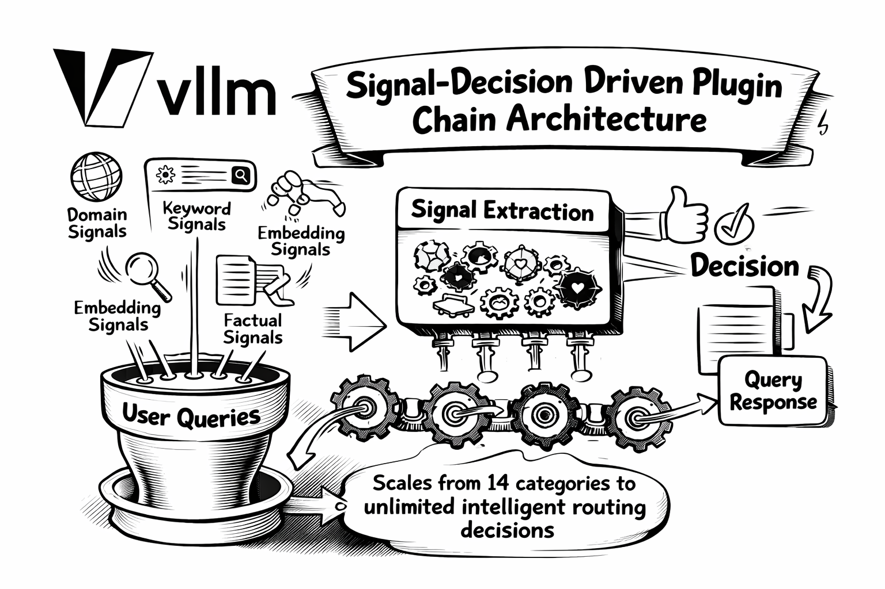
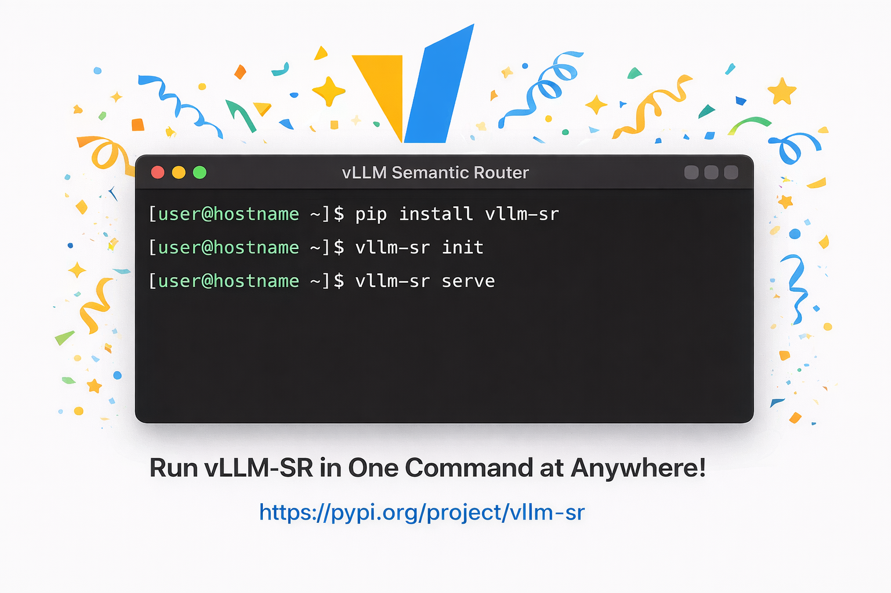
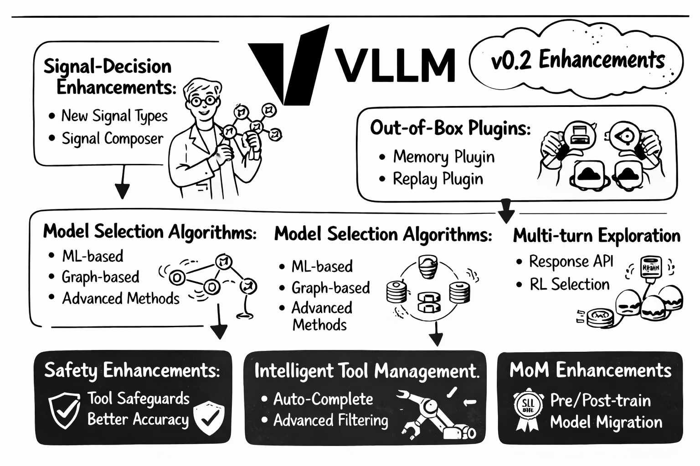

# vLLM Semantic Router v0.1 Iris：首个大版本发布

> 原素材源自 [vLLM 博客](https://blog.vllm.ai/2026/01/05/vllm-sr-iris.html)

[vLLM Semantic Router](https://github.com/vllm-project/semantic-router) 是面向 **混合模型 MoM** 的 **系统级智能** ，将 **群体智能** 引入 LLM 系统。vLLM Semantic Router 位于用户与模型之间，从请求、响应和上下文中捕获信号，做出智能路由决策——包括模型选择、安全过滤（越狱、PII）、语义缓存以及幻觉检测。更多信息请参见[首发公告](https://blog.vllm.ai/2025/09/11/semantic-router.html)。

我们非常激动地宣布 **vLLM Semantic Router v0.1** 正式发布，代号 **Iris** 。这是我们的首个大版本，标志着智能 LLM 路由的一个里程碑。自 2025 年 9 月创库以来，GitHub 社区发展迅猛：已合并 **600+ 个 PR** 、解决 **300+ 个 Issue** ，并汇聚了来自全球 **50 多位优秀开发者** 的贡献。步入 2026 年，我们很高兴交付一个从最初形态中脱胎而出、已可用于生产的语义路由平台。


## 为什么叫 Iris？

在希腊神话中，Iris（Ἶρις）是连接众神与凡人的神使，沿着彩虹之桥穿越广阔空间传递信息。这一意象完美诠释了 vLLM Semantic Router v0.1 的使命：
**在用户与多样化 AI 模型之间架起一座桥梁** ，在不同 LLM 提供商与架构之间实现智能路由请求。


## v0.1 Iris 有哪些新变化？

### 1. 架构重塑：信号-决策插件链架构

**过去:** 早期的 Semantic Router 采用单一维度的方法——将查询分类到 14 个 MMLU 领域类别之一，并以静态方式编排越狱、PII 与语义缓存能力。

**现在:** 我们引入了 **信号-决策驱动的插件链架构** ，对语义路由进行全面重构，将能力从 14 个固定类别扩展到 **无限的智能路由决策** 。



新架构会从用户查询中提取 **六类信号:**

- **领域信号:** 基于 MMLU 训练的分类，支持 LoRA 扩展
- **关键词信号:** 基于正则的快速、可解释匹配
- **向量信号:** 使用神经嵌入进行可扩展的语义相似度计算
- **事实信号:** 用于幻觉检测的事实校验分类
- **反馈信号:** 用户满意/不满意指示
- **偏好信号:** 基于用户自定义偏好的个性化

这些信号作为输入，进入一个 **灵活的决策引擎** ，通过 AND/OR 逻辑与优先级选择进行组合。此前静态的能力（如越狱检测、PII 保护、语义缓存）如今都成为可配置的 **插件** ，可按决策启用：

| 插件 | 作用 |
| --- | ---- |
| `semantic-cache` | 缓存相似查询以优化成本 |
| `jailbreak` | 检测提示注入攻击 |
| `pii` | 保护敏感信息 |
| `hallucination` | 实时幻觉检测 |
| `system_prompt` | 注入自定义指令 |
| `header_mutation` | 修改 HTTP 头以传递元数据 |

这种模块化设计带来 **无限可扩展性** ——无需更改架构即可新增信号、插件和模型选择算法。
更多内容请参见[信号-决策架构博客](https://blog.vllm.ai/2025/11/19/signal-decision.html)。

### 2. 性能优化：模块化 LoRA 架构

我们与 **Hugging Face Candle 团队** 合作，彻底重构了路由器的推理内核。旧实现需要分别加载并运行多个微调模型——计算成本随分类任务数量线性增长。


**突破点:** 采用 **低秩适配（LoRA）** 后，所有分类任务共享同一基础模型的计算：

| 方案 | 工作负载 | 可扩展性 |
| --- | ------- | ------ |
| 之前 | N 次完整模型前向 | O(n) |
| 现在 | 1 次基础模型前向 + N 个轻量 LoRA 适配器 | O(1) + O(n×ε) |

> **说明:** ε 表示 LoRA 适配器一次前向相对基础模型的成本，通常 ε ≪ 1，额外开销可忽略。

该架构显著降低了延迟，并支持对同一输入进行多任务分类。
完整技术细节见[模块化 LoRA 博客](https://blog.vllm.ai/2025/10/27/semantic-router-modular.html)。

### 3. 安全增强：HaluGate 幻觉检测

除请求阶段的安全能力（越狱、PII）外，v0.1 还引入 **HaluGate**——一个三阶段的 LLM 响应幻觉检测流水线：

**阶段 1：HaluGate Sentinel** —— 二分类判断查询是否需要事实校验（创意写作和代码通常无需校验）。

**阶段 2：HaluGate Detector** —— Token 级检测，精确定位响应中缺乏上下文支撑的 token。

**阶段 3：HaluGate Explainer** —— 基于 NLI 的分类，解释每个被标记片段的问题原因（矛盾 vs 中立）。


HaluGate 可与函数调用工作流无缝集成——工具结果作为校验的事实依据。检测结果通过 HTTP 头传播，便于下游系统制定自定义策略。详见
[HaluGate 博客](https://blog.vllm.ai/2025/12/14/halugate.html)。

### 4. 体验提升：一行命令安装

**本地开发:**

```bash
pip install vllm-sr
```



一个 pip 命令即可快速上手，包内已包含核心依赖。

> **配置:** 安装后运行 `vllm-sr init` 生成默认的 `config.yaml`，然后在 `providers` 中配置你的 LLM 后端：
>
> ```yaml
> providers:
>   models:
>     - name: "openai/gpt-oss-120b"       # 本地 vLLM 端点
>       endpoints:
>         - endpoint: "localhost:8000"
>           protocol: "http"
>       access_key: "your-vllm-api-key"
>     - name: "openai/gpt-4"              # 外部提供商
>       endpoints:
>         - endpoint: "api.openai.com"
>           protocol: "https"
>       access_key: "sk-xxxxxx"
>   default_model: "openai/gpt-oss-120b"
> ```
>
> 详见[配置文档](https://vllm-semantic-router.com/docs/installation/)。

**Kubernetes 部署:** 

```bash
helm install semantic-router oci://ghcr.io/vllm-project/charts/semantic-router
```

提供生产可用的 Helm Chart，内置合理默认值并支持丰富定制，轻松在 Kubernetes 中部署。

**仪表盘:** 提供完整的 Web 控制台，用于管理智能路由策略、模型配置，以及实时测试路由决策的交互式聊天环境。可视化路由流程、监控延迟分布，并微调分类阈值。

### 5. 生态集成

vLLM Semantic Router v0.1 与更广泛的 AI 基础设施生态无缝集成：

**推理框架:**

* [vLLM Production Stack](https://github.com/vllm-project/production-stack) —— 生产级 vLLM 参考栈（Helm、请求路由、KV Cache 卸载）
* [NVIDIA Dynamo](https://github.com/ai-dynamo/dynamo) —— 面向多 GPU、多节点的分布式推理框架
* [llm-d](https://github.com/llm-d/llm-d) —— Kubernetes 原生分布式推理栈，支持多种加速器
* [vLLM AIBrix](https://github.com/vllm-project/aibrix) —— 可扩展 LLM 服务的开源 GenAI 基础模块

**API 网关:**

* [Envoy AI Gateway](https://github.com/envoyproxy/ai-gateway) —— 基于 Envoy 的多提供商生成式 AI 统一入口
* [Istio](https://github.com/istio/istio) —— 企业级服务网格，提供流量管理、安全与可观测性

### 6. MoM 系列


我们自豪地推出 **MoM 系列**——一整套为语义路由量身打造的专用模型：

| 模型 | 作用 |
| --- | ---- |
| `mom-domain-classifier` | 基于 MMLU 的领域分类 |
| `mom-pii-classifier` | PII 检测与保护 |
| `mom-jailbreak-classifier` | 提示注入检测 |
| `mom-halugate-sentinel` | 事实校验分类 |
| `mom-halugate-detector` | Token 级幻觉检测 |
| `mom-halugate-explainer` | 基于 NLI 的解释 |
| `mom-toolcall-sentinel` | 工具选择分类 |
| `mom-toolcall-verifier` | 工具调用校验 |
| `mom-feedback-detector` | 用户反馈分析 |
| `mom-embedding-x` | 语义向量提取 |

所有 MoM 模型均针对 vLLM Semantic Router 专门训练与优化，确保在各类路由场景中表现一致。

### 7. Responses API 支持

现已支持 **OpenAI Responses API**（`/v1/responses`），并提供内存级会话状态管理：

* **有状态对话:** 通过 `previous_response_id` 串联
* **多轮上下文:** 自动保留对话上下文
* **路由连续性:** 在对话过程中保留意图分类历史

为现代 Agent 框架和多轮应用提供智能路由能力。

### 8. 工具选择

为 Agent 化工作流提供智能工具管理：

* **语义工具过滤:** 自动过滤无关工具
* **上下文感知选择:** 结合对话历史与任务需求
* **降低 Token 消耗:** 更小的工具集意味着更快推理与更低成本

## 展望未来：v0.2 路线图

v0.1 Iris 奠定了坚实基础，我们已在规划 v0.2 的重要增强：



### 信号-决策架构增强

* **更多信号类型:** 提取更多高价值信号
* **更高准确性:** 提升现有信号计算精度
* **信号组合器:** 用于复杂信号提取与性能提升

### 模型选择算法


基于信号-决策基础，研究更智能的模型选择算法：

* **机器学习方法:** KNN、KMeans、MLP、SVM、矩阵分解
* **高级方法:** Elo 评分、RouterDC、AutoMix、混合方案
* **图结构选择:** 利用模型关系图
* **规模感知路由:** 根据模型规模与任务复杂度优化

### 即开即用插件

* **Memory Plugin:** 持久化对话记忆管理
* **Router Replay:** 调试并回放路由决策与反馈

### 多轮算法探索

* **Responses API 增强:** 支持 Redis、Milvus、Memcached 等可扩展后端
* **上下文工程:** 上下文压缩与记忆管理
* **RL 驱动选择:** 基于强化学习的偏好驱动模型选择

### MoM 增强

* **预训练基础模型:** 更长上下文用于信号提取
* **后训练 SLM:** 人类偏好信号提取
* **模型迁移:** 以自研模型替换现有模型

### 安全增强

* **工具调用越狱检测:** 防御恶意工具调用
* **多轮防护:** 跨会话安全
* **更高精度幻觉检测**

### 智能工具管理

* **工具补全:** 基于意图自动补全工具定义与调用
* **高级工具过滤:** 更精细的相关性筛选

### 体验与运维

* **仪表盘增强:** 更强的可视化与管理能力
* **Helm Chart 改进:** 更多配置选项与部署模式

### 评测

* 与 RouterArena 团队合作，构建全面的路由器评测框架

## 开始使用

准备好体验 vLLM Semantic Router v0.1 Iris 了吗？

```bash
pip install vllm-sr
```

## 加入社区

我们相信，智能路由的未来需要共建。无论你是希望将智能路由集成到 AI 基础设施中的 **企业** ，探索语义理解前沿的 **研究者** ，还是热爱开源 AI 的 **个人开发者** ，都欢迎你的参与。

**参与方式:**

* **组织:** 合作集成、赞助开发或投入工程资源
* **研究者:** 论文合作、提出新算法或参与性能评测
* **开发者:** 提交 PR、反馈问题、完善文档或开发插件
* **社区:** 分享用例、撰写教程、翻译文档或答疑解惑

从修复拼写错误到设计新特性，每一份贡献都很重要。与我们一起塑造下一代语义路由基础设施。

* **文档:** [https://vllm-semantic-router.com](https://vllm-semantic-router.com)
* **GitHub:** [https://github.com/vllm-project/semantic-router](https://github.com/vllm-project/semantic-router)
* **模型:** [https://huggingface.co/llm-semantic-router](https://huggingface.co/llm-semantic-router)
* **社区:** vLLM Slack（[https://vllm-dev.slack.com/archives/C09CTGF8KCN）](https://vllm-dev.slack.com/archives/C09CTGF8KCN）)

DaoCloud 已有[多位核心开发者](https://github.com/vllm-project/semantic-router/graphs/contributors)以 Approver 和 Maintainer 的身份，深度参与 vLLM Semantic Router 项目的核心代码实现、架构演进以及文档体系的持续建设与维护，为社区的稳定性和长期发展贡献力量。

*彩虹之桥已经开启，欢迎来到 Iris。* 🌈
