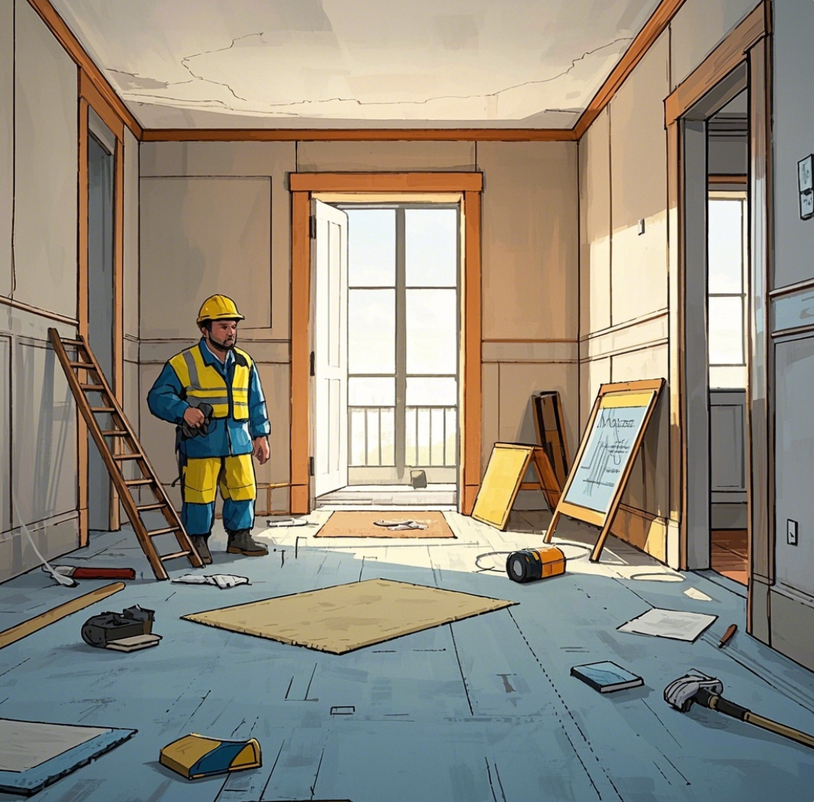
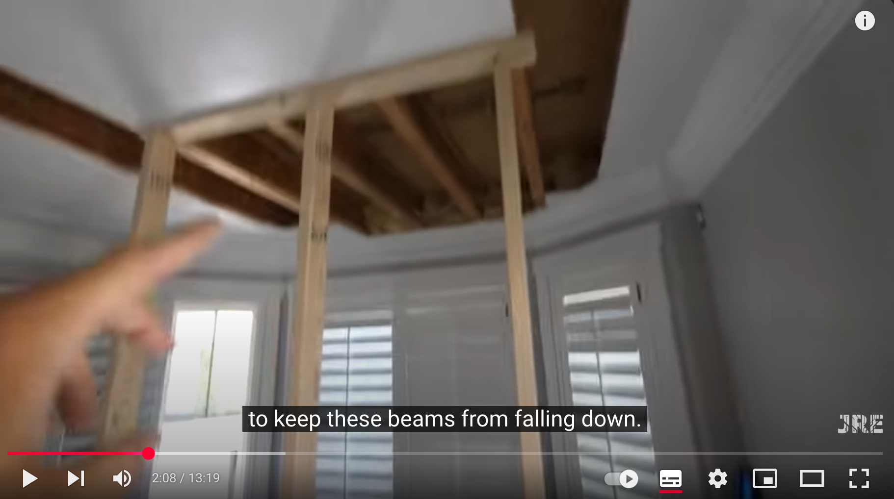
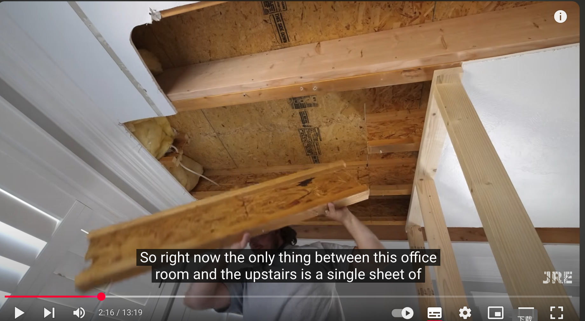
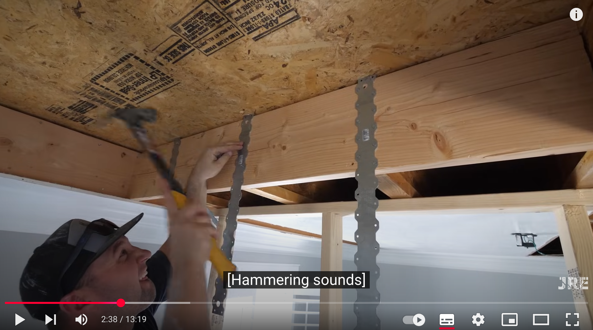
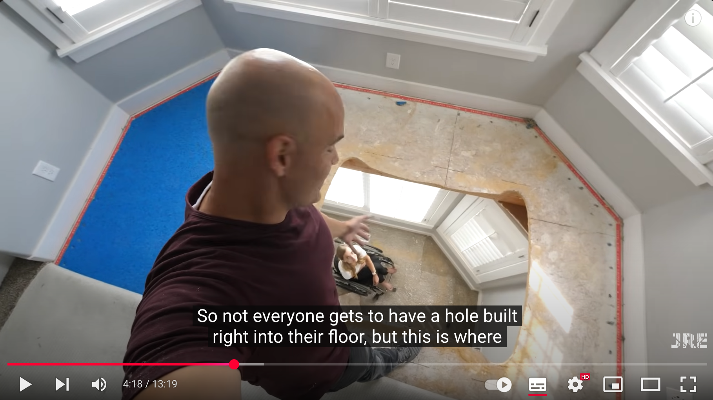

---
hide:
  - navigation
---

# 木质楼板安装电梯前的准备工作

本页说明在木质楼板上打洞，为电梯安装做好前期准备工作。

视频来源：[YouTube: How to Install an Elevator in Your Living Room](https://www.youtube.com/watch?v=aqMZfQODJZo)

其中一些 AI 示意图由[豆包](https://www.doubao.com/)生成。

## 清理施工区域

- 移除地毯、地板饰面、家具等一切杂物，露出原始木质楼板。
- 确保地面平整，避免工具打滑或被绊倒。

## 确定洞口位置和尺寸

- 根据电梯厂家提供的施工图纸和现场情况，测量、标记洞口位置。
- 使用厂家提供的洞口模板（cutout template）或根据图纸精确弹线，确保尺寸准确。

## 检查并安装临时支撑

- 查看楼板下方是否有水管、电线、暖气管或其他设施，提前规划避让或改造。
- 在预期的洞口下方用木方、钢管或脚手架搭建支撑。
- 将支撑杆牢牢顶在楼板下，确保均匀受力，形成强有力的“支撑框架”，防止切割时板材下沉、变形或坍塌。

## 切割木质楼板

- 使用电锯等，沿着画好的线缓慢切割。
- 分段操作，避免一次性切断，防止掉板发生危险。
- 切割完后，先用工具小心撬松，再人工缓慢搬离板材，避免板材掉落砸伤或损坏下方结构。

## 洞口边缘加固

!!! danger

    大梁被切断后，严禁直接撤掉支撑杆。
    必须先增加横向木梁和槽钢加固，再经测试加固的强度合理之后，才能撤掉临时支撑。

- 用厚木方或槽钢沿洞口四周固定，增强边缘承重力。
- 固定螺丝用膨胀螺丝或专用配件，确保牢固不松动。

## 清理现场

- 打扫木屑、碎屑，清理现场垃圾。
- 最后复查洞口尺寸、平整度、加固情况、以及周边安全，确保一切妥当，等待电梯安装进场。

