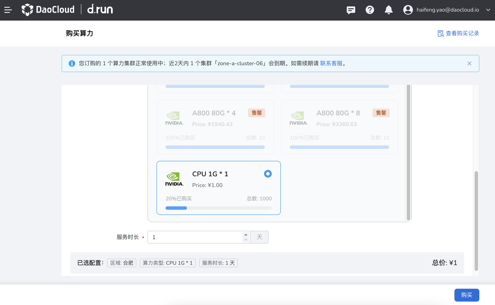

---
hide:
  - toc
---

# 购买算力

用户使用 d.run 各项服务之前，需要先购买可用的算力，助力企业将算力变为算利。
用户也可以很方便的查看购买记录细目，做好成本预算。

!!! tip

    A100 80G * 1 指的是 1 张 A100 显卡，显存共 80 GB。

    勾选最后一个选项 **CPU 1G * 1** ，可以用一元体验完整功能。

    

[注册并体验 d.run](https://console.d.run/){ .md-button .md-button--primary }
