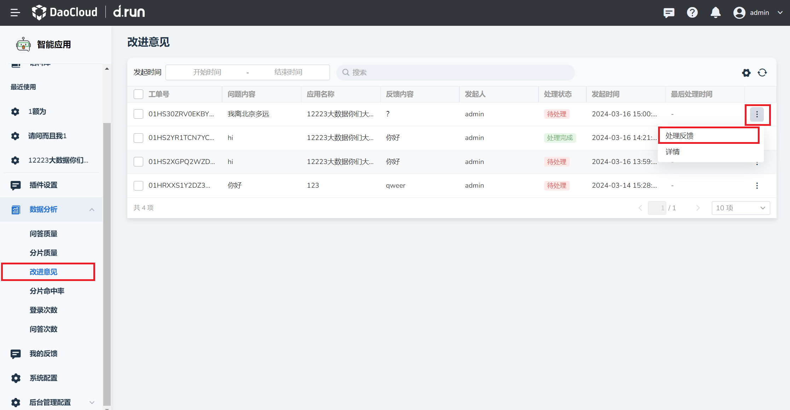
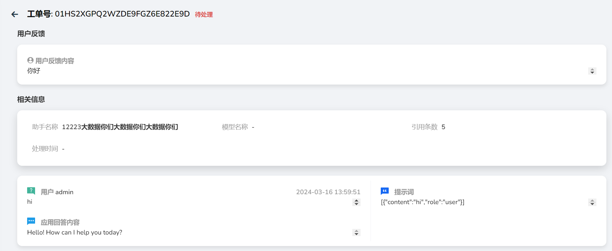
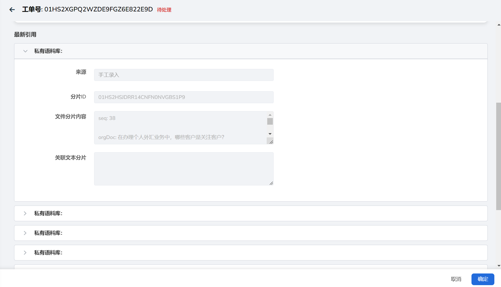
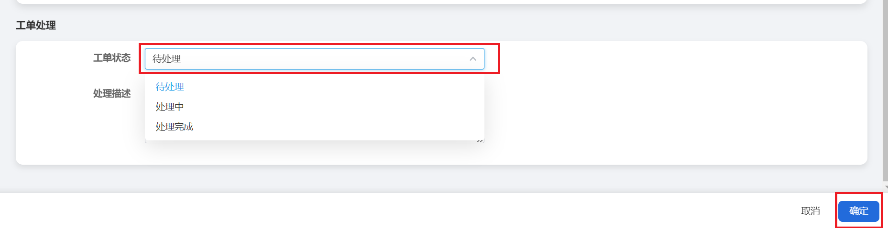
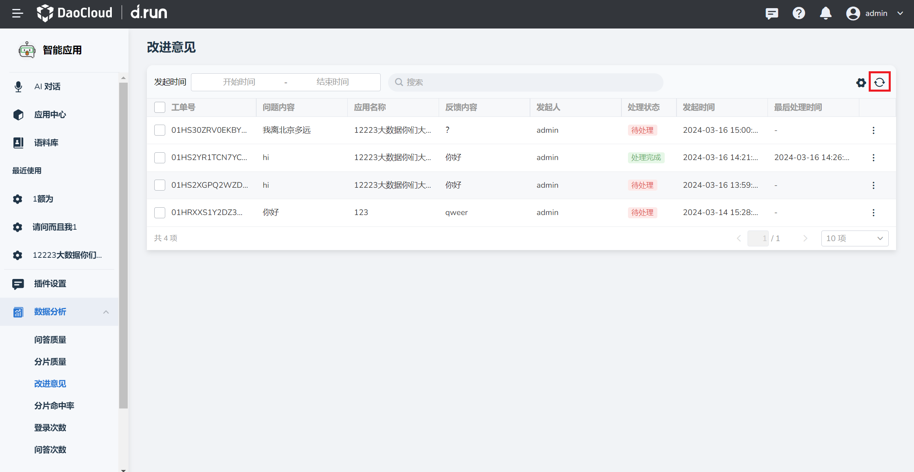

# 改进意见

可以查看用户在使用应用后对回答的反馈，并对反馈进行处理。

## 处理反馈

1. 在**数据分析**栏中点击**改进意见**，找到需要处理的反馈，点击右侧的**更多**按钮。

2. 点击**处理反馈**进入

    

3. 可查看以下内容；

    - 用户对问答的反馈内容。
    - 问答的相关信息：助手名称、模型名称、引用条数、处理时间以及问答详情。

        

    - 最新引用：可查看回答所有引用的分片详情。

        

    - 工单处理的详情。

4. 点击工单状态后的**待处理**，可将状态调整为**处理中**或**处理完成**，并填写下方的**处理描述**。

5. 点击右下角**确认**即可修改反馈处理状态。

    

6. 当有新的改进意见产生，可点击右上角**刷新**按钮查看最新生成的改进意见。

    

## 导出反馈

将所有问答的详细内容以及问答反馈汇总成表格导出。

1. 点击**问答反馈左方**，选取需要导出的反馈，点击右上角**导出**按键。

2. 自动将问答内容详情汇总成xlsx文件并下载。

    
