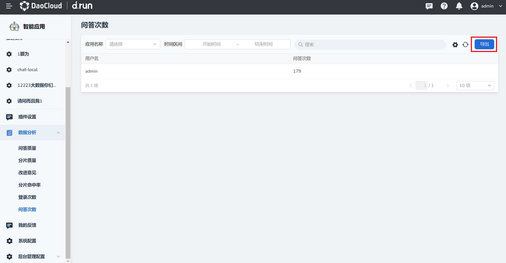

---
hide:
  - toc
---

# 问答次数

d.run 支持记录在该工作空间创建的应用问答的次数。

当有用户进行了问答，记录会保存在创建该应用的工作空间下，点击右上角 **刷新** 按钮查看最新问答次数数据。

您可以将该工作空间内所有用户的问答次数汇总成表格导出。

1. 在 **问答次数** 页点击右上角 **导出** 按键。

    

2. 将该工作空间下所有用户的问答次数汇总成xlsx文件并下载。
