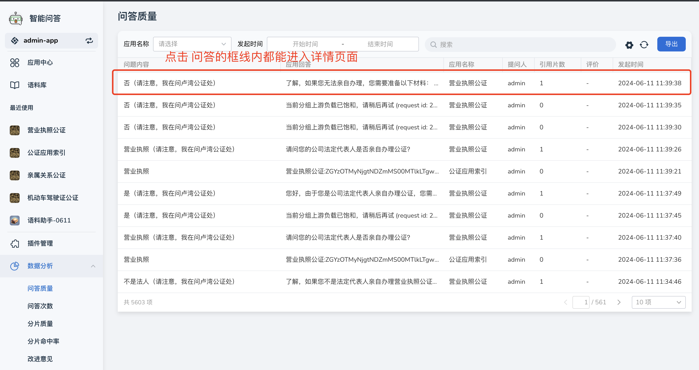
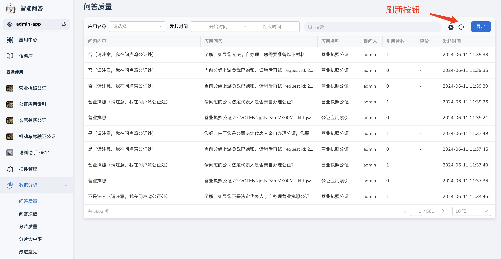
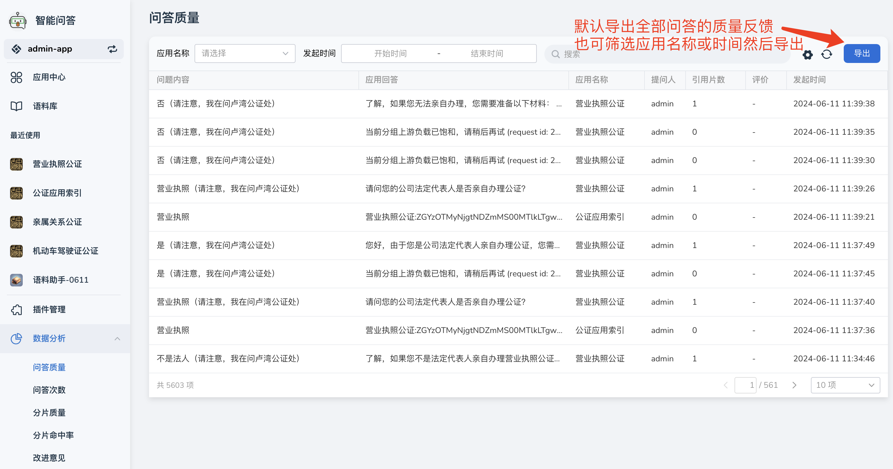
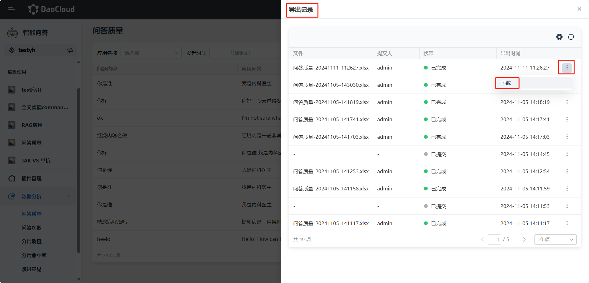

# 问答质量

d.run 支持统计用户对问答质量的反馈，并以报表的方式展示，同样也支持将数据导出至xlsx中。

## 查看问答质量详情

1. 在 **数据分析** 栏中点击 **问答质量** ，找到需要查看的问答，点击该问答记录可进入详情页面。

    

2. 可以查看以下内容：

    - 用户提问内容，包括提问用户名称。
    - 应用回答：应用针对用户问题产生的答案。
    - 该问题使用的提示词。

    

3. 当有新的问答生成，可点击右上角 **刷新** 按钮查看最新问答详情。

    

## 导出问答质量

您可以将该工作空间内所有用户对问答质量的反馈汇总成表格导出。

1. 在 **问答质量** 页面点击右上角 **导出** 按键。

    

2. 点击 **导出记录**，查看导出的问答质量记录，选择需要下载的记录，导出为excel文件。

    