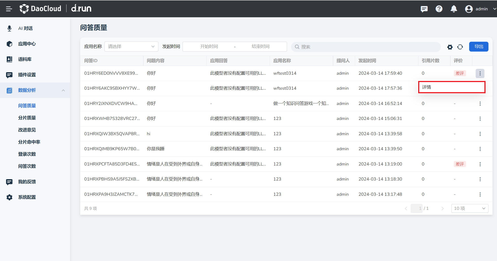
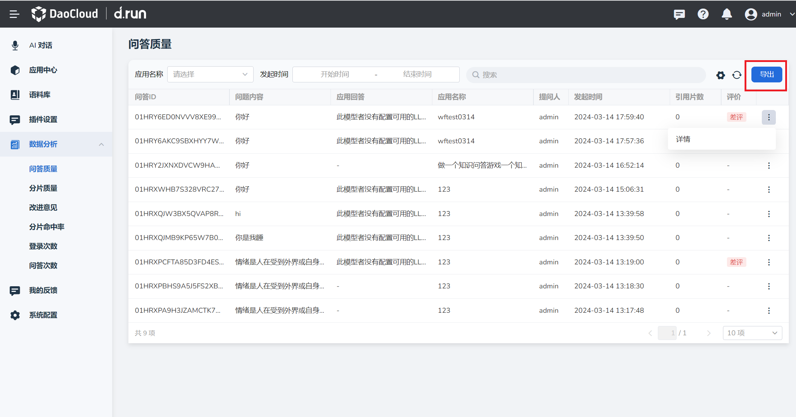

# 问答质量

d.run 支持查看和导出问答质量数据。

## 查看问答质量详情

1. 在 **数据分析** 栏中点击 **问答质量** ，找到需要查看的问答，点击右侧的 **⋮** 按钮。

2. 在弹出菜单中选择 **详情** 。

    

3. 可以查看以下内容：

    - 用户提问内容，包括提问用户名称。
    - 应用回答：应用针对用户问题产生的答案。
    - 该条问题使用的提示词。

    

4. 当有新的问答生成，可点击右上角 **刷新** 按钮查看最新问答详情。

    

## 导出问答质量

将所有问答的详细内容以及问答质量汇总成表格导出。

1. 在 **问答质量** 页点击右上角 **导出** 按键。

    

2. 自动将问答内容详情汇总为 xlsx 文件并下载。
