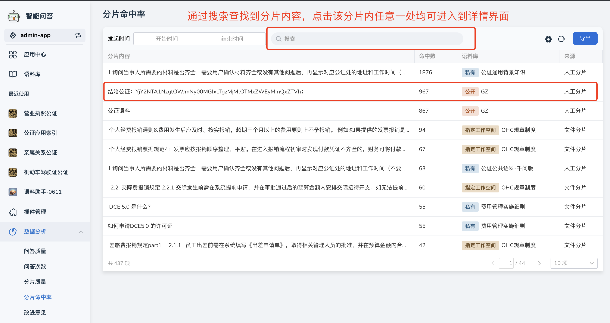
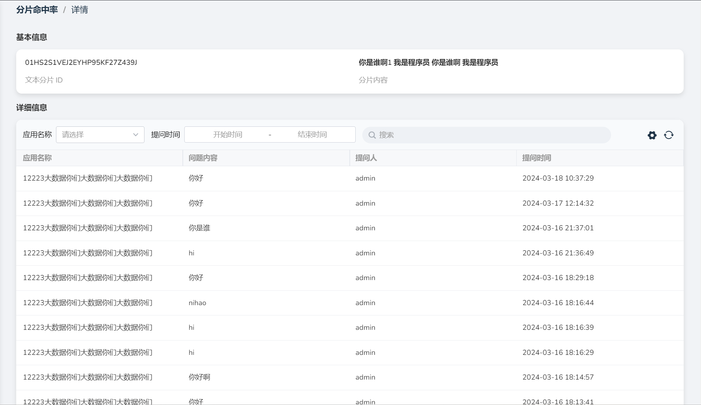
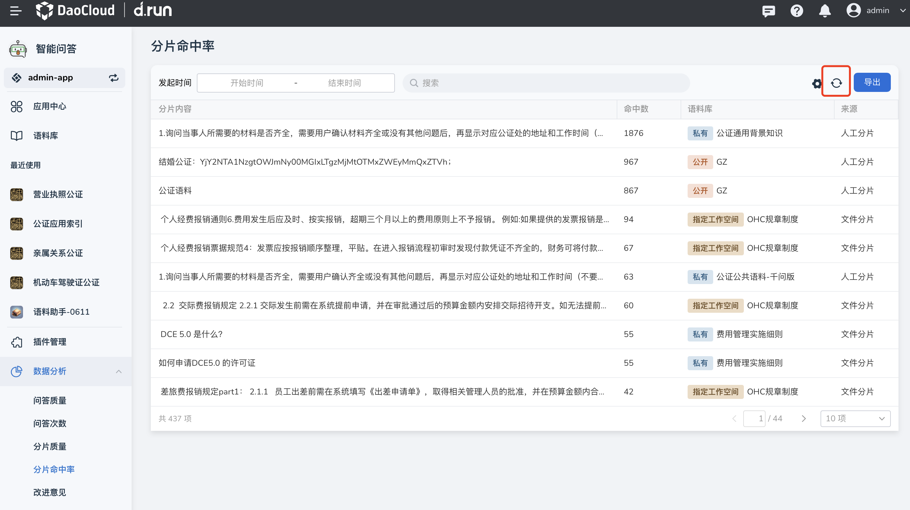
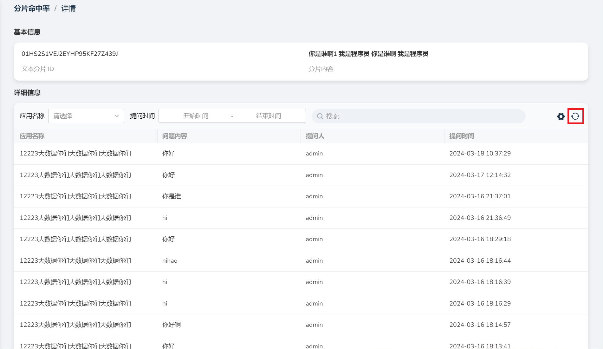
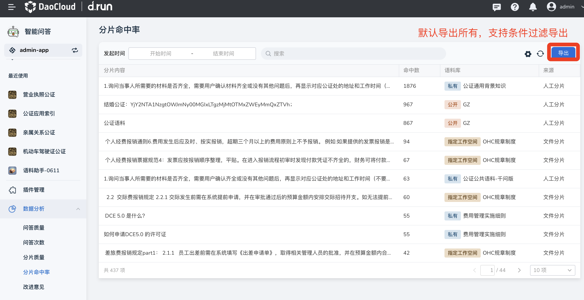

---
hide:
  - toc
---

# 分片命中率

d.run 统计了用户对于分片数据的使用情况，将分片按命中次数排序，支持查看分片内容并将分片的使用情况导出到xlsx中。

## 查看分片命中率详情

1. 在 **数据分析** 栏中点击 **分片命中率** ，通过 **搜索** 找到您关注的分片，点击该分片可进入详情页面，可查看该分片被引用的详细情况。

    

2. 可以查看以下内容：

    - 分片的基本信息：包括文本分片ID以及具体的分片内容。
    - 详细信息：该分片被问题命中的问题内容、应用名称、提问人以及提问时间。

    

3. 当有新的问答生成，可点击右上角 **刷新** 按钮查看最新分片命中率结果。

    

    分片命中率详情中也可 **刷新** 查看最新结果。

    

## 导出分片命中率

1. 在 **分片命中率** 页点击右上角 **导出** 按键。

    

2. 导出在该工作该空间创建的分片，将对这些对分片使用情况的反馈汇总成xlsx文件并下载。
