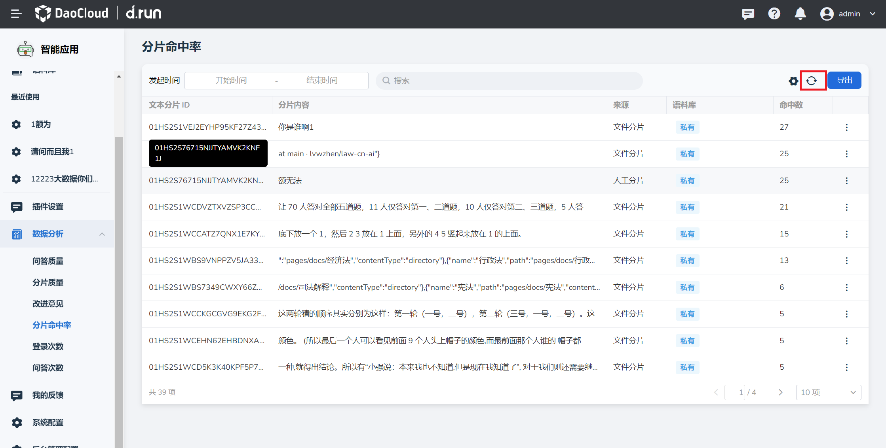
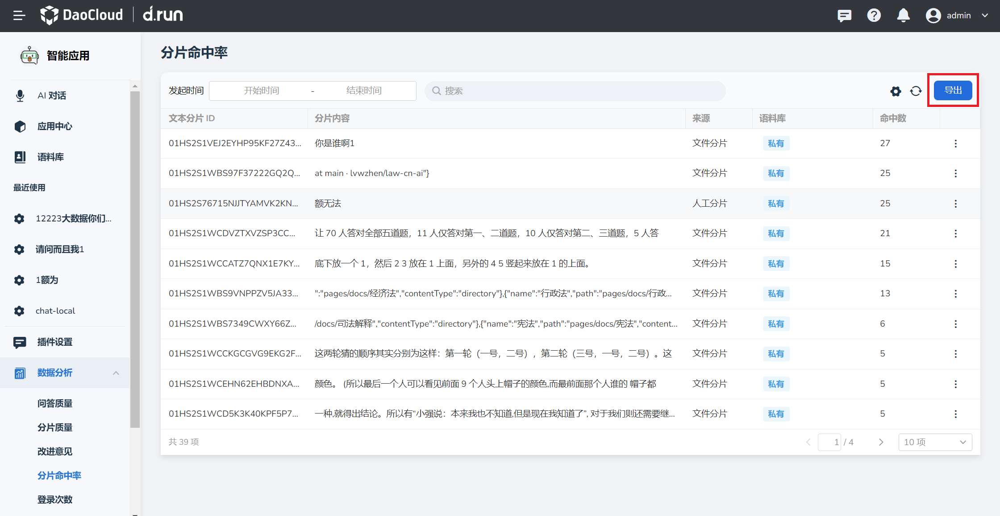

# 分片命中率

## 查看分片命中率详情

1. 在**数据分析**栏中点击**分片命中率**，找到需要查看的分片文件，点击右侧的**更多**按钮。

2. 点击**详情**按钮进入。

    

3. 可以查看以下内容：
    - 分片的基本信息：包括文本分片ID以及具体的分片内容。
    - 详细信息：该分片被问题命中的问题内容、应用名称、提问人以及提问时间。

    

4. 当有新的问答生成，可点击右上角**刷新**按钮查看最新分片命中率结果。

    

    分片命中率详情中也可**刷新**查看最新结果。

    

## 导出分片命中率

1. 在**分片命中率**页点击右上角**导出**按键。

    

2. 自动将分片命中率详情汇总成xlsx文件并下载。
