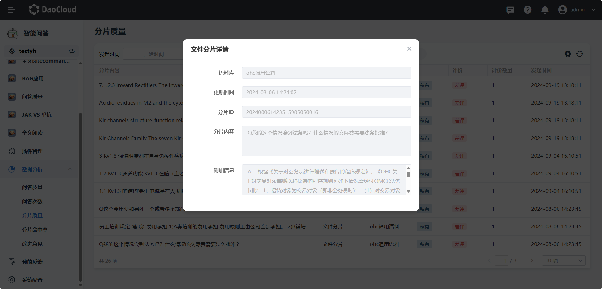
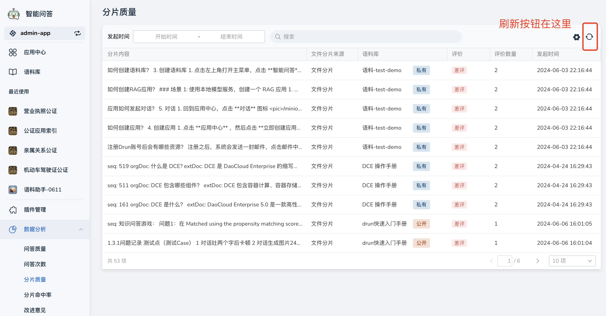

---
hide:
  - toc
---

# 分片质量

分片是指将较大的数据切分为多个片段，便于训练模型查找和命中
d.run 支持查看分片的质量。具体步骤如下：

1. 在 **数据分析** 栏中点击 **分片质量** ，通过 **搜索** 找到您关注的分片,点击该分片可进入详情页面，可查看该分片的详细内容

    

2. 可以查看以下内容：

    - 语料库：分片属于哪个语料库
    - 更新时间：该分片文件的更新时间
    - 分片 ID：分片的唯一识别码
    - 文件切片内容：切片后该分片的具体内容
    - 关联分片文本：与该分片有关的分片附加内容

    

3. 当有新的分片文件被评价，可点击右上角 **刷新** 按钮查看最新分片文件

    
