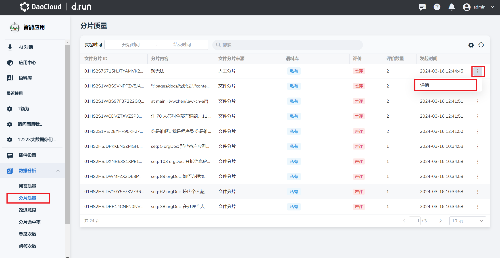

---
hide:
  - toc
---

# 分片质量

分片是指将较大的数据切分为多个片段，便于训练模型查找和命中。
d.run 支持查看分片的质量。具体步骤如下：

1. 在 **数据分析** 栏中点击 **分片质量** ，找到需要查看的分片文件，点击右侧的 **⋮** 按钮。

2. 在弹出菜单中选择 **详情** 。

    

3. 可以查看以下内容：

    - 语料库：这一分片文件属于哪个语料库
    - 更新时间：该分片文件的更新时间
    - 分片 ID
    - 文件切片内容：切片后该分片的具体内容
    - 关联分片文本：与该分片有关的分片文本内容

    

4. 当有新的分片文件被评价，可点击右上角 **刷新** 按钮查看最新分片文件。

    
