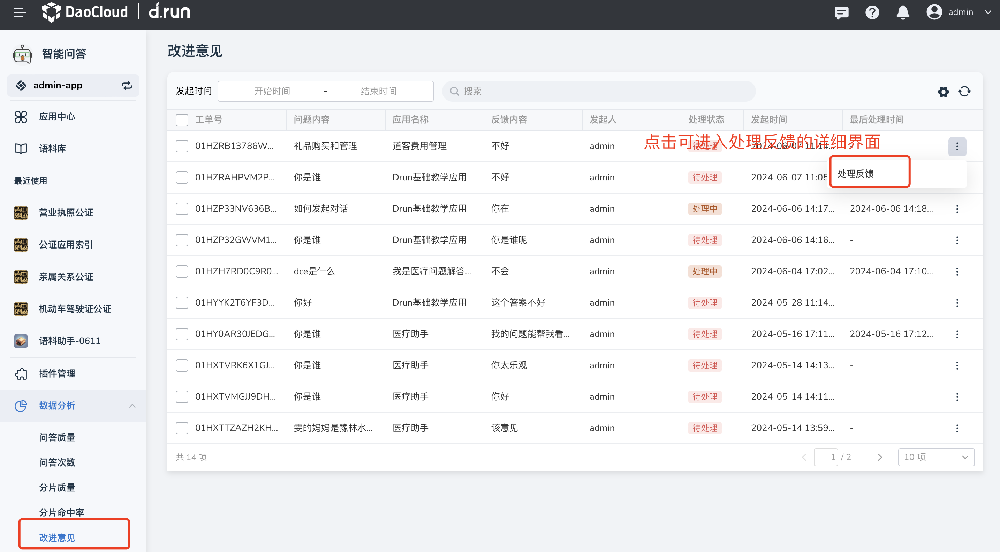
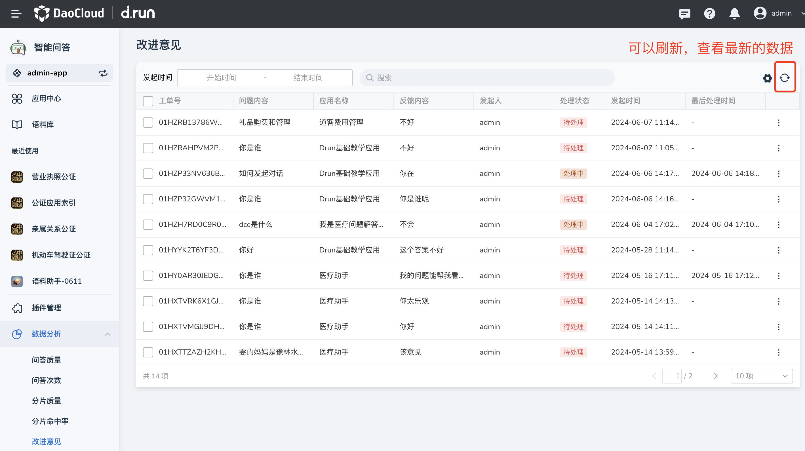
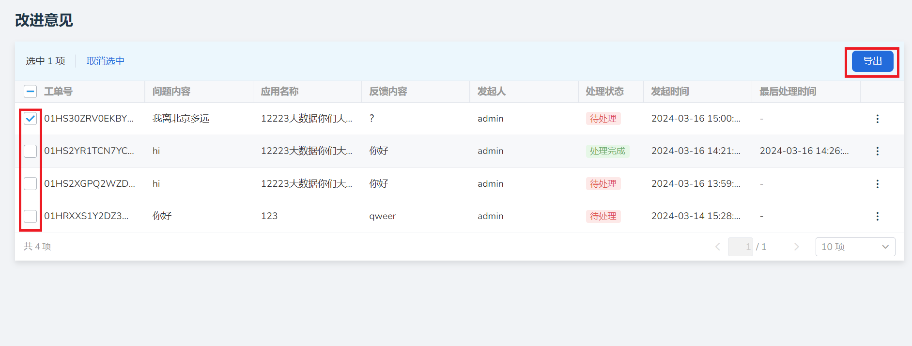

# 改进意见

d.run 提供了用户提交反馈的入口，管理员可在此处看到在这个工作空间的应用在对话上有哪些问题需要改进。

## 处理反馈

1. 在 **数据分析** 栏中点击 **改进意见** ，找到需要处理的反馈，点击右侧的 **┇** 按钮。

2. 在弹出菜单中选择 **处理反馈**（在范围内点击工单信息可进入详情界面）。

    

3. 可查看以下内容；

    - 用户对问答的反馈内容。
    - 问答的相关信息：助手名称、模型名称、引用条数、处理时间以及问答详情。

        

    - 最新引用：可查看回答所有引用的分片详情。

        

    - 工单处理的详情。

4. 点击工单状态后的 **待处理** ，可将状态调整为 **处理中** 或 **处理完成** ，并填写下方的 **处理描述** 。

5. 点击右下角 **确定** 即可修改反馈处理状态。

    

6. 当有新的改进意见提交，可点击右上角 **刷新** 按钮查看最新的改进意见。

    

## 导出反馈

将所有问答的详细内容以及问答反馈汇总成表格导出。

1. 点击 **问答反馈左方** ，选取需要导出的反馈，点击右上角 **导出** 按键。

2. 将问答内容汇总为 xlsx 文件并下载。

    
