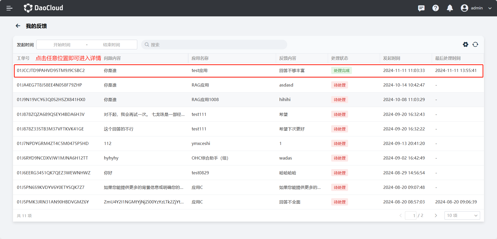

---
hide:
  - toc
---

# 我的反馈

d.run 记录了当前用户发出的反馈信息，以方便查看后续该反馈得到的回馈。

“我的反馈”功能用于集中记录并管理当前用户提交的所有反馈信息，方便您在后续跟进查看每条反馈的处理进度与最终结果。  
无论是对问答内容的准确性、模型的表现，还是系统功能的建议与问题，您都可以通过该功能提交反馈，并随时回溯历史记录。  
这不仅有助于平台及时优化 AI 模型与知识库内容，还能保障您的意见被有效采纳和回应，从而持续提升整体使用体验。

## 查看反馈详情

1. 点击 **我的反馈** ，可通过搜索找到需要查看的反馈，点击范围内任意位置均可进入详情。

    

2. 可以查看以下内容：

    - 用户反馈：用户本人发出的反馈内容。
    - 相关信息：助手名称、模型名称、引用条数、处理时间以及问答详情。
    - 处理意见：管理员处理反馈后发出的意见。

    

    - 历史引用。
    - 最新引用。

    
