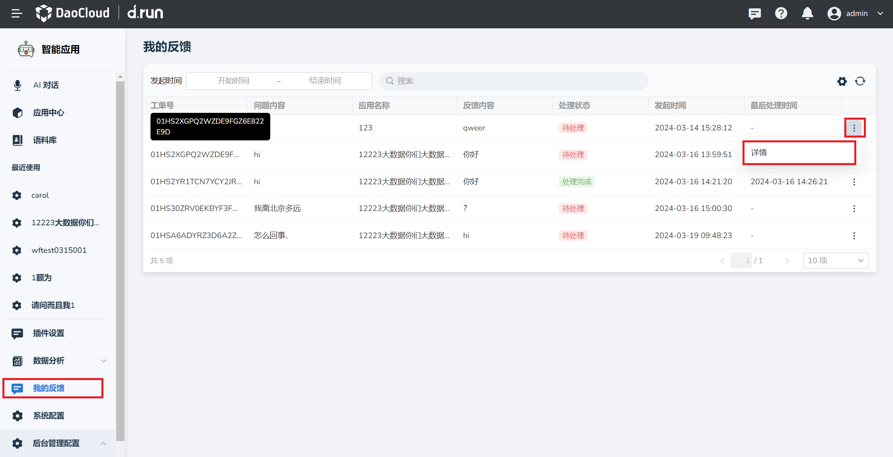
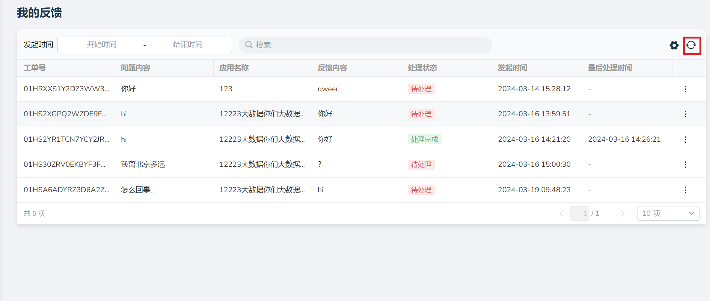

---
hide:
  - toc
---

# 我的反馈

d.run 智能问答支持查看用户本人发出的反馈详情。

## 查看我的反馈详情

1. 点击 **我的反馈** ，找到需要查看的反馈，点击右侧的 **更多** 按钮。

2. 点击 **详情** 按钮进入。

    

3. 可以查看以下内容：

    - 用户反馈：用户本人发出的反馈内容。
    - 相关信息：助手名称、模型名称、引用条数、处理时间以及问答详情。
    - 处理意见：管理员处理反馈后发出的意见。

        

    - 历史引用
    - 最新引用

        

4. 当有用户本人提出新的反馈，可点击右上角 **刷新** 按钮查看最新生成的反馈。

    
