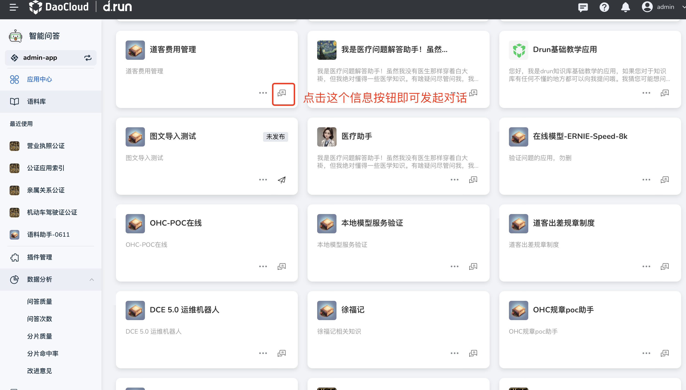
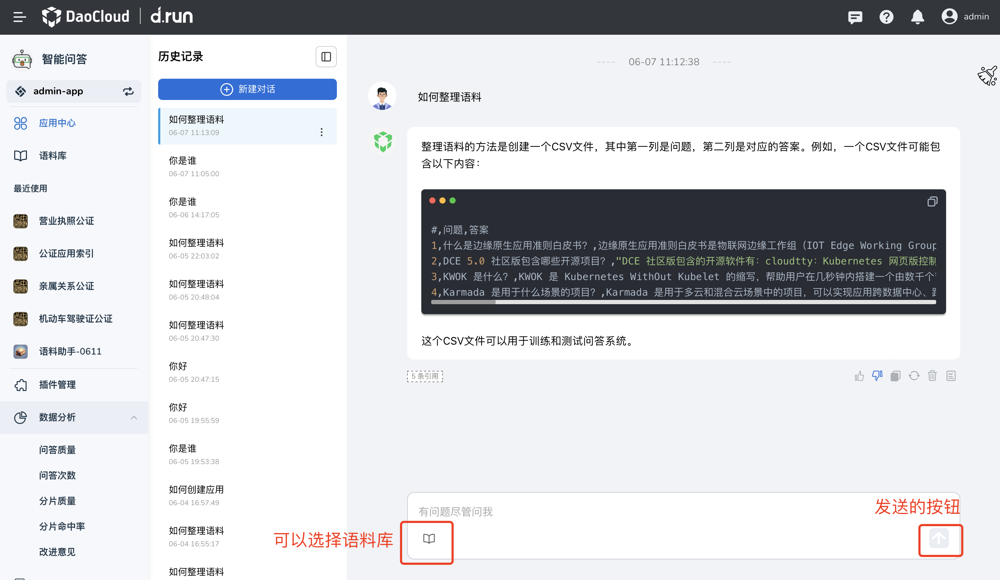
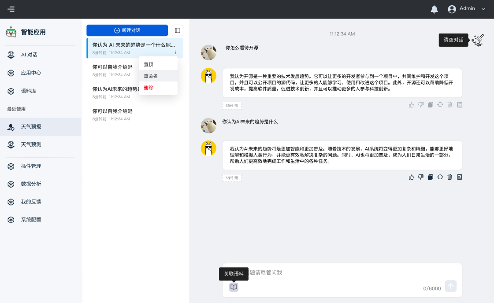
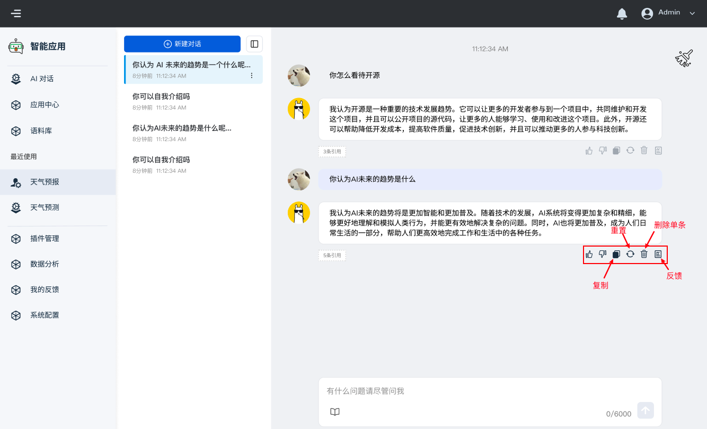

# 应用对话说明

**对话** 是 ChatGPT 出现后最常见的获取资讯方式
在 d.run 中，一个应用被发布之后，即可使用对话功能
您可以在对话中关联语料库后自由提问，可以随时查阅历史记录，另外导航栏还列出了最近使用的对话

## 日常对话

1. 在左侧导航栏，点击 **应用中心** ，在已发布应用的右下角，点击对话图标

    

2. 在对话框中输入问题，点击 **发送** ，或敲击回车键，进行对话

    

## 对话管理

- **置顶** 、 **重命名** 和 **删除** ：在历史记录窗格中，点击某一条对话右侧的 **⋮** ，可以置顶、重命名和删除对话
- **清空** ：在对话页面左上角，点击 🧹 图标，可以 **清空** 对话
- **关联语料库** ：在输入框左下角，点击 📖 图标，可以关联语料库

    语料库的选择： **聊天应用** 会在选中的语料库中去匹配最相似的语料作为参考，回答您的问题
    显示操作成功表示已经选中语料库。也可以取消选中某个或某些语料库

    !!! info

        如果无法选择和更改关联的语料库，只能添加语料库。应用的向量化模型和语料库的向量化模型一致才可以使用

- **停止对话** ：提问后，点击输入框右侧的图标，可以在回答过程中停止对话，让助手停止输出内容

## 几个实用图标

- **评价** ：可以点赞 👍 或点踩 👎 某条回答，取决于您对回答内容是否满意
- **复制** ：可以复制某条回答
- **重置** ：可以重置、重新生成某一条回答

    !!! info "随机度"

        对于重置的内容，可以通过管理员调节模型的 **随机度** 来控制聊天助手多次回答的一致性

        若随机度高，聊天助手多次回答的结果，可能会有不一样的答案
        如果要求回答的准确度高，可以降低随机度，这样聊天助手每次生成的结果会接近一致

- **删除** ：点击垃圾桶 :material-delete: 图标，可以删除某条回答，此后在聊天助手上下文对话时，将不会对删除的对话有记忆
- **改进意见** ：点击某条回答的最后一个图标 :bookmark_tabs:，可以提交反馈，根据聊天助手的回答结果好坏，在反馈中提出反馈意见
