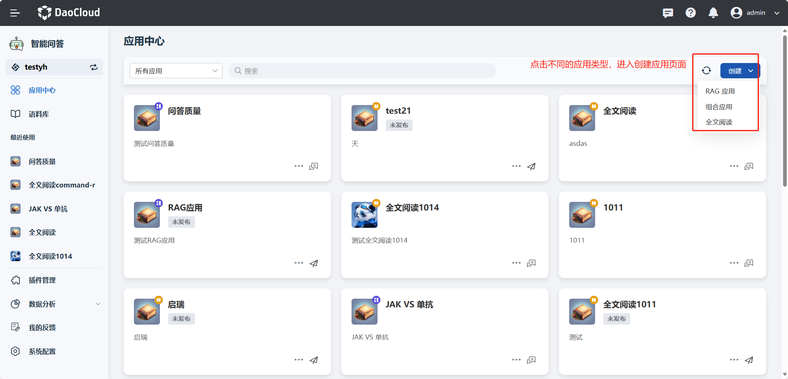
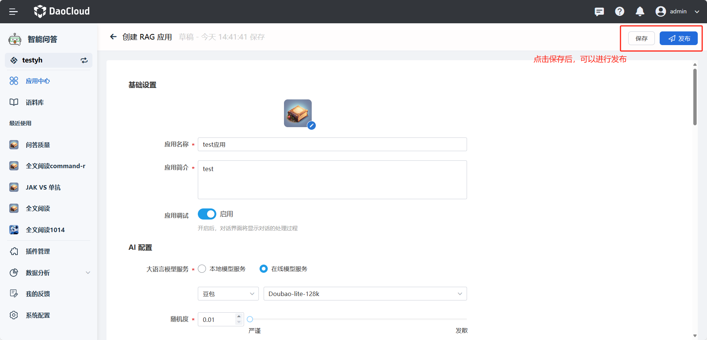

---
hide:
  - toc
---

# 创建应用

本页介绍如何在应用中心创建一个应用。

<div class="video-container">
<iframe width="560" height="315" src="https://harbor-test2.cn-sh2.ufileos.com/drun/deploy-qa.mp4" title="部署应用教学" allow="accelerometer; autoplay; clipboard-write; encrypted-media; gyroscope; picture-in-picture; web-share" allowfullscreen></iframe>
</div>

### 创建 RAG 应用，具体步骤如下

1. 在 **应用中心** 页面中，点击 **创建** 按钮，选择创建 RAG 应用

    

2. 填写应用基础信息

    - **上传应用图标** ：选择 jpg、jpeg 或 png 格式的图片，确保文件大小不超过 10MB。
    - **输入应用名称** ：限制在 20 个字符以内。
    - **填写应用简介** ：简介应用，不超过 100 个字符。
    - **应用调试** ：选择开启，开启后，对话界面将显示对话的处理过程。

3. 配置 AI

    - **选择大语言模型服务** ：决定是使用本地模型服务还是在线模型服务（例如 Azure Open AI 或文心一言）。
    - **设置随机度** ：调整模型回答的创造性/发散性程度。
    - **重复惩罚** ：减少生成的文本中重复的内容，默认值为1，值越大，越不会生成重复的内容。
    - **向量化模型** ：应用选择的向量化模型及向量化模型服务。
    - **系统提示词** ：指定模型所扮演的角色，它的能力，以及你希望它在跟你对话或者帮助你生成内容时的一些规则。
    - **命中语料库时的模版** ：为模型提供检索和回答问题的模板。
    - **未命中语料库时的模版** ：提供模型在检索不到相似语料时的通用提示词。
    !!! note

        - 命中语料库时的模版：当检索到相似语料的时候，会使用语料库提示词模板。模板内容包含通过相似度搜索得到的 **知识块
        {corpus_search_content}**、**用户的输入 {corpus_search_content}** 。这些变量将被替换成对应的文本，发送给大模型，进行问答。

            ```template
            做一个知识问答游戏：
            1. 回答内容必须在"{corpus_search_content}"中。
            2. 如果问题在所提供的资料信息内无法找到，您会回答:"抱歉,资料库已知的信息中，没有找到您需要的结果,请尝试修改引用的资料库或使用模型自有能力回答。"
            {user_inputs_content}
            ```

        - 未命中语料库时的模版：当检索不到相似语料的时候，会使用嵌入提示词模板。嵌入的提示词拼接在用户的问题之前，作为通用的约定提示来引导应用模型进行回答输出。

4. 关联语料库

    - **选择向量化模型** ：确定用于问题向量化的模型。
    - **选择语料库** ：从已有的语料库中选择一个或多个用于模型检索。

5. 设置检索策略
    - **检索预处理** ：支持自定义插件进行问答预处理。
    - **检索知识块数** ：决定提供给模型的知识块数量。
    - **相似度** ：设置知识块匹配的严格程度。
    - **重排序** ：启用或禁用重排序模型以改进结果排序。
    - **仅语料回答** ：开启后，模型只会按照匹配到的语料内容回答。
    - **图文模式** ：控制是否以及如何输出图文内容。
    - **图文分片最大数** ：确定在一个对话中最多输出多少图片。
    - **图文相似度** ：设置图片匹配的严格程度。

6. 设置记忆策略

    - **最近聊天记忆轮数** ：设置对话历史的轮数或回合数。

7. 保存并发布应用

    - 点击 **保存** 按钮，应用设置完成，应用会保存成草稿状态。
      
    !!! note

        请确保按照上述步骤仔细填写和配置应用的各个方面，以确保应用能够准确和高效地响应用户的需求。

    - 点击 **发布** 按钮，应用将会被发布到应用中心，用户可以在应用中心中找到并使用您的应用。

    

### 创建全文阅读应用，具体步骤如下

1. 在 **应用中心** 页面中，点击 **创建** 按钮，选择选择创建全文阅读应用

    

2. 填写应用基础信息

    - **上传应用图标** ：选择 jpg、jpeg 或 png 格式的图片，确保文件大小不超过 10MB。
    - **输入应用名称** ：限制在 20 个字符以内。
    - **填写应用简介** ：简介应用，不超过 100 个字符。

3. 配置 AI

    - **选择大语言模型服务** ：决定是使用本地模型服务还是在线模型服务（例如 Azure Open AI 或文心一言）。
    - **设置随机度** ：调整模型回答的创造性/发散性程度。
    - **提示词** ：为模型提供检索和回答问题的模板。

4. 保存并发布应用

    - 点击 **保存** 按钮，应用设置完成，应用会保存成草稿状态。
      
    !!! note

        请确保按照上述步骤仔细填写和配置应用的各个方面，以确保应用能够准确和高效地响应用户的需求。

    - 点击 **发布** 按钮，应用将会被发布到应用中心，用户可以在应用中心中找到并使用您的应用。