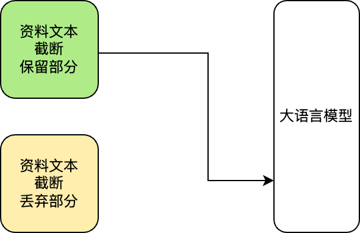
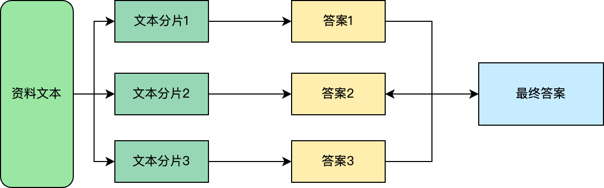
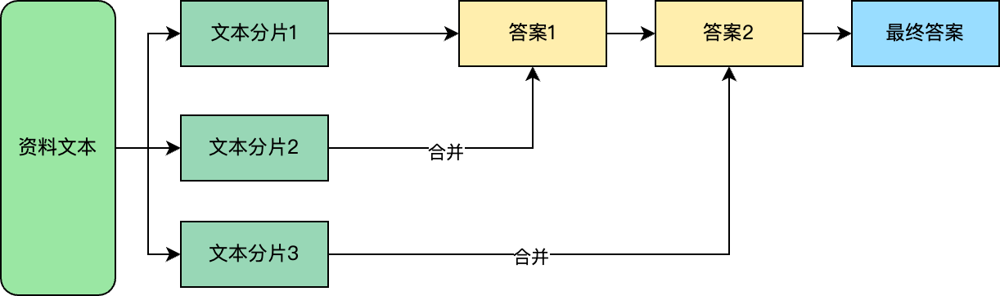

---
hide:
  - toc
---

# 召回策略

创建应用时，需要配置以下召回策略：

相关字段解释如下：

- 聊天记忆轮数：

    这个参数设置是为了将每次对话会将之前的历史对话输送多少轮给到模型，让模型能够根据上下文来连续的回答用户的问题。
    聊天记忆轮数就是和模型对话了多少次，不建议设置过大的记忆轮数，
    会在聊天的过程中耗费大量 Token 用于让模型进行上下文理解的推理，所以一般建议设置 5 轮左右。

- 对话召回字数：

    这个参数用于设置历史对话占用 Token 的最大长度，如果历史对话超过了预设的字数，
    则会启用程序自动总结逻辑讲之前的历史对话总结精炼到预设的字数以下。

- 提示词召回字数：

    提示词是由（对话召回字数 + 提示模板 + 检索的资料 + 用户的问题）组合而成的。

    

!!! info "提示词限制及策略"

    由于大多数模型有 Token 数量限制，如果设置了提示词限制将在发送给模型前按照既定策略进行检查。如果发现总的 Token 数超过模型限则会采用下面的几种策略：

    - 直接截断：将召回资料的部分直接截断，大语言模型根据截断内容给出答案。

        

    - map_reduce：针对搜索召回资料的多个段落文本，大语言模型对每个文本段落生成答案，最后再将多个答案合并，生成基于全文的答案。

        

    - refine：将召回资料的长文本分成多个文本段落，大语言模型对第一个文本段落生成答案，然后根据答案和第二个文本段落再生成新的答案，依次类推最终生成全部文本的答案。

        
