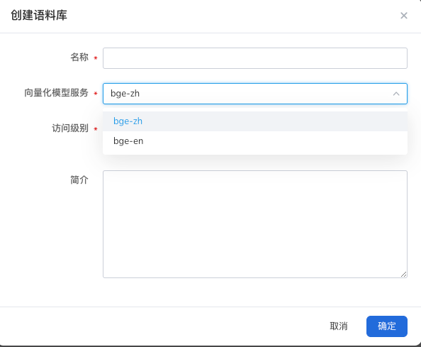

# 如何创建语料库

## 操作步骤
1. 在 **我的语料** 页面中，点击 **创建语料** 按钮。

2. 参考下列要求填写语料库基本信息，并点击 **下一步** 。

* 语料库名称：名称包含大小写字母、数字和符号。

* 向量化模型服务：可选择为`bge-large-zh`和`bge-large-en`

* 访问级别：可选择为公开/私有

* 简介：简要描述语料库中的内容信息，简介可为中英文，数字，限制400个字符

