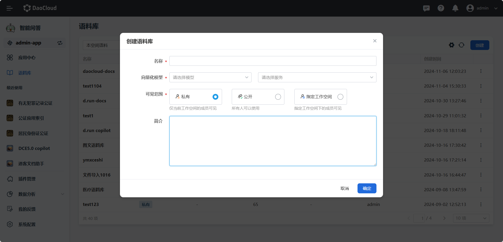

---
hide:
  - toc
---

# 如何创建语料库

语料库是指收集整理的大量文本数据集合，用于训练、测试和优化自然语言处理模型。
通过构建高质量的语料库，可以帮助大模型更好地理解用户输入的问题，提高问答准确率和智能化水平。

在 d.run 中，可以很方便地创建语料库：

1. 在 **我的语料** 页面中，点击 **创建语料** 按钮。

2. 参考下列要求填写语料库基本信息，并点击 **下一步** 。

    * **语料库名称**：名称包含大小写字母、数字和符号（限制20个字符）。

    * **向量化模型服务**：可选择 `bge-large-zh` 和 `bge-large-en`。

    * **可见范围**：可选择公开/私有/指定工作空间。

    * **简介**：简要描述语料库中的内容信息，可包含中英文、数字，（限制 100 个字符）。

    
