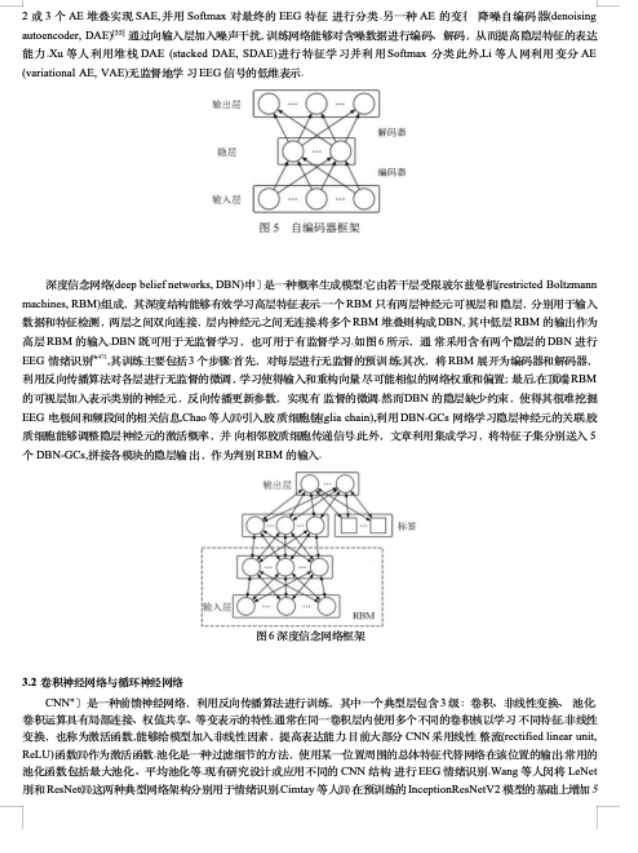
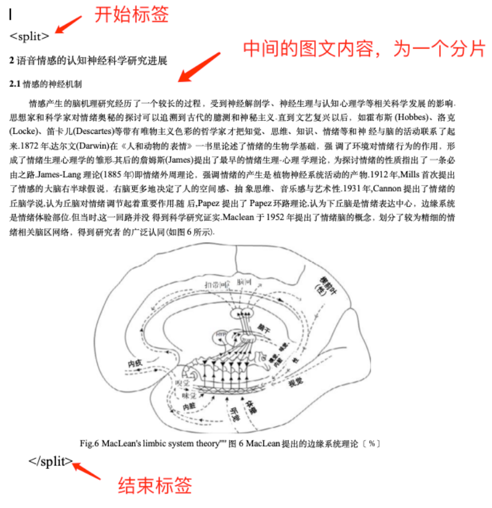

# 导入图文

在导入图文前，需要将导入的语料进行处理后再导入（目前仅支持 Word 和 Excel 的图文处理）。

## 预处理 Docx 文档

1. 直接支持带图文的 Docx 文档按照约定的字符长度分割

    

2. 也支持手工用 `<split></split>` 标签，提前规划好文档分割段落。

    

    对于 Docx 文档中的图片信息，整理的时候请直接粘贴到文档（不要使用形状或者文本框包裹图片）以免程序无法检测从而遗漏图片的处理。

## 预处理 xlsx 文档

xlsx 文件需要符合固定的模板格式：


Q：问题，A：答案。

对于 xlsx 文档，请按照模板要求整理，插图请尽量放一个在单元格中，尽量不要横跨几个单元格放置。

## 处理语料

### 准备环境

我们提供了基础镜像来处理图文：`release.daocloud.io/aigc/aitools:1.0`

- `/home/aitools/input` 替换成实际输入文件的目录
- `/home/aitools/output` 替换成实际输出处理后文件的目录

```shell
# 主机上创建输入、输出目录
mkdir -p /home/aitools/output /home/aitools/input
chmod 777 -R /home/aitools/output /home/aitools/input

# 运行常驻服务到后台
docker run -d -p 8888:8888 --name aitools \
    -v /home/aitools/input:/app/corpus_processing/input \
    -v /home/aitools/output:/app/corpus_processing/output \
    -e JUPYTER_TOKEN=aitools \
    --restart=always release.daocloud.io/aigc/aitools:1.0
```

### 处理数据

1. 文件上传到预设的输入目录 `/home/aitools/input`

2. 使用以下命令运行工具镜像中的脚本

    ```shell
    docker exec aitools sh run.sh
    ```

### 导入处理好的文件

1. 点击 **语料导入** -> **图文导入**

2. 将处理好的文件夹上传数据，并进行向量化，等待处理成功后即表示导入成功。
