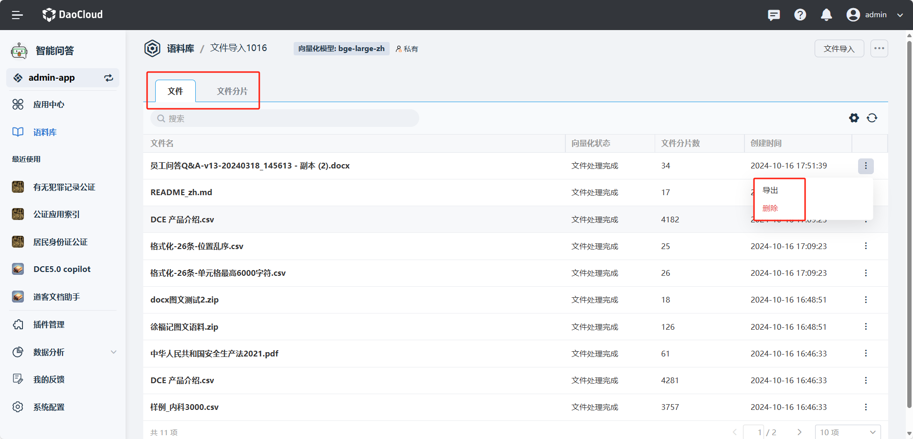

---
hide:
  - toc
---

# 管理语料库内容

点击 **语料库** 创建时间旁的 **┇** 按钮进入语料库整理页面。

- 查看语料库中文件名称，向量化状态，文件分片数以及创建时间。
- 选择点击操作中 **导出** 按钮，可以将某一文件导出。
- 点击操作中 **删除** 按钮，可以将文件在语料库中删除。

  

- 点击上方的 **文件分片** 进入到文件分片详情，可以查看文件的所有分块信息。
- 输入文件分片描述来搜索具体的分片，其中文本相似度用于衡量搜索内容和语料库中分块的相似度。这里用【欧氏距离】来作为相似度计算指标，故相似度越小，则距离越接近，文本越相似。
- 在文件分片中点击某一分片的 **┇** 按钮，即可编辑语料分片内容/删除某一分片。

  
