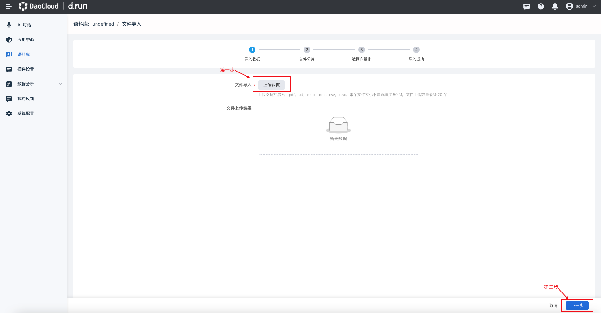

# 文件导入

## 上传数据

1. 点击语料库旁的 **⋮** 按钮

2. 点击 **语料导入** ，选择上传的数据

3. 在导入数据界面，点击 **上传数据**

    选择自己想要上传的文件，目前支持 pdf、txt、docx、doc、csv、xlsx
    单个文件的大小不建议超过 50 M，文件上传数量限制为50个

4. 将文件上传完成后，可以在 **文件上传结果** 中查看

    

5. 上传成功后，点击 **下一步**

6. 选择文件分片的处理类型：标准处理、自定义处理（即插件处理，请到插件接入处查看）

7. 数据向量化过程后，查看文件分片数量、重复分片数量、本次导入分片数以及向量化状态

8. 当向量化处理成功后，点击 **下一步**

9. 待文件状态为文件处理完成后，点击 **关闭** 即可

### 标准处理

- PDF、TXT、DOC、DOCX 支持自定义分隔符
- CSV、xlsx 按照一行分片
- 设置分隔符，不设置分片大小，仅根据分隔符划分文档
- 不设置分隔符，设置分片大小，仅根据分片大小拆分文档
- 设置分隔符并设置分片大小，在分片大小内，最终根据分隔符匹配进行分割
