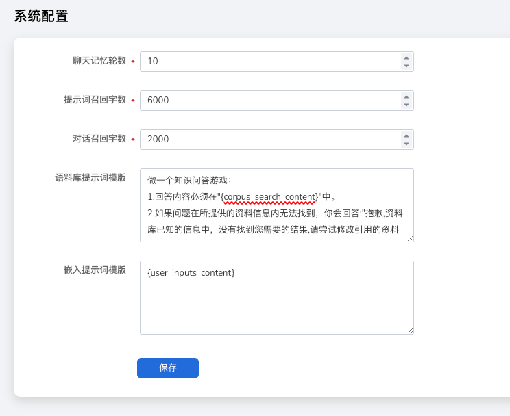

---
hide:
  - toc
---

# 系统配置

系统配置用于定义平台中与智能问答应用相关的全局默认参数，包括聊天记忆轮数、语料库提示词模板、嵌入提示词模板等。  
这些配置会影响应用在运行时的行为与输出效果，并在创建新应用时作为默认设置自动应用，
帮助您快速构建一致且可控的对话体验。

!!! note

    系统配置中的参数将会作为创建应用时的默认参数。

## 聊天记忆轮数

指在一个对话系统中，用于追踪和管理对话历史的轮数或回合数。每当用户与系统进行一次交互，对话的轮数就会增加一次。
此处指用户与聊天应用进行交互时，应用会在一个小记忆窗口中保持一段时间的对话历史，记忆轮数大小即保持时间的长短。

- 默认值为 10
- 最低为 0

## 语料库提示词模板

该模板在应用关联使用模板时启用，模板内容包含通过相似度搜索得到的知识块、用户的输入和嵌入提示词模板。

## 嵌入提示词模板

嵌入的提示词拼接在用户的问题之前，作为通用的约定提示来引导应用模型输出针对问题的回答。
